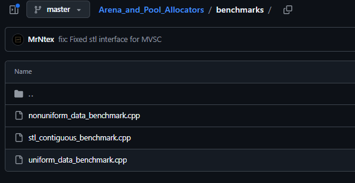
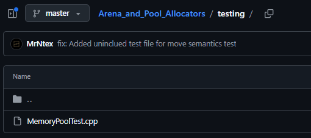
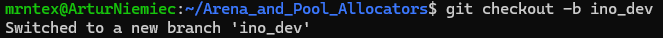
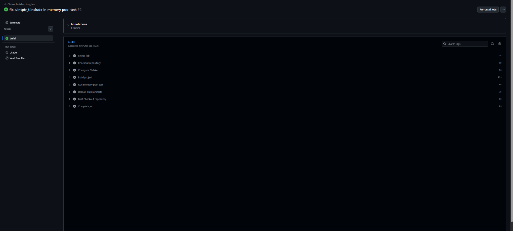
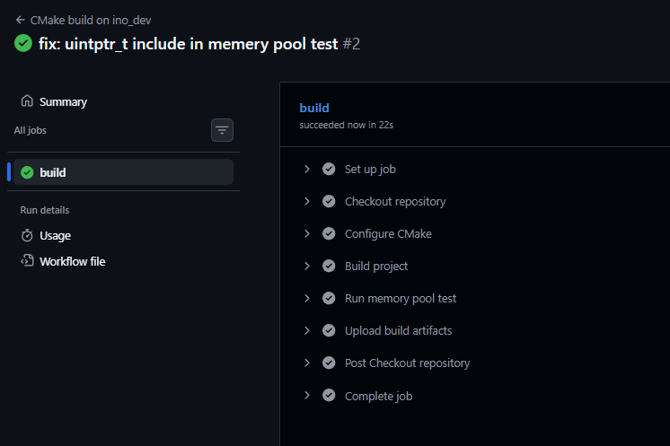
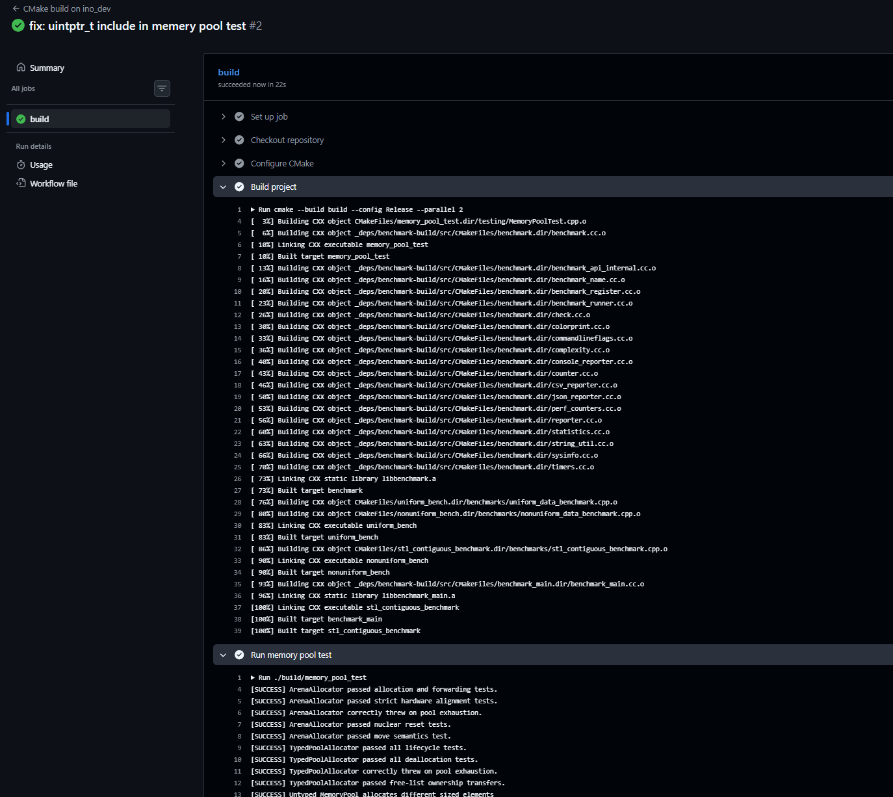
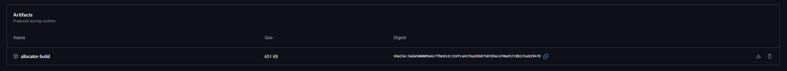

# Sprawozdanie – Shift-left: GitHub Actions

## 1. Cel zadania

Celem zadania było zapoznanie się z mechanizmem GitHub Actions oraz przygotowanie własnego workflow uruchamianego po zmianach w dedykowanej gałęzi `ino_dev`. Workflow miał automatycznie wykonać proces budowania projektu, uruchomić podstawową weryfikację działania programu oraz, jeżeli to możliwe, zapisać zbudowane pliki jako artefakt.

W zadaniu zwrócono szczególną uwagę na trigger akcji, czyli warunek określający, kiedy workflow ma zostać uruchomiony. W przygotowanym rozwiązaniu akcja reaguje na zdarzenia `push` oraz `pull_request`, ale wyłącznie dla gałęzi `ino_dev`.

## 2. Wybrane repozytorium

Do realizacji zadania wykorzystano repozytorium `Arena_and_Pool_Allocators`, zawierające projekt napisany w języku C++ z użyciem systemu budowania CMake. Projekt zawiera implementację alokatorów pamięci, benchmarki oraz test sprawdzający poprawność działania wybranych struktur.

W repozytorium znajdują się między innymi pliki benchmarków w katalogu `benchmarks`:



oraz test w katalogu `testing`:



Projekt nadaje się do użycia w GitHub Actions, ponieważ proces budowania można uruchomić automatycznie za pomocą komend CMake.

## 3. Przygotowanie gałęzi `ino_dev`

Na potrzeby zadania utworzono dedykowaną gałąź `ino_dev`.

Użyta komenda:

```bash
git checkout -b ino_dev
```



## 4. Konfiguracja workflow GitHub Actions

W repozytorium dodano własny workflow w katalogu:

```text
.github/workflows/
```

Workflow został skonfigurowany tak, aby uruchamiał się po zmianach w gałęzi `ino_dev`.

Konfiguracja workflow:

```yaml
name: CMake build on ino_dev

on:
  push:
    branches:
      - ino_dev
  pull_request:
    branches:
      - ino_dev

jobs:
  build:
    runs-on: ubuntu-latest

    steps:
      - name: Checkout repository
        uses: actions/checkout@v4

      - name: Configure CMake
        run: cmake -S . -B build -DCMAKE_BUILD_TYPE=Release

      - name: Build project
        run: cmake --build build --config Release --parallel 2

      - name: Run memory pool test
        run: ./build/memory_pool_test

      - name: Upload build artifacts
        uses: actions/upload-artifact@v4
        with:
          name: allocator-build
          path: |
            build/uniform_bench
            build/nonuniform_bench
            build/stl_contiguous_benchmark
            build/memory_pool_test
          if-no-files-found: error
```

Najważniejsze elementy konfiguracji:

- `on: push` – uruchamia workflow po spushowaniu zmian do repozytorium,
- `on: pull_request` – uruchamia workflow dla pull requestów,
- `branches: ino_dev` – ogranicza uruchamianie akcji do gałęzi `ino_dev`,
- `runs-on: ubuntu-latest` – uruchamia job na runnerze z systemem Linux,
- `actions/checkout@v4` – pobiera kod repozytorium,
- `cmake -S . -B build` – konfiguruje projekt CMake,
- `cmake --build build` – buduje projekt,
- `./build/memory_pool_test` – uruchamia test,
- `actions/upload-artifact@v4` – zapisuje zbudowane pliki jako artefakt.

## 5. Wynik działania workflow

Workflow zakończył się sukcesem. Na stronie GitHub Actions widoczny jest zielony status wykonania joba `build`.



W ramach joba zostały wykonane kolejne kroki: checkout repozytorium, konfiguracja CMake, build projektu, uruchomienie testu oraz upload artefaktów.



Logi z etapu budowania pokazują, że zostały zbudowane między innymi targety:

- `memory_pool_test`,
- `uniform_bench`,
- `nonuniform_bench`,
- `stl_contiguous_benchmark`.

Następnie uruchomiono test `memory_pool_test`, który zakończył się komunikatami `[SUCCESS]`, oznaczający poprawne działanie testowanych elementów projektu.



## 6. Artefakt

Workflow został rozszerzony o krok zapisujący wynik budowania jako artefakt. Po zakończeniu działania akcji na stronie workflow dostępny był artefakt o nazwie `allocator-build`.



Artefakt zawiera zbudowane pliki wykonywalne wygenerowane podczas procesu kompilacji.

## 7. Wnioski

Po każdej zmianie w gałęzi `ino_dev` GitHub Actions automatycznie buduje projekt i uruchamia test, co pozwala szybciej wykrywać błędy kompilacji oraz problemy z podstawową poprawnością działania programu.