## 1. Zestawienie środowiska skonteneryzowanego
# 1.1. Pobrano Docker uzywajac `sudo apt install docker.io`
# 1.2. Utworzono konto na Docker Hub i zalogowano sie w terminalu

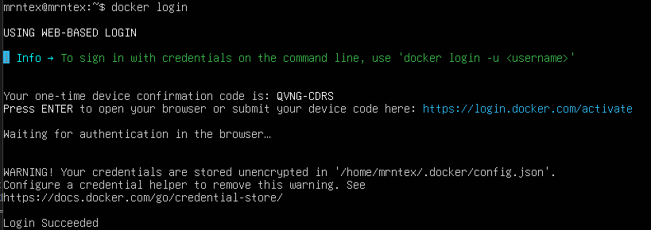

# 1.3. Dodano uzytkownika do grupy `sudo usermod -aG docker mrntex`

# 1.4. Docker hello-world

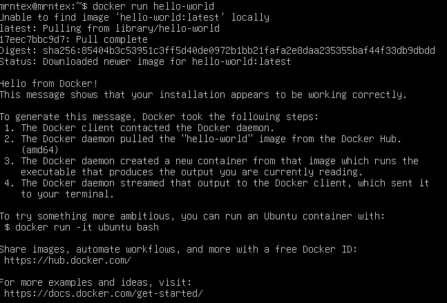

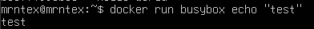

# 1.5. Pobrane obrazy i ich rozmiary (kolumna SIZE)

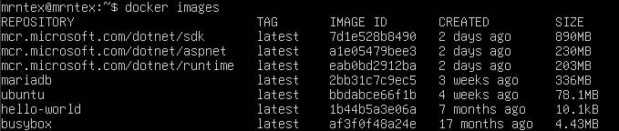

# 1.6. Kody wyjscia (kolumna STATUS)

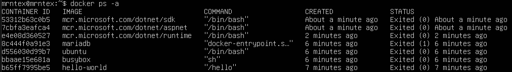

# 1.7. busybox


Polaczenie interaktywne
`-i` oznacza tryb interaktywny
`-t` oznacza terminal, laczy terminal z stdin/stdout contenera, dzieki czemu mozna wspolpracowac z powloka

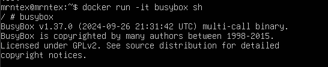

aby wyjsc z kontenera, nalezy wpisac `exit` lub uzyc CTRL+D

# 1.8. ubuntu

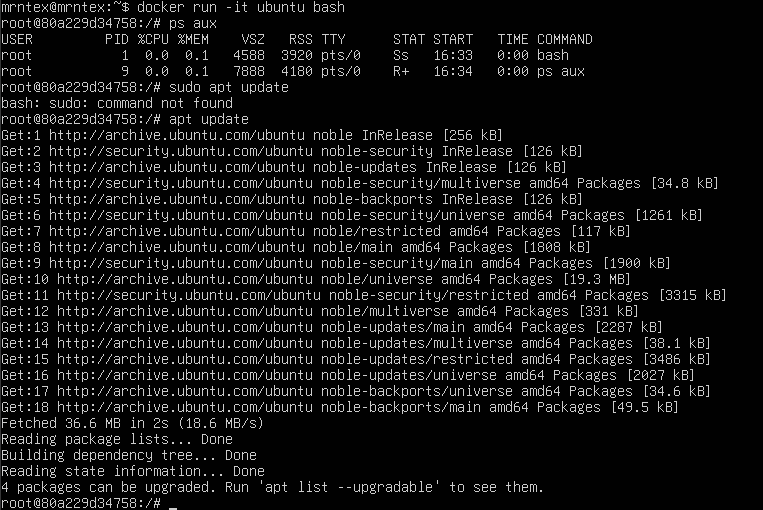

Aby przejsc terminal hosta, zrobiono detach uzywajac `Ctrl + P` i `Ctrl + Q`

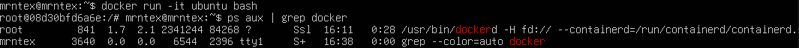

# 1.9. Wlasny dockerfile

```Dockerfile
FROM ubuntu:latest

RUN apt-get update && apt-get install -y git

WORKDIR /app

RUN git clone -b AN420700 https://github.com/InzynieriaOprogramowaniaAGH/MDO2026_ITE.git
```

Wywolano: `docker build -t lab-2-img .`

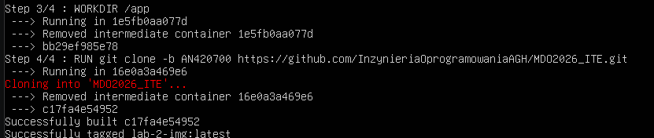

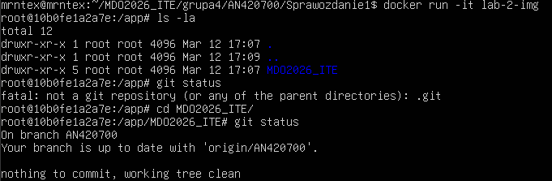

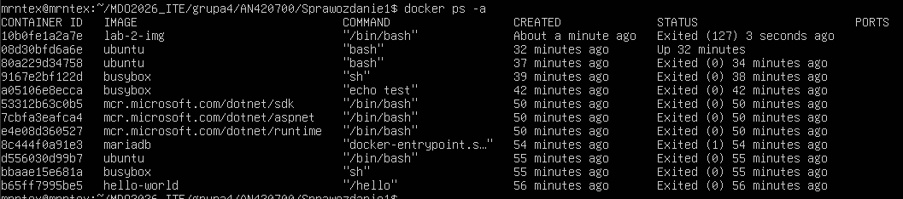

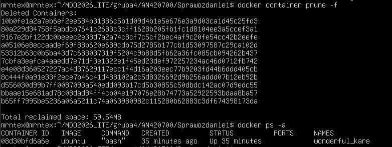

wylaczono dzialajacy kontener

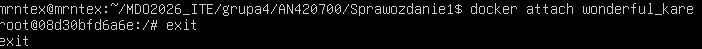

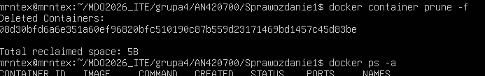

wyczyszczono obrazy
`docker image prune -a -f`