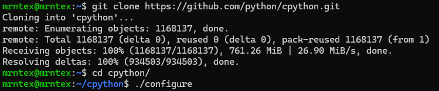
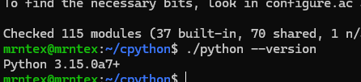
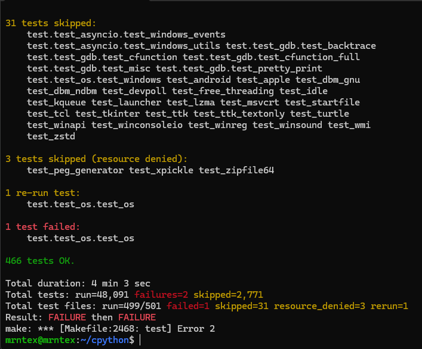
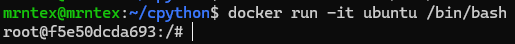
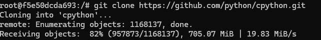
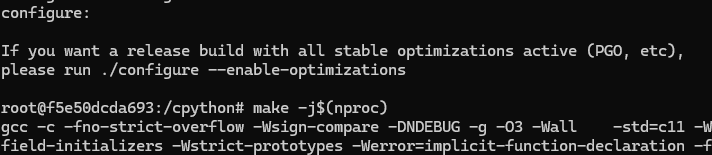
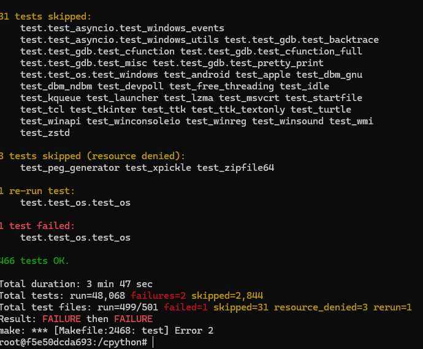
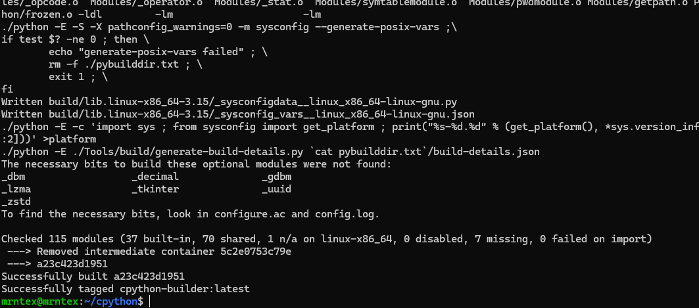
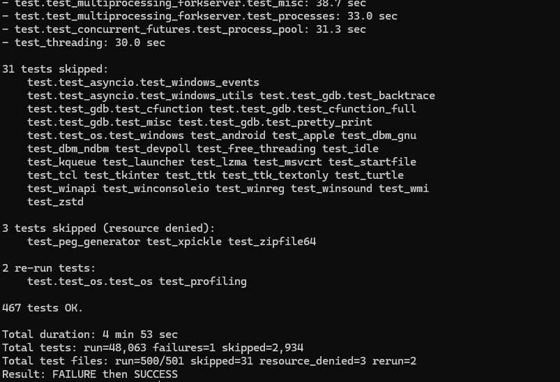

## Budowanie lokalne

Klonowanie repozytorium.


Konfiguracja srodowiska i kompilacja kodu




Uruchomienie testow.



## Izolacja: kontener interaktywny

Uruchomienie czystego Ubuntu.





Pobranie narzedzi i build w srodku.





## Automatyzacja (Dockerfile)

Dockerfile.build: Środowisko i kompilacja.

```dockerfile
FROM ubuntu:22.04

ENV DEBIAN_FRONTEND=noninteractive

RUN apt-get update && apt-get install -y \
    git build-essential pkg-config libssl-dev zlib1g-dev \
    libffi-dev libbz2-dev libreadline-dev libsqlite3-dev tzdata

RUN git clone https://github.com/python/cpython.git /cpython

WORKDIR /cpython

RUN ./configure && make -j$(nproc)
```

```ENV DEBIAN_FRONTEND=noninteractive``` jest aby uniknac promptujacego w czasie configuracji zapytania do uzytkownka o strefe czasowa

Dockerfile.test: Obraz dziedziczący, odpala tylko testy.
```dockerfile
FROM cpython-builder:latest

WORKDIR /cpython

CMD [make, test]
```





### Co pracuje w tym kontenerze?
Jeden proces, bez serwera w tle czy demona. Głównym procesem (PID 1) jest komenda testowa zadeklarowana w CMD.

## Docker Compose

Orkiestracja.

```yml
version: '3.8'

services:
  builder:
    build:
      context: .
      dockerfile: Dockerfile.build
    image: cpython-builder:latest

  tester:
    build:
      context: .
      dockerfile: Dockerfile.test
    depends_on:
      - builder
```

## Dyskusja: Przygotowanie do wdrozenia

Program nie nadaje sie do wdrazania jako kontener. Obraz po buildzie wazy gigabajty, zawiera kody zrodlowe i kompilatory C.

Finalny artefakt: Nalezy zastosować Multi-stage build. W nowym pliku Dockerfile kopiujemy ze zbudowanego obrazu wylacznie gotowe pliki binarne do czystego, chudego systemu.

Dystrybucja: Oprogramowanie takie jak CPython rzadko zyje tylko w kontenerze. Najlepiej dystrybuować je jako natywne pakiety systemowe, np. .deb lub .rpm na platforme Linux. Na Windows Python jest dystrybuowany za pomoca WiX Toolset lub za pomoca paczki .msix z Microsoft Store.

Aby to osiagnac nalezy uruchomic trzeci kontener (tzw. packager, np. z użyciem narzędzia fpm). Podpiac lokalny katalog jako wolumen. Kontener pakuje skompilowane pliki binarne w plik pakietu i zwraca na dysk hosta.