# Zachowywanie stanu między kontenerami
## Przygotowanie woluminów i kontenera bazowego
Do zadania wykorzystano obraz cpython-builder z poprzednich zajęć jako kontener bazowy. Posiada on niezbędne zależności do budowania projektu, ale zgodnie z poleceniem, operacje wykonano bez użycia Gita wewnątrz tego kontenera.

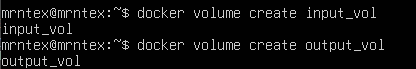

Klonowanie repozytorium na wolumin wejściowy

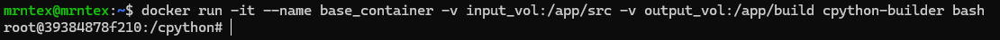

Klonowanie wykonano przy użyciu kontenera pomocniczego.

```bash
docker run --rm -v input_vol:/helper alpine/git clone https://github.com/python/cpython.git /helper
```
wykorzystanie kontenera pomocniczego pozwala na dostarczenie kodu do woluminu bez instalowania Gita w obrazie bazowym. Jest to czystsze rozwiązanie niż kopiowanie plików bezpośrednio do /var/lib/docker (co jest niebezpieczne dla uprawnień) czy używanie bind mount, który uzależnia kontener od konkretnej ścieżki na hoście.

## Build i zapis na woluminie wyjściowym
Po podmontowaniu woluminów, przeprowadzono proces kopiowania/budowania artefaktów do katalogu powiązanego z output_vol.

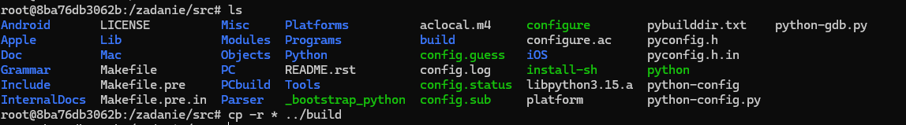

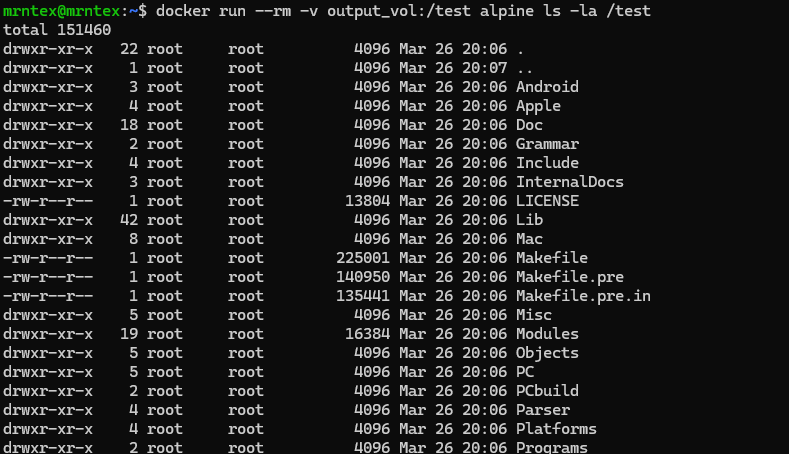

Operacja z Gitem wewnątrz kontenera
W drugim etapie wykorzystano natywnego Gita dostępnego w obrazie cpython-builder, aby pobrać kod bezpośrednio na wolumin.

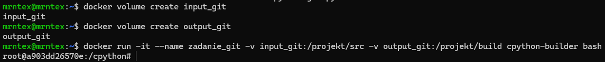

### Dyskusja: Dockerfile i RUN --mount
Proces ten można zautomatyzować w Dockerfile używając instrukcji RUN --mount=type=bind. Pozwala ona na tymczasowe zamontowanie plików źródłowych z hosta tylko na czas budowania obrazu, dzięki czemu gotowy obraz nie zawiera kodu źródłowego, a jedynie skompilowane pliki binarne.

Eksponowanie portu i łączność między kontenerami (IPerf)
Łączność w sieci domyślnej (IP)
Uruchomiono serwer iperf3 w jednym kontenerze, a następnie połączono się z nim z drugiego kontenera, używając adresu IP uzyskanego przez docker inspect.

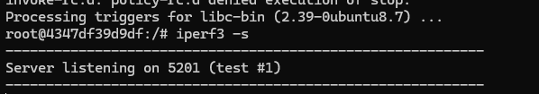

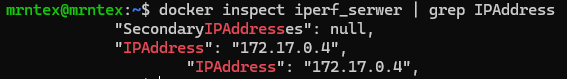

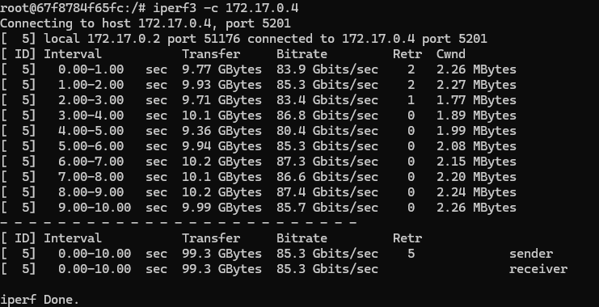

Własna sieć mostkowa i rozwiązywanie nazw (DNS)
Utworzono sieć iperf_siec. Dzięki temu możliwe było nawiązanie połączenia przy użyciu nazwy kontenera serwer_dns, co udowadnia działanie wewnętrznego mechanizmu DNS Dockera.

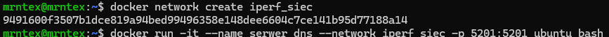

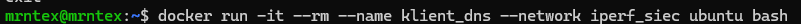

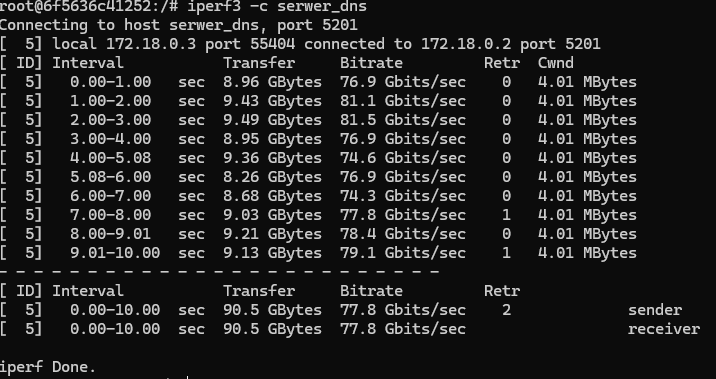

Polączenie spoza kontenera

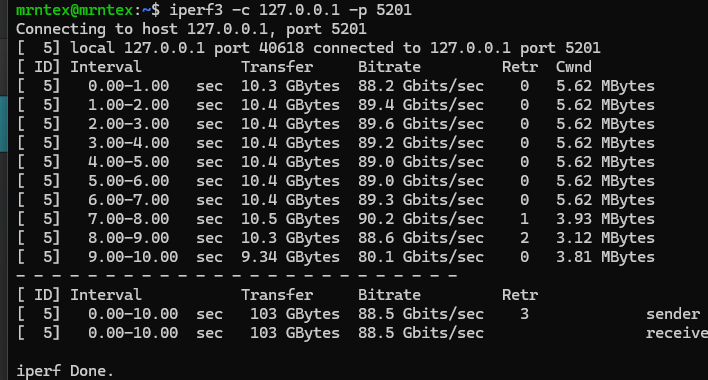

Połączenie spoza hosta
Przy próbie połączenia z zewnętrznego komputera (spoza VM) wystąpił błąd komunikacji. Problem z pomiarem wynika z reguł firewall na hoście/VM. Mimo wystawienia portu -p 5201:5201, ruch przychodzący spoza interfejsu lokalnego jest blokowany.

Usługi: SSHD w kontenerze
Zestawienie usługi SSH
W kontenerze Ubuntu zainstalowano i skonfigurowano usługę openssh-server.

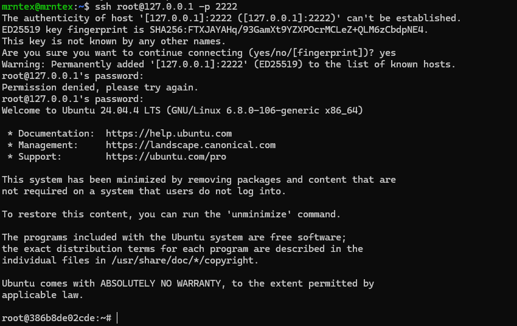

Zalety i wady SSH w kontenerze
Wady: Jest to antywzorzec. Zwiększa rozmiar obrazu, wydłuża czas startu i łamie zasadę "jeden proces na kontener". Do zarządzania kontenerem dedykowane jest polecenie docker exec.

Zalety: Przydatne w starych systemach, których nie da się zarządzać inaczej, lub w kontenerach typu Honeypot służących do izolacji atakujących.

Przygotowanie serwera Jenkins
Instalacja Jenkins + DinD
Przeprowadzono instalację zgodnie z dokumentacją, uruchamiając kontener pomocniczy docker:dind (Docker-in-Docker) oraz właściwy serwer Jenkins.

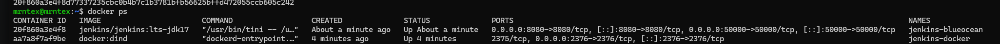

Inicjalizacja i ekran logowania
Hasło inicjalizacyjne odczytano bezpośrednio z systemu plików kontenera.

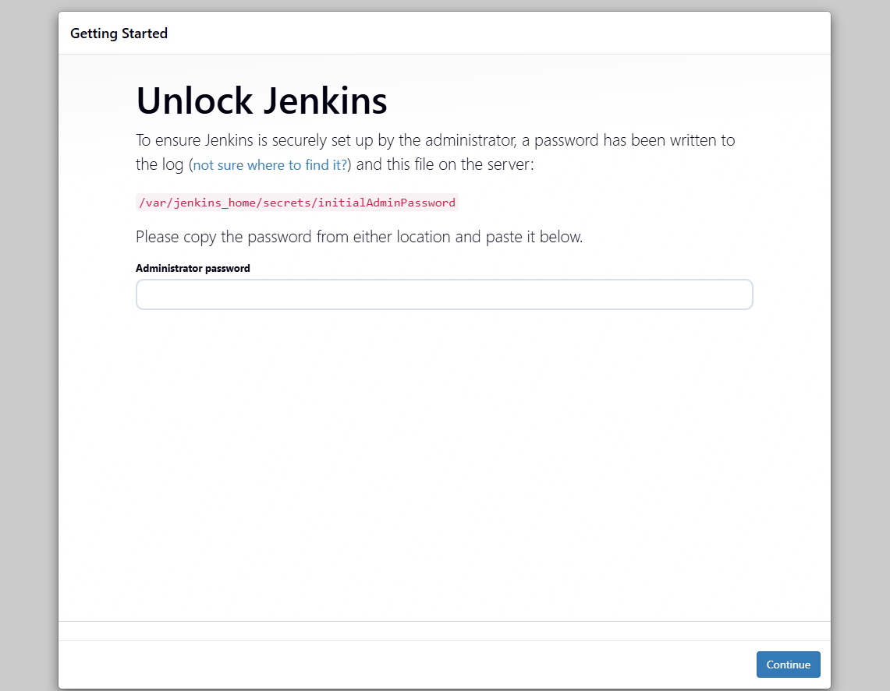