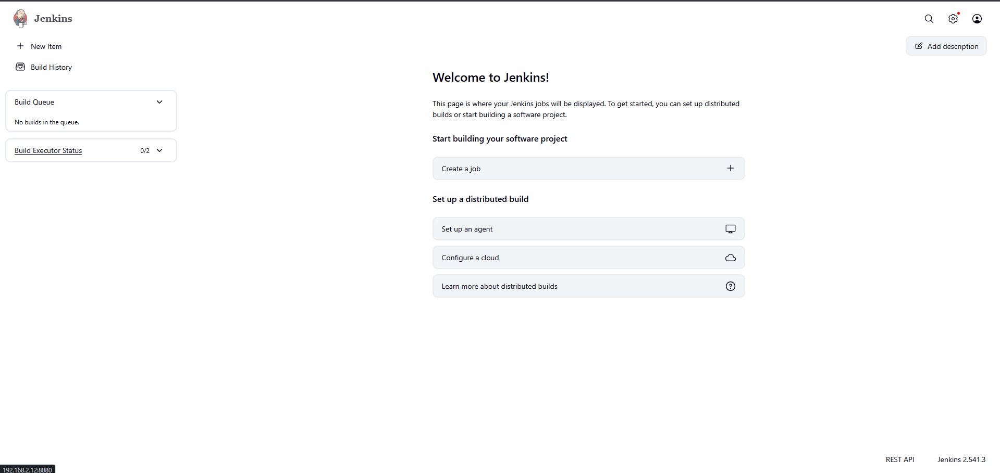
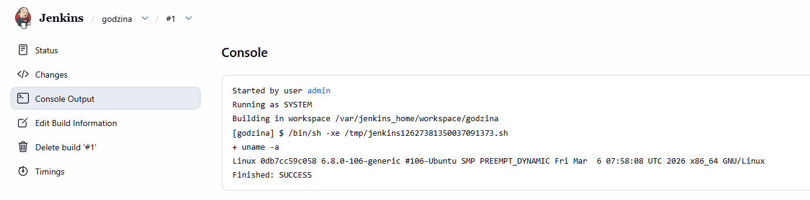
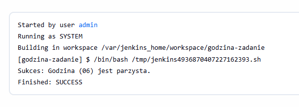
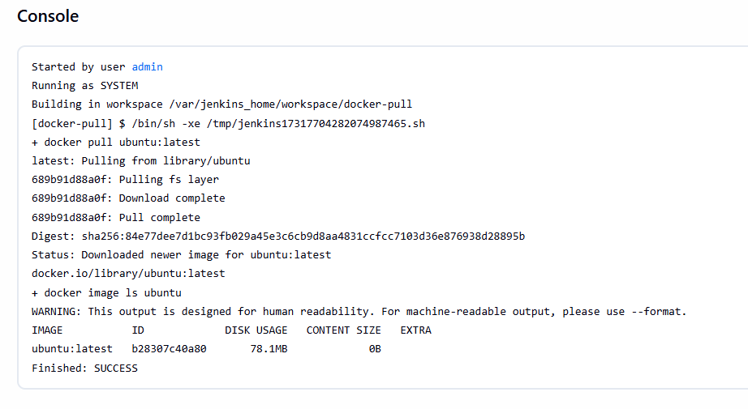
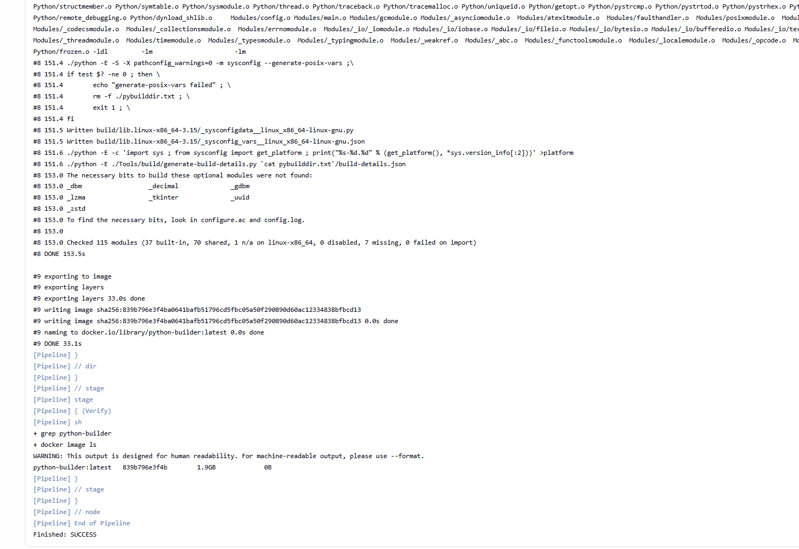
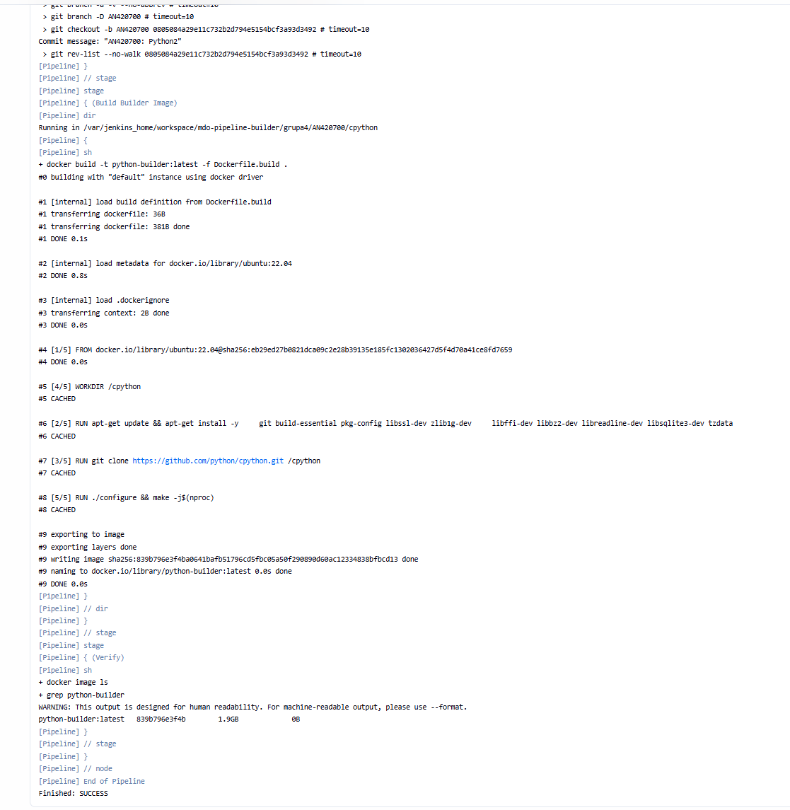

## Budowa potoku CI/CD (build-test-deploy-publish) w Jenkinsie

Przygotowanie środowiska Jenkins i Docker-in-Docker (DinD)
Zgodnie z najlepszymi praktykami, do obsługi Dockera wewnątrz Jenkinsa wykorzystano wzorzec Docker-in-Docker. Utworzono współdzieloną sieć, w której uruchomiono kontener docker:dind pełniący rolę demona Dockera.

Następnie przygotowano własny obraz Jenkinsa na bazie jenkins/jenkins:2.541.3-jdk21. Utworzono plik dockerfile. I uzyskano haslo za pomoca komendy:

```shell
docker exec jenkins-blueocean cat /var/jenkins_home/secrets/initialAdminPassoword
```

Zalogowano sie na panelu administratora:



### Konfiguracja wstępna i pierwsze uruchomienia

Utworzono trzy zadania typu "Projekt o swobodnej konfiguracji":

Projekt wyświetlający uname:



Projekt z błędem dla nieparzystej godziny: 



Pobieranie obrazu kontenera: 



### Obiekt typu Pipeline
Zdefiniowano nowy obiekt typu Pipeline. Skrypt napisano w języku Groovy bezpośrednio w interfejsie Jenkinsa.

Struktura potoku

```groovy
pipeline {
    agent any

    stages {
        stage('Clone') {
            steps {
                git branch: 'AN420700', url: 'https://github.com/InzynieriaOprogramowaniaAGH/MDO2026_ITE.git'
            }
        }
        
        stage('Build Builder Image') {
            steps {
                dir('grupa4/AN420700/cpython') {
                    sh 'docker build -t python-builder:latest -f Dockerfile.build .'
                }
            }
        }
        
        stage('Verify') {
            steps {
                sh 'docker image ls | grep python-builder'
            }
        }
    }
}
```



### Optymalizacja i demonstracja mechanizmu Cache
Zgodnie z poleceniem, po pomyślnym wykonaniu pierwszego cyklu, uruchomiono Pipeline po raz drugi.

Czas wykonania skrocil sie z 15 min do paru sekund

Krok Checkout: Jenkins nie pobierał całego repozytorium, a jedynie wykonał błyskawiczną operację git fetch sprawdzającą zmiany.

Krok Build: Budowanie obrazu wykonało się w ułamku sekundy. Docker wykorzystał wbudowany mechanizm pamięci podręcznej (Cache) – widząc, że pliki źródłowe i plik Dockerfile.build nie uległy zmianie, pominął czasochłonne pobieranie pakietów i użył gotowych warstw z dysku.


