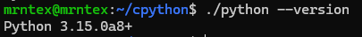
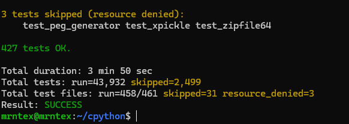
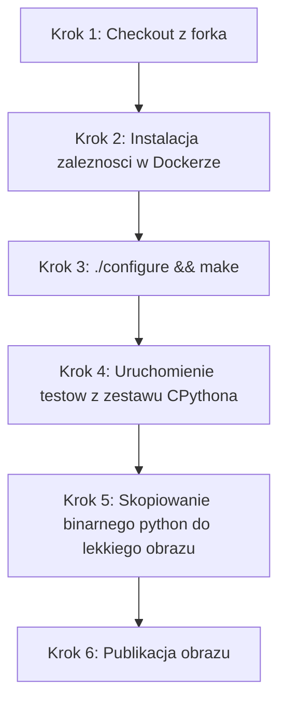
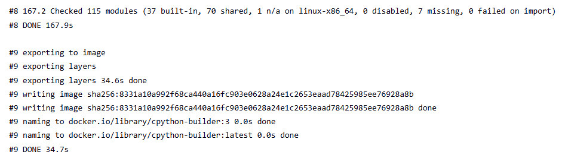
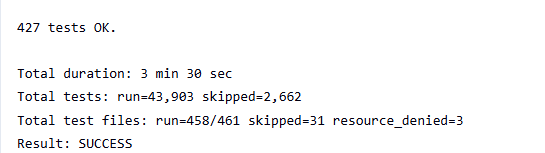

- [x] Aplikacja została wybrana

https://github.com/python/cpython

- [x] Licencja potwierdza możliwość swobodnego obrotu kodem na potrzeby zadania

CPython udostępniany jest na licencji Python Software Foundation License (PSFL). Jest to licencja otwarta (GPL-compatible), która bez problemu pozwala na modyfikację, forkowanie i uruchamianie w procesach CI/CD.

- [x] Wybrany program buduje się

- [x] Przechodzą dołączone do niego testy

- [x] Zdecydowano, czy jest potrzebny fork własnej kopii repozytorium

https://github.com/mrntex/cpython

Fork był niezbędny, aby zyskać uprawnienia do dodania webhooków dla Jenkinsa oraz aby wstrzyknąć własne pliki definicji środowiska (Dockerfile oraz Jenkinsfile) bezpośrednio do kodu źródłowego.

- [x] Stworzono diagram UML zawierający planowany pomysł na proces CI/CD

- [x] Wybrano kontener bazowy lub stworzono odpowiedni kontener wstepny (runtime dependencies)

Jako bazę do kompilacji wybrano obraz ubuntu:22.04 (lub debian:bullseye), ponieważ zawiera stabilne repozytoria pakietów C/C++. Zainstalowano niezbędne dependencje.
- [x] *Build* został wykonany wewnątrz kontenera

- [x] Testy zostały wykonane wewnątrz kontenera (kolejnego)

- [x] Kontener testowy jest oparty o kontener build

Tak, stworzono osobny plik Dockerfile.test, który w instrukcji FROM dziedziczy z obrazu wygenerowanego w etapie build..

- [x] Logi z procesu są odkładane jako numerowany artefakt, niekoniecznie jawnie

Wyjście ze standardowej konsoli kontenera testowego zostało przekierowane do pliku tekstowego za pomocą polecenia docker logs cpython-test-run > test-results.log. Następnie plik ten został zarchiwizowany w Jenkinsie przy użyciu wbudowanej dyrektywy archiveArtifacts, co powiązało go z konkretnym numerem Builda.

- [x] Zdefiniowano kontener typu 'deploy' pełniący rolę kontenera, w którym zostanie uruchomiona aplikacja (niekoniecznie docelowo - może być tylko integracyjnie)

Zdefiniowano docelowy obraz uruchomieniowy. Ponieważ tworzymy interpreter języka, "deploy" w tym przypadku oznacza stworzenie czystego środowiska (kontenera), z którego użytkownik końcowy może uruchamiać swoje skrypty Pythona. W Jenkinsie obraz ten budowany jest w etapie "Build Deploy Image".

- [x] Uzasadniono czy kontener buildowy nadaje się do tej roli/opisano proces stworzenia nowego, specjalnie do tego przeznaczenia

Kontener buildowy kategorycznie nie nadaje się do roli wdrożeniowej. Zawiera on dziesiątki megabajtów zbędnych pakietów (np. git, build-essential, gcc, pliki nagłówkowe), co nie tylko drastycznie zwiększa jego wagę, ale również stwarza poważne luki bezpieczeństwa.

- [x] Wersjonowany kontener 'deploy' ze zbudowaną aplikacją jest wdrażany na instancję Dockera

Obraz aplikacji otrzymał unikalny Tag na podstawie zmiennej środowiskowej Jenkinsa (${BUILD_NUMBER})

- [x] Następuje weryfikacja, że aplikacja pracuje poprawnie (*smoke test*) poprzez uruchomienie kontenera 'deploy'

Jenkins uruchamia docelowy kontener poleceniem docker run i przekazuje mu do wykonania prosty skrypt: python3 -c "print('Smoke test przeszedl pomyslnie!')"

- [x] Zdefiniowano, jaki element ma być publikowany jako artefakt

Ostatecznym artefaktem procesu CI/CD jest gotowy do użycia obraz Docker zawierający skompilowany interpreter CPython.

- [x] Uzasadniono wybór: kontener z programem, plik binarny, flatpak, archiwum tar.gz, pakiet RPM/DEB

Wybrano format obrazu kontenerowego, ponieważ gwarantuje on niezmienność środowiska. Dostarczając sam plik binarny (np. tar.gz), zmusilibyśmy użytkownika końcowego do samodzielnej instalacji zależności współdzielonych (np. libssl, zlib) w jego systemie.

- [x] Opisano proces wersjonowania artefaktu (można użyć *semantic versioning*)

Do wersjonowania użyto standardu Semantic Versioning połączonego z identyfikatorem buildu z systemu CI. Wersja składa się z głównego numeru wersji interpretera uzupełnionego o numer kompilacji, np. 3.13-build${BUILD_NUMBER}.

- [x] Dostępność artefaktu: publikacja do Rejestru online, artefakt załączony jako rezultat builda w Jenkinsie

Obraz Docker został zbudowany i zmagazynowany w lokalnym rejestrze Dockera na serwerze Jenkins, co pozwala na jego łatwe wyeksportowanie lub wypchnięcie do zewnętrznego rejestru, takiego jak Docker Hub. Logi z przebiegu są natomiast przypięte bezpośrednio do buildu w Jenkinsie.

- [x] Przedstawiono sposób na zidentyfikowanie pochodzenia artefaktu

Pochodzenie artefaktu można jednoznacznie zidentyfikować na podstawie jego Tagu. Sufiks build${BUILD_NUMBER} (np. build42) odnosi się bezpośrednio do konkretnego przebiegu (Job #42) w historii Jenkinsa, gdzie możemy sprawdzić, kto zainicjował proces, z jakiego commitu z GitHuba pochodził kod i jak przebiegły testy.

- [x] Pliki Dockerfile i Jenkinsfile dostępne w sprawozdaniu w kopiowalnej postaci oraz obok sprawozdania, jako osobne pliki
- [x] Zweryfikowano potencjalną rozbieżność między zaplanowanym UML a otrzymanym efektem

Zrealizowany pipeline pokrywa się z zaplanowanym diagramem UML. Główną rozbieżnością względem początkowych ustaleń jest techniczna realizacja podziału kontenerów.