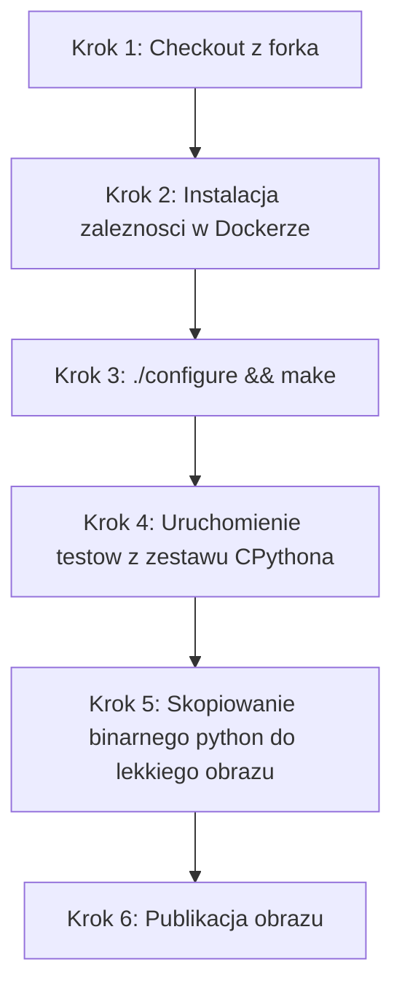

- [x] Aplikacja została wybrana
https://github.com/python/cpython
- [x] Licencja potwierdza możliwość swobodnego obrotu kodem na potrzeby zadania
CPython udostępniany jest na licencji Python Software Foundation License (PSFL). Jest to licencja otwarta (GPL-compatible), która bez problemu pozwala na modyfikację, forkowanie i uruchamianie w procesach CI/CD.
- [x] Wybrany program buduje się

- [x] Przechodzą dołączone do niego testy
- [x] Zdecydowano, czy jest potrzebny fork własnej kopii repozytorium
https://github.com/mrntex/cpython

Fork był niezbędny, aby zyskać uprawnienia do dodania webhooków dla Jenkinsa oraz aby wstrzyknąć własne pliki definicji środowiska (Dockerfile oraz Jenkinsfile) bezpośrednio do kodu źródłowego.
- [x] Stworzono diagram UML zawierający planowany pomysł na proces CI/CD

- [ ] Wybrano kontener bazowy lub stworzono odpowiedni kontener wstepny (runtime dependencies)
- [ ] *Build* został wykonany wewnątrz kontenera
- [ ] Testy zostały wykonane wewnątrz kontenera (kolejnego)
- [ ] Kontener testowy jest oparty o kontener build
- [ ] Logi z procesu są odkładane jako numerowany artefakt, niekoniecznie jawnie
- [ ] Zdefiniowano kontener typu 'deploy' pełniący rolę kontenera, w którym zostanie uruchomiona aplikacja (niekoniecznie docelowo - może być tylko integracyjnie)
- [ ] Uzasadniono czy kontener buildowy nadaje się do tej roli/opisano proces stworzenia nowego, specjalnie do tego przeznaczenia
- [ ] Wersjonowany kontener 'deploy' ze zbudowaną aplikacją jest wdrażany na instancję Dockera
- [ ] Następuje weryfikacja, że aplikacja pracuje poprawnie (*smoke test*) poprzez uruchomienie kontenera 'deploy'
- [ ] Zdefiniowano, jaki element ma być publikowany jako artefakt
- [ ] Uzasadniono wybór: kontener z programem, plik binarny, flatpak, archiwum tar.gz, pakiet RPM/DEB
- [ ] Opisano proces wersjonowania artefaktu (można użyć *semantic versioning*)
- [ ] Dostępność artefaktu: publikacja do Rejestru online, artefakt załączony jako rezultat builda w Jenkinsie
- [ ] Przedstawiono sposób na zidentyfikowanie pochodzenia artefaktu
- [ ] Pliki Dockerfile i Jenkinsfile dostępne w sprawozdaniu w kopiowalnej postaci oraz obok sprawozdania, jako osobne pliki
- [ ] Zweryfikowano potencjalną rozbieżność między zaplanowanym UML a otrzymanym efektem