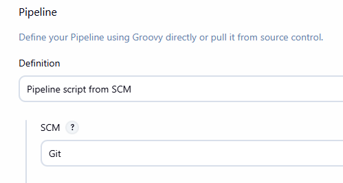

- [x] Przepis dostarczany z SCM, a nie wklejony w Jenkinsa lub sprawozdanie (co załatwia nam `clone` )

- [x] Posprzątaliśmy i wiemy, że odbyło się to skutecznie - mamy pewność, że pracujemy na najnowszym (a nie *cache'owanym* kodzie)

Zastosowano podwojne czyszczenie przestrzeni roboczej

```groovy
stage('Cleanup Workspace') {
    steps {
        cleanWs()
    }
}

post {
  always {
      script {
          sh "docker rmi ${BUILDER_IMAGE} ${TESTER_IMAGE} ${DEPLOY_IMAGE} || true"
      }
      cleanWs()
  }
  success {
      echo "Pipeline zakonczony sukcesem! Artefakt gotowy do pobrania z rejestru."
  }
}
```

- [x] Etap `Build` dysponuje repozytorium i plikami `Dockerfile`
- [x] Etap `Build` tworzy obraz buildowy, np. `BLDR`

Dzięki pobraniu kodu z SCM, na agencie dostępne są odpowiednie pliki Dockerfile. W etapie wywoływany jest: Dockerfile.build. Proces buduje obraz wykorzystywany do kompilacji, oznaczając go tagiem związanym z numerem builda.

```groovy
stage('Build Builder Image') {
    steps {
        script {
            sh "docker build --pull -f Dockerfile.build -t ${BUILDER_IMAGE} -t cpython-builder:latest ."
        }
    }
}
```

- [x] Etap `Build` (krok w tym etapie) lub oddzielny etap (o innej nazwie), przygotowuje artefakt - **jeżeli docelowy kontener ma być odmienny**, tj. nie wywodzimy `Deploy` z obrazu `BLDR`

Etap Build Deploy Image tworzy zupełnie nowy obraz, dedykowany wyłącznie do uruchomienia aplikacji w środowisku docelowym.

```groovy
stage('Build Deploy Image') {
    steps {
        script {
            sh "docker build -f Dockerfile.deploy -t ${DEPLOY_IMAGE} ."
        }
    }
}
```

- [x] Etap `Test` przeprowadza testy

```groovy
stage('Test') {
    steps {
        script {
            sh "docker build -f Dockerfile.test -t ${TESTER_IMAGE} ."
            sh "docker run --name cpython-test-run ${TESTER_IMAGE}"
            sh "docker logs cpython-test-run > test-results.log"
        }
    }
    post {
        always {
            archiveArtifacts artifacts: 'test-results.log', fingerprint: true
        }
    }
}
```

- [x] Etap `Deploy` przygotowuje **obraz lub artefakt** pod wdrożenie. W przypadku aplikacji pracującej jako kontener, powinien to być obraz z odpowiednim entrypointem. W przypadku buildu tworzącego artefakt niekoniecznie pracujący jako kontener (np. interaktywna aplikacja desktopowa), należy przesłać i uruchomić artefakt w środowisku docelowym.

Obraz jest tworzony w etapie Build Deploy Image, a zmienne środowiskowe zapewniają mu spójne nazewnictwo i tagowanie potrzebne do uruchomienia.

```groovy
environment {
    DEPLOY_IMAGE = "cpython-deploy:3.13-build${BUILD_NUMBER}"
}
```

- [x] Etap `Deploy` przeprowadza wdrożenie (start kontenera docelowego lub uruchomienie aplikacji na przeznaczonym do tego celu kontenerze sandboxowym)

```groovy
stage('Smoke Test / Local Deploy') {
    steps {
        script {
            sh "docker run --rm ${DEPLOY_IMAGE} python3 -c \"print('Smoke test przeszedł pomyślnie!')\""
        }
    }
}
```

- [x] Etap `Publish` wysyła obraz docelowy do Rejestru i/lub dodaje artefakt do historii builda

Gotowy do wdrożenia obraz zostaje odpowiednio otagowany i przygotowany do wysyłki do zewnętrznego rejestru Docker.
```groovy
stage('Publish Image to Registry') {
    steps {
        script {
            sh "docker tag ${DEPLOY_IMAGE} ${REGISTRY}/${DEPLOY_IMAGE}"
            echo "Obraz został przygotowany jako: ${DEPLOY_IMAGE}"
        }
    }
}
```

- [x] Ponowne uruchomienie naszego *pipeline'u* powinno zapewniać, że pracujemy na najnowszym (a nie *cache'owanym*) kodzie. Innymi słowy, *pipeline* musi zadziałać więcej niż jeden raz 😎

Poprzez sprzątanie po zakończeniu (niezależnie od tego, czy build był udany), usuwamy zarowno nieuzywane obrazy z cache'u lokalnego deamona Docker, jak i czyscimy katalog workspace.

```groovy
post {
    always {
        script {
            sh "docker rmi ${BUILDER_IMAGE} ${TESTER_IMAGE} ${DEPLOY_IMAGE} || true"
        }
        cleanWs()
    }
}
```