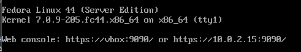
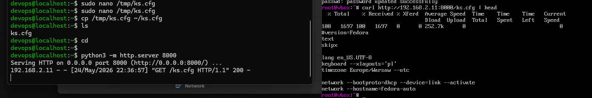
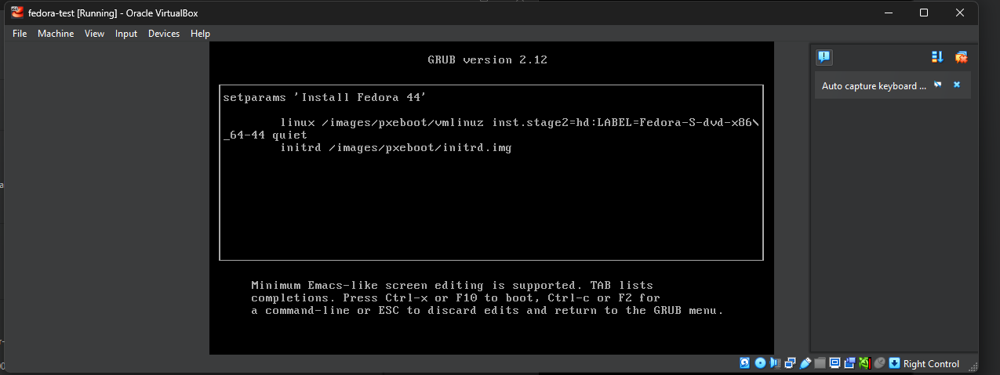
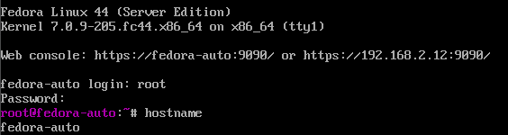
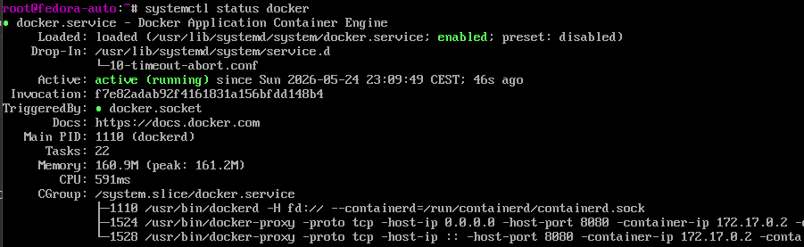
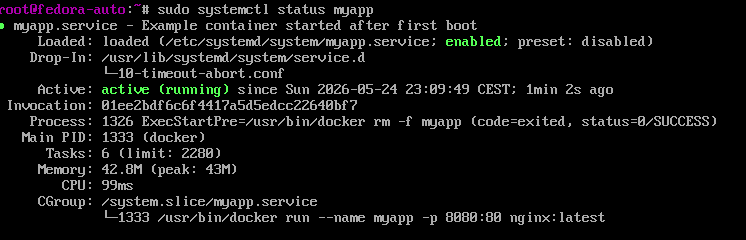
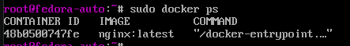
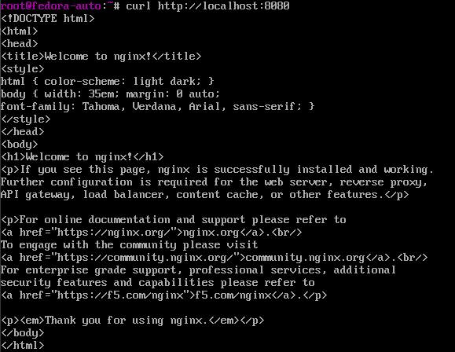

# Sprawozdanie z laboratorium: Pliki odpowiedzi dla wdrożeń nienadzorowanych

## Przygotowanie środowiska

W ramach laboratorium przygotowano instalację nienadzorowaną systemu Fedora Server z wykorzystaniem pliku odpowiedzi Kickstart. Celem było utworzenie źródła instalacyjnego, które pozwala automatycznie zainstalować system operacyjny, skonfigurować podstawowe ustawienia oraz uruchomić oprogramowanie po pierwszym starcie systemu.

Do wykonania zadania wykorzystano środowisko VirtualBox. Utworzono maszynę wirtualną z włączonym UEFI, wirtualnym dyskiem oraz kartą sieciową działającą w trybie mostkowanym. Jako źródło instalacji wykorzystano obraz ISO Fedora Server.

W pierwszym kroku przeprowadzono standardową, ręczną instalację Fedory. Jej celem było uzyskanie pliku odpowiedzi wygenerowanego automatycznie przez instalator Anaconda.

Po zakończeniu instalacji system uruchomił się poprawnie i możliwe było zalogowanie się do powłoki systemowej.



## Pobranie pliku odpowiedzi

Po ręcznej instalacji pobrano wygenerowany przez instalator plik odpowiedzi znajdujący się w lokalizacji `/root/anaconda-ks.cfg`.


Modyfikacja pliku Kickstart

Plik ks.cfg został rozszerzony o konfigurację potrzebną do automatycznej instalacji systemu oraz uruchomienia aplikacji po pierwszym starcie. Dodano źródło instalacji systemu, repozytorium aktualizacji, automatyczne czyszczenie dysku, własny hostname, użytkownika systemowego oraz automatyczny restart po zakończeniu instalacji.

Najważniejsze fragmenty konfiguracji:

``` cfg
network --bootproto=dhcp --device=link --activate
network --hostname=fedora-auto

rootpw --plaintext root123
user --name=devops --password=devops123 --plaintext --groups=wheel

zerombr
clearpart --all --initlabel
autopart --type=lvm

url --mirrorlist=https://mirrors.fedoraproject.org/mirrorlist?repo=fedora-44&arch=x86_64
repo --name=updates --mirrorlist=https://mirrors.fedoraproject.org/mirrorlist?repo=updates-released-f44&arch=x86_64

reboot

Dyrektywy zerombr oraz clearpart --all --initlabel pozwalają na wielokrotną reinstalację systemu na tej samej maszynie. Instalator usuwa istniejące partycje i inicjalizuje dysk od nowa, dzięki czemu instalacja może zostać wykonana bez dodatkowych pytań do użytkownika.

W sekcji %packages dodano pakiety wymagane do dalszej konfiguracji systemu oraz instalacji Dockera.

%packages
@^server-product-environment
dnf-plugins-core
curl
wget
git
nano
openssh-server
%end
```

W sekcji %post dodano instalację Dockera oraz przygotowanie usługi systemd, która po pierwszym uruchomieniu systemu uruchamia kontener z aplikacją.

```
%post --log=/root/ks-post.log --erroronfail --interpreter=/bin/bash
exec > >(tee -a /root/ks-post-screen.log) 2>&1
set -eux

systemctl enable sshd

dnf -y config-manager addrepo --from-repofile=https://download.docker.com/linux/fedora/docker-ce.repo
dnf -y install docker-ce docker-ce-cli containerd.io docker-buildx-plugin docker-compose-plugin

systemctl enable docker.service
systemctl enable containerd.service

cat > /etc/systemd/system/myapp.service <<'EOF'
[Unit]
Description=Example container started after first boot
After=docker.service network-online.target
Wants=network-online.target
Requires=docker.service

[Service]
Restart=always
ExecStartPre=-/usr/bin/docker rm -f myapp
ExecStart=/usr/bin/docker run --name myapp -p 8080:80 nginx:latest
ExecStop=/usr/bin/docker stop myapp

[Install]
WantedBy=multi-user.target
EOF

systemctl enable myapp.service
%end
```

Kontener nie jest uruchamiany bezpośrednio w sekcji %post, ponieważ na etapie działania instalatora Docker nie pracuje jeszcze jako normalna usługa działającego systemu. Zamiast tego w sekcji %post tworzona jest usługa systemd i włączana poleceniem systemctl enable. Dzięki temu kontener zostaje uruchomiony automatycznie po pierwszym starcie zainstalowanego systemu.

Aby instalator Fedory mógł pobrać plik odpowiedzi, udostępniono plik ks.cfg przez tymczasowy serwer HTTP uruchomiony w katalogu domowym użytkownika.



Plik był dostępny pod adresem:

`http://192.168.2.11:8000/ks.cfg`

## Uruchomienie instalacji nienadzorowanej

Następnie utworzono nową maszynę wirtualną przeznaczoną do testu instalacji nienadzorowanej. Maszyna posiadała pusty dysk, włączone UEFI, podłączony obraz ISO Fedory oraz kartę sieciową działającą w tej samej sieci lokalnej co maszyna udostępniająca plik Kickstart.
Po uruchomieniu maszyny z obrazu ISO wybrano opcję Install Fedora 44, a następnie edytowano parametry startowe GRUB-a. Do linii uruchomieniowej jądra dopisano parametr:

```inst.ks=http://192.168.2.11:8000/ks.cfg```



Po uruchomieniu instalatora z parametrem inst.ks instalacja rozpoczęła się automatycznie. Instalator nie wymagał wyboru języka, partycjonowania dysku, tworzenia użytkownika ani podawania innych danych konfiguracyjnych.

W trakcie instalacji wykonana została również sekcja %post, odpowiedzialna za instalację Dockera oraz utworzenie usługi systemd dla kontenera.
Po zakończeniu instalacji system został automatycznie uruchomiony ponownie. Następnie odłączono obraz ISO, aby maszyna startowała już z zainstalowanego dysku.

## Weryfikacja po instalacji












