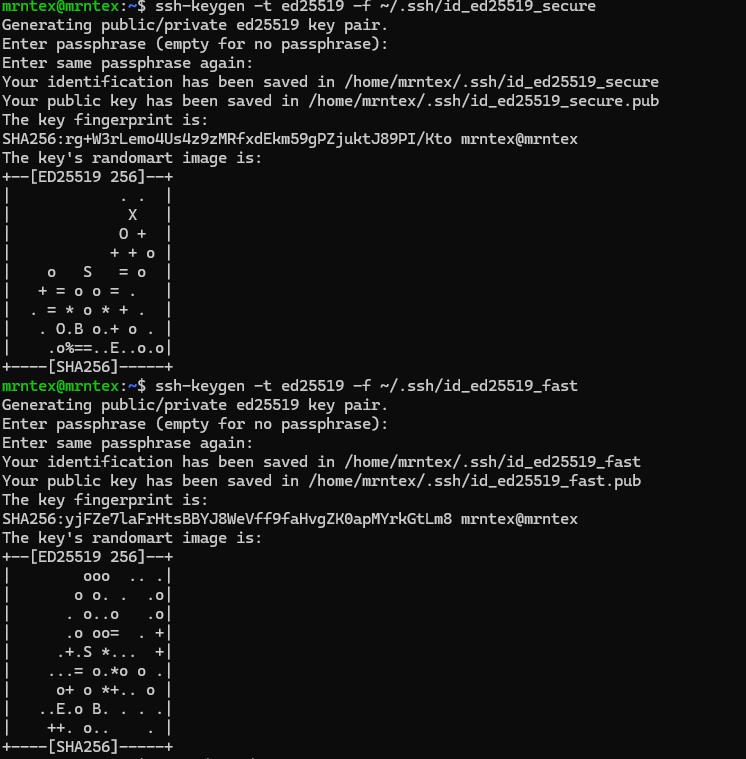
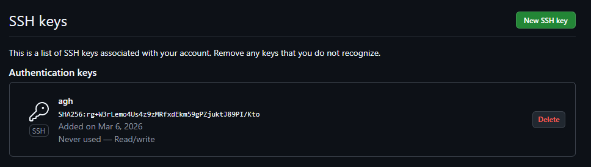
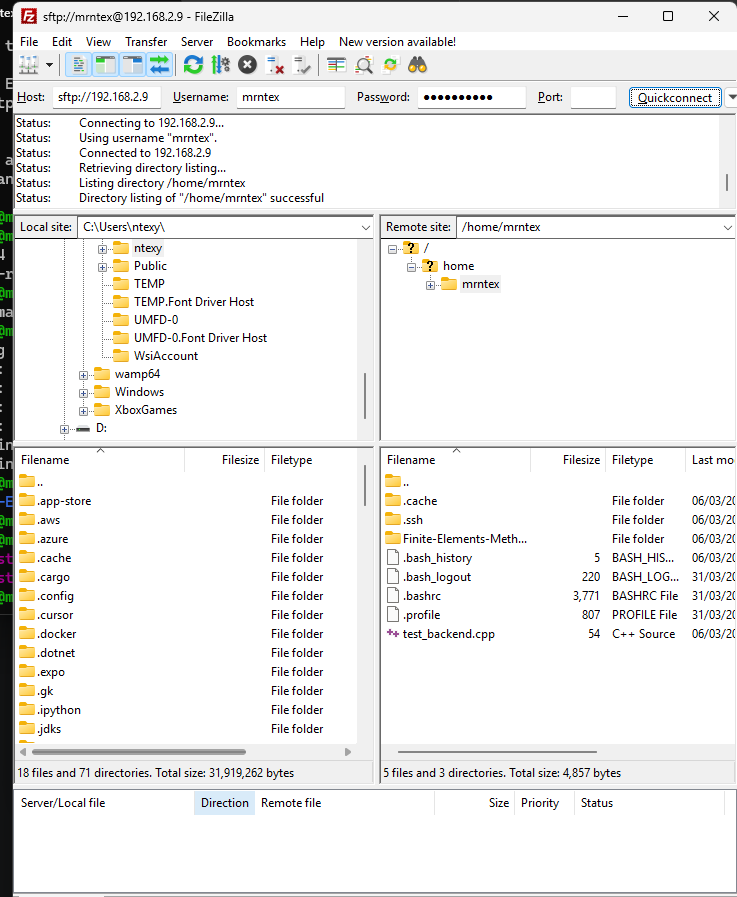
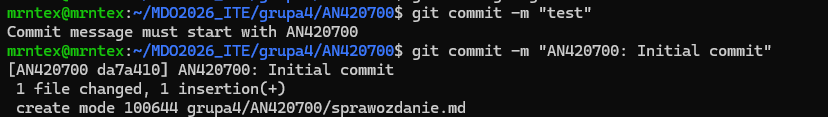

## 1. Konfiguracja Git i SSH
Sklonowano repozytorium git za pomoca:
` git clone https://github.com/InzynieriaOprogramowaniaAGH/MDO2026_ITE `

Utworzono dwa klucze Ed25519:
* `id_ed25519_secure` (zabezpieczony)
* `id_ed25519_open` (bez hasla)



Dodano SSH do GitHuba:

```
eval "$(ssh-agent -s)"
ssh-add ~/.ssh/id_ed25519_secure
```

`git clone git@github.com:InzynieriaOprogramowaniaAGH/MDO2026_ITE.git`

**Narzedzia**



## 2. Galaz
```
git checkout main
git checkout grupa4
git checkout -b AN420700
```

```
mkdir -p grupa4/AN420700
```

## 3. Git Hook
Zaimplementowano skrypt `commit-msg`, ktory wymusza prefiks `AN420700`.

**Kod skryptu:**
```bash
#!/bin/bash
commit_msg=$(cat "$1")
pattern="^AN420700"
if [[ ! $commit_msg =~ $pattern ]]; then
    echo "BŁĄD: Commit musi zaczynać się od AN420700"
    exit 1
fi
```

Umieszczenie skryptu w katalogu hooks
```
cp commit-msg-hook.sh ../../.git/hooks/commit-msg
chmod +x ../../.git/hooks/commit-msg
```

Prezentacja dzialania

