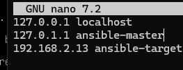
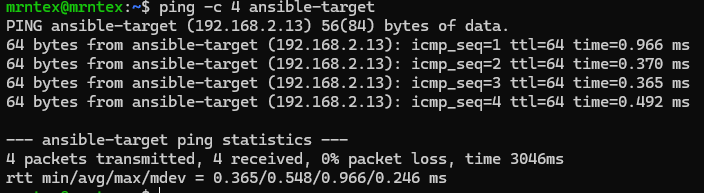
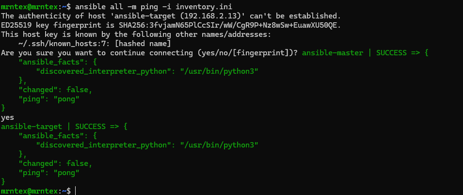
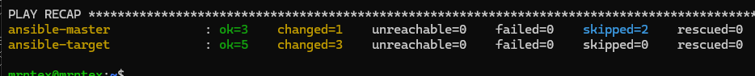
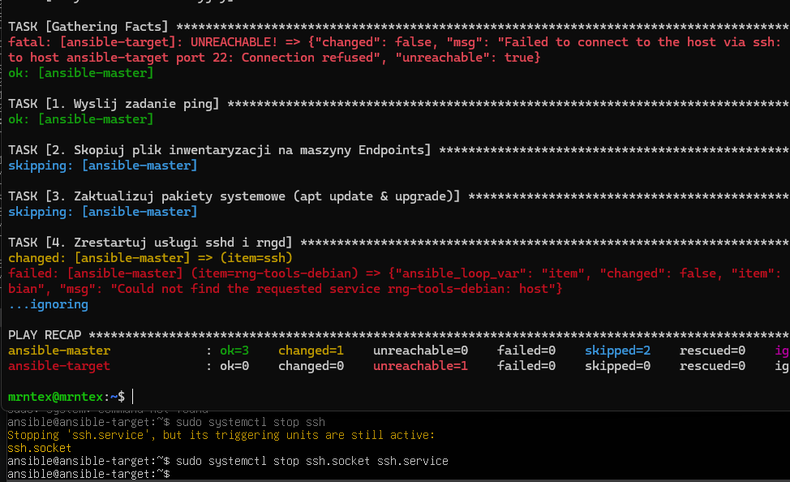

## Sprawozdanie z laboratorium: Automatyzacja i zdalne wykonywanie poleceń za pomocą Ansible
Instalacja zarządcy i przygotowanie środowiska

[x] Utwórz drugą maszynę wirtualną o jak najmniejszym zbiorze zainstalowanego oprogramowania (z programem tar i serwerem sshd)

Jako środowisko docelowe wykorzystano minimalną instalację systemu Ubuntu Server (w tej samej wersji co maszyna główna), wyposażoną wyłącznie w podstawowe narzędzia systemowe oraz serwer OpenSSH.

[x] Nadaj maszynie hostname ansible-target i utwórz użytkownika ansible

Nazwa została nadana podczas instalacji, a dodatkowo zweryfikowana i ustawiona w systemie za pomocą polecenia hostnamectl set-hostname ansible-target.

[x] Na głównej maszynie wirtualnej zainstaluj oprogramowanie Ansible

Zainstalowano Ansible z oficjalnych repozytoriów dystrybucji na maszynie ansible-master.

[x] Wymień klucze SSH tak, by logowanie nie wymagało podania hasła

Wygenerowano nową parę kluczy SSH algorytmem ED25519 `ssh-keygen -t ed25519 -C "ansible-master" -f ~/.ssh/id_ansible` i przesłano klucz publiczny na maszynę docelową za pomocą ssh-copy-id. Skonfigurowano również bezhasłowe wykonywanie poleceń sudo dla użytkownika ansible poprzez plik /etc/sudoers.d/ansible.

### Inwentaryzacja

[x] Wprowadź nazwy DNS dla maszyn wirtualnych (/etc/hosts)





Utworzono plik inventory.ini definiujący role poszczególnych węzłów oraz wskazujący ścieżkę do wygenerowanego wcześniej klucza SSH dla połączeń z końcówkami.

```TOML
[Orchestrators]
ansible-master ansible_connection=local

[Endpoints]
ansible-target ansible_user=ansible ansible_ssh_private_key_file=~/.ssh/id_ansible
```

[x] Wyślij żądanie ping do wszystkich maszyn (Ad-hoc)

Wykonano weryfikację łączności za pomocą wbudowanego modułu ping: ansible all -m ping -i inventory.ini. Obie maszyny poprawnie odpowiedziały statusem SUCCESS.



### Zdalne wywoływanie procedur

[x] Za pomocą playbooka wyślij ping, skopiuj plik inwentaryzacji, zaktualizuj pakiety i zrestartuj usługi (sshd, rngd)

Stworzono plik admin_playbook.yml automatyzujący podstawowe zadania administracyjne na wszystkich węzłach.

```YAML
---
- name: Playbook Administracyjny
  hosts: all
  become: yes

  tasks:
    - name: 1. Wyslij zadanie ping
      ansible.builtin.ping:

    - name: 2. Skopiuj plik inwentaryzacji na maszyny Endpoints
      ansible.builtin.copy:
        src: ./inventory.ini
        dest: /home/ansible/inventory_backup.ini
      when: "'Endpoints' in group_names"

    - name: 3. Zaktualizuj pakiety systemowe (apt update & upgrade)
      ansible.builtin.apt:
        update_cache: yes
        upgrade: dist
      when: "'Endpoints' in group_names"

    - name: 4. Zrestartuj usługi sshd i rngd
      ansible.builtin.systemd:
        name: "{{ item }}"
        state: restarted
      loop:
        - ssh
        - rng-tools-debian
      ignore_errors: yes
```



[x] Ponów operację, porównaj różnice w wyjściu

Ponowne uruchomienie playbooka udowodniło idempotentność narzędzia Ansible. Zadania takie jak kopiowanie pliku czy aktualizacja pakietów zakończyły się statusem ok (zielony) zamiast changed (żółty), ponieważ system znajdował się już w pożądanym stanie.

[x] Przeprowadź operacje względem maszyny z wyłączonym serwerem SSH, odpiętą kartą sieciową



[x] Ubierz kroki playbooka w rolę za pomocą szkieletowania ansible-galaxy

Wygenerowano standaryzowaną strukturę roli poleceniem `ansible-galaxy role init deploy_artifact` oraz uzupełniono metadane w pliku meta/main.yml.

[x] Przeprowadź sanity check docelowej maszyny przed wdrożeniem, nie ulegaj awarii

Na początku wdrożenia rola sprawdza dostępność wolnego miejsca na dysku maszyny docelowej.

```YAML
- name: Sanity check
  ansible.builtin.shell: df -h / | awk 'NR==2 {print $5}' | sed 's/%//'
  register: disk_space
  failed_when: false
  changed_when: false
```
[x] Na maszynie docelowej, Dockera zainstaluj Ansiblem

```YAML
- name: Zainstaluj Dockera i biblioteki Pythona
  ansible.builtin.apt:
    name:
      - docker.io
      - python3-docker
    state: present
    update_cache: yes
```
[x] Uruchom kontener, zweryfikuj łączność, po czym zatrzymaj i usuń kontener

Rola wdraża aplikację kontenerową (artefakt), a następnie pętlą sprawdzającą (mechanizm until/retries/delay) weryfikuje po HTTP, czy usługa wewnątrz kontenera poprawnie wstała i odpowiada kodem 200. Na sam koniec środowisko zostaje wyczyszczone.

```YAML
- name: Uruchom kontener z aplikacja
  community.docker.docker_container:
    name: moj_artefakt
    image: nginx:latest
    state: started
    ports:
      - "8080:80"

- name: Zweryfikuj lacznosc z kontenerem po HTTP
  ansible.builtin.uri:
    url: http://localhost:8080
    status_code: 200
  register: app_status
  until: app_status.status == 200
  retries: 5
  delay: 3

- name: Sukces weryfikacji
  ansible.builtin.debug:
    msg: "Aplikacja działa poprawnie i odpowiada kodem 200!"

- name: Zatrzymaj i usun kontener
  community.docker.docker_container:
    name: moj_artefakt
    state: absent
```
[x] Umieść strukturę w repozytorium GitHub

Cała utworzona struktura znajduje sie w podfolderze `ansible`.
