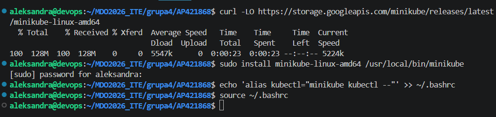
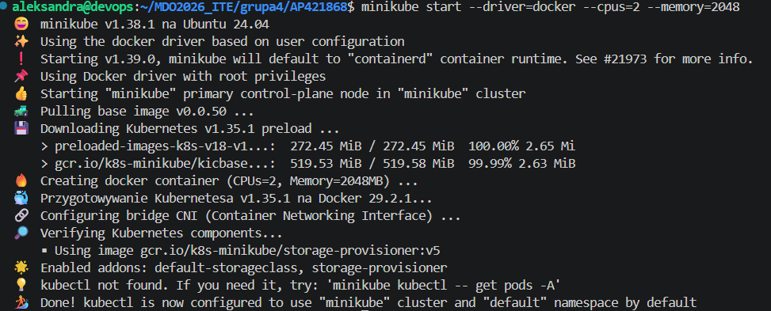
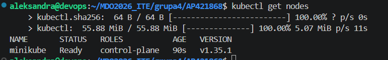
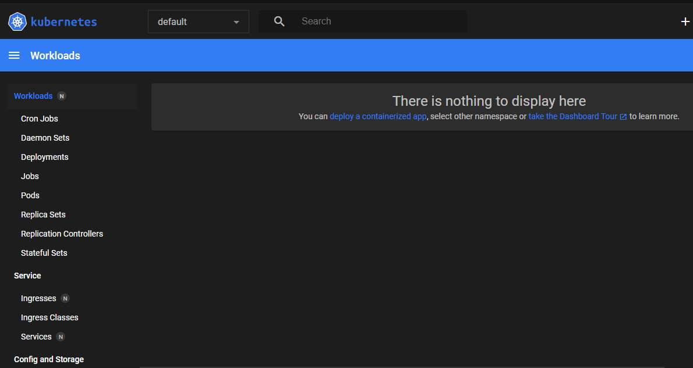
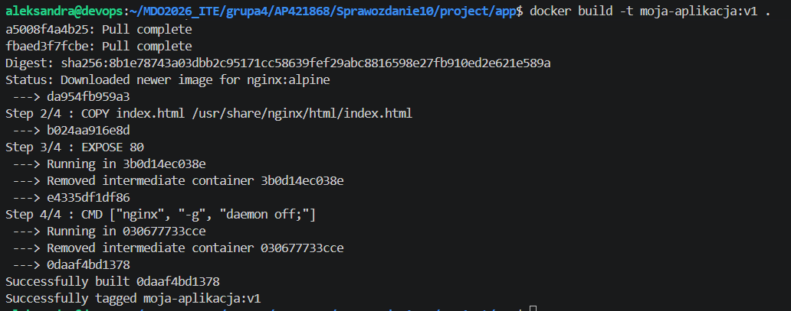
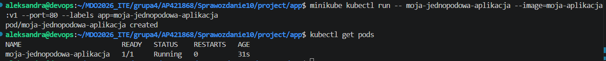
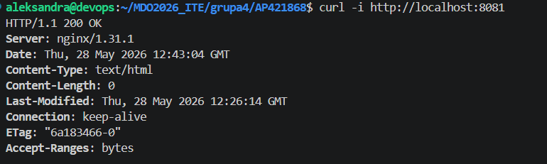
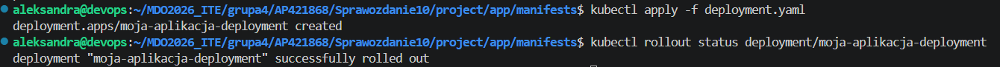
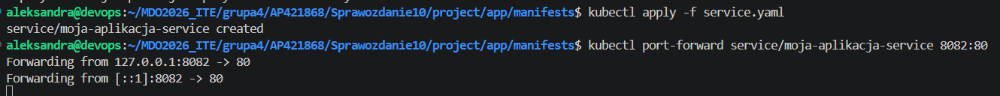
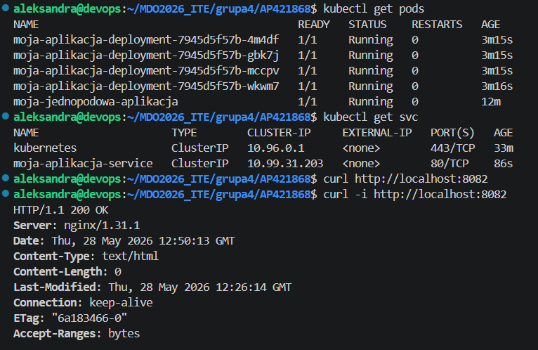

# Sprawozdanie 10 : Wdrażanie na zarządzalne kontenery: Kubernetes 
Aleksandra Pac 421868
# 1. Instalacja stosu k8s, mitygacja wymagań i weryfikacja workera
Na początku pobrano i zainstalowano binarne narzędzie minikube w katalogu domowym systemu. Zgodnie z dokumentacją, do stabilnej pracy wymagane są co najmniej 2 procesory (vCPU) oraz 2 GB pamięci RAM. Żeby uniknąć problemów związanych z uruchamianiem klastra w środowisku wirtualnym, start klastra został wykonany z jawnie ustawionymi ograniczeniami zasobów oraz z użyciem sterownika Docker.

Po instalacji sprawdzono również poziom bezpieczeństwa rozwiązania. W przypadku minikube uruchamianego przez Dockera, kluczowe komponenty klastra, w tym Control Plane oraz API Server, działają wewnątrz odizolowanego kontenera systemowego. Dodatkowo komunikacja wewnątrz klastra jest zabezpieczona certyfikatami TLS (X.509), co ogranicza dostęp do środowiska zarządzającego wyłącznie do maszyny hosta.

W celu uproszczenia pracy przygotowano też alias do polecenia kubectl, korzystający z wersji udostępnianej przez minikube.


Po zakończeniu uruchamiania klastra sprawdzono jego stan oraz działanie węzła roboczego za pomocą polecenia wyświetlającego listę node’ów.

# 2. Uruchomienie i konfiguracja łączności z Dashboardem
Następnie uruchomiono graficzny panel zarządzania Kubernetes Dashboard przy użyciu polecenia:

```
minikube dashboard --url
```


# 3. Analiza kontenera i przygotowanie obrazu-gotowca
Podczas analizy aplikacji z poprzednich laboratoriów, czyli biblioteki dwukierunkowej C clibs/list, okazało się, że nie nadaje się ona do bezpośredniego wdrożenia jako samodzielna usługa w chmurze. Jest to komponent programistyczny w postaci biblioteki statycznej .a, który nie udostępnia żadnego interfejsu sieciowego.

Z tego powodu na potrzeby zadania przygotowano rozwiązanie typu obraz-gotowiec. Zbudowano prostą aplikację webową opartą na Nginx, do której dodano własną stronę startową HTML. W pliku Dockerfile proces uruchamiany jest w trybie pierwszoplanowym dzięki daemon off;, co zapewnia, że główny proces serwera działa cały czas jako PID 1. Dzięki temu kontener pozostaje aktywny i nie kończy pracy zaraz po starcie.

W katalogu ~/k8s-project/app przygotowano pliki źródłowe index.html oraz Dockerfile.

Obraz został zbudowany lokalnie przy użyciu Dockera:
```
docker build -t moja-aplikacja:v1 .
```

Aby minikube mógł skorzystać z lokalnie zbudowanego obrazu bez wypychania go do zewnętrznego rejestru, został on załadowany bezpośrednio do środowiska klastra:
```
minikube image load moja-aplikacja:v1
```
# 4. Manualne uruchomienie aplikacji
W kolejnym etapie wykonano test uruchomienia aplikacji w sposób manualny jako pojedynczego wdrożenia. Zgodnie z wymaganiami użyto polecenia, które uruchamia jednopodową aplikację w klastrze. Minikube automatycznie „ubrał” kontener w strukturę Pod, czyli podstawową jednostkę wykonawczą Kubernetes.
```
minikube kubectl run -- moja-jednopodowa-aplikacja --image=moja-aplikacja:v1 --port=80 --labels app=moja-jednopodowa-aplikacja
```


W celu sprawdzenia działania usługi wykonano przekierowanie portu z kontenera na port lokalny hosta:
```
kubectl port-forward pod/moja-jednopodowa-aplikacja 8081:80
```
Po ustanowieniu tunelu w drugiej sesji terminala wykonano testowe zapytanie curl, otrzymując odpowiedź bezpośrednio z uruchomionej aplikacji.

# 5. Przekucie wdrożenia w deklaratywny plik YAML, replikacja i ekspozycja serwisu
W kolejnym kroku manualne uruchamianie zastąpiono podejściem deklaratywnym. W katalogu ~/k8s-project/manifests utworzono plik deployment.yaml. Zgodnie z wymaganiami wdrożenie zostało rozszerzone do 4 replik, a parametr imagePullPolicy: Never wymusza korzystanie z obrazu wcześniej załadowanego do pamięci minikube.

Wdrożenie uruchomiono w klastrze, a następnie sprawdzono jego stan za pomocą komendy śledzącej rollout:
```
kubectl apply -f deployment.yaml
kubectl rollout status deployment/moja-aplikacja-deployment
```

Ostatnim etapem było wyeksponowanie wdrożenia jako Service. Taka forma pozwala uzyskać stały punkt dostępu do aplikacji oraz automatycznie rozkłada ruch pomiędzy replikami.

Następnie uruchomiono plik z usługą i przekierowano port lokalny na serwis:
```
kubectl apply -f service.yaml
kubectl port-forward service/moja-aplikacja-service 8082:80
```

Na końcu zweryfikowano działanie całego rozwiązania, wysyłając zapytanie curl do wyeksponowanej usługi z drugiego okna terminala.
