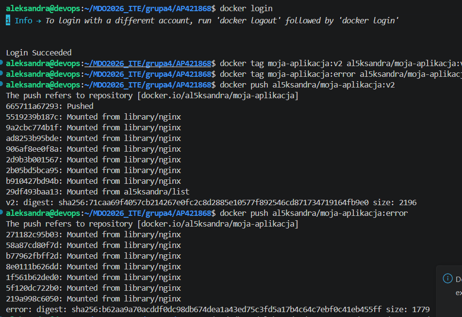
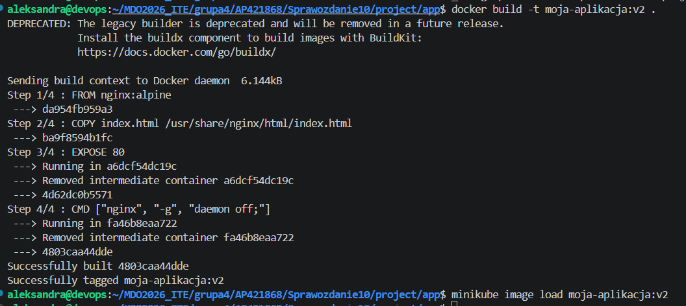
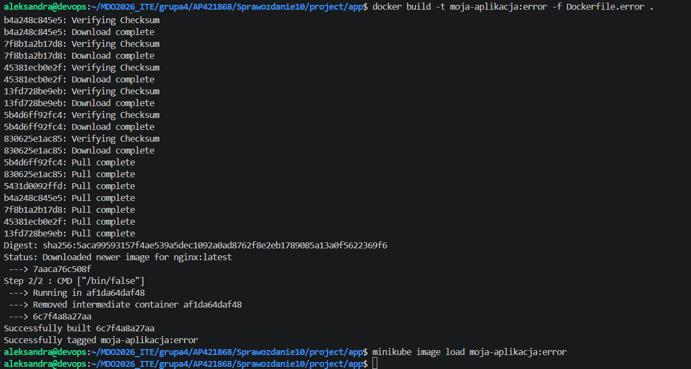
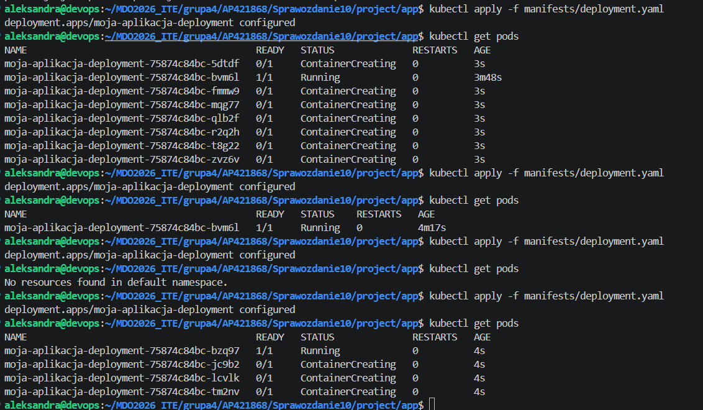
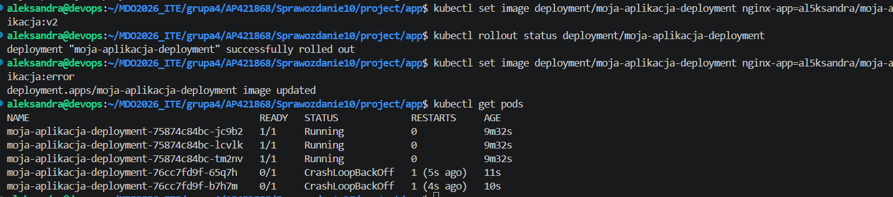
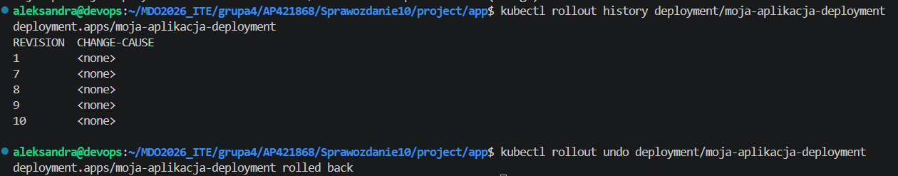
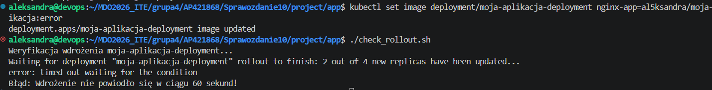
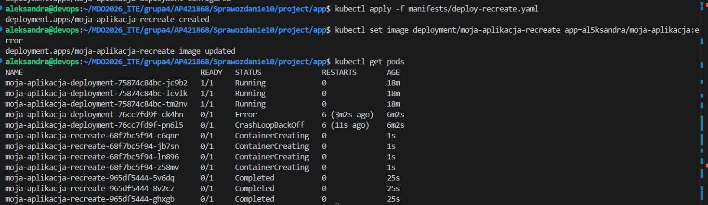
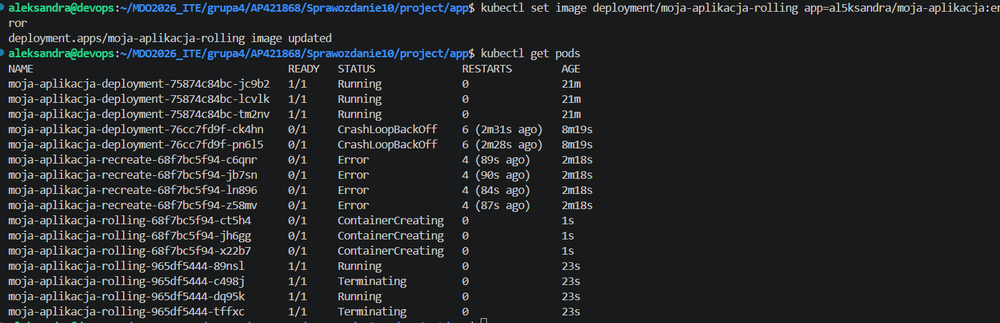
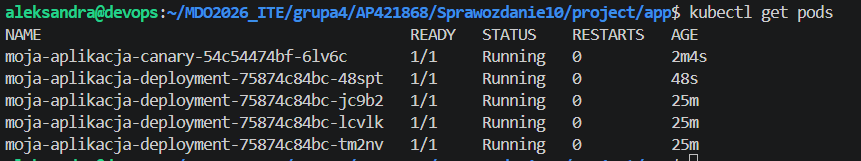

# Sprawozdanie 11: Wdrażanie na zarządzalne kontenery: Kubernetes (2)
Aleksandra Pac 421868

# 1. Przygotowanie nowych wersji obrazów aplikacyjnych i publikacja w Docker Hub

Aby móc sprawdzić bardziej zaawansowane scenariusze aktualizacji i zarządzania cyklem życia aplikacji w klastrze Minikube, przygotowano kolejne wersje obrazu kontenera. Prace rozpoczęto w katalogu projektu:

`/home/aleksandra/MDO2026_ITE/grupa4/AP421868/Sprawozdanie10/project/app`

W celu realizacji scenariuszy wymagających zewnętrznego rejestru kontenerów, zalogowano się do platformy Docker Hub i przygotowano proces wypychania obrazów za pomocą polecenia `docker push`.



Następnie zmodyfikowano plik źródłowy `index.html`, tak aby zawierał nową, łatwo rozpoznawalną treść identyfikującą wersję `v2` serwisu. Za pomocą polecenia `docker build -t moja-aplikacja:v2 .` zbudowano lokalny obraz aplikacyjny. Aby obraz był natychmiast dostępny dla klastra bez konieczności przesyłania go do sieci, wykorzystano funkcjonalność Minikube pozwalającą na bezpośrednie ładowanie lokalnych struktur za pomocą komendy `minikube image load moja-aplikacja:v2`.



Kolejnym krokiem było zasymulowanie błędu aplikacji podczas uruchamiania, aby sprawdzić reakcję klastra na awarię. W tym celu przygotowano osobny plik `Dockerfile.error`, w którym standardowe polecenie uruchomieniowe serwera zostało zastąpione komendą zwracającą natychmiastowy błąd (`/bin/false`). Powoduje to zakończenie działania procesu startowego kontenera z niezerowym kodem wyjścia. 

Tak przygotowany wadliwy obraz został zbudowany pod nazwą `al5ksandra/moja-aplikacja:error` i przesłany do zdalnego rejestru Docker Hub, skąd pobiera go klaster podczas testowania zaawansowanych strategii aktualizacji.



# 2. Dynamiczne skalowanie deklaratywnego wdrożenia

W tej części sprawdzono możliwości elastycznego i dynamicznego skalowania aplikacji poprzez modyfikację parametru `replicas` w głównym manifeście wdrożenia:

`/home/aleksandra/MDO2026_ITE/grupa4/AP421868/Sprawozdanie10/project/app/manifests/deployment.yaml`

Po każdej zmianie wartości w pliku YAML, nowa konfiguracja była aplikowana deklaratywnie do klastra, a Kubernetes automatycznie dążył do osiągnięcia oczekiwanego stanu (Desired State):

1. **Skalowanie w górę (replicas: 8):** Liczba instancji została zwiększona do 8. Klaster natychmiast utworzył cztery dodatkowe pody, które pomyślnie przeszły w stan `Running`.
2. **Skalowanie w dół (replicas: 1):** Po zmniejszeniu liczby replik do 1, mechanizmy kontrolera wdrożeń usunęły siedem zbędnych podów, pozostawiając dokładnie jedną, działającą instancję.
3. **Całkowite zatrzymanie (replicas: 0):** Ustawienie wartości zero spowodowało bezpowrotne wygaszenie i usunięcie wszystkich aktywnych podów powiązanych z tym wdrożeniem.
4. **Przywrócenie stanu stabilnego (replicas: 4):** Na koniec przywrócono docelową liczbę 4 replik. Przed przejściem do kolejnych zadań środowisko zostało w pełni oczyszczone ze starych, nieaktywnych podów, dzięki czemu na liście pozostały wyłącznie cztery czyste i stabilnie działające pody głównej aplikacji.

```bash
kubectl apply manifests/deployment.yaml
kubectl get pods
```



# 3. Aktualizacje wersji, analiza historii zmian (Rollout) i automatyzacja weryfikacji

W tej części przeanalizowano mechanizmy aktualizacji aplikacji pomiędzy kolejnymi wersjami. W manifeście wdrożenia dynamicznie zmieniano wartość pola `image`, wskazując przygotowane wcześniej w Docker Hubie obrazy za pomocą polecenia `kubectl set image`.

Po przejściu na wersję `al5ksandra/moja-aplikacja:v2` wdrożenie zakończyło się pełnym powodzeniem. Następnie przetestowano scenariusz awaryjny, wdrażając celowo uszkodzoną wersję `al5ksandra/moja-aplikacja:error`. Pody zaczęły cyklicznie crashować, przez co wpadły w pętlę restartów, a ich status zmienił się na `CrashLoopBackOff`.



Aby przywrócić działającą wersję aplikacji, wykorzystano wbudowany mechanizm historii wdrożeń klastra. Polecenie `kubectl rollout history` pozwoliło na weryfikację dostępnych rewizji zapisu, a następnie za pomocą polecenia `kubectl rollout undo` wykonano natychmiastowy powrót (rollback) do poprzedniej, w pełni stabilnej wersji pobranej z Docker Hub.

```bash
kubectl rollout history deployment/moja-aplikacja-deployment
kubectl rollout undo deployment/moja-aplikacja-deployment
```



Dodatkowo przygotowano skrypt automatyzujący `check_rollout.sh`, którego zadaniem była automatyczna kontrola poprawności nowo uruchamianego wdrożenia. Skrypt odpytywał status aktualizacji i wymuszał sztywny limit czasu (timeout) wynoszący 60 sekund. Jeżeli wdrożenie nie osiągnęło stanu pełnej gotowości w wyznaczonym oknie czasowym, skrypt przerywał pracę, zwracając kod błędu.

Działanie automatyzacji przetestowano, ponownie wdrażając wadliwy obraz `al5ksandra/moja-aplikacja:error`. Skrypt prawidłowo zidentyfikował brak postępu aktualizacji (brak statusu gotowości podów) i po upływie 60 sekund zakończył działanie z jawnym komunikatem o błędzie w terminalu. Po zakończeniu testu środowisko ponownie uzdrowiono za pomocą operacji `rollout undo`.



# 4. Praktyczna implementacja i analiza zaawansowanych strategii wdrożeń

Ostatnia część ćwiczenia dotyczyła implementacji oraz porównania zaawansowanych strategii wdrażania oprogramowania w środowisku Kubernetes. Wszystkie wdrażane podsystemy były powiązane z istniejącą usługą sieciową (`Service`) za pomocą etykiet selektorów (`labels`), co pozwoliło na ewaluację zachowania klastra w trakcie zmian.

## Strategia Recreate

Przygotowano dedykowany manifest `deploy-recreate.yaml`, w którym zdefiniowano strategię aktualizacji typu `Recreate`. W tym podejściu Kubernetes dąży do całkowitego odcięcia starej wersji przed uruchomieniem nowej. 

Podczas wywołania aktualizacji do wersji `al5ksandra/moja-aplikacja:error` na zrzucie ekranu zaobserwowano, że dotychczas działające pody starej rewizji (z hashem `965df5444`) zostały bezwzględnie zatrzymane i przeszły w stan `Completed`. Dopiero po ich pełnym wygaszeniu, kontroler zaczął tworzyć nowe instancje (`ContainerCreating` z nowym hashem `68f7bc5f94`). Zaletą tej strategii jest gwarancja, że dwie różne wersje aplikacji nigdy nie działają równolegle, wadą natomiast jest chwilowa niedostępność usług dla użytkownika końcowego.



## Strategia RollingUpdate

Następnie utworzono manifest `deploy-rolling.yaml`, wykorzystujący domyślną i płynną strategię `RollingUpdate`. W konfiguracji precyzynie określono parametry sterujące procesem wymiany podów:
- `maxUnavailable: 2` (maksymalnie dwa pody mogą być niedostępne w trakcie trwania procedury),
- `maxSurge: 25%` (klaster może tymczasowo powołać maksymalnie 1 pod nadprogramowy ponad limit replik).

Podczas testu polegającego na podmianie obrazu na wersję uszkodzoną uchwycono moment stopniowej, kroczącej wymiany. Na zrzucie ekranu wyraźnie widać jednoczesne występowanie podów w różnych stanach: część starych podów wciąż obsługiwała ruch (`Running`), część była stopniowo wygaszana (`Terminating`), a w tym samym czasie klaster powoływał już nowe instancje aplikacyjne (`ContainerCreating`). Dzięki temu aplikacja zachowuje ciągłość działania i pozostaje dostępna bez jakichkolwiek przerw.



## Canary Deployment (Wdrożenie Kanarkowe)

Ostatnim testowanym podejściem było Canary Deployment. W tym celu przygotowano niezależny manifest `canary.yaml`, którego zadaniem było uruchomienie zaledwie jednej repliki nowej wersji aplikacji (`v2`), podczas gdy główne wdrożenie produkcyjne (`moja-aplikacja-deployment`) stabilnie utrzymywało swoje 4 repliki.

Kluczowym elementem konfiguracji było współdzielenie przez oba te niezależne wdrożenia identycznej etykiety głównej: `app: moja-aplikacja`. 

W efekcie końcowym w klastrze uruchomiono równolegle:
- 4 w pełni sprawne pody wersji stabilnej (`moja-aplikacja-deployment`),
- 1 pod wersji testowej/kanarkowej (`moja-aplikacja-canary`).


