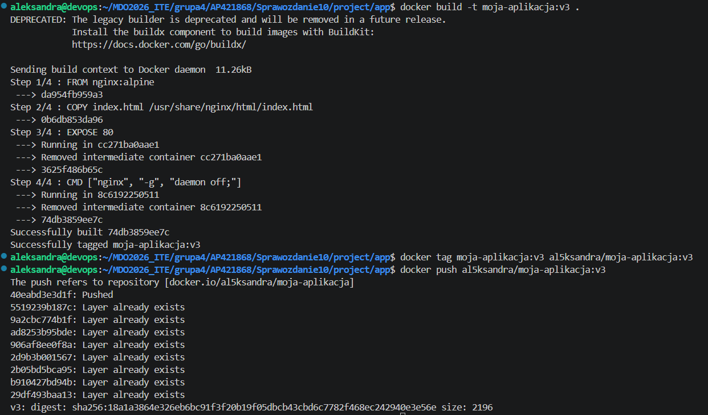
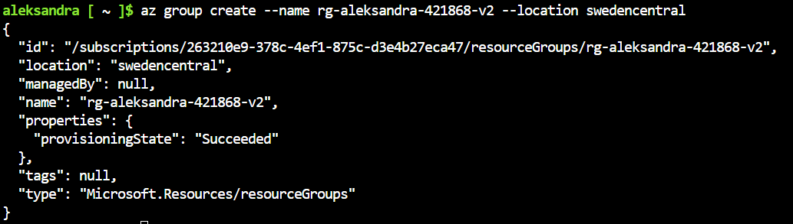
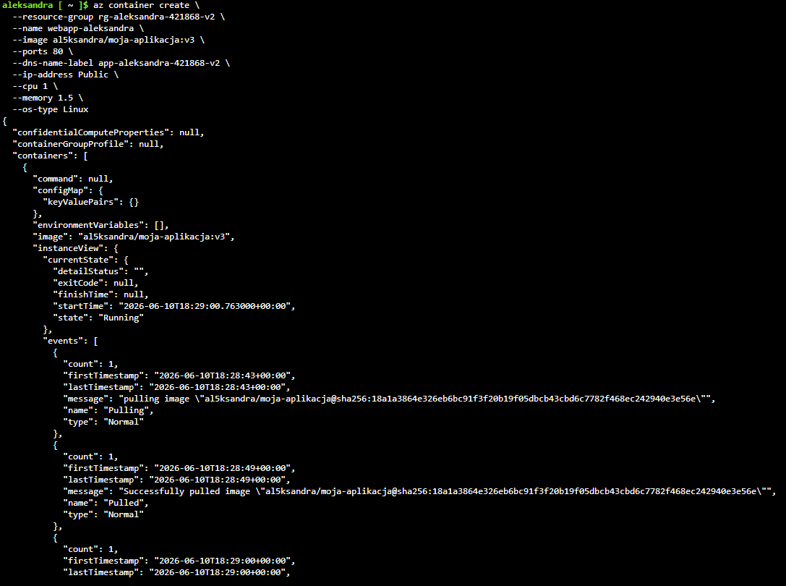
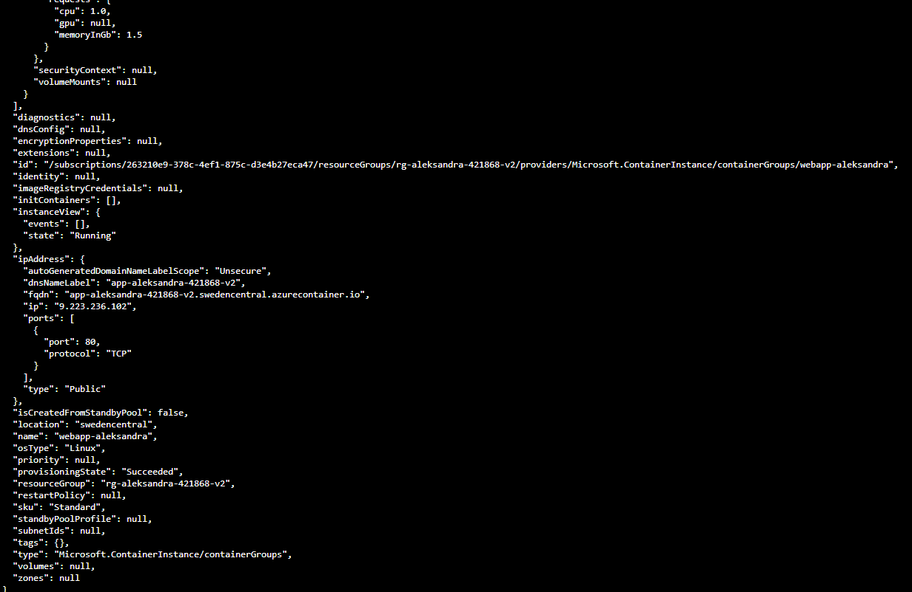
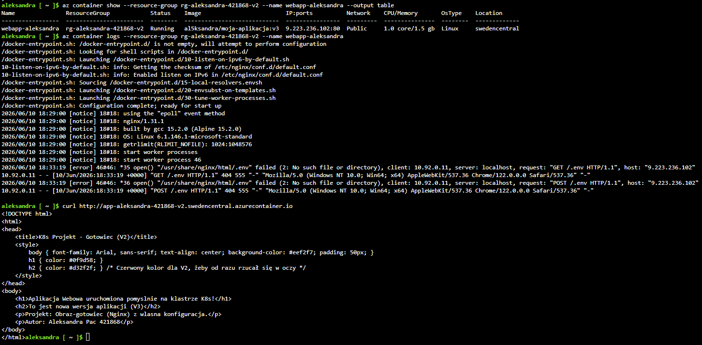
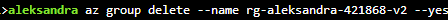
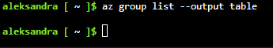

# Wdrażanie w chmurze Azure
Aleksandra Pac 421868
## 1. Przygotowanie i aktualizacja obrazu na platformie Docker Hub
W pierwszej kolejności upewniono się, że dysponuje się własnym kontenerem aplikacyjnym. Zgodnie z wymaganiami zaktualizowano aplikację webową, wprowadzając drobną modyfikację do pliku index.html w celu oznaczenia nowej wersji wdrożeniowej (v3). Następnie zbudowano nowy obraz lokalnie.
```
docker build -t moja-aplikacja:v3 .
```
Po pomyślnym zbudowaniu obrazu zaktualizowano wersję kontenera obecną w publicznym rejestrze Docker Hub. Otagowano lokalny obraz, łącząc go z kontem, a następnie wysłano na platformę poleceniem push
```
docker tag moja-aplikacja:v3 al5ksandra/moja-aplikacja:v3
docker push al5ksandra/moja-aplikacja:v3
```

## 2. Inicjalizacja środowiska Azure Cloud Shell i utworzenie Resource Group
Po zalogowaniu do platformy Azure przy użyciu konta studenckiego Microsoft, uruchomiono wbudowane narzędzie Azure Cloud Shell dla powłoki Bash, które jest niezbędne do przeprowadzenia wdrożenia. Pierwszym krokiem konfiguracyjnym było utworzenie własnej, dedykowanej grupy zasobów (Resource Group) o nazwie rg-aleksandra-421868 w regionie swedencentral.
```
az group create --name rg-aleksandra-421868-v2 --location swedencentral
```

## Wdrożenie kontenera do usługi Azure
Wdrożono kontener przy użyciu polecenia tworzącego instancję w zdefiniowanej wcześniej grupie zasobów. Przydzielono mu publiczny adres IP, otwarto port 80 oraz skonfigurowano unikalną etykietę DNS.


## 4. Weryfikacja działania, pobranie logów i test usługi HTTP
W celu potwierdzenia, że aplikacja została poprawnie uruchomiona w chmurze Azure, sprawdzono status kontenera za pomocą polecenia az container show. Wynik w postaci tabeli potwierdził, że usługa ma status Running.

Następnie pobrano logi systemowe serwera Nginx, aby upewnić się, że proces startowy przebiegł bez błędów. Ostatnim etapem weryfikacji było przetestowanie komunikacji sieciowej - za pomocą narzędzia curl wysłano zapytanie na publiczny adres URL kontenera, uzyskując w odpowiedzi pełny kod HTML wdrożonej strony internetowej.

## 5. Czyszczenie środowiska
Po zakończeniu prac i zebraniu logów zatrzymano i całkowicie usunięto kontener. Wykonano to poprzez skasowanie całej powiązanej grupy zasobów.
```
az group delete --name rg-aleksandra-421868 --yes
```


