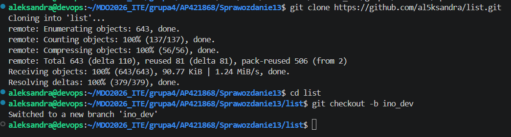
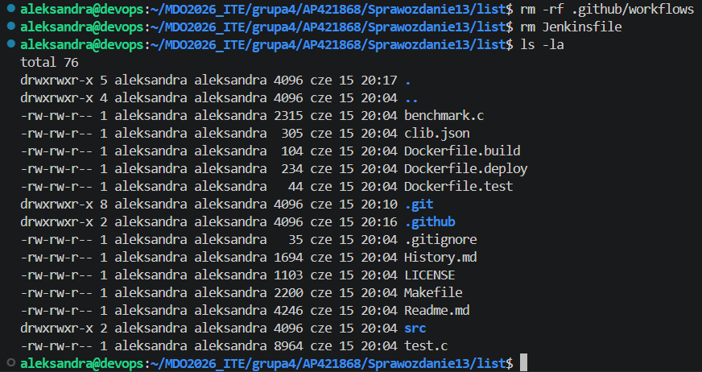
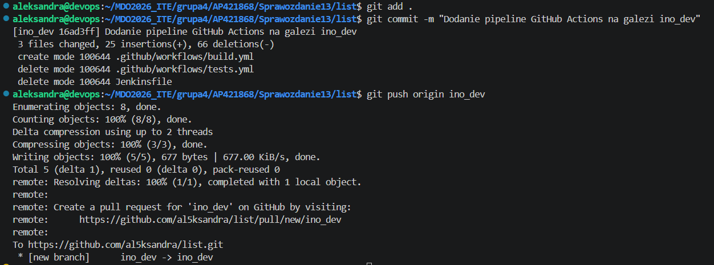
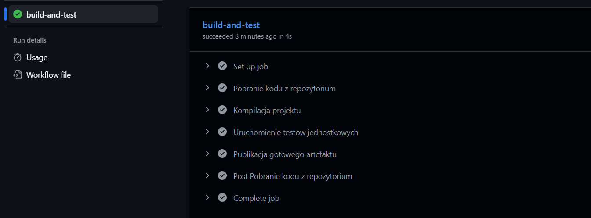
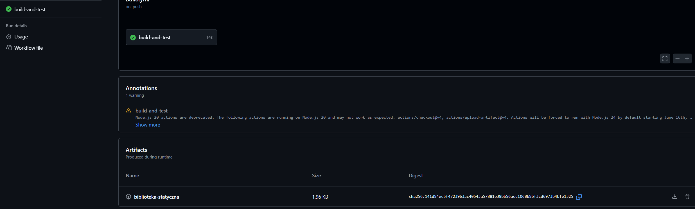

# Sprawozdanie 13 : Automatyzacja potoku CI/CD przy użyciu GitHub Actions
Aleksandra Pac 421868
### 1. Przygotowanie repozytorium i utworzenie nowej gałęzi
W ramach zadania zapoznano się z koncepcją GitHub Actions, czyli natywnym narzędziem CI/CD zintegrowanym z platformą GitHub.
Sklonowano lokalnie wcześniej utworzony fork repozytorium al5ksandra/list i utworzono w nim dedykowaną gałąź środowiskową o nazwie ino_dev.
```
git clone https://github.com/al5ksandra/list.git
cd list
git checkout -b ino_dev
```

### 2. Oczyszczenie projektu z poprzednich konfiguracji CI/CD
Przed zdefiniowaniem nowego potoku, upewniono się, że projekt nie zawiera starych workflows, które mogłyby kolidować z nowym zadaniem. Usunięto katalogi konfiguracyjne platformy GitHub jeśli istniały oraz zlikwidowano plik Jenkinsfile z poprzednich laboratoriów.
```
rm -rf .github/workflows
rm Jenkinsfile
```

### 3. Utworzenie deklaratywnego pliku workflow
W kolejnym kroku utworzono strukturę katalogów wymaganą przez GitHub Actions i przygotowano własną akcję.
```
mkdir -p .github/workflows
touch .github/workflows/build.yml
```
Utworzono akcję reagującą wyłącznie na zdarzenie push w gałęzi ino_dev. W pliku konfiguracyjnym zdefiniowano proces oparty na maszynie ubuntu-latest. Proces składa się z pobrania kodu, kompilacji (narzędzie make), uruchomienia testów jednostkowych (make test) oraz, ze względu na niewielki rozmiar budowanego projektu, archiwizacji gotowej biblioteki statycznej za pomocą dedykowanej akcji upload-artifact.

Treść pliku build.yml:
```
name: CI Pipeline C-Library

on:
  push:
    branches: [ "ino_dev" ]

jobs:
  build-and-test:
    runs-on: ubuntu-latest

    steps:
    - name: Pobranie kodu z repozytorium
      uses: actions/checkout@v4

    - name: Kompilacja projektu
      run: make

    - name: Uruchomienie testow jednostkowych
      run: make test

    - name: Publikacja gotowego artefaktu
      uses: actions/upload-artifact@v4
      with:
        name: biblioteka-statyczna
        path: 'build/*.a'
  ```      
### 4. Wypchnięcie zmian i wyzwolenie potoku       
 Zatwierdzono zmiany w systemie kontroli wersji, dodając stworzony plik workflow do repozytorium. Następnie wypchnięto zawartość lokalnej gałęzi ino_dev do serwera zdalnego. Operacja ta zadziałała jako zdefiniowany wcześniej trigger, uruchamiając akcję na platformie GitHub.
 
 ### 5. Weryfikacja działania potoku i pobranie artefaktu
 Aby potwierdzić poprawność działania stworzonego rozwiązania, zalogowano się do panelu webowego GitHub w przeglądarce i przejrzano zakładkę "Actions". Zweryfikowano, że wybrany program zbudował się poprawnie i zaliczył testy wewnątrz zdefiniowanej akcji, co potwierdził zielony status zadania.


 Na koniec sprawdzono dostępność zbudowanego pliku wynikowego. Zgodnie z konfiguracją kroku upload-artifact, na stronie podsumowania przebiegu akcji pomyślnie wygenerowano paczkę .zip zawierającą docelowy artefakt (bibliotekę libclibs_list.a).
 