# 1. Instalacja Środowiska docker
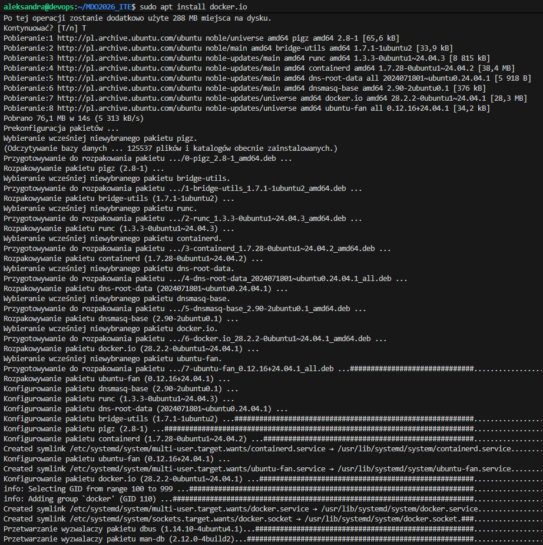
# 2. Zapoznanie się z obrazami
a. hello-world
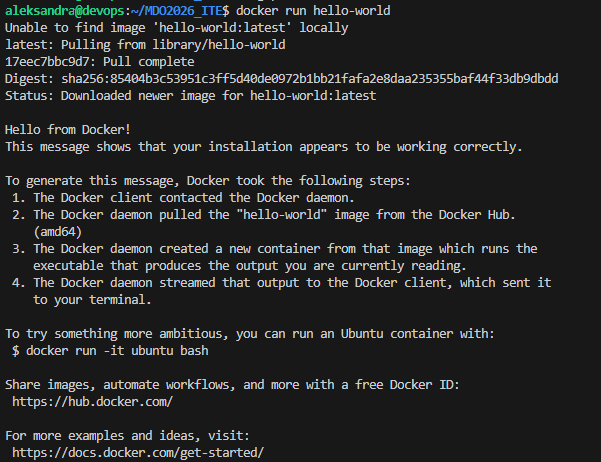
Kod wyjścia:

b. busybox
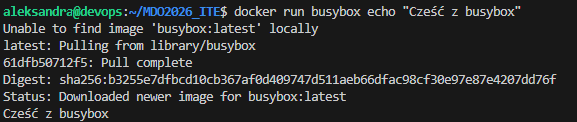
Kod wyjścia:
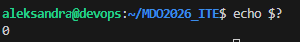
c. ubuntu
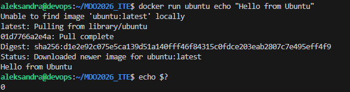
d. mariadb
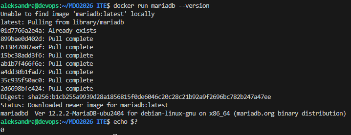
e. runtime
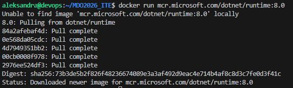
f. aspnet
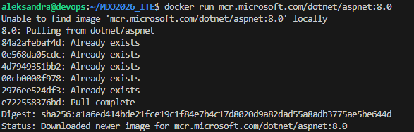
g. sdk
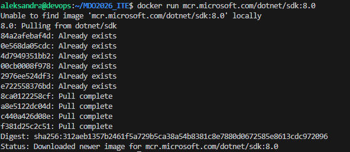

Rozmiary obrazow:
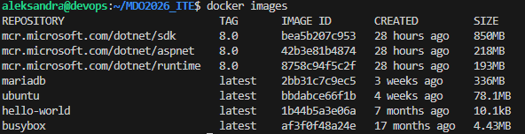
# 3. Uruchomienie konteneru z obrazu busybox i pokazanie numeru wersji
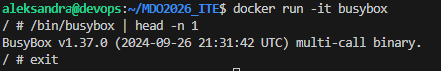
# 4. Uruchomienie konteneru z obrazu ubuntu
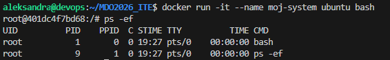
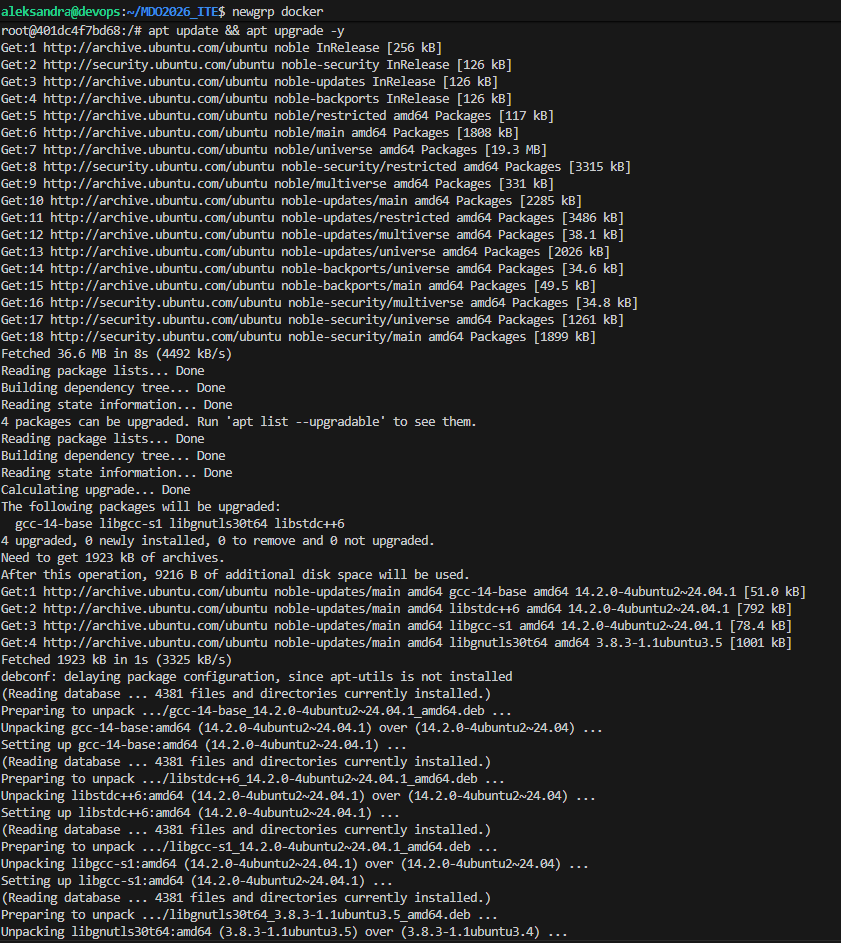
# 5. Stworzenie, zbudowanie i uruchomienie pliku Dockerfile i sklonowanie w nim repozytorium
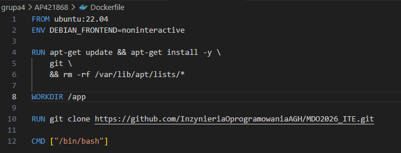
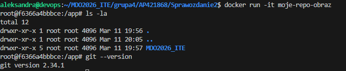
# 6. Pokazanie działających kontenerów, wyczyszczenie zakończonych
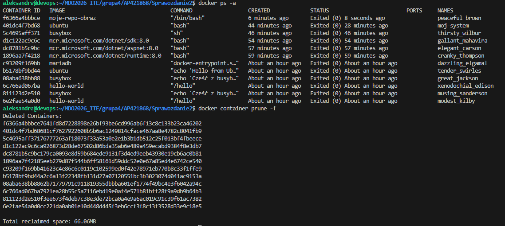
# 7. Wyczyszczenie obrazów przechowywanych w lokalnym magazynie
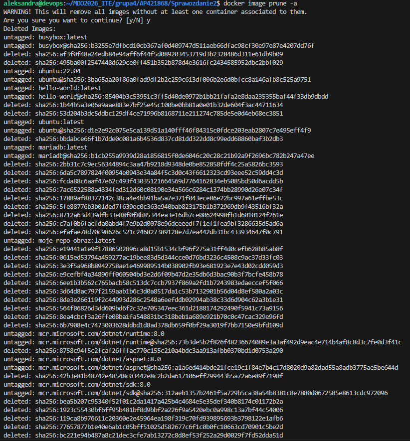
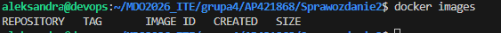