# 1. Wybór oprogramowania
Wybrano następujące repozytorium: 
https://github.com/clibs/list.git
Następnie je sklonowano:
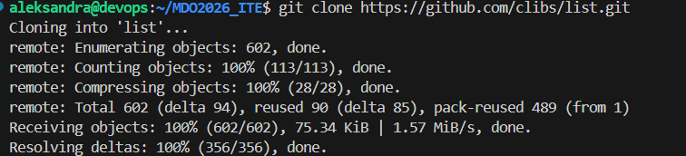
Po doinstalowaniu zależności zbudowano program:
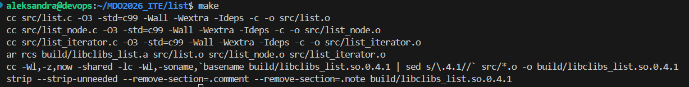
I uruchomiono testy jednostkowe: 
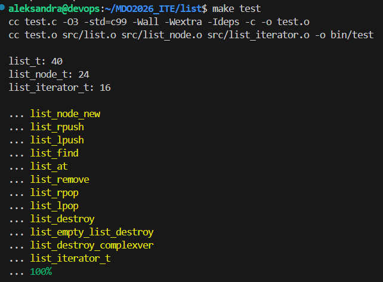
# 2. Izolacja i powtarzalność: build w kontenerze
1. Do realizacji zadania wybrano obraz gcc:latest, ponieważ zawiera on już wbudowany kompilator i narzędzia niezbędne dla projektów w języku C.
2. Następnie uruchomiono kontener komendą docker run -it --name budowniczy-interaktywny gcc:latest bash i w jego wnętrzu sklonowano repozytorium, skompilowano kod komendą make i sprawdzono testy przez make test
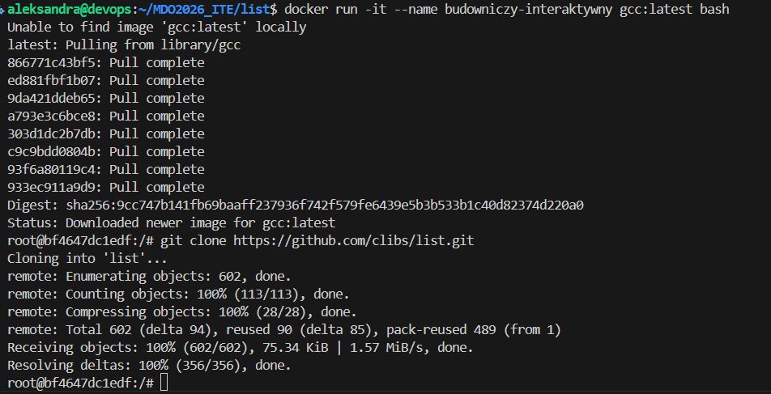
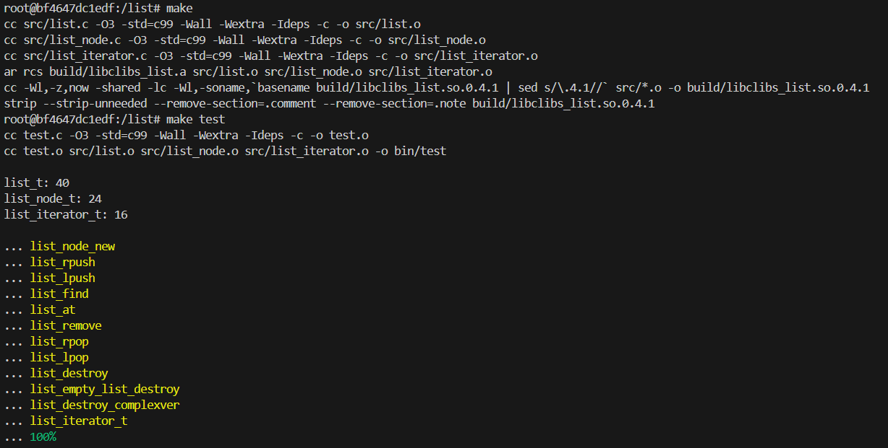
3. Następnie utworzono dwa pliki Dockerfile automatyzujące kroki powyżej
a. plik Dockerfile.build, który przygotowuje środowisko budowania
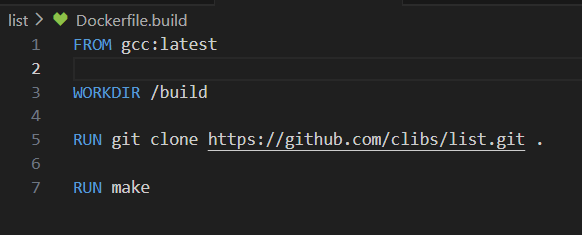
b. plik Dockerfile.test, który bazuje na pierwszym i tylko wykonuje testy
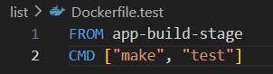
4. Uruchomiono pliki DOckerfile:
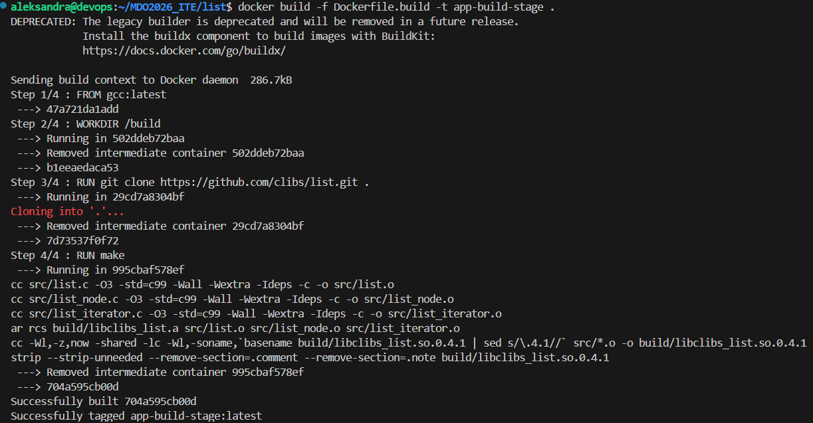
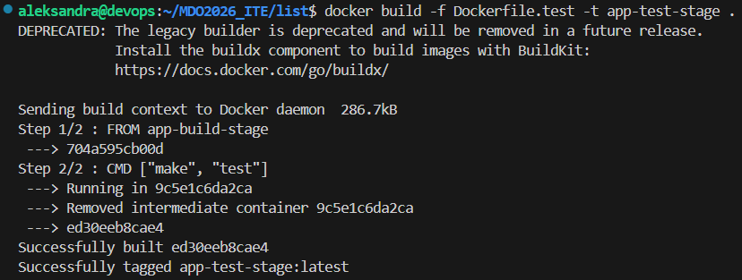
Aby sprawdzić poprawność działania obrazu testowego uruchomiono kontener poleceniem:
docker run --name raport-z-testow app-test-stage
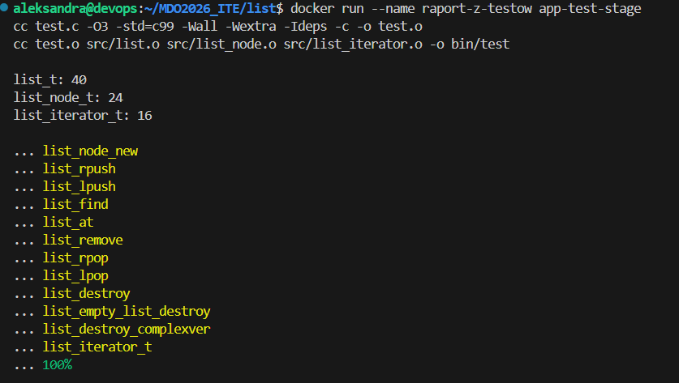
Obraz app-test-stage zawiera zbudowany projekt, natomiast kontener raport-z-testow uruchamia polecenie make test, które kompiluje i wykonuje testy jednostkowe.
# 3. Kompozycja
Kontenery zostały ujęte w kompozycję:
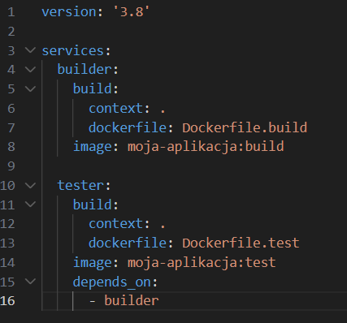
Została ona uruchomiona za pomocą polecenia:
docker-compose up --build
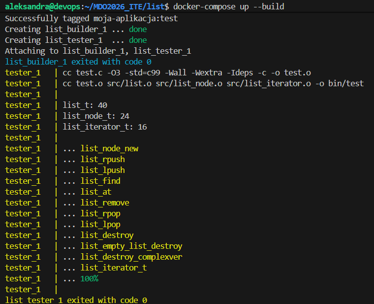
# 4. Deploy - dyskusja
Publikacja tej biblioteki jako obrazu kontenera nie ma sensu, ponieważ jest to komponent programistyczny, a nie samodzielna usługa. Konteneryzacja w tym projekcie służy wyłącznie do stworzenia powtarzalnego i odizolowanego środowiska budowania.

Obraz produkcyjny należałoby oczyścić z kompilatora i kodów źródłowych, stosując tzw. Multi-stage build, co drastycznie zmniejszy jego rozmiar.

Finalny artefakt najlepiej dystrybuować jako natywny pakiet systemowy (np. .deb), aby umożliwić instalację standardowymi narzędziami typu apt.

Taki format można zapewnić poprzez dodanie trzeciego etapu (kontenera), który automatycznie spakuje skompilowane pliki binarne w gotową paczkę instalacyjną.