# 1. Zachowywanie stanu między kontenerami
1) Przygotowano woluminy wejściowy i wyjściowy w formie lokalnych katalogów (input, output). Na wolumin wejściowy sklonowano repozytorium projektu clibs/list bezpośrednio z poziomu hosta, aby dostarczyć kod do kontenera nieposiadającego klienta Git.
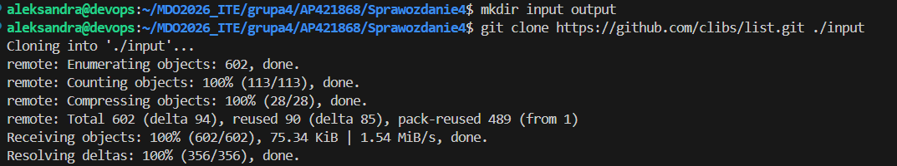
2) Uruchomiono kontener bazowy gcc:latest z podmontowanymi woluminami. Przeprowadzono proces budowania projektu (komenda make) korzystając z kodu źródłowego na woluminie /src. Gotowy artefakt (bibliotekę .a) skopiowano na wolumin wyjściowy /dist, co zapewnia jego trwałość po zatrzymaniu kontenera. Zweryfikowano poprawność operacji na hoście. Plik wynikowy jest dostępny w katalogu output, co potwierdza poprawne działanie mechanizmu Bind Mount i zachowanie stanu między cyklami życia kontenera.
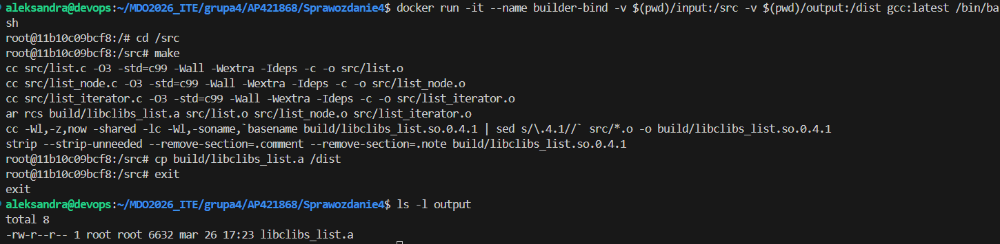
Wybrano metodę Bind Mount, ponieważ pozwala ona na dostarczenie kodu źródłowego do kontenera "z zewnątrz". Jest to kluczowe w scenariuszu, gdy kontener bazowy jest celowo pozbawiony klienta Git w celu minimalizacji rozmiaru obrazu i zwiększenia bezpieczeństwa. Dzięki temu host pełni rolę dostawcy danych, a kontener jedynie procesora przetwarzającego kod.
3) Utworzono dedykowane woluminy zarządzane przez silnik Dockera (vol-in, vol-out), co pozwala na pełną izolację danych od systemu plików hosta. W tym wariancie repozytorium sklonowano bezpośrednio wewnątrz kontenera po uprzedniej instalacji klienta Git, a następnie przeprowadzono kompilację projektu. Gotowy artefakt zabezpieczono na woluminie wyjściowym, co umożliwia jego późniejsze wykorzystanie przez inne usługi.
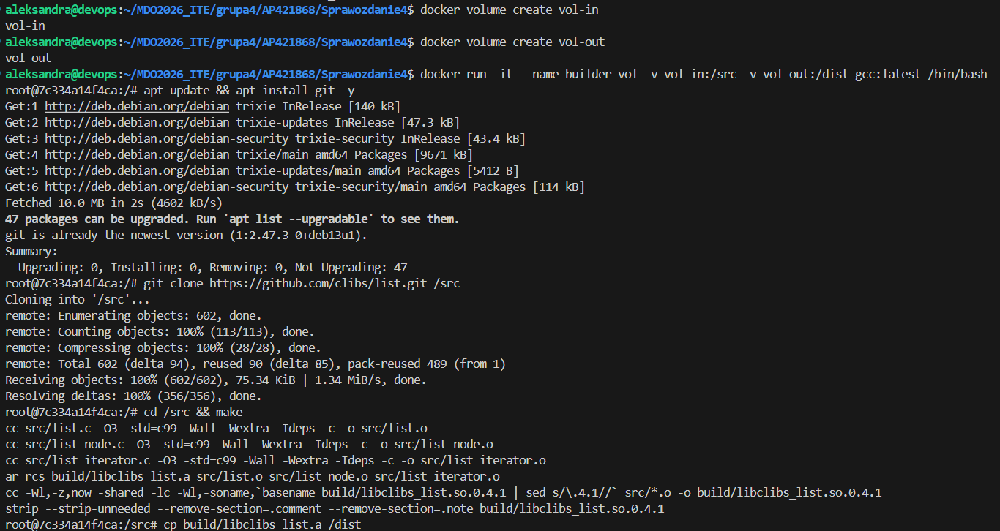

Powyższe kroki można zautomatyzować za pomocą pliku Dockerfile z wykorzystaniem instrukcji RUN --mount=type=bind. Pozwala to na tymczasowe zamontowanie kodu źródłowego lub pamięci podręcznej managera pakietów tylko na czas budowania obrazu. Różnica polega na tym, że RUN --mount nie pozostawia śladu zamontowanych danych w końcowej warstwie obrazu, co owocuje lżejszym i bezpieczniejszym artefaktem końcowym w porównaniu do tradycyjnej instrukcji COPY.
# 2. Eksponowanie portu i łączność między kontenerami
4) Uruchomiono serwer iperf3 i za pomocą komendy docker inspect zidentyfikowano jego wewnętrzny adres IP w domyślnej sieci typu bridge.
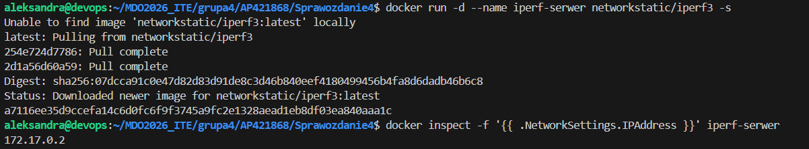
5) Uruchomiono drugi kontener pełniący rolę klienta i nawiązano połączenie z serwerem, wskazując bezpośrednio jego adres IP.
6) Przeprowadzono test wydajnościowy, który wykazał przepustowość komunikacji między kontenerami na poziomie 22.8 Gbits/sec.
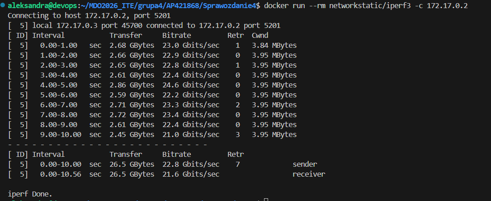

7) Utworzono dedykowaną sieć mostkową moja-siec. Dzięki wbudowanemu w Docker serwerowi DNS, klient nawiązał połączenie z serwerem, używając jego nazwy (serwer-dns) zamiast adresu IP. Przepustowość w tej izolowanej sieci wyniosła 18.4 Gbits/sec.
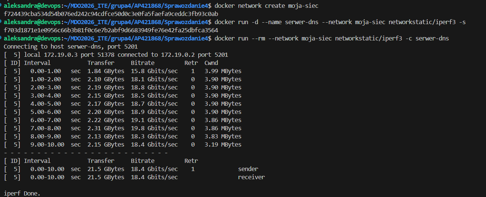
8) Wykorzystano mapowanie portów (-p 5201:5201), co pozwoliło na udostępnienie usługi działającej wewnątrz kontenera bezpośrednio na interfejsie localhost hosta. Po zainstalowaniu narzędzia iperf3 w systemie operacyjnym, przeprowadzono pomyślny test łączności spoza środowiska Docker, co potwierdza poprawną konfigurację eksponowania portów.
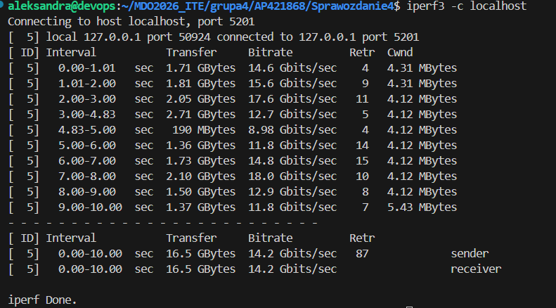
# 3. Usługi w rozumieniu systemu, kontenera i klastra
9) Po pomyślnej instalacji pakietu openssh-server oraz ręcznym uruchomieniu demona SSH, zweryfikowano stan portów za pomocą narzędzia netstat. Wynik potwierdza, że usługa SSHD poprawnie nasłuchuje na porcie 22 wewnątrz kontenera, co umożliwia nawiązanie połączenia zdalnego.
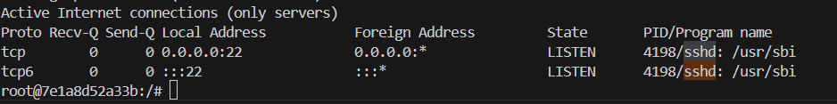
10) Przeprowadzono test logowania zdalnego z poziomu hosta do kontenera za pomocą polecenia ssh root@localhost -p 2222. Pomyślne wyświetlenie banera powitalnego systemu Ubuntu 24.04 LTS oraz zmiana znaku zachęty na root@7e1a8d52a33b potwierdza, że usługa SSHD została skonfigurowana poprawnie, a komunikacja sieciowa między hostem a odizolowanym kontenerem przebiega bez zakłóceń.
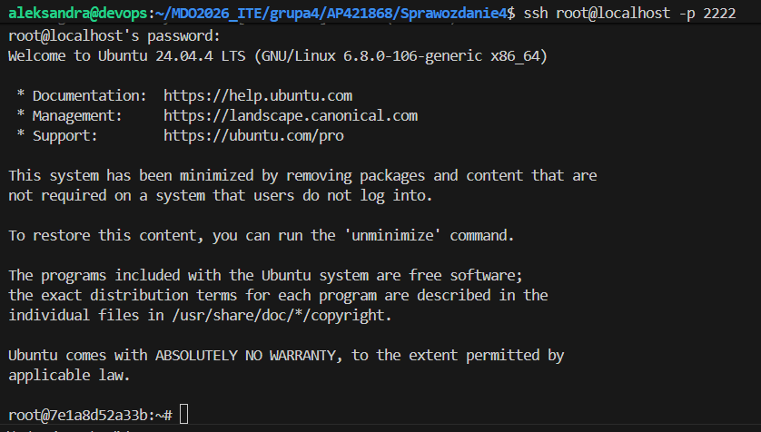

Zalety wykorzystania SSH w kontenerze:

- Umożliwia zarządzanie kontenerem za pomocą klasycznych narzędzi (np. Ansible, WinSCP) bez konieczności instalowania wtyczek Dockerowych.
- Pozwala na nadanie uprawnień dostępu do terminala kontenera osobom, które nie mają (i nie powinny mieć) uprawnień do samego silnika Dockera na hoście.

Wady:
-Złamanie zasady "One Process": Kontener powinien uruchamiać jedną główną usługę. Dodanie SSHD jako drugiego procesu komplikuje monitorowanie logów i cykl życia kontenera.
-Bezpieczeństwo: Każda działająca usługa to dodatkowy wektor ataku

# 4. Przygotowanie do uruchomienia serwera Jenkins
11) Przeprowadzono instalację Jenkinsa w modelu Docker-in-Docker (DinD). Uruchomiono dwa kontenery: jenkins-server jako główną usługę CI/CD oraz jenkins-docker pełniącą rolę zdalnego silnika Dockera. 
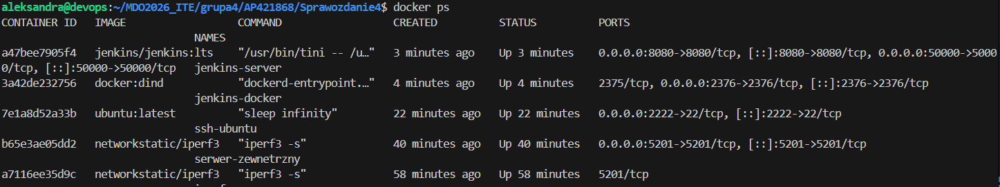
12) Po poprawnym skonfigurowaniu routingu portów, uzyskano dostęp do graficznego interfejsu instalacyjnego Jenkinsa. Na ekranie widoczny jest formularz, który stanowi zabezpieczenie przed nieautoryzowanym dostępem podczas pierwszego uruchomienia. Wprowadzenie klucza wygenerowanego w logach kontenera pozwala na przejście do dalszej konfiguracji wtyczek i kont użytkowników.
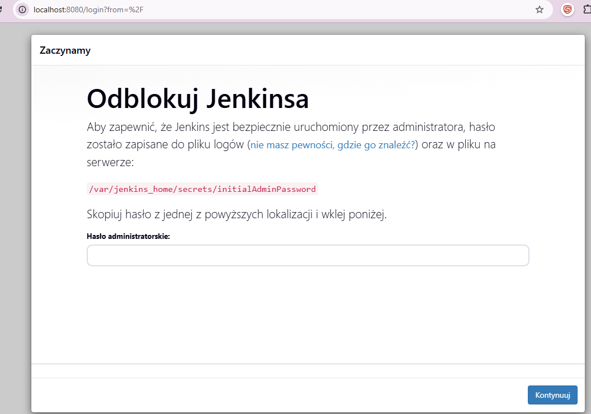