# 1. Przygotowanie
1) Sprawdzono, czy na pewno kontenery budujące i testujące stworzone na poprzednich zajęciach działąją
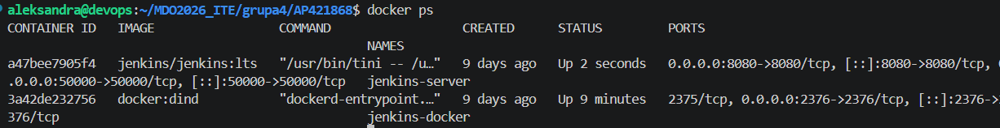
2) Przygotowano własny obraz Jenkinsa za pomocą pliku Dockerfile-jenkins.
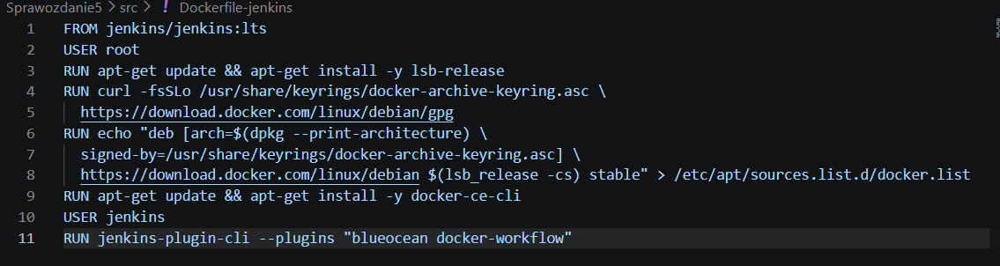
3) Przeprowadzono proces budowania obrazu komendą:
docker build -t myjenkins-blueocean -f Sprawozdanie5/src/Dockerfile-jenkins Sprawozdanie5/src/
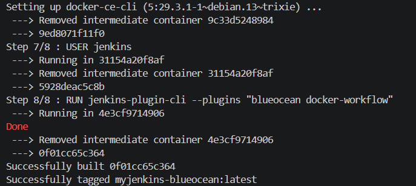
4) Po zalogowaniu się i konfiguracji Jenkinsa, uzyskano dostęp do interfejsu Blue Ocean
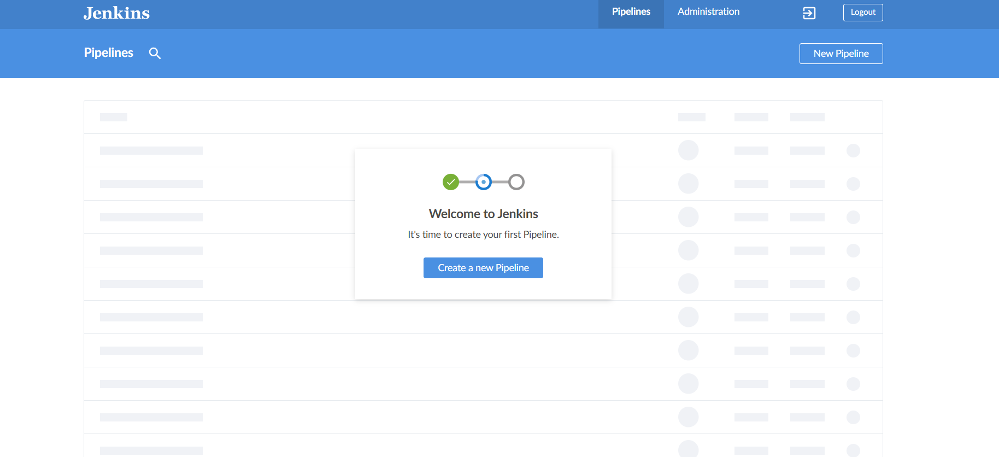
5) Zadbano o archiwizację i zabezpieczenie danych oraz logów poprzez wykorzystanie woluminów Dockera (-v jenkins-data:/var/jenkins_home). Dzięki temu cała konfiguracja, historia budowania i logi konsoli są przechowywane na dysku maszyny wirtualnej, a nie tylko wewnątrz tymczasowego kontenera, co zapobiega ich utracie po restarcie.
# 2. Zadanie wstępne - uruchomienie
1) Utworzono projekt, który wykonuje komendę uname -a
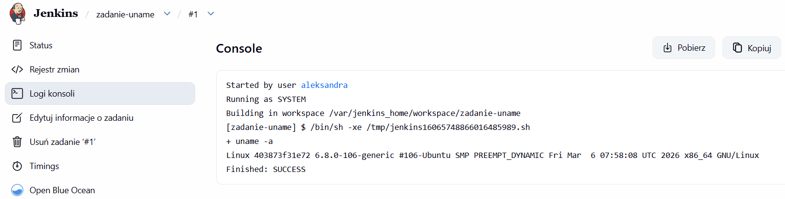
2) Utworzono projekt, który zwraca błąd gdy godzina jest nieparzysta
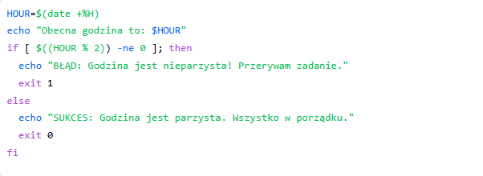
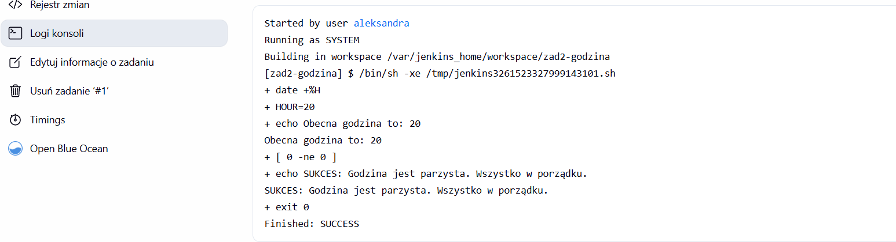
3) Następnie w projekcie pobrano obraz kontenera ubuntu
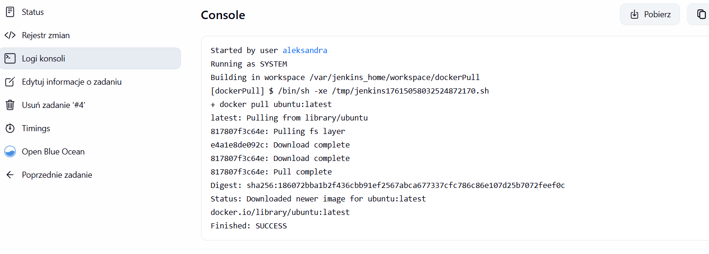
# 3. Pipeline
1) Utworzono nowy obiekt typu pipeline z następującą konfiguracją:
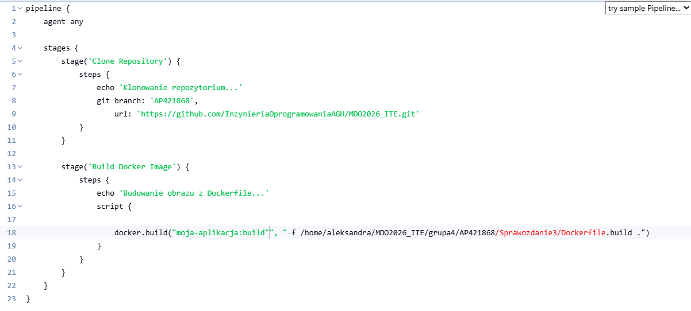
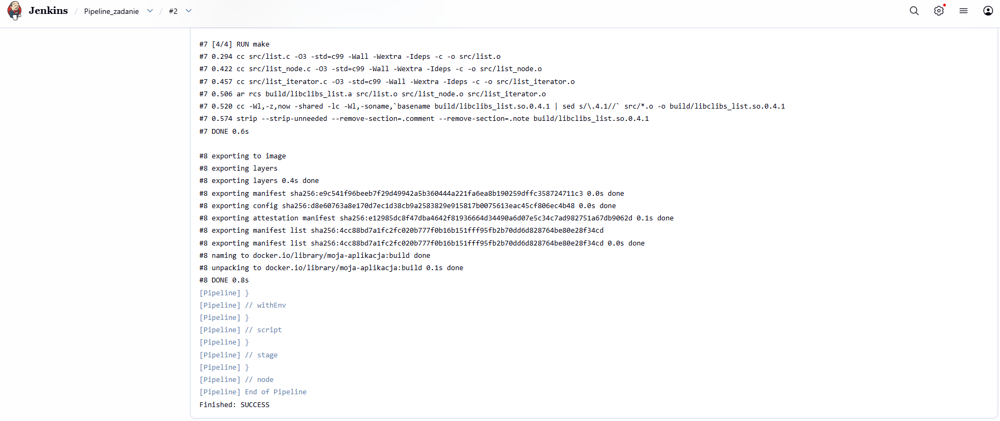
Pipeline najpierw automatycznie klonuje repozytorium z GitHuba i przełącza się na gałąź AP421868. Następnie wykorzystuje Dockera do znalezienia wskazanego pliku Dockerfile.build w pobranym kodzie i buduje na jego podstawie obraz.
2) Pipeline został uruchomiony ponownie - drugie wykonanie trwało zauważalnie krócej, dzięki wykorzystaniu cache przy budowaniu obrazu Dockera.
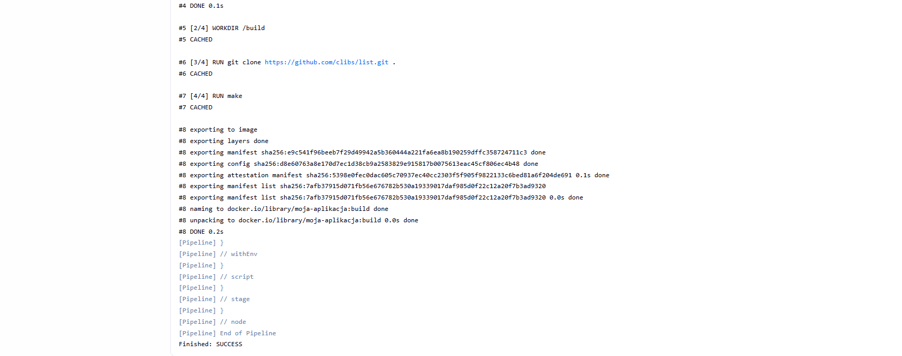