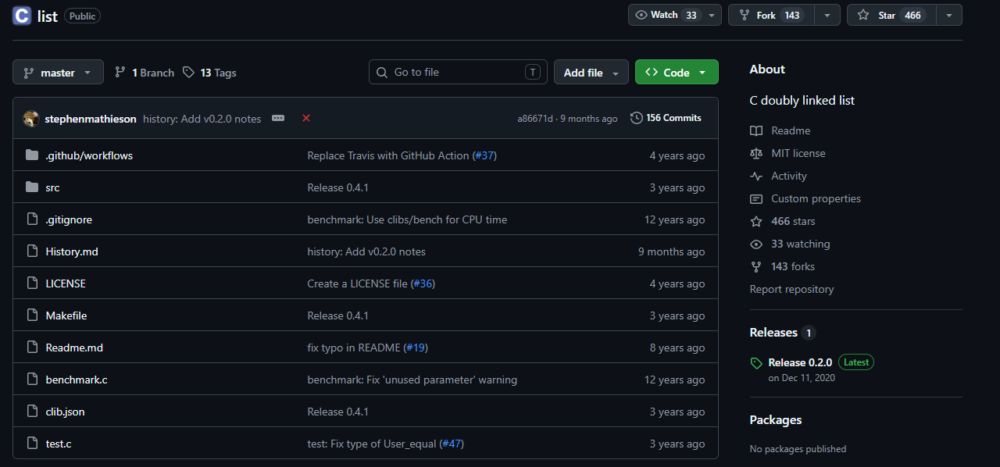
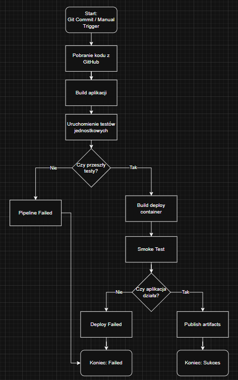
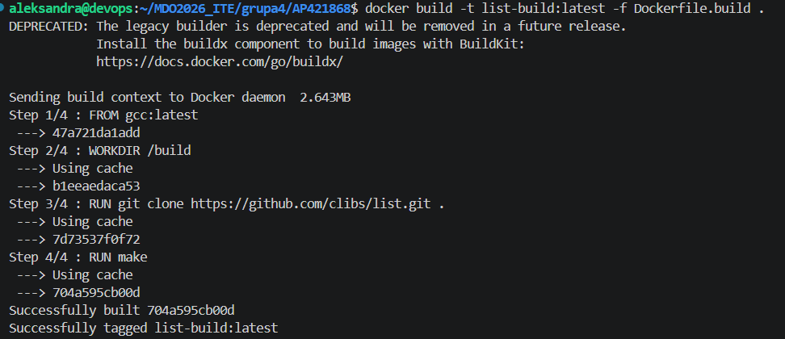
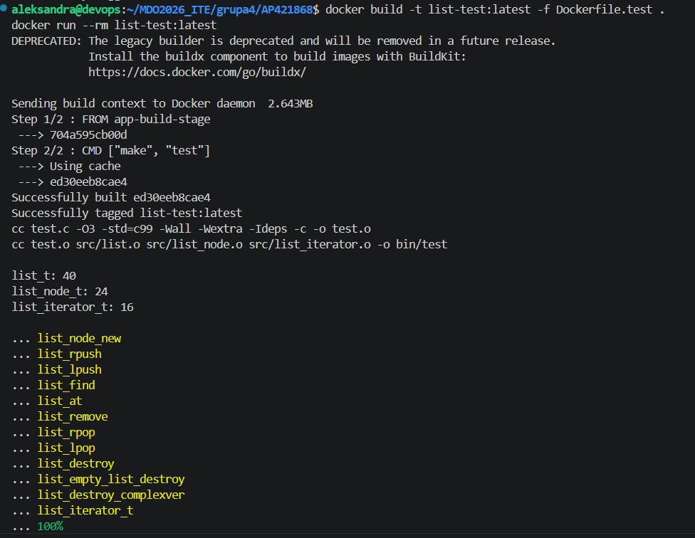
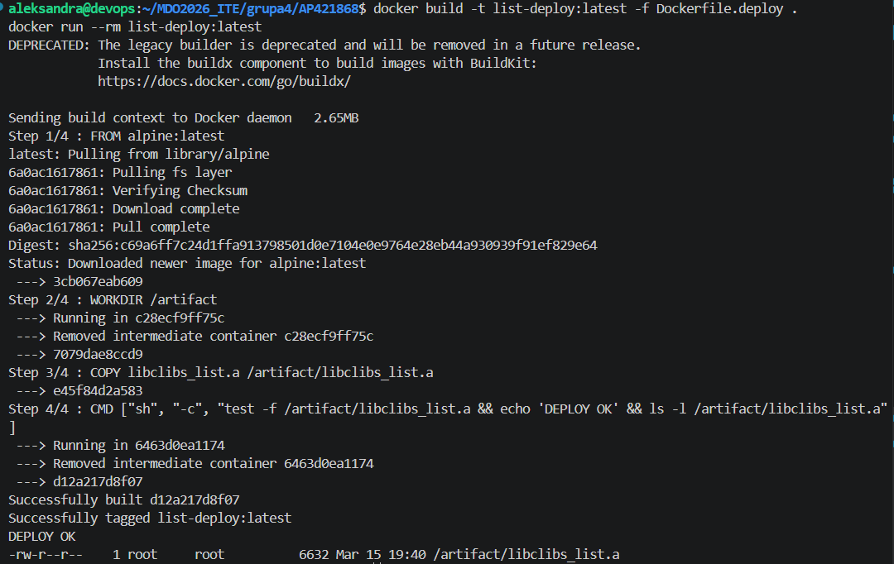
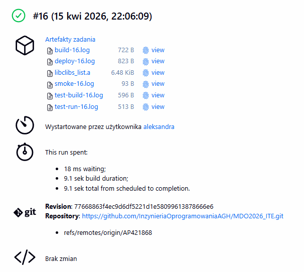
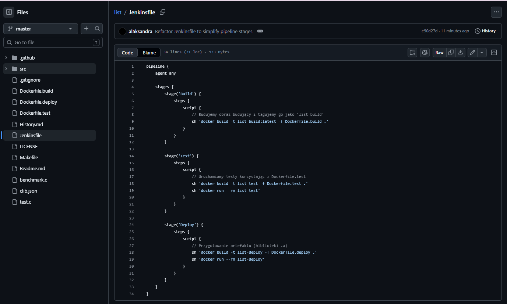
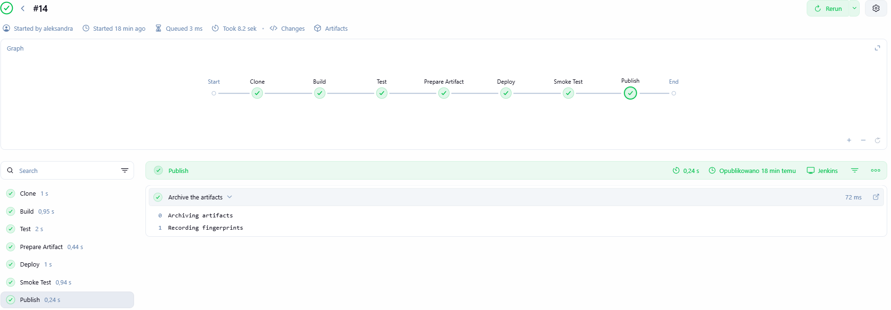

# 1. Aplikacja i licencja
Wybrano repozytorium clibs/list, czyli niewielką bibliotekę napisaną w języku C, implementującą listę dwukierunkową. Projekt udostępniony jest na licencji MIT, co pozwala na swobodne korzystanie z kodu w ramach zadania.



Zdecydowano się na utworzenie forka repozytorium pod adresem: https://github.com/al5ksandra/list. Dzięki temu pliki konfiguracyjne (Dockerfile, Jenkinsfile) znajdują się bezpośrednio w kodzie źródłowym aplikacji, co jest dobrą praktyką CI/CD.

# 2. Opis przepływu CI/CD
Diagram przedstawia planowany przebieg pipeline’u CI/CD dla repozytorium clibs/list. Proces rozpoczyna się od commita lub ręcznego uruchomienia zadania w Jenkinsie. Następnie Jenkins pobiera kod z GitHuba, buduje aplikację i uruchamia testy jednostkowe. Jeżeli testy zakończą się powodzeniem, uruchamiany jest etap budowania kontenera deployowego, po którym wykonywany jest smoke test. Gdy aplikacja działa poprawnie, pipeline kończy się publikacją artefaktów i statusem sukcesu. W przypadku błędu proces zostaje zakończony statusem failed.

# 3. Build w kontenerze
1. Kontener bazowy
Wybrano obraz gcc:latest, ponieważ zawiera kompletny zestaw narzędzi potrzebnych do budowy projektu, czyli kompilator GCC, make oraz biblioteki standardowe. Jest to szczególnie istotne w przypadku biblioteki clibs/list napisanej w języku C. Dzięki temu nie ma potrzeby instalowania kompilatora bezpośrednio na maszynie z Jenkins.
2. Plik Dockerfile.build
Treść:
```
FROM gcc:latest
RUN apt-get update && apt-get install -y make git
WORKDIR /build
COPY . .
RUN make
```

Build został uruchomiony wewnątrz kontenera, co zapewnia powtarzalność procesu oraz niezależność od konfiguracji hosta. Kompilacja zakończyła się poprawnie, a wynikowy artefakt został wygenerowany w kontenerze.

# 4. Testy w kontenerze
Plik Dockerfile.test opiera się na obrazie budującym, co gwarantuje, że testy uruchamiane są na dokładnie tym samym kodzie, który został wcześniej skompilowany.

Dockerfile.test:
```
FROM list-build:latest

CMD ["make", "test"]
```
Testy są uruchamiane automatycznie za pomocą komendy make test wewnątrz odizolowanego kontenera. Pozwala to potwierdzić poprawność działania projektu w środowisku kontrolowanym przez Dockera.

# 5. Kontener deploy i smoke test
Zdefiniowano kontener typu deploy, którego zadaniem jest przechowywanie zbudowanego artefaktu oraz jego weryfikacja. Ponieważ analizowany projekt jest biblioteką, a nie aplikacją serwerową, etap deploy nie polega na uruchomieniu usługi sieciowej. Zamiast tego użyto osobnego obrazu deployowego, który potwierdza obecność oraz poprawność przygotowania artefaktu.

Jako artefakt wybrano plik libclibs_list.a, czyli gotową bibliotekę statyczną. Kontener deploy kopiuje ten plik do obrazu i wykonuje prostą weryfikację, czy artefakt istnieje oraz jest dostępny w systemie plików kontenera. Taki krok pełni rolę smoke testu.

Dockerfile.deploy:
```
FROM alpine:latest

WORKDIR /artifact

COPY libclibs_list.a /artifact/libclibs_list.a

CMD ["sh", "-c", "test -f /artifact/libclibs_list.a && echo 'DEPLOY OK' && ls -l /artifact/libclibs_list.a"]
```

# 6. Publikacja i wersjonowanie artefaktów
Jako artefakt publikowany wybrano plik libclibs_list.a, będący końcowym wynikiem budowy biblioteki. Jest on archiwizowany i fingerprintowany w Jenkinsie, co umożliwia identyfikację jego pochodzenia.

Wersjonowanie odbywa się poprzez numer buildu oraz powiązanie ze skrótem commita. Logi z przebiegu pipeline są archiwizowane razem z artefaktem i dostępne dla każdego builda.

# 7. Jenkinsfile
Pipeline został zaimplementowany w sposób deklaratywny. Plik Jenkinsfile znajduje się w głównym katalogu repozytorium.
```groovy
pipeline {
    agent any

    stages {
        stage('Build') {
            steps {
                script {
                    
                    sh 'docker build -t list-build:latest -f Dockerfile.build .'
                }
            }
        }

        stage('Test') {
            steps {
                script {
                    
                    sh 'docker build -t list-test -f Dockerfile.test .'
                    sh 'docker run --rm list-test'
                }
            }
        }

        stage('Deploy') {
            steps {
                script {
                    
                    sh 'docker build -t list-deploy -f Dockerfile.deploy .'
                    sh 'docker run --rm list-deploy'
                }
            }
        }
    }
}
```


# 8. Porównanie planu UML z otrzymanym efektem
Zastosowanie forka pozwoliło na pełną integrację kodu z potokiem CI/CD. Zgodnie z planem, wszystkie etapy (Build, Test, Deploy/Smoke Test) zostały zautomatyzowane. Wykorzystanie Dockerfile wewnątrz repozytorium umożliwiło stworzenie lekkiego i powtarzalnego procesu, niezależnego od konfiguracji maszyny, na której działa Jenkins. 