# 1. Konfiguracja SCM i Ścieżka Krytyczna
Zrezygnowano z wklejania skryptu bezpośrednio w interfejs Jenkinsa. Skonfigurowano zadanie tak, aby pobierało definicję Pipeline bezpośrednio z repozytorium Git.
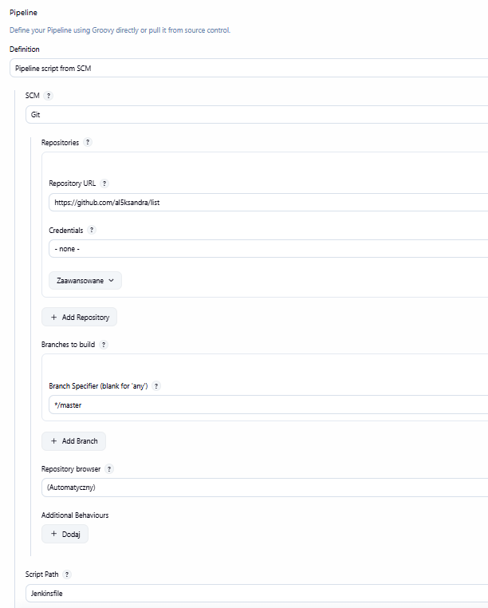
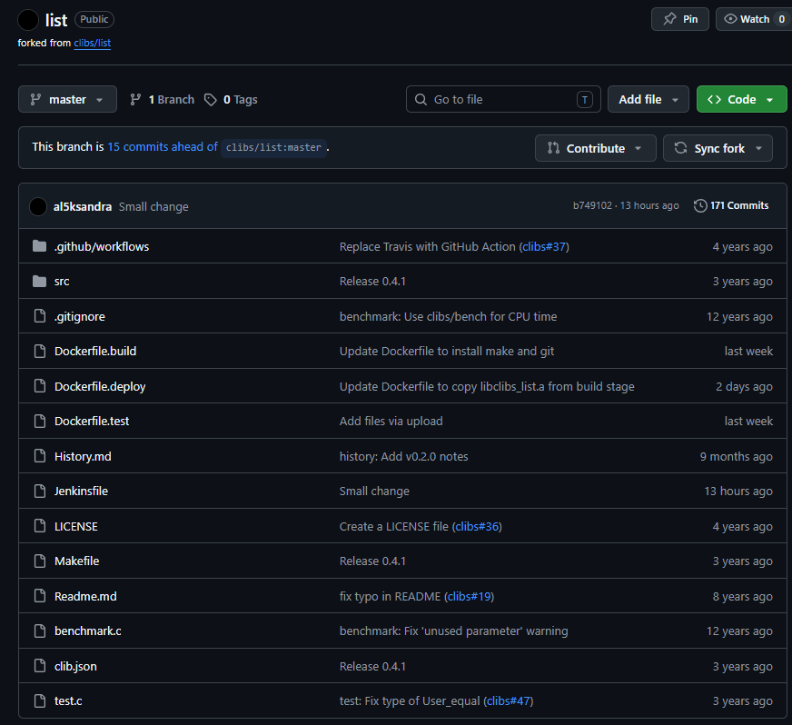
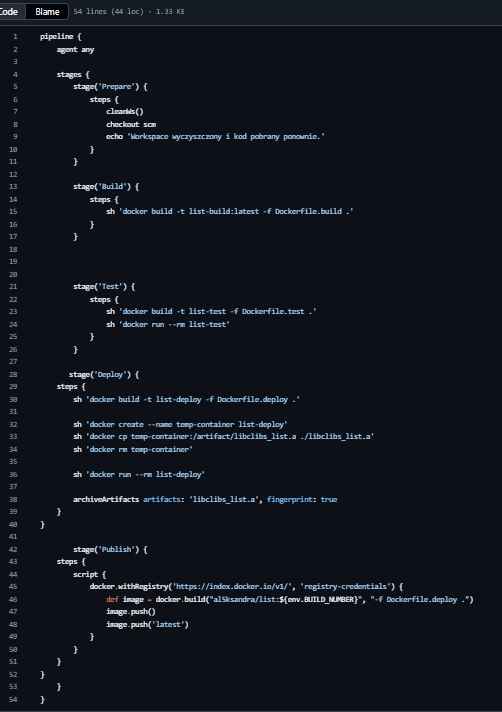
# 2. Przygotowanie i czyszczenie środowiska
W pierwszym etapie pipeline'u zadbano o wyczyszczenie katalogu roboczego. Dzięki temu mamy pewność, że proces budowania startuje na "czystym" kodzie pobranym z SCM, a pozostałości z poprzednich buildów nie wpłyną na wynik końcowy.
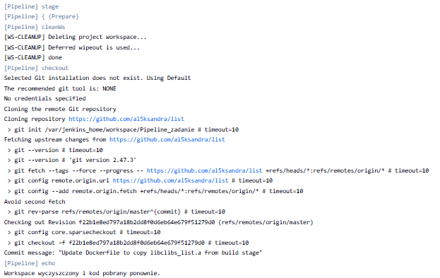
# 3. Etap Build: Obraz budujący i artefakty
W etapie Build obraz list-build przeprowadził kompilację źródeł, tworząc bibliotekę statyczną libclibs_list.a
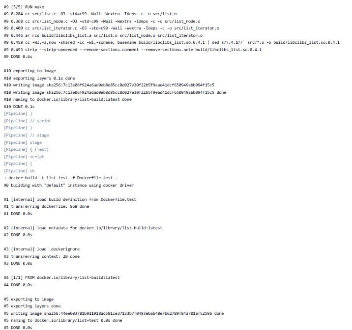
# 4. Etap Test: Uruchomienie testów jednostkowych
Uruchomiono testy jednostkowe wewnątrz kontenera.
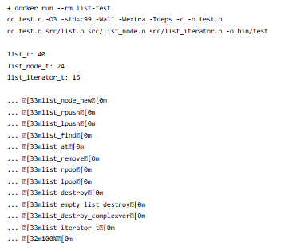
# 5. Etap Deploy: Przygotowanie lekkiego artefaktu
Etap Deploy potwierdził sukces operacji. Artefakt został przeniesiony do finalnego obrazu, co potwierdza komunikat DEPLOY OK oraz listing pliku.
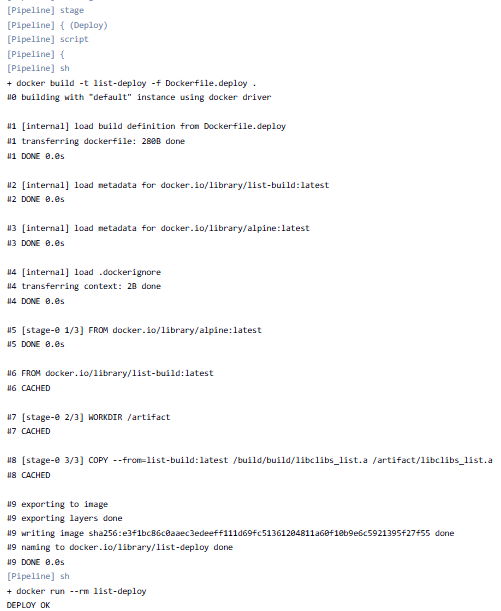
# 6. Etap Publish: Wysyłka obrazu do Docker Hub
Obraz został otagowany i wypchnięty do Docker Hub; logi wskazują na publikację obrazu w rejestrze
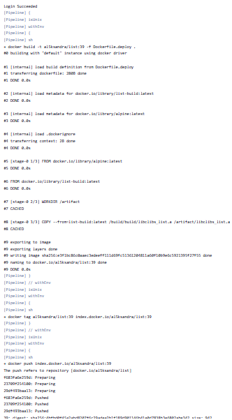
# 7. Archiwizacja artefaktów
Biblioteka libclibs_list.a została wyprowadzona z kontenera i zarchiwizowana w Jenkinsie.
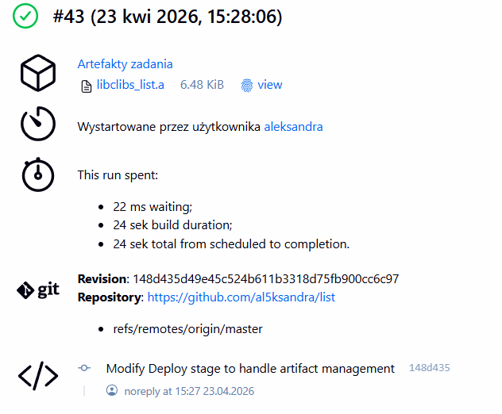
# 8. Potwierdzenie działania
Pipeline przechodzi pomyślnie przez wszystkie zdefiniowane etapy:
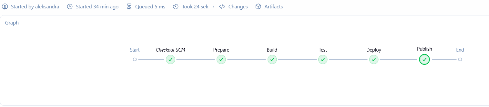
# 9. Uruchomienie pipeline'u po raz kolejny
Pipeline został uruchomiony po raz kolejny.
Pomiędzy przebiegami wprowadzono zmianę w repozytorium i wykonano commit oraz push.
Drugi przebieg pipeline’u pobrał nową rewizję kodu, co potwierdza, że Jenkins nie korzysta z cache, lecz pracuje na aktualnym kodzie z SCM.
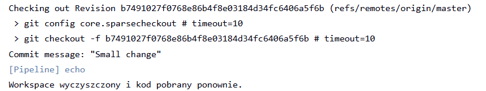

# 10. "Definition of done" 
Opublikowany obraz został pobrany z rejestru poleceniem docker pull, a następnie uruchomiony lokalnie poleceniem docker run. Test potwierdził, że obraz działa poza środowiskiem Jenkins, bez modyfikacji.
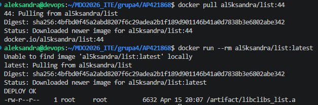