# Sprawozdanie 8 :Automatyzacja i zdalne wykonywanie poleceń za pomocą Ansible
Aleksandra Pac 421868
# 1. Przygotowanie maszyn i instalacja Ansible
Utworzono drugą maszynę wirtualną, zastosowano ten sam system operacyjny co na głównej maszynie (Ubuntu 24.04 LTS).
```
Hostname: ansible-target
Użytkownik: ansible
```
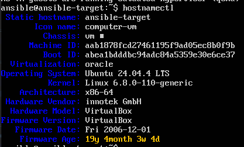

Zapewniono obecność programu tar i serwera OpenSSH:

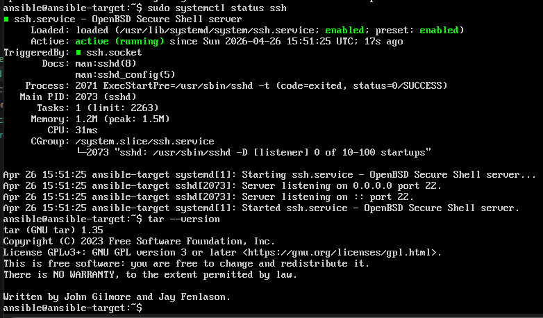

Zrobiono migawkę maszyny:

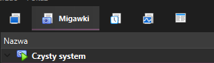

Na głównej maszynie wirtualnej, zainstalowano oprogramowanie Ansible

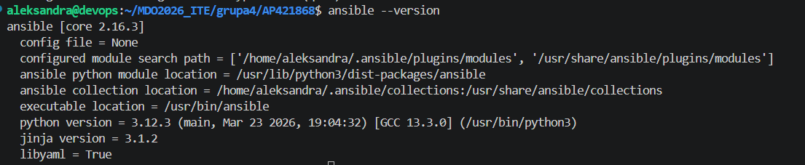

Wymieniono klucze SSH między użytkownikiem w głównej maszynie wirtualnej, a użytkownikiem ansible

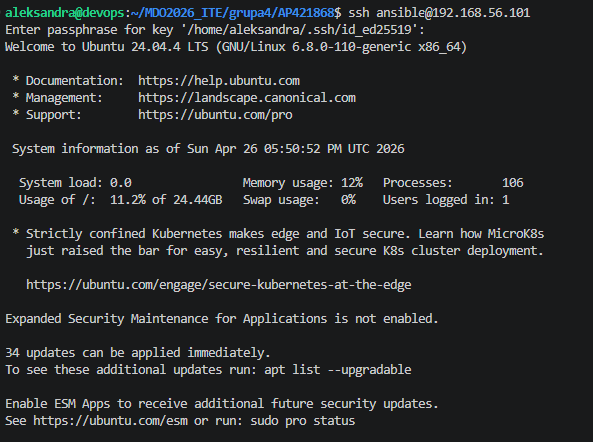
# 2. Inwentaryzacja
```
Ustalono następujące nazwy komputerów:
-ansible-master
-ansible-target
```
W celu umożliwienia komunikacji po nazwach (DNS), zmodyfikowano plik /etc/hosts na maszynie głównej, przypisując adresy IP maszyn wirtualnych do ich nazw tekstowych:

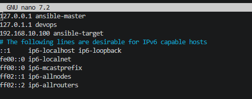

A następnie zweryfikowano łączność: 

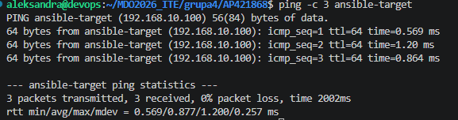

Na maszynie głównej utworzono plik o nazwie inventory.ini, w którym umieszczone zostały sekcje Orchestrators oraz Endpoints:
```
[Orchestrators]
ansible-master ansible_connection=local

[Endpoints]
ansible-target ansible_user=ansible
```
Wysłano żądanie ping do wszystkich maszyn:
```
ansible all -i inventory.ini -m ping
```

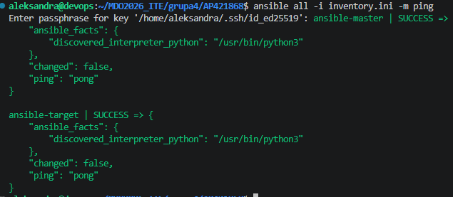

# 3. Zdalne wywoływanie procedur
W ramach kolejnego etapu przygotowano i przetestowano playbook zadania.yml, którego celem była automatyzacja powtarzalnych czynności administracyjnych na maszynach w infrastrukturze. Skrypt został zaprojektowany tak, aby precyzyjnie rozróżniać zadania diagnostyczne od zadań konfiguracyjnych wykonywanych wyłącznie na węzłach końcowych (Endpoints)
Utworzono plik playbooka:

```
---
---
- name: Realizacja zadan zdalnych
  hosts: all
  become: yes

  tasks:
    - name: 1. Wyslij zadanie ping do wszystkich maszyn
      ping:

    - name: 2. Skopiuj plik inwentaryzacji na maszyny Endpoints
      copy:
        src: ./inventory.ini
        dest: /home/ansible/inventory_backup.ini
      when: inventory_hostname in groups['Endpoints']

    - name: 3. Zaktualizuj pakiety w systemie
      become: yes
      ansible.builtin.apt:
        update_cache: yes
        upgrade: dist
      when:
        - ansible_os_family == "Debian"
        - inventory_hostname != 'ansible-master'

    - name: 4. Zrestartuj uslugi sshd i rngd
      service:
        name: "{{ item }}"
        state: restarted
      loop:
        - ssh
        - rng-tools-debian
      when: inventory_hostname != 'ansible-master'
      ignore_errors: yes
```
Uruchomiono go za pomocą komendy:
```
ansible-playbook -i inventory.ini zadania.yml --ask-become-pass
```
Automatyzuje on następujące zadania:
-sprawdzenie dostępności maszyn modułem ping
-kopiowanie pliku inventory.ini do katalogu domowego na maszynach Endpoints
-aktualizaje bazy pakietów w systemie
-restartuje procesy sshd i rngd

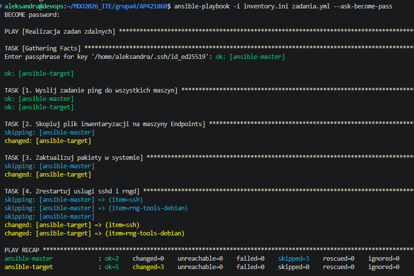

Przy pierwszym uruchomieniu ansible wykrył brak pliku inwentaryzacji oraz dostępność aktualizacji, co zaowocowało statusem changed dla tych zadań.

 Następnie uruchomiono playbook po raz drugi:

 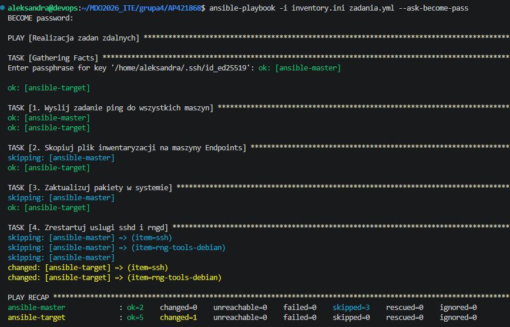

 Podczas ponownej próby, zadania te otrzymały status ok. Ansible zweryfikował, że stan docelowy jest już zgodny z deklaracją (plik jest obecny, pakiety są aktualne) i nie podejmował zbędnych działań.

 Następnie przeprowadzono test zachowania narzędzia w przypadku braku możliwości nawiązania połączenia. Na maszynie ansible-target wyłączono usługę SSH:

 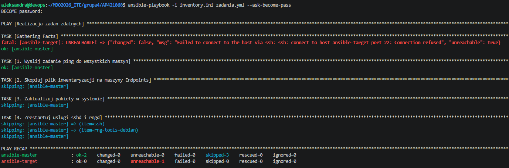

Komunikat Connection refused wskazuje, że maszyna jest widoczna w sieci, ale usługa SSH nie przyjmuje połączeń. Ansible natychmiast przerwał wykonywanie dalszych zadań dla maszyny nieosiągalnej (ansible-target), jednocześnie kontynuując bezpiecznie operacje na pozostałych dostępnych hostach (w tym przypadku ansible-master), co widać w sekcji PLAY RECAP.

W kolejnym kroku zasymulowano całkowitą awarię sieci poprzez odłączenie karty sieciowej w ustawieniach maszyny wirtualnej.

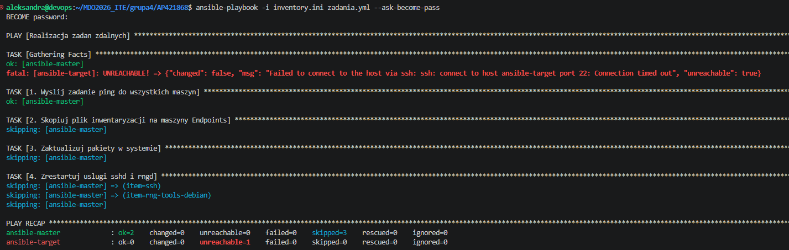

Ansible po uruchomieniu komendy ansible-playbook próbował nawiązać połączenie, jednak ze względu na brak fizycznej ścieżki do hosta, operacja została przerwana po upływie limitu czasu (timeout).
# 4.Zarządzanie stworzonym artefaktem (Docker)
Ostatnim etapem prac było przygotowanie pełnej automatyzacji wdrożenia artefaktu wytworzonego w poprzednich zadaniach. Jako artefakt wykorzystano obraz kontenera al5ksandra/list:latest opublikowany w serwisie Docker Hub.

Proces wdrażania został zamknięty w strukturze roli. Zainicjowano ją poleceniem:
```
ansible-galaxy role init deploy_app
```
Stworzona struktura pozwoliła na odseparowanie zadań od metadanych roli. W pliku deploy_app/meta/main.yml uzupełniono informacje o autorze oraz opisano przeznaczenie roli.
W ramach roli zaimplementowano następujące kroki automatyzacji:

Sanity check: Przed rozpoczęciem wdrożenia sprawdzono dostępne miejsce na dysku maszyny docelowej, aby zapobiec awarii podczas pobierania obrazu.

Instalacja środowiska: Za pomocą modułu apt zainstalowano silnik Docker na maszynie ansible-target.

Pobranie artefaktu: Wykorzystano polecenie docker pull do pobrania najnowszej wersji obrazu al5ksandra/list.

Uruchomienie: Kontener został uruchomiony pod nazwą moja-aplikacja.

Weryfikacja: Sprawdzono status kontenera poleceniem docker ps.

Uruchomiono proces wdrożenia:
```
ansible-playbook -i inventory.ini deploy.yml --ask-become-pass
```
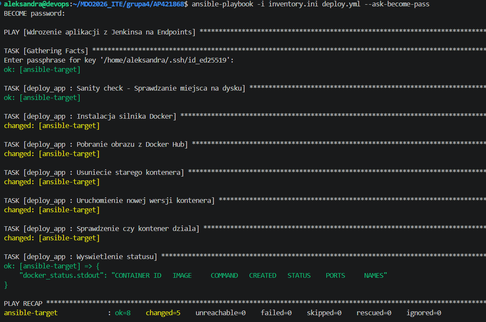