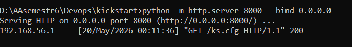
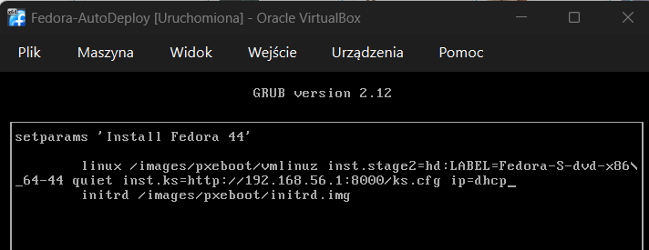
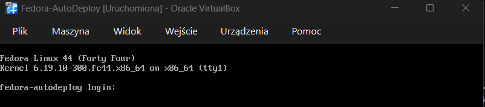
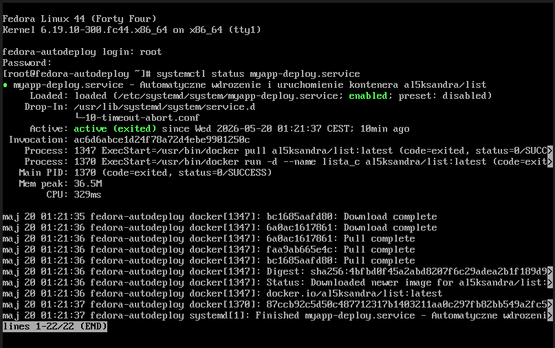
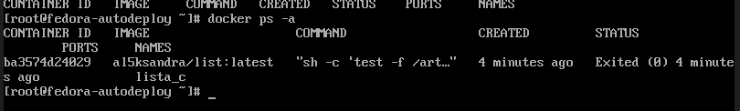

# Sprawozdanie 9 :Pliki odpowiedzi dla wdrożeń nienadzorowanych
Aleksandra Pac 421868
# Cel
Celem ćwiczenia było przygotowanie nośnika instalacyjnego do bezobsługowej instalacji systemu operacyjnego Fedora 44 z wykorzystaniem pliku Kickstart. Założeniem było pełne zautomatyzowanie procesu instalacji tak, aby system docelowy po pierwszym uruchomieniu samodzielnie skonfigurował środowisko i rozpoczął uruchamianie skonteneryzowanego artefaktu aplikacji.
# 1. Przygotowanie pliku odpowiedzi
Przygotowano plik ks.cfg. W pierwszej kolejności zdefiniowano źródła instalacji sieciowej dla systemu Fedora 44, dodając odpowiednie repozytoria. Ustawiono również pełne formatowanie dysku twardego oraz ustawiono nową nazwę hosta maszyny docelowej jako fedora-autodeploy.
Następnie, w sekcji %packages, rozszerzono listę instalowanego oprogramowania o narzędzia niezbędne do uruchomienia artefaktu z pipeline'u (silnik Dockera).
Ostatnim etapem konfiguracji pliku odpowiedzi było utworzenie mechanizmu, który pobierze i uruchomi kontener z aplikacją C (al5ksandra/list:latest) natychmiast po pierwszym uruchomieniu systemu.
W sekcji %post wymuszono wyświetlanie logów instalacyjnych na ekranie wirtualnego terminala. Skonfigurowano również usługę systemd (myapp-deploy.service), która po uzyskaniu połączenia sieciowego pobiera obraz z repozytorium Docker Hub i uruchamia kontener.
```
lang pl_PL.UTF-8
keyboard pl
timezone Europe/Warsaw
reboot

url --mirrorlist=http://mirrors.fedoraproject.org/mirrorlist?repo=fedora-44&arch=x86_64
repo --name=updates --mirrorlist=http://mirrors.fedoraproject.org/mirrorlist?repo=updates-released-f44&arch=x86_64

network --bootproto=dhcp --device=link --hostname=fedora-autodeploy --activate

zerombr
clearpart --all --initlabel
autopart --type=lvm

rootpw --plaintext root123

%packages
@core

moby-engine
nano
wget
%end

%post --log=/root/ks-post.log
exec < /dev/tty3 > /dev/tty3
chvt 3
echo "Rozpoczynam konfigurację Post-Install dla środowiska"

systemctl enable docker

echo "Tworzenie usługi Systemd dla aplikacji..."
cat << 'EOF' > /etc/systemd/system/myapp-deploy.service
[Unit]
Description=Automatyczne wdrozenie i uruchomienie kontenera al5ksandra/list
After=network-online.target docker.service
Wants=network-online.target
Requires=docker.service

[Service]
Type=oneshot
ExecStart=/usr/bin/docker pull al5ksandra/list:latest
ExecStart=/usr/bin/docker run -d --name lista_c al5ksandra/list:latest
RemainAfterExit=yes

[Install]
WantedBy=multi-user.target
EOF

systemctl enable myapp-deploy.service

echo "Konfiguracja zakonczona! Za chwile nastapi restart."
sleep 5
chvt 1
%end

```
# 2. Przeprowadzenie instalacji nienadzorowanej
W celu udostępnienia przygotowanego pliku odpowiedzi w sieci lokalnej, w katalogu z plikiem ks.cfg na maszynie gospodarza uruchomiono lekki, tymczasowy serwer WWW przy użyciu wbudowanego modułu języka Python:

```
python -m http.server 8000 --bind 0.0.0.0
```

Uruchomiono nową maszynę wirtualną z wirtualnym nośnikiem instalacyjnym. W menu rozruchowym GRUB zainicjowano instalację, przekazując do instalatora lokalizację przygotowanego pliku odpowiedzi ks.cfg za pomocą dyrektywy wejściowej.



Instalator Anaconda poprawnie pobrał plik konfiguracyjny i bez interwencji użytkownika przeprowadził proces pobierania pakietów, formatowania dysku oraz instalacji systemu. Zgodnie z założeniami z sekcji %post, komunikaty poinstalacyjne wyświetlały się bezpośrednio na ekranie.
# 3. Weryfikacja działania środowiska
Po zakończonej instalacji maszyna zrestartowała się automatycznie, uruchamiając system z wirtualnego dysku twardego.

Zaobserwowano pomyślną zmianę domyślnej nazwy localhosta - system przywitał użytkownika zdefiniowaną wcześniej nazwą fedora-autodeploy.



Po zalogowaniu się na konto administratora (root), w celu dokładnego przeanalizowania przebiegu automatycznego wdrożenia aplikacji, wywołano polecenie sprawdzające status oraz logi stworzonej usługi systemowej:
```
systemctl status myapp-deploy.service
```


Na koniec, dla ostatecznego potwierdzenia obecności artefaktu w środowisku, wywołano polecenie:
```
docker ps -a
```

