Sprawozdanie 1

**Środowisko:** Maszyna wirtualna Ubuntu Server. Połączenie z serwerem zrealizowano przez protokół SSH przy użyciu rozszerzenia Remote - SSH, a pracowałem poprzez terminal w Visual Studio Code. Transfer plików odbywa się za pomocą programu FileZilla.

## 1. Połaczenie sie z serverem przez Visual Studio code oraz FileZilla
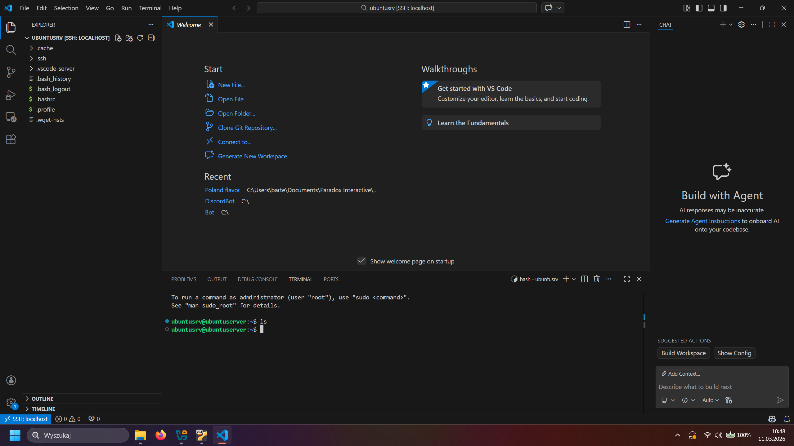
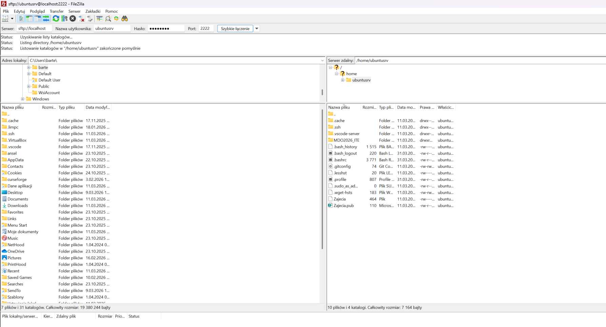

## 2. Pobranie Gita i SSH
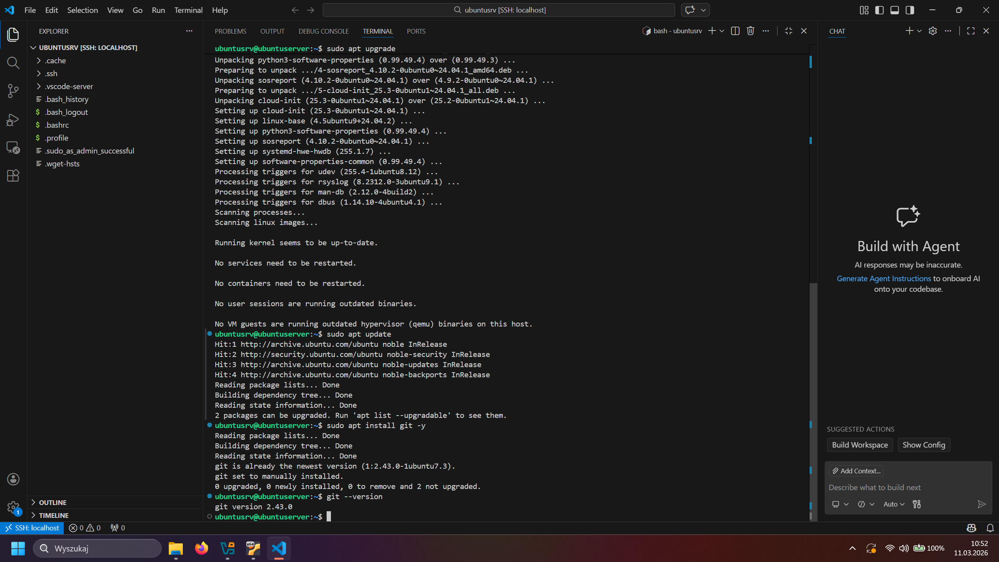
Podczas tego kroku pobrałem tylko gita, gdyż ssh zainstalowałem podczas instalacji ubuntu server. Do tego wykorzystałem komendy:

```
sudo apt update
sudo apt install git -y
git --version
```

## 3. Sklonowanie repozytorium za pomocą personal acces token
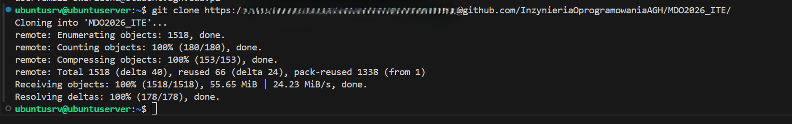
Pobrałem repozytorium za pomocą perosnal tokenu, został zamazany ze względów bezpieczeństwa. Wykorzystana komenda:
`git clone https://<personal_token>@github.com/InzynieriaOprogramowaniaAGH/MDO2026_ITE/`

## 4. Utworzenie kluczy ssh
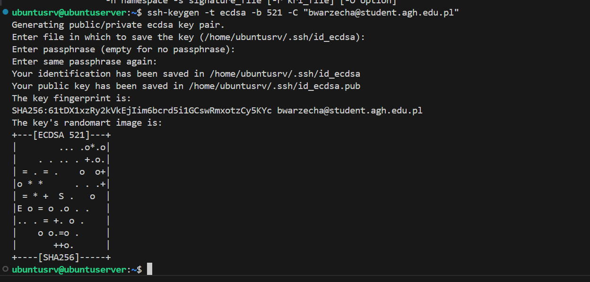
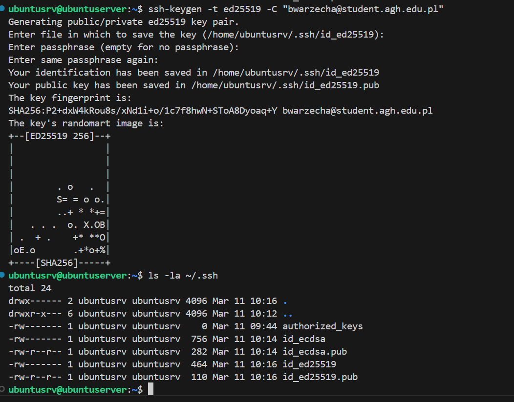
  
Wygenerowałem klucze ssh za pomocą komend:
```
ssh-keygen -t ecdsa -b 521 -C "bwarzecha@student.agh.edu.pl"
ssh-keygen -t ed25519 -C "bwarzecha@student.agh.edu.pl"
```
Z czego  tą generowanaza pomocąed25519 zabezpieczyłem hasłem i podpiołem do githuba:
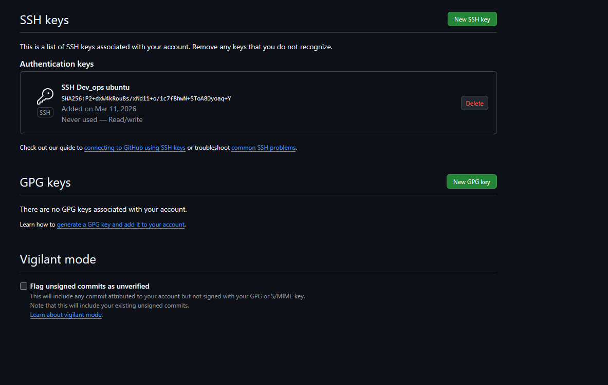

## 5. Pobieranie repozytorium za pomocą ssh
Po skonfigurowaniu klucza, pobrałem za pomocą ssh repozytorium do folderu MDO2026_ITE_SSH za pomocą komendy 
` git clone git@github.com:InzynieriaOprogramowaniaAGH/MDO2026_ITE.git MDO2026_ITE_SSH `
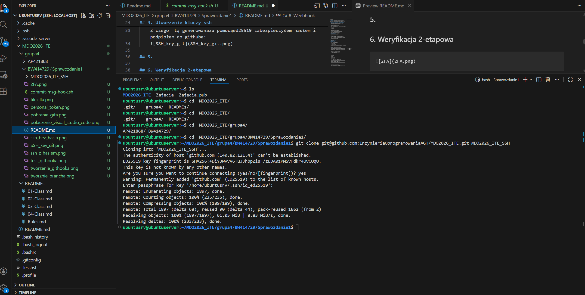


## 6. Weryfikacja 2-etapowa
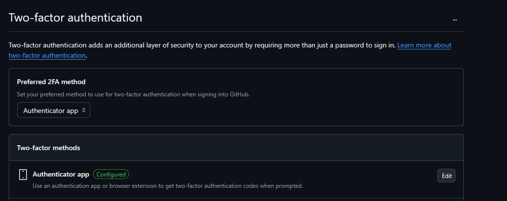

## 7. Tworzenie brancha
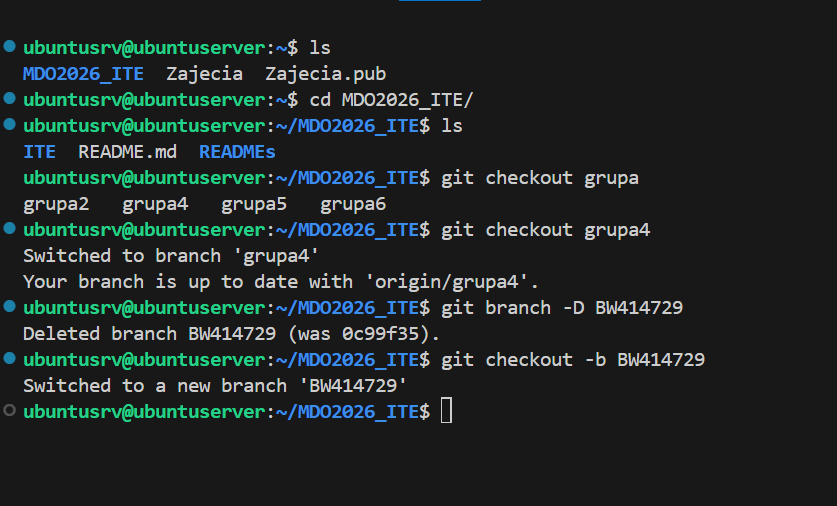
Do tego wykrozystałem komendy:
```
git checkout grupa
git checkout grupa4
git checkout -b BW414729
```
Został on stworzony na podstawie brancha grupa4 do której jestem przypsisany


## 8. Weebhook
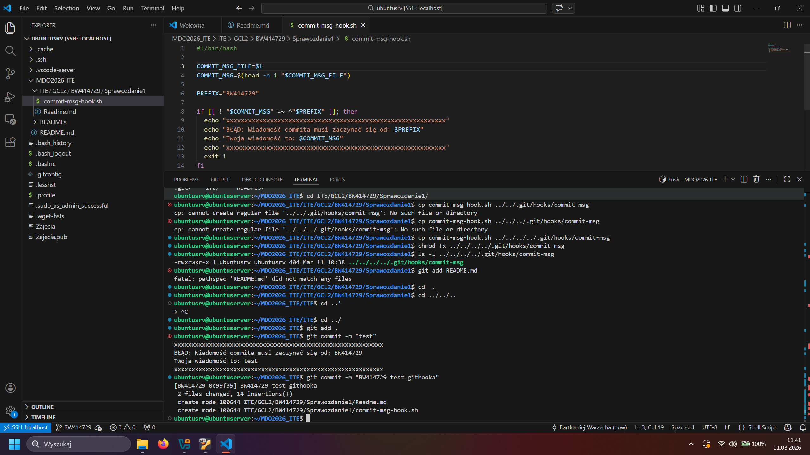
Na zamieszczonym screenie githook pierwotnie powstał troche na innym branchu ktory potem został poprawiony, gdyż ten nie był stworzony na grupie 4 tylko na maine. Następnei skopiowałem go do odpowiedniej lokacji i nadałem uprawnienia do wykonywania za pomocą komend:
```
cp commit-msg-hook.sh ../../../.git/hooks/commit-msg
chmod +x ../../../.git/hooks/commit-msg
git add .
git commit -m "Test Githooka"
git commit -m "BW414729 Test Githooka"
```

Treść githooka:

```
#!/bin/bash

COMMIT_MSG_FILE=$1
COMMIT_MSG=$(head -n 1 "$COMMIT_MSG_FILE")

PREFIX="BW414729"

if [[ ! "$COMMIT_MSG" =~ ^"$PREFIX" ]]; then
echo "xxxxxxxxxxxxxxxxxxxxxxxxxxxxxxxxxxxxxxxxxxxxxxxxxxxxxxxxxxxx"
echo "BŁĄD: Wiadomość commita musi zaczynać się od: $PREFIX"
echo "Twoja wiadomość to: $COMMIT_MSG"
echo "xxxxxxxxxxxxxxxxxxxxxxxxxxxxxxxxxxxxxxxxxxxxxxxxxxxxxxxxxxxx"
exit 1
fi
```

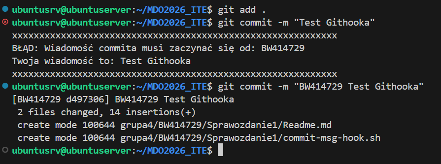
Jak widać na screenie githook działa prawidłowo, nie przechodzą commity niezaczynające sie na BW414729
