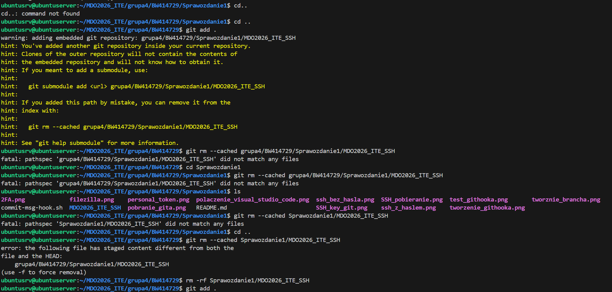
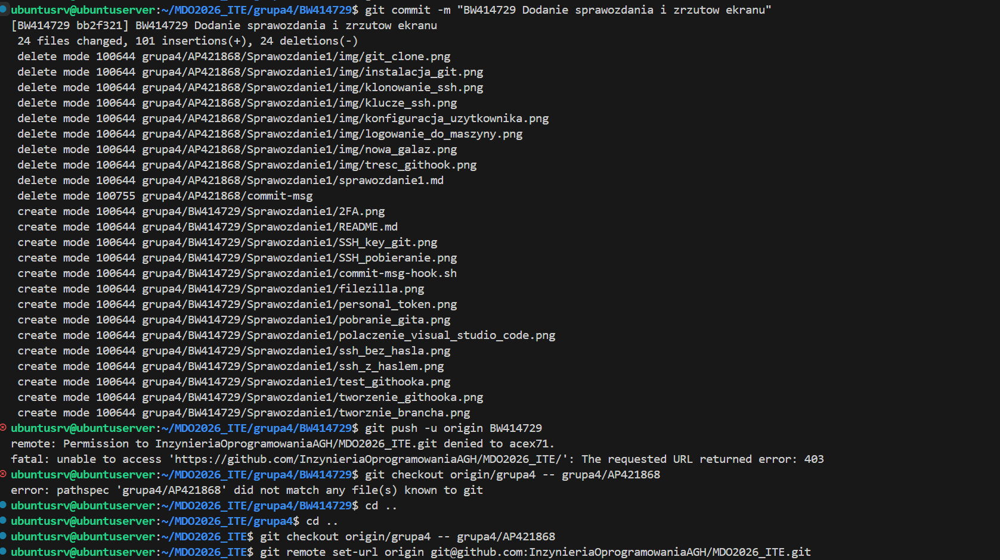
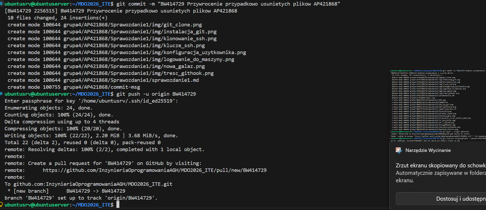
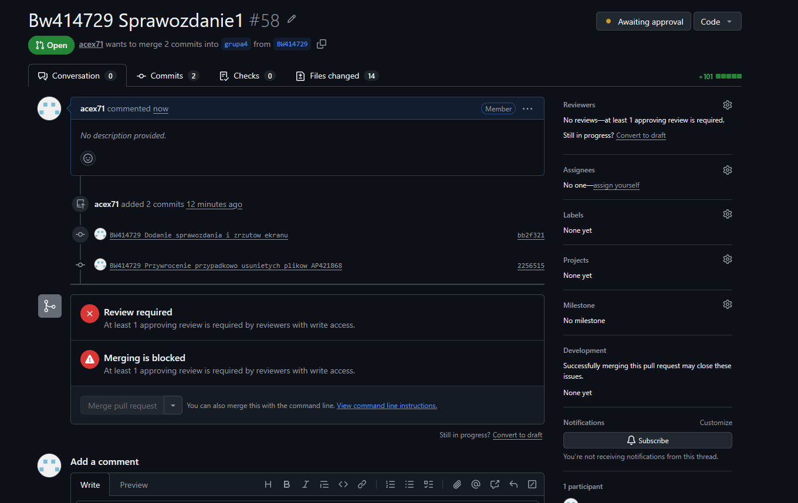

Sprawozdanie 1

**Środowisko:** Maszyna wirtualna Ubuntu Server. Połączenie z serwerem zrealizowano przez protokół SSH przy użyciu rozszerzenia Remote - SSH, a pracowałem poprzez terminal w Visual Studio Code. Transfer plików odbywa się za pomocą programu FileZilla.

## 1. Połaczenie się z serwerem przez Visual Studio code oraz FileZilla


## 2. Pobranie Gita i SSH

Podczas tego kroku pobrałem tylko gita, gdyż ssh zainstalowałem podczas instalacji ubuntu server. Do tego wykorzystałem komendy:

```
sudo apt update
sudo apt install git -y
git --version
```

## 3. Sklonowanie repozytorium za pomocą personal access token

Pobrałem repozytorium za pomocą perosnal tokenu, został zamazany ze względów bezpieczeństwa. Wykorzystana komenda:
`git clone https://<personal_token>@github.com/InzynieriaOprogramowaniaAGH/MDO2026_ITE/`

## 4. Utworzenie kluczy ssh


  
Wygenerowałem klucze ssh za pomocą komend:
```
ssh-keygen -t ecdsa -b 521 -C "bwarzecha@student.agh.edu.pl"
ssh-keygen -t ed25519 -C "bwarzecha@student.agh.edu.pl"
```
Z czego  ten generowany za pomocą ed25519 zabezpieczyłem hasłem i podpiąłem do githuba:


## 5. Pobieranie repozytorium za pomocą ssh
Po skonfigurowaniu klucza, pobrałem za pomocą ssh repozytorium do folderu MDO2026_ITE_SSH za pomocą komendy 
` git clone git@github.com:InzynieriaOprogramowaniaAGH/MDO2026_ITE.git MDO2026_ITE_SSH `


Po wykonaniu tej operacji usunąłem to repozytorium,

## 6. Weryfikacja 2-etapowa


## 7. Tworzenie brancha

Do tego wykrorzystałem komendy:
```
git checkout grupa
git checkout grupa4
git checkout -b BW414729
```
Został on stworzony na podstawie brancha grupa4 do której jestem przypisany


## 8. Webhook

Na zamieszczonym screenie githook pierwotnie powstał trochę na innym branchu który potem został poprawiony, gdyż ten nie był stworzony na grupie 4 tylko na main. Następnie skopiowałem go do odpowiedniej lokacji i nadałem uprawnienia do wykonywania za pomocą komend:
```
cp commit-msg-hook.sh ../../../.git/hooks/commit-msg
chmod +x ../../../.git/hooks/commit-msg
git add .
git commit -m "Test Githooka"
git commit -m "BW414729 Test Githooka"
```

Treść githooka:

```
#!/bin/bash

COMMIT_MSG_FILE=$1
COMMIT_MSG=$(head -n 1 "$COMMIT_MSG_FILE")

PREFIX="BW414729"

if [[ ! "$COMMIT_MSG" =~ ^"$PREFIX" ]]; then
echo "xxxxxxxxxxxxxxxxxxxxxxxxxxxxxxxxxxxxxxxxxxxxxxxxxxxxxxxxxxxx"
echo "BŁĄD: Wiadomość commita musi zaczynać się od: $PREFIX"
echo "Twoja wiadomość to: $COMMIT_MSG"
echo "xxxxxxxxxxxxxxxxxxxxxxxxxxxxxxxxxxxxxxxxxxxxxxxxxxxxxxxxxxxx"
exit 1
fi
```


Jak widać na screenie githook działa prawidłowo, nie przechodzą commity niezaczynające się na BW414729

## 9. Wysłanie zmian i Pull Request
Zgodnie z instrukcją, po ukończeniu sprawozdania wypchnąłem moje zmiany do zdalnego repozytorium na moją gałąź BW414729. Użyłem komendy:`git push -u origin BW414729`




Po drodze miałem problemy z:
- usunąć repozytorium ssh pobrane do kroku  5
- przywrócić niechcący usunięte pliki
- musiałem zmienić repozytorium z personal token na ssh


Następnie w interfejsie GitHuba wystawiłem Pull Request z mojej gałęzi do gałęzi grupowej `grupa4`.



historia komend:
```
1  ls
    2  ls
    3  sudo apt update
    4  sudo apt upgrade
    5  sudo apt update
    6  sudo apt install git -y
    7  git --version
    8  ssh-keygen --version
    9  git config --global user.name "Bartłomiej Warzecha"
   10  git config --global user.email "bwarzecha@student.agh.edu.pl"
   11  git config --list
   12  tu był personal_token. Bez usuniecia komendy git nie puszczał pusha.
   13  ssh-keygen -t ed25519 -C "bwarzecha@student.agh.edu.pl"
   14  ssh-keygen -t ecdsa -b 532 "bwarzecha@student.agh.edu.pl"
   15  ssh-keygen -t ecdsa -b 521 -C "bwarzecha@student.agh.edu.pl"
   16  cat ~/.ssh/id_ed25519.pub
   17  ls ~/.ssh/id_ed25519.pub
   18  ls  ~/.ssh/id_ed25519.pub
   19  ls -la ~/.ssh
   20  ssh-keygen -t ed25519 -C "bwarzecha@student.agh.edu.pl"
   21  ls -la ~/.ssh
   22  cat ~/.ssh/id_ed25519.pub
   23  cd MDO2026_ITE/
   24  ls
   25  git checkout GCL4
   26  mkdir ITE/GCL2/BW414729
   27  mkdir -p ITE/GCL2/BW414729
   28  cd ITE/GCL2/BW414729/
   29  mkdir Sprawozdanie1
   30  cd Sprawozdanie1/
   31  ls
   32  cd..
   33  cd ..
   34  ls
   35  git checkout BW414729
   36  git checkout -b BW414729
   37  git branch
   38  ls
   39  cd ITE/GCL2/BW414729/Sprawozdanie1/
   40  cp commit-msg-hook.sh ../../.git/hooks/commit-msg
   41  cp commit-msg-hook.sh ../../../.git/hooks/commit-msg
   42  cp commit-msg-hook.sh ../../../../.git/hooks/commit-msg
   43  chmod +x ../../../../.git/hooks/commit-msg
   44  ls -l ../../../../.git/hooks/commit-msg
   45  git add README.md
   46  cd  .
   47  cd ../../..
   48  cd ..'
   49  cd ../
   50  git add .
   51  git commit -m "test"
   52  git commit -m "BW414729 test githooka"
   53  git fetch --all
   54  git branch -a
   55  git checkout main
   56  git fetch origin
   57  git checkout grupa4
   58  git checkout BW414729
   59  git branch
   60  git checkout grupa4
   61  git branch
   62  git checkout BW414729
   63  ls
   64  cd MDO2026_ITE/
   65  ls
   66  git checkout grupa4
   67  git branch -D BW414729
   68  git checkout -b BW414729
   69  git add .
   70  git commit -m "Test Githooka"
   71  git commit -m "BW414729 Test Githooka"
   72  git add .
   73  git status
   74  git add .
   75  git status
   76  ls
   77  git checkout grupa4
   78  git branch -D BW414729
   79  git checkout -b BW414729
   80  ls
   81  cd  MDO2026_ITE/grupa4/BW414729/Sprawozdanie1/
   82  git clone git@github.com:InzynieriaOprogramowaniaAGH/MDO2026_ITE.git MDO2026_ITE_SSH
   83  cd..
   84  cd ..
   85  git add .
   86  git rm --cached grupa4/BW414729/Sprawozdanie1/MDO2026_ITE_SSH
   87  cd Sprawozdanie1
   88  git rm --cached grupa4/BW414729/Sprawozdanie1/MDO2026_ITE_SSH
   89  ls
   90  git rm --cached Sprawozdanie1/MDO2026_ITE_SSH
   91  cd ..
   92  git rm --cached Sprawozdanie1/MDO2026_ITE_SSH
   93  rm -rf Sprawozdanie1/MDO2026_ITE_SSH
   94  git add .
   95  git commit -m "BW414729 Dodanie sprawozdania i zrzutow ekranu"
   96  git push -u origin BW414729
   97  git checkout origin/grupa4 -- grupa4/AP421868
   98  cd ..
   99  git checkout origin/grupa4 -- grupa4/AP421868
  100  git remote set-url origin git@github.com:InzynieriaOprogramowaniaAGH/MDO2026_ITE.git
  101  git commit -m "BW414729 Przywrocenie przypadkowo usunietych plikow AP421868"
  102  git push -u origin BW414729
  103  history
```
