Sprawozdanie 2

## 1. Instalacja Docker w systemie linuksowym
Zainstalowałem Dockera za pomocą komendy `sudo apt install docker.io`, a nastepnie zgodnie z wymaganiami zadania dotyczącymi unikania pracy na koncie root, skonfigurowałem uprawnienia tak, aby móc zarządzać Dockerem jako zwykły użytkownik.
za pomocą `sudo usermod -aG docker $USER`
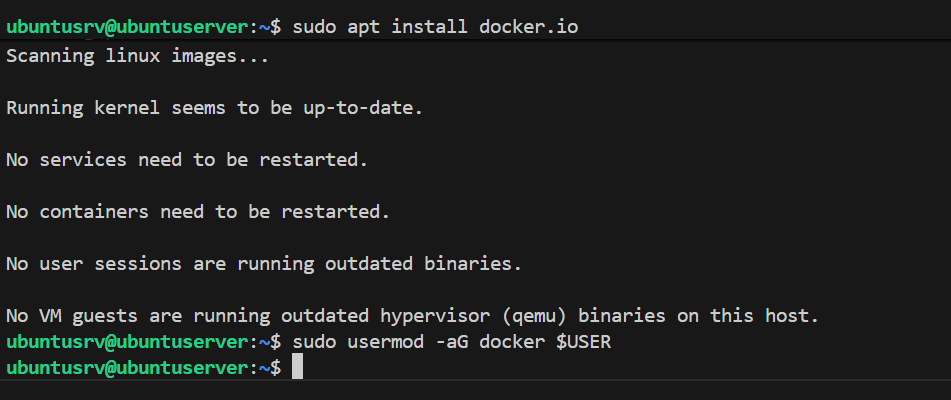

## 2. Docker Hub

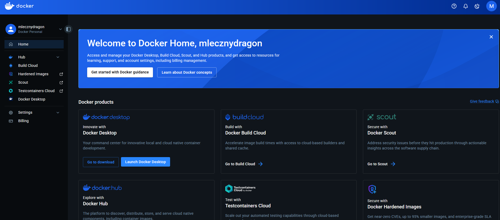
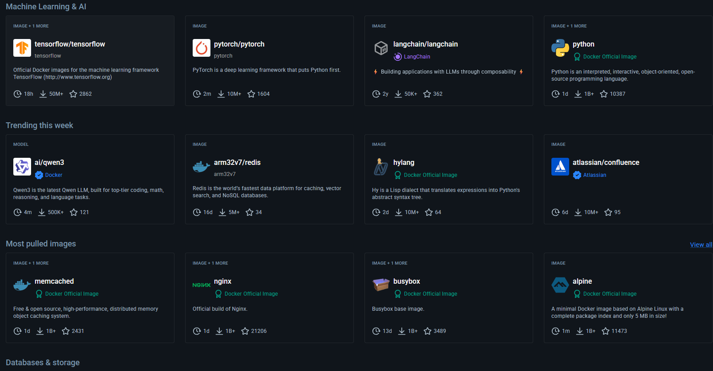


## 3. Zapoznanie sie z obrazami hello-world. busybox, ubuntu

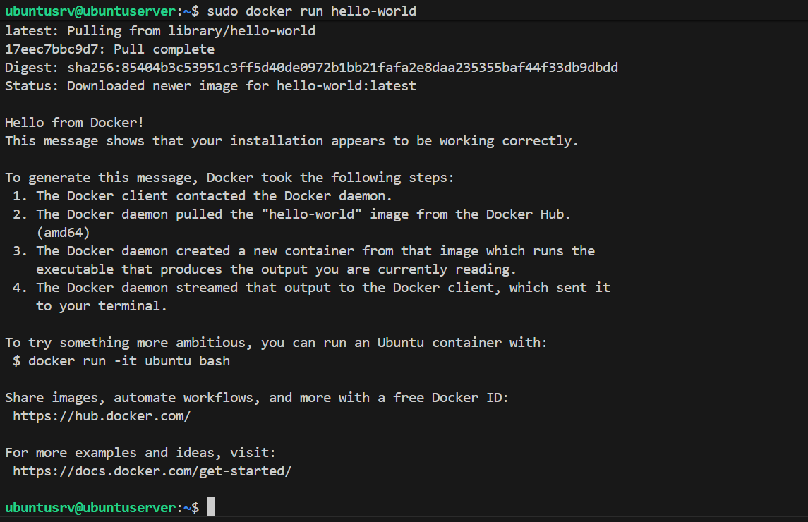
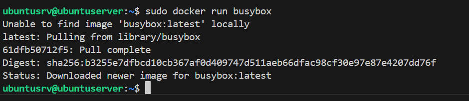
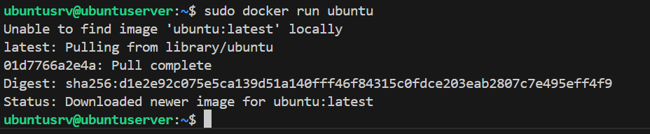

Z 3 uruchomionych obrazów jedynie Helloworld, gdyż BusyBox i Ubuntu po uruchomieniu bez dodatkowych parametrów natychmiast zakończyły pracę, ponieważ nie miały przypisanego żadnego domyślnego zadania. 

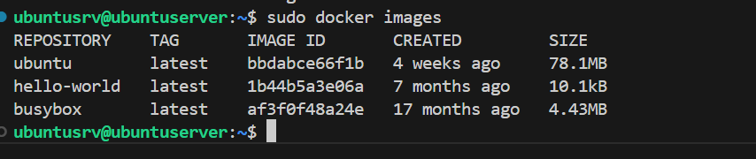
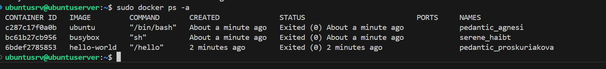

Wszystkie kontenery zakończyły prace kodem 0 czyli uruchomiły się i zakończyły swoją prace poprawnmie.

## 4. Uruchomienie busybox

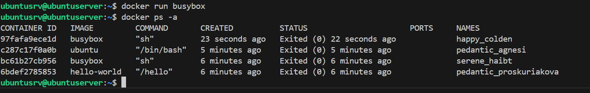

W efekcie uruchomienia busyboxa nic sie nie wydażyło, lecz po podłączeniu sie interaktywnie mozemy pracowaćw tym kontenerze. Numer wersji to 1.37.0

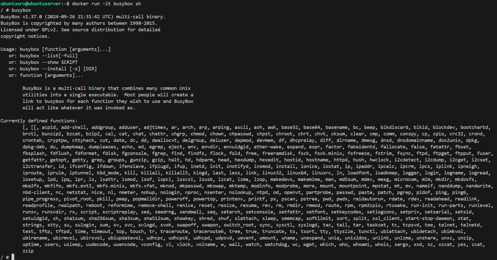

## 5. Uruchomienia "systemu w kontenerze"

Jako system wybrałem ubuntu do uruchomienia. Uruchomiłem i wszedłem do kontenera za pomocą `docker run -it ubuntu bash`, po czym zaktualizowałem pakiety.

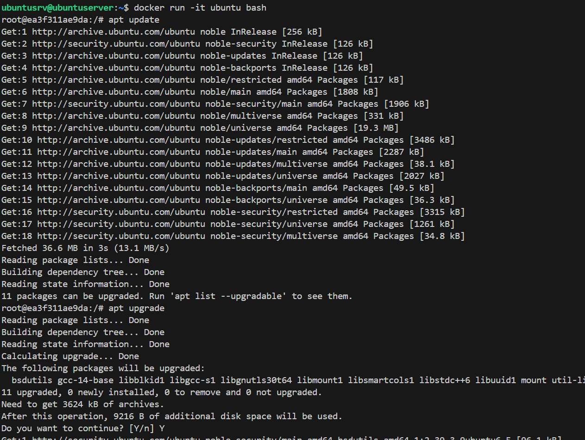

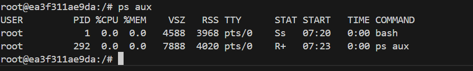

Na powyższyym screenie widać że procesem o PID1 jest bash, co jest charakterystyczne dla kontenerów. Pierwszy proces to  powłoka uruchamiająca a nie system jak w tradycyjnym OS.

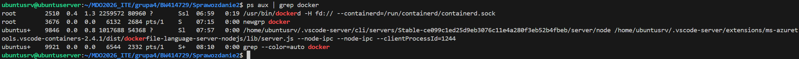

Procesy dockera na hoscie moga być inne z założeniami, gdyż na koniec o tym doczytałem że trzeba zrobici zrobiłe mjuz po czyszczeniu.

## 6. Moj Dockerfile

Korzystajac z dobrych praktyk napisałem Dockerfile:
```
FROM ubuntu:22.04

# aktualizacja , pobranie certyfiaktu do gita, i czyszczenie po apt
RUN apt-get update && apt-get install -y --no-install-recommends \
    git \
    ca-certificates \
    && rm -rf /var/lib/apt/lists/*

WORKDIR /app

# Klonowanie repozytorium
RUN git clone https://github.com/InzynieriaOprogramowaniaAGH/MDO2026_ITE.git .

CMD ["bash"]
```

Następnei uruchomiłem Dockerfile i wykazalem, że jest na nim nasze repozytorium.
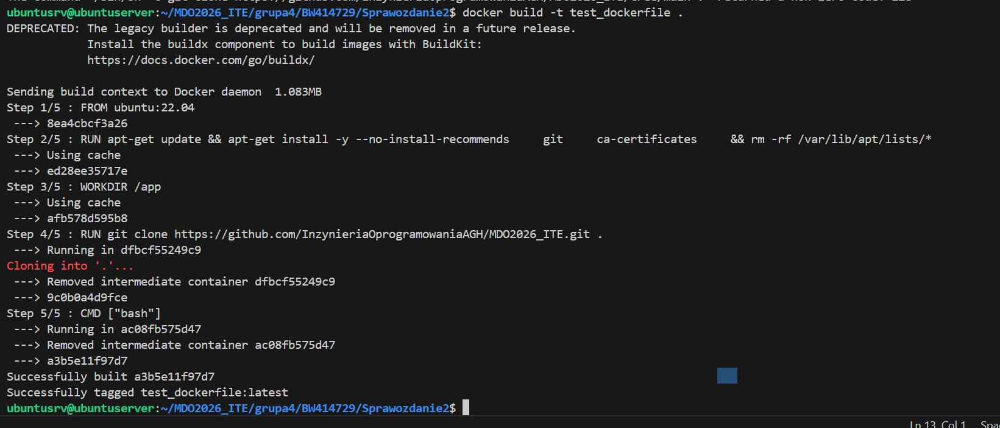
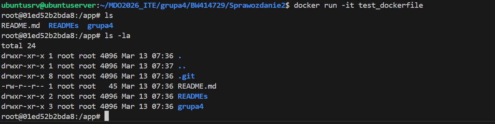

## 7. Pokazanie uruchomionych kontenerów, i ich czyszczenie

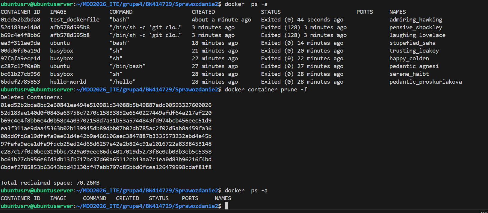

## 8. Czyszczenie obrazów z lokalnego magazynu

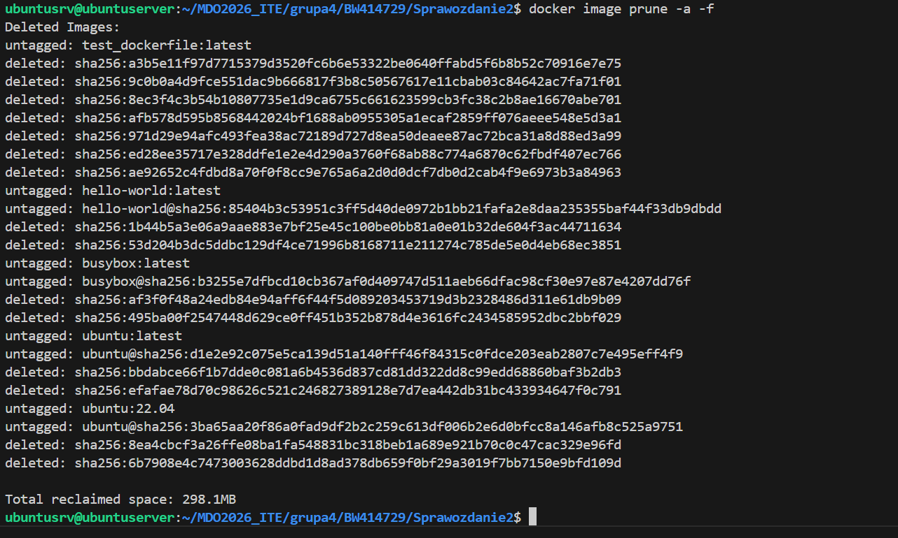