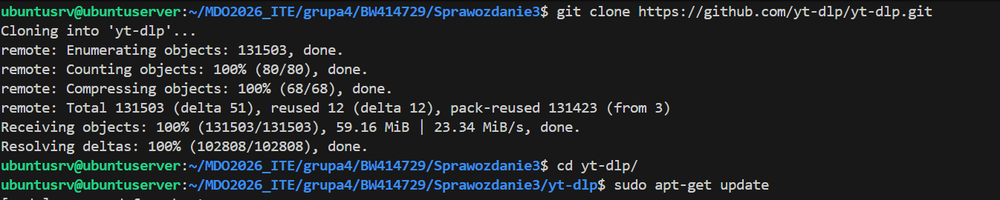
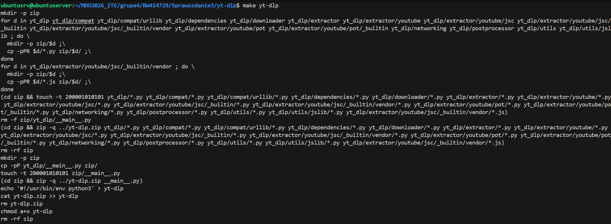
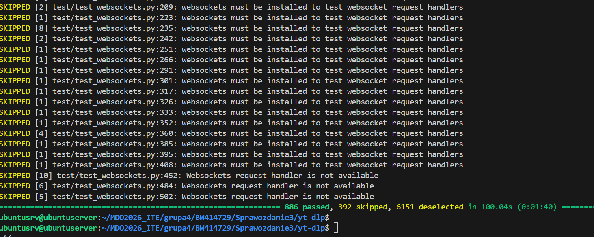
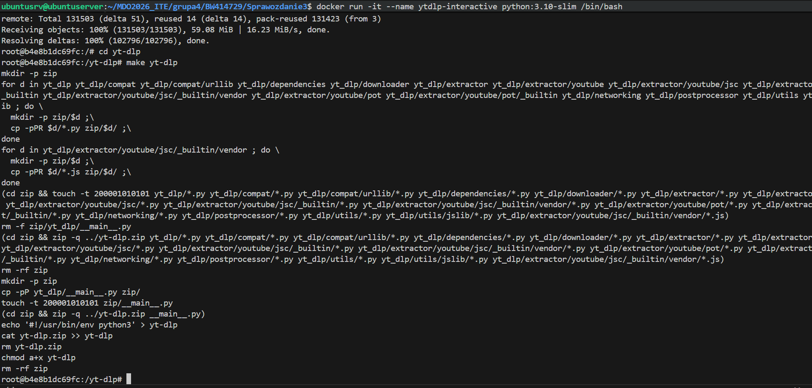
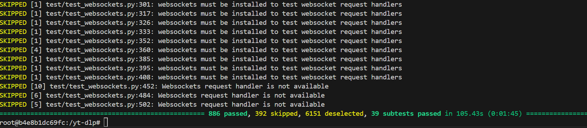
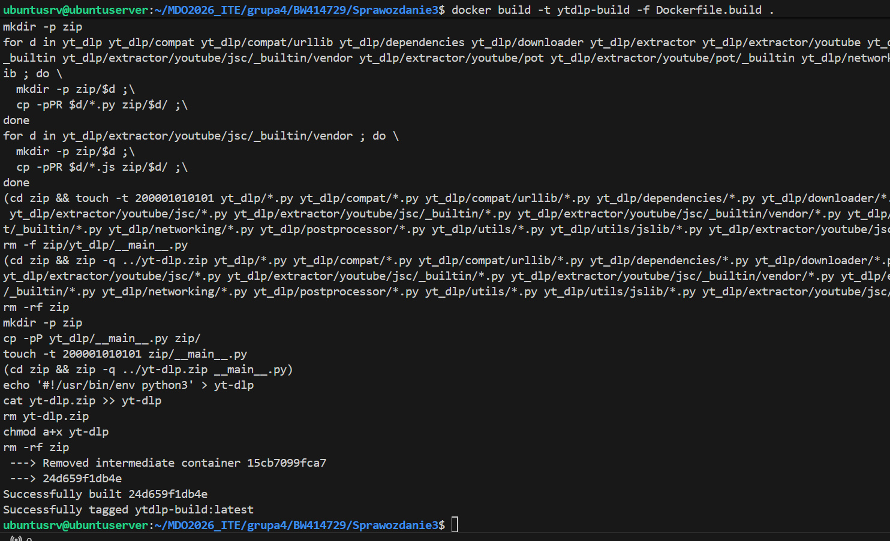
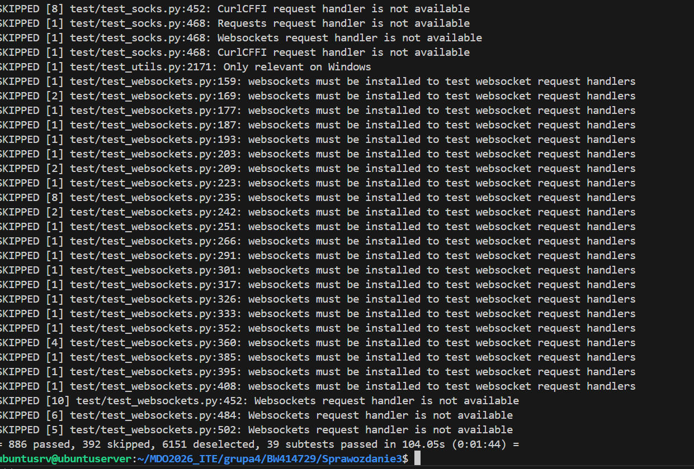

# Sprawozdanie 3

## 1. Wybór oprogramowania na zajęcia
Do zadania wybrałem projekt yt-dlp, zawiera wszystkie wymagania z zastrzeżeniem, iż podczas zajęć wykonałem tylko testy offline. Wykonanie testów online zajęłoby za dużo czasu ze względu chociażby na ich ilość i charakter programu, a część z nich i tak mogłaby się zakończyć niepowodzeniem ze względu na blokadę części serwisów.

Wykorzystane polecenia do zadania:

```
sudo apt-get install -y make zip pandoc python3-pip
sudo apt-get install -y python3-pytest
pip3 install --break-system-packages ruff
export PATH="$HOME/.local/bin:$PATH"
pip3 install --break-system-packages autopep8 flake8 isort
python3 -m pytest -v -m "not download"
```





Wykorzystałem : `python3 -m pytest -v -m "not download"` zamiast make offlinetest, gdyż make nie mógł sobie poradzić z kodowaniem znaków.

## 2. Izolacja i powtarzalność: build w kontenerze

W tym kroku testowałem czy oprogramowanie da radę uruchomić się w czystym dockerowym środowisku interaktywnym, czyli czy damy rade osiągnąć zamierzoną powtarzalność. Do tego wykorzystałem polecenia:

```
docker run -it --name ytdlp-interactive python:3.10-slim /bin/bash
apt-get update && apt-get install -y git make zip pandoc
pip install pytest
git clone https://github.com/yt-dlp/yt-dlp.git
cd yt-dlp
make yt-dlp
python3 -m pytest -v -m "not download"
```




Wszystko wykonało się prawidłowo więc można było przejść do automatyzacji z Dockerfile

## 3. Automatyzacja za pomocą Dockerfile

W tym kroku napisałem pliki Dockerfile.build i Dockerfile.test aby zautomatyzować proces.


Dockerfile.build

```
FROM python:3.10-slim
RUN apt-get update && apt-get install -y git make zip pandoc
RUN pip install pytest
WORKDIR /app
RUN git clone https://github.com/yt-dlp/yt-dlp.git .
RUN make yt-dlp
```

Uruchomiłem ten plik za pomocą `docker build -t ytdlp-build -f Dockerfile.build .`, proces przebiegł pomyślnie więc przeszedłem do testów.



Dockerfile.test

```
FROM ytdlp-build:latest
CMD ["python3", "-m", "pytest", "-v", "-m", "not download"]
```
 Do testów wykorzystałem polecenia:

```
docker build -t ytdlp-test -f Dockerfile.test .
docker run --name ytdlp-test-run ytdlp-test
```

Które również wykonały się należycie.



Na załączonych zrzutach ekranu widać, że kontener wdrożył się i działa poprawnie, co potwierdza pomyślny wynik testów jednostkowych.

## Różnica między obrazem a kontenerem:

- Obraz (ytdlp-test): Jest statycznym, niezmiennym zapisem      systemu plików i konfiguracji aplikacji. Sam w sobie nie wykonuje żadnych operacji.

- Kontener (ytdlp-test-run): To „ożywiony” obraz, czyli jego uruchomiona i odizolowana instancja w pamięci RAM. Kontener posiada własną warstwę zapisu i odczytu, umożliwiającą działanie procesu w wydzielonym środowisku.

## Co pracuje w kontenerze?
W kontenerze nie pracuje pełny, ciężki system operacyjny (jak w przypadku maszyn wirtualnych). Pracuje w nim wyłącznie jeden, konkretny proces główny, zdefiniowany w instrukcji – w tym przypadku jest to python3 -m pytest. Kontener żyje tak długo, jak długo trwa ten proces. Gdy testy dobiegają końca, główny proces kończy swoje działanie, a kontener zostaje automatycznie zatrzymany.