# Sprawozdanie 4

## 1. Zachowywanie stanu między kontenerami

Na początek tworzę woluminy, aby oddzielić kod źródłowy i zbudowane pliki od cyklu życia samego kontenera. Pozwala to na zachowanie danych nawet po usunięciu kontenera budującego.
Wykmorzystałem do tego komendy:
```
docker volume create wejscie_kod
docker volume create wyjscie_build
```
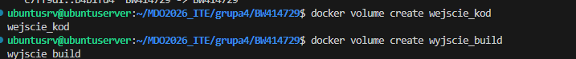

Następnie wykorzystałem pomocniczy kontener alpine/git, aby za jego pomocą pobrać repozytorium na wolumin. Dzięki temu nie muszę instalować narzędzia Git w kontenerze bazowym, co pozwala zachować mniejszy rozmiar obrazu docelowego.

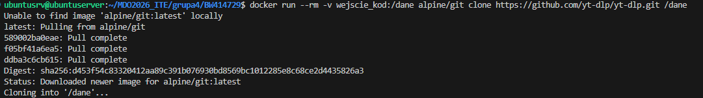
`docker run --rm -v wejscie_kod:/dane alpine/git clone https://github.com/yt-dlp/yt-dlp.git /dane`

Uruchamiam główny kontener budujący, montując wolumin z kodem do folderu /app oraz wolumin wyjściowy do /wynik.
```
  docker run -it --name budowniczy \
  -v wejscie_kod:/app \
  -v wyjscie_build:/wynik \
  python:3.10-slim /bin/bash
  ```
  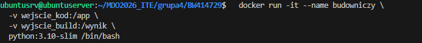

Wewnątrz kontenera instaluję niezbędne narzędzia i kompiluję projekt. Gotowy plik binarny przenoszę na wolumin wyjściowy.
  ```
    apt-get update && apt-get install -y make zip pandoc
    cd /app
    make yt-dlp
    # Kopiujemy gotowy plik na wolumin wyjściowy
    cp yt-dlp /wynik/
    exit
  ```
  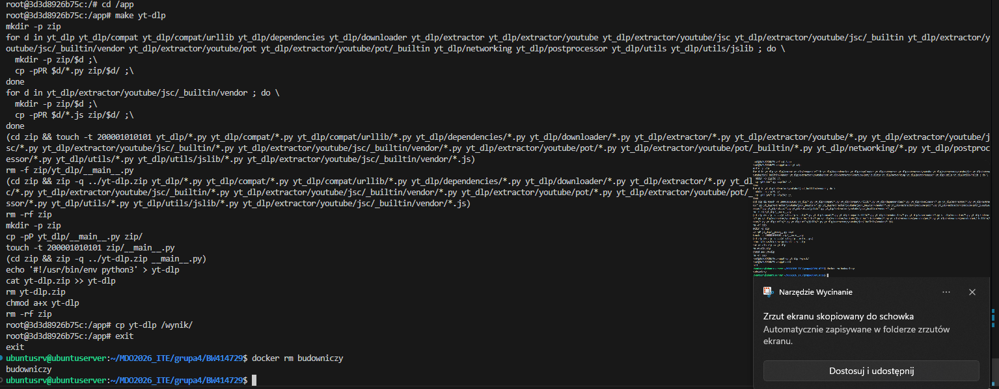

Weryfikuję, czy plik przetrwał usunięcie kontenera budującego.
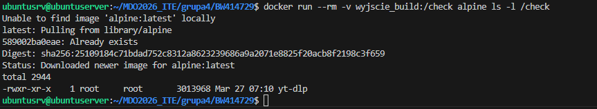
`docker run --rm -v wyjscie_build:/check alpine ls -l /check`


Następnie komendą: `docker run --rm -v wejscie_kod:/app alpine sh -c "rm -rf /app/*"` wyczysciłem folder app. Jak się potem przekonałem nie usunoł on jednak plików ukrytych.


Podpinam wolumin do nowego, tymczasowego kontenera:
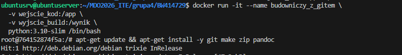
```
docker run -it --name budowniczy_z_gitem \
  -v wejscie_kod:/app \
  -v wyjscie_build:/wynik \
  python:3.10-slim /bin/bash
```

Podczas wykonywania tego korku wykryłem pozostałe ukryte pliki, które usuonłem komendą `rm -rf /app/.* 2>/dev/null`
Wykorzystane komendy:

```
apt-get update && apt-get install -y git make zip pandoc
rm -rf /app/.* 2>/dev/null
git clone https://github.com/yt-dlp/yt-dlp.git /app
cd /app
make yt-dlp
cp yt-dlp /wynik/yt-dlp-wersja-z-gitem
exit
```
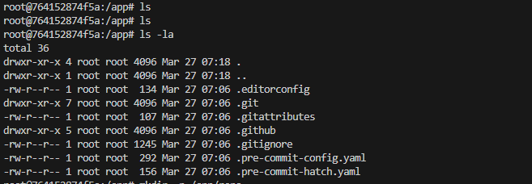
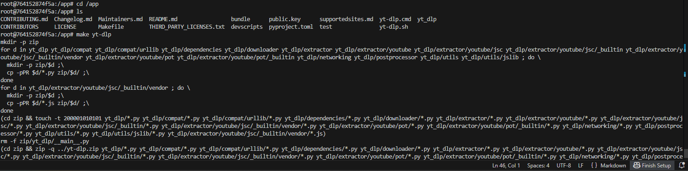

### DYSKUSJA
Proces budowania projektu można w pełni zautomatyzować za pomocą pliku Dockerfile. Zamiast ręcznie montować woluminy, można użyć nowoczesnej instrukcji RUN --mount=type=bind.
* Zaleta: Pozwala to na "wypożyczenie" kodu źródłowego z hosta tylko na czas budowania obrazu. Kod nie staje się częścią finalnego obrazu, co drastycznie zmniejsza jego rozmiar.
* Pamięć podręczna: Można również użyć --mount=type=cache, aby przyspieszyć instalację pakietów (np. apt czy pip), przechowując je między różnymi budowaniami obrazu.

## 2. Eksponowanie portu i łączność między kontenerami

Do zbadania przepustowości sieci użyto narzędzia iperf3. W pierwszej kolejności sprawdzono łączność w domyślnej sieci Dockera, która wymaga znajomości adresów IP.

```docker run -d --name iperf_serwer networkstatic/iperf3 -s
docker run -d --name iperf_klient --entrypoint sleep networkstatic/iperf3 3600
docker inspect -f '{{.Name}} ma adres IP: {{range.NetworkSettings.Networks}}{{.IPAddress}}{{end}}' iperf_serwer iperf_klient
```
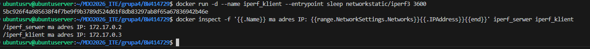

`docker exec -it iperf_klient iperf3 -c 172.17.0.2`
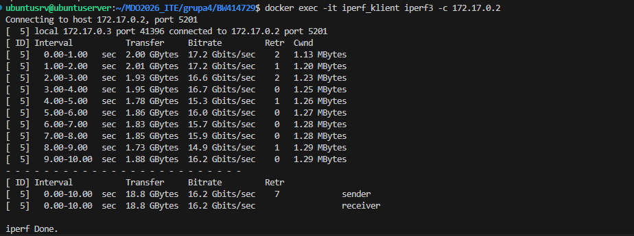

Następnie utworzono dedykowaną sieć. W sieciach użytkownika Docker udostępnia wbudowany serwer DNS, co pozwala kontenerom komunikować się za pomocą nazw zamiast zmiennych adresów IP.

```docker rm -f iperf_serwer iperf_klient
docker network create moja_siec
docker run -d --name iperf_serwer --network moja_siec networkstatic/iperf3 -s
```
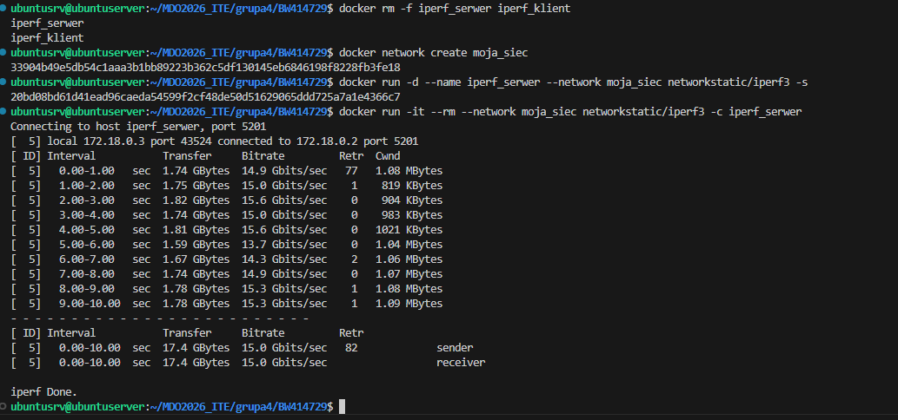


Następnie wyeksporowałem port kontenera na kport hosta. I nastąpiął próba łączenia przez hosta:
```
docker rm -f iperf_serwer
docker run -d --name iperf_serwer -p 5201:5201 networkstatic/iperf3 -s
sudo apt-get update && sudo apt-get install -y iperf3
iperf3 -c 127.0.0.1
```
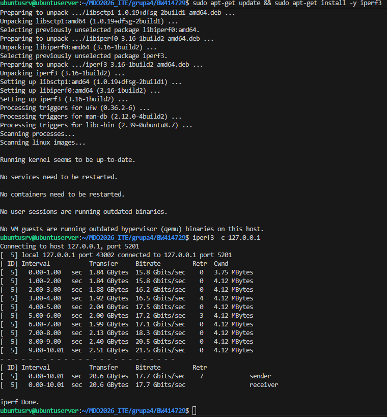
Tutaj wszystko przebiegło pomyślnie

Jednak podczas próby łączenia z  poza  hosta ( do tego wykorzystałem Powershella z  windowsa) zostałem zablokwoan yprozez firewalla.
```
curl ifconfig.me
Test-NetConnection -ComputerName 178.219.17.254 -Port 5201
```
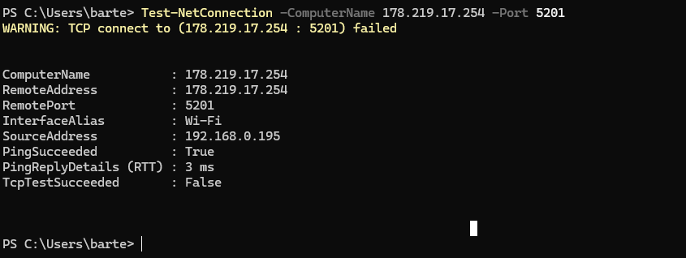

Widziałem serwer ale nie mogłem wejsc do konenetra.

## 3. Usługi w rozumieniu systemu, kontenera i klastra

Uruchomiono usługę SSHD wewnątrz kontenera Ubuntu.
```
docker run -d --name kontener_ssh -p 2222:22 ubuntu:latest sleep infinity
docker exec -it kontener_ssh bash
```

```
apt-get update && apt-get install -y openssh-server
mkdir /var/run/sshd
echo 'root:haslo123' | chpasswd
sed -i 's/#PermitRootLogin prohibit-password/PermitRootLogin yes/' /etc/ssh/sshd_config
/usr/sbin/sshd
exit
```
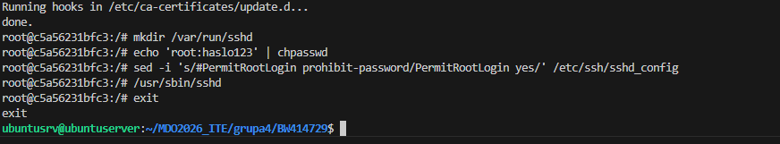

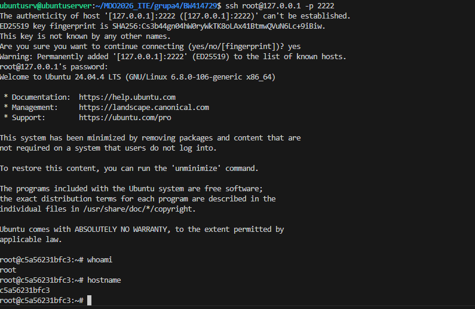

Zalety SSH w kontenerze:

* Możliwość zarządzania kontenerem za pomocą standardowych narzędzi (np. Ansible, WinSCP).
* Łatwe przesyłanie plików bez znajomości specyficznych komend Dockera.

Wady:

* Zwiększenie rozmiaru obrazu o zbędne pakiety.
* Złamanie zasady "jeden proces na kontener".
* Niższe bezpieczeństwo (dodatkowy punkt ataku).
* Lepiej stosować komendę docker exec.


## 4. Przygotowanie do uruchomienia serwera Jenkins

Zainstalowano Jenkinsa w architekturze DIND (Docker-in-Docker). Jenkins (jako kontener) komunikuje się z pomocnikiem jenkins-docker, który udostępnia mu silnik Dockera do budowania obrazów.

```
docker network create jenkins
docker volume create jenkins-docker-certs
docker volume create jenkins-data

docker run --name jenkins-docker --detach \
  --privileged --network jenkins --network-alias docker \
  --env DOCKER_TLS_CERTDIR=/certs \
  --volume jenkins-docker-certs:/certs \
  --volume jenkins-data:/var/jenkins_home \
  --publish 2376:2376 \
  docker:dind --storage-driver overlay2

docker run --name jenkins-blueocean --detach \
  --network jenkins --env DOCKER_HOST=tcp://docker:2376 \
  --env DOCKER_CERT_PATH=/certs/client --env DOCKER_TLS_VERIFY=1 \
  --publish 8080:8080 --publish 50000:50000 \
  --volume jenkins-data:/var/jenkins_home \
  --volume jenkins-docker-certs:/certs/client:ro \
  jenkins/jenkins:2.462.3-jdk17
```

Po tym  stworzyłem  docker_compose.yml by łątwiej był uruchamiać w przyszłości jenkinsa.

Weryfikacja działających kontenerów:
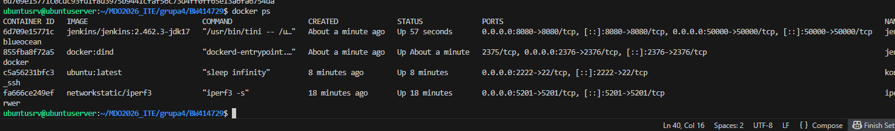

Ustawiełm w VSC port forwarding.
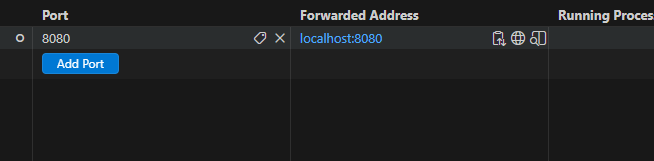

Wyciągnołem hasło, i  uruchomiłem i skonfiguroiwałem Jenkinsa.
` docker exec jenkins-blueocean cat /var/jenkins_home/secrets/initialAdminPassword`
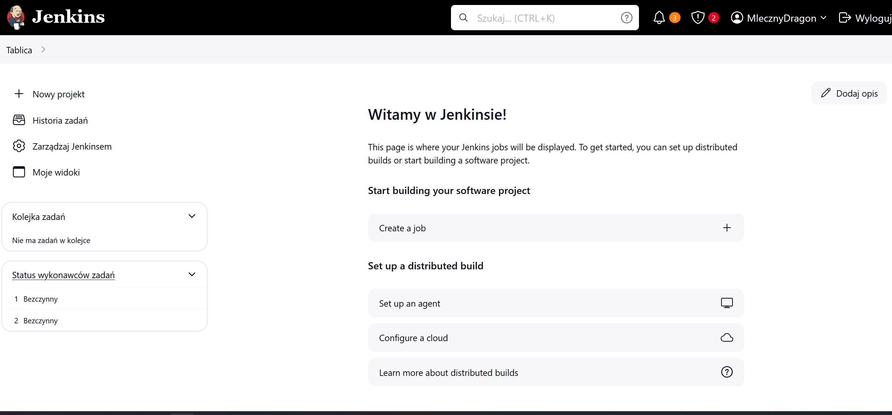
