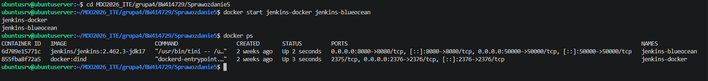
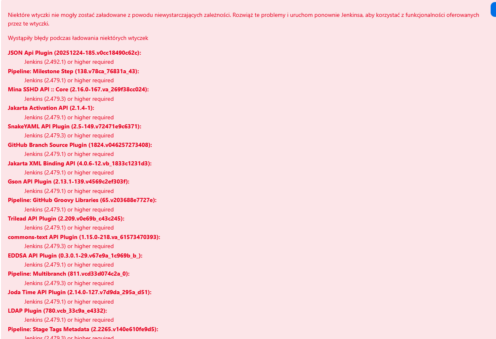
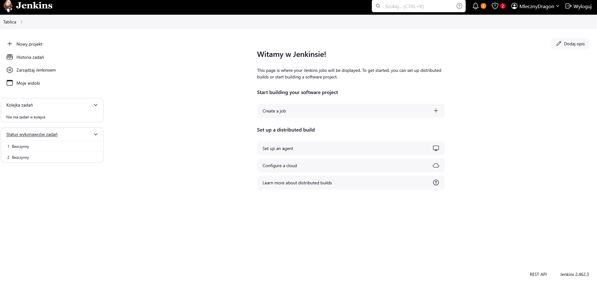
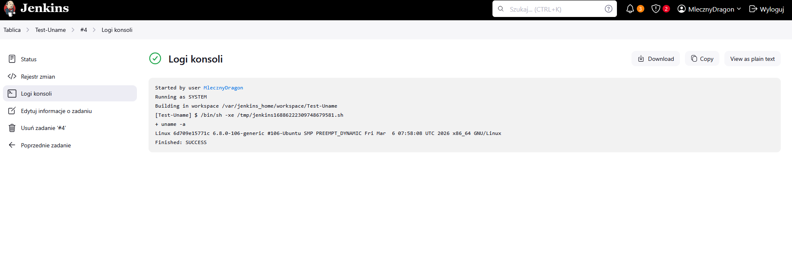
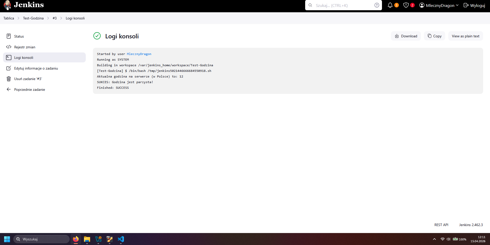
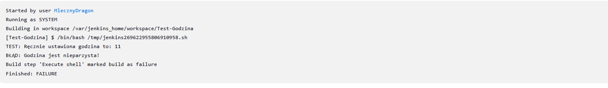
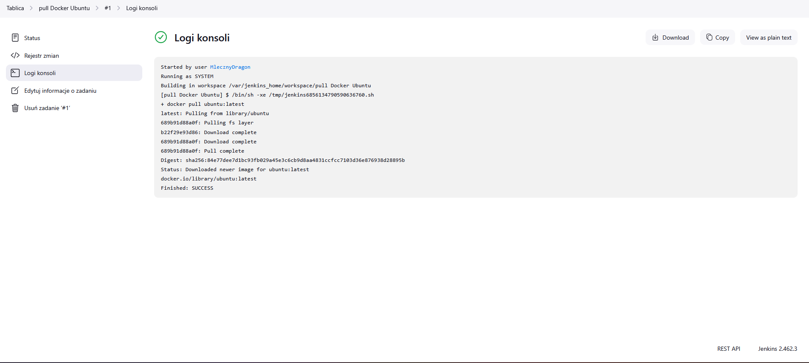
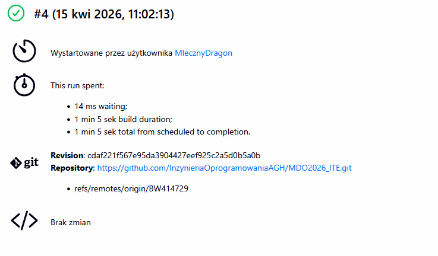
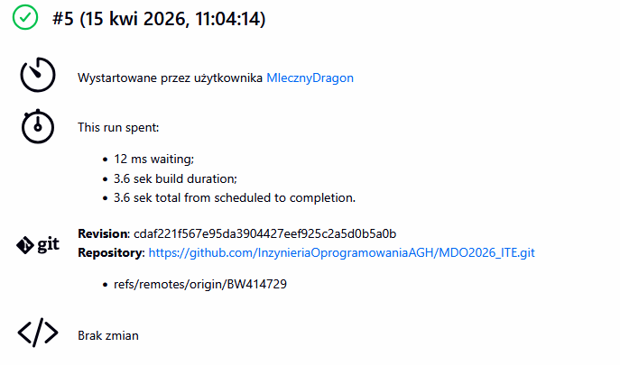
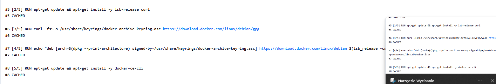

# Sprawozdanie 5


## 1. Przygotowanie

Kontenery z poprzedniego ćwiczenia działąły prawidłowo.


W trakcie tworzenia pipelina odkryłem brak wymaganych wtyczek, które by były niezbędne.
By narpawic ten bład najpierw podmieniłę mwersje jenkisna na najnowszą , potem pobrałem i  zaktualizowałem wtyczki a następnie zresetowałem  kontener.




## 2. Zadanie wstępne: uruchomienie
#### 2.1 Uname
Pierwszy projekt który tworzyłem, to pokazanie  nazwy amszyny co udało sie wykonaĆ bez wiekszych problemów za pomocą:
```
uname -a
```


#### 2.2 Kod na sprawdzanie czy godzina jest parzysta.
Tutaj pojawił się minimalny nie tyle chyba problem co rozbieżność godzin. Czas amszyny  byłstale -2 godziny neizależnie  od sutawionej w ustawieniach Jenkinsa strefy czasowej. NAszczęscie w skrypcie udało sie to poprawić a skrypt działą prawidłowo. Kod:

```
#!/bin/bash
# Wymuszamy czas warszawski tylko dla tej jednej komendy
HOUR=$(TZ="Europe/Warsaw" date +%-H)

echo "Aktualna godzina na serwerze to: $HOUR"

if [ $((HOUR % 2)) -ne 0 ]; then
    echo "BŁĄD: Godzina jest nieparzysta!"
    exit 1
else
    echo "SUKCES: Godzina jest parzysta!"
    exit 0
fi
```




#### 2.3 Pullowawnie ubuntu.
W tym punkcie pojawiło się najwięcej problemów. Obraz Jenkinsa domyślnie nie posiada zainstalowanego klienta Dockera, przez co nie mogłem pobrać obrazu Ubuntu. Wymagało to drobnych poprawek, które ostatecznie przekształciły się w utworzenie pliku Dockerfile oraz docker-compose.yml, co pozwoli na wygodniejsze uruchamianie Jenkinsa w przyszłości.
Polecenie wykorzystane w skrypcie: `docker pull ubuntu:latest`




## 3. Zadanie wstępne: obiekt typu pipeline
W tym kroku  utworzyłem w Jenkinsie obiekt Pipeline, w ktorym pobieram repozytorium z mojego brancha, następnei Stworzyłem Dockerfile.spr dla kroków wykonywanych podczas Sprawozdania4, by je odtworzyc. NAstępnie uruchomiłem pipelian 2 razy.
Kod pipelina:
```
pipeline {
    agent any

    stages {
        stage('1. Checkout SCM') {
            steps {
                echo 'Pobieram gałąź BW414729 z repozytorium AGH...'
                // Pobieramy Twoją gałąź, gdzie są wszystkie sprawozdania
                git branch: 'BW414729', url: 'https://github.com/InzynieriaOprogramowaniaAGH/MDO2026_ITE.git'
            }
        }

        stage('2. Budowanie Buildera') {
            steps {
                echo 'Buduję obraz na podstawie Dockerfile ze Sprawozdania 4...'
                script {
                    // Wchodzimy do katalogu, w którym fizycznie JEST plik Dockerfile
                    dir('grupa4/BW414729/Sprawozdanie5') {
                        sh 'docker build -t moj-builder-projektowy .'
                    }
                }
            }
        }

        stage('3. Weryfikacja') {
            steps {
                echo 'Sprawdzam czy obraz został utworzony...'
                sh 'docker images | grep moj-builder-projektowy'
            }
        }
    }
}
```
Rezultat 1 uruchomienia


Rezultat 2 uruchomienia


Pipeline podczas drugiego uruchomienia wykonał się znacznie szybciej. Wynika to z faktu, że repozytorium zostało jedynie zaktualizowane (nie klonowane od zera), a przede wszystkim dzięki zastosowaniu mechanizmu Docker Cache – warstwy obrazu nie musiały być budowane ponownie, co widać w logach jako status CACHED.



