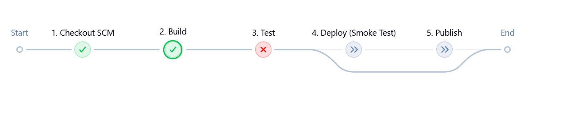
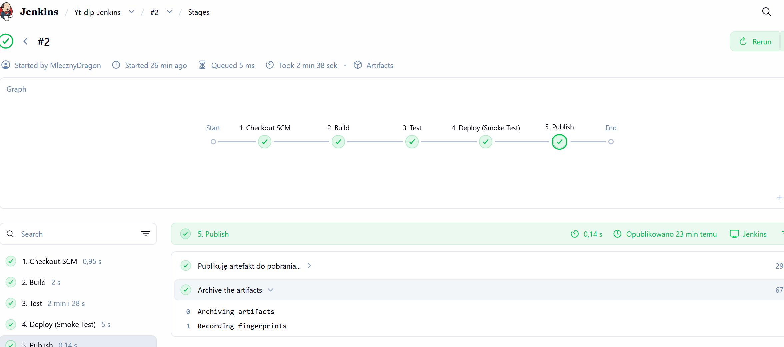
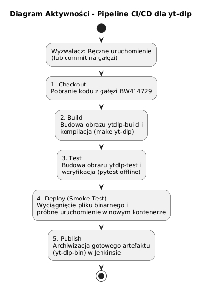
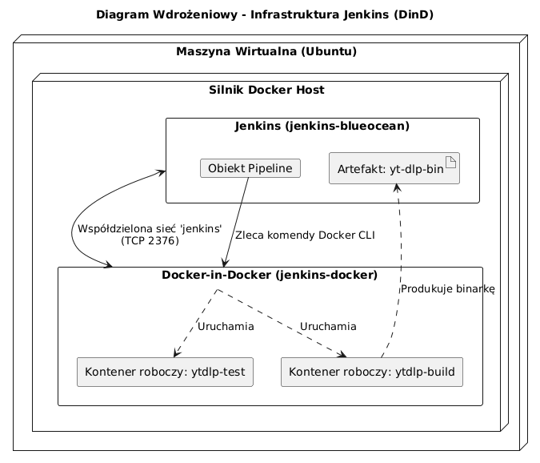
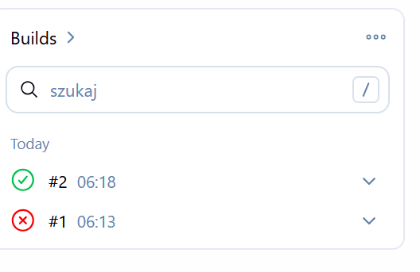
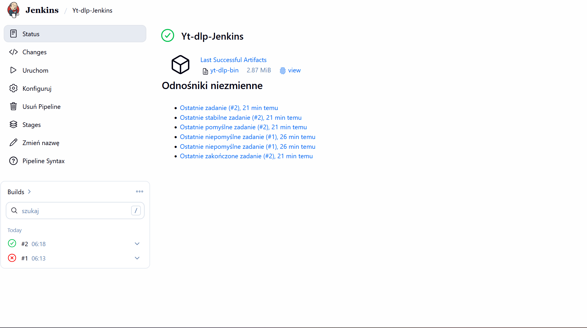

# Sprawozdanie z zajęć 06 – Pipeline CI/CD (yt-dlp)

## Pipeline: lista kontrolna
Scharakteryzuj plan na *pipeline* i przedstaw postęp prac. Czy mamy pomysł na każdy krok poniżej?

### Ścieżka krytyczna
Podstawowy zbiór czynności do wykonania w ramach zadania z pipelinem CI/CD. Ścieżką krytyczną jest:

- [x] **commit (lub tzw. *manual trigger* @ Jenkins)**
  > Pipeline jest wyzwalany ręcznie z poziomu interfejsu Jenkinsa (przycisk "Build Now"). Skonfigurowano również możliwość uruchamiania po wykryciu commita w gałęzi.
  
- [x] **clone**
  > Kod pobierany jest z repozytorium GitHub (gałąź `BW414729`) w bloku `Checkout SCM`.

- [x] **build**
  > Budowa narzędzia odbywa się wewnątrz kontenera `ytdlp-build` na bazie pliku `Dockerfile.build` (wywołanie `make yt-dlp`).

- [x] **test**
  > Testy uruchamiane są w kolejnym kroku, w kontenerze `ytdlp-test` (za pomocą środowiska `pytest` w trybie offline,  ze wgledu na to że testy online są zbyt rozbudowane)

- [x] **deploy**
  > Gotowy plik binarny jest wyciągany z kontenera budującego i uruchamiany w całkowicie czystym kontenerze typu runtime (`python:3.10-slim`) jako tzw. *smoke test*.

- [x] **publish**
  > Zbudowany plik `yt-dlp-bin` archiwizowany jest w systemie Jenkins jako gotowy do pobrania artefakt.

---

### Pełna lista kontrolna
Zweryfikuj dotychczasową postać sprawozdania oraz planowane czynności względem ścieżki krytycznej oraz poniższej listy. 

- [x] **Aplikacja została wybrana**
  > Wybrano popularne narzędzie open-source do pobierania wideo: `yt-dlp`.

- [x] **Licencja potwierdza możliwość swobodnego obrotu kodem na potrzeby zadania**
  > Projekt `yt-dlp` jest udostępniany na licencji *The Unlicense*, co przekazuje go do domeny publicznej i pozwala na pełną swobodę modyfikacji.

- [x] **Wybrany program buduje się**
  > Kod pomyślnie kompiluje się przy użyciu pliku `Makefile`.
  
  Jak  widac tutaj Build ywkonał sie porpawnie ale tyest nie przeszedł, wynikało to z pomyłki w kodzie.

- [x] **Przechodzą dołączone do niego testy**
  > Testy uruchamiane poleceniem `python3 -m pytest -v -m "not download"` przechodzą pomyślnie w odizolowanym kontenerze.
  

- [x] **Zdecydowano, czy jest potrzebny fork własnej kopii repozytorium**
  > Zdecydowano, że fork repozytorium nie jest konieczny, ponieważ cała praca odbywa się w izolowanym, dedykowanym katalogu oraz własnej gałęzi (`BW414729`) w głównym repozytorium

- [x] **Stworzono diagram UML zawierający planowany pomysł na proces CI/CD**
  > Opracowano diagram aktywności oraz wdrożeniowy dla zaplanowanej infrastruktury.
  
  

- [x] **Wybrano kontener bazowy lub stworzono odpowiedni kontener wstepny (runtime dependencies)**
  > Jako kontener bazowy wybrano lekki obraz `python:3.10-slim`. W trakcie budowania doinstalowywane są pakiety `make` oraz `zip`.

- [x] **Build został wykonany wewnątrz kontenera**
  > Budowa jest całkowicie zamknięta w `Dockerfile.build`.

- [x] **Testy zostały wykonane wewnątrz kontenera (kolejnego)**
  > W etapie testów budowany i uruchamiany jest odrębny obraz na podstawie pliku `Dockerfile.test`.

- [x] **Kontener testowy jest oparty o kontener build**
  > Plik `Dockerfile.test` opiera się na poprzednim obrazie za pomocą dyrektywy: `FROM ytdlp-build:latest`.

- [x] **Logi z procesu są odkładane jako numerowany artefakt, niekoniecznie jawnie**
  > Jenkins automatycznie zapisuje pełne Console Output z każdego uruchomienia, numerując je zgodnie z Build ID (np. `#5`, `#6`), co pozwala łatwo weryfikować, dlaczego dane testy nie przeszły.
  

- [x] **Zdefiniowano kontener typu 'deploy' pełniący rolę kontenera, w którym zostanie uruchomiona aplikacja**
  > Zdecydowano, że aplikacja będzie uruchamiana w czystym kontenerze bazowym `python:3.10-slim`, do którego binarka jest przekazywana za pomocą montowania wolumenu (`-v`).

- [x] **Uzasadniono czy kontener buildowy nadaje się do tej roli/opisano proces stworzenia nowego, specjalnie do tego przeznaczenia**
  > Kontener buildowy **nie nadaje się** do wdrożenia docelowego. Zawiera on narzędzia kompilacyjne (jak `make`, pakiety dev), pełny kod źródłowy i logi, co znacznie powiększa jego rozmiar oraz zwiększa powierzchnię ataku. Z tego powodu plik binarny z kontenera build jest "wyciągany" komendą `docker cp` i uruchamiany w czystym, wyizolowanym środowisku uruchomieniowym.

- [x] **Wersjonowany kontener 'deploy' ze zbudowaną aplikacją jest wdrażany na instancję Dockera**
  > Realizuje to etap "Deploy (Smoke Test)" za pomocą komendy `docker run`.

- [x] **Następuje weryfikacja, że aplikacja pracuje poprawnie (smoke test) poprzez uruchomienie kontenera 'deploy'**
  > Weryfikacja następuje przez wywołanie pliku z parametrem wersji: `sh 'docker run --rm -v ${WORKSPACE}/yt-dlp-bin:/yt-dlp python:3.10-slim /yt-dlp --version'`. Krok kończy się sukcesem, jeśli zwrócony zostanie tekst (wersja aplikacji).

- [x] **Zdefiniowano, jaki element ma być publikowany jako artefakt**
  > Opublikowany zostaje pojedynczy plik binarny `yt-dlp-bin`.

- [x] **Uzasadniono wybór: kontener z programem, plik binarny, flatpak, archiwum tar.gz, pakiet RPM/DEB**
  > Wybrano **plik binarny**. Ponieważ `yt-dlp` to typowe i proste narzędzie wiersza poleceń, użytkownicy zazwyczaj chcą je po prostu pobrać i uruchomić w swoim terminalu. Narzucanie konieczności instalacji platformy Docker, aby tylko pobrać wideo, mijałoby się z głównym celem tego programu.

- [x] **Opisano proces wersjonowania artefaktu (można użyć semantic versioning)**
  > Plik jest wersjonowany zgodnie z numeracją uruchomień Jenkinsa (Build ID). Dodatkowo, docelowe wersjonowanie aplikacji oparte jest na dacie wydania w formacie Kalendarzowym (CalVer, np. `2024.x.y`).

- [x] **Dostępność artefaktu: publikacja do Rejestru online, artefakt załączony jako rezultat builda w Jenkinsie**
  > Artefakt jest załączony bezpośrednio w interfejsie graficznym Jenkinsa jako rezultat pomyślnego builda (wykorzystano krok `archiveArtifacts`).
    

- [x] **Przedstawiono sposób na zidentyfikowanie pochodzenia artefaktu**
  > Zastosowano wbudowaną w Jenkinsa opcję *Fingerprinting* (`fingerprint: true`). Pozwala to powiązać konkretny plik ze zrzutem GitHuba i konkretnym numerem zadania, które go stworzyło.

- [x] **Pliki Dockerfile i Jenkinsfile dostępne w sprawozdaniu w kopiowalnej postaci oraz obok sprawozdania, jako osobne pliki**
  > Pliki znajdują się w repozytorium oraz wylistowano je poniżej:

## Jenkinsfile
```
pipeline {
    agent any

    stages {
        stage('1. Checkout SCM') {
            steps {
                echo 'Pobieram kod z GitHuba...'
                git branch: 'BW414729', url: 'https://github.com/InzynieriaOprogramowaniaAGH/MDO2026_ITE.git'
            }
        }

        stage('2. Build') {
            steps {
                echo 'Buduję narzędzie yt-dlp...'
                script {
                    dir('grupa4/BW414729/Sprawozdanie3') {
                        sh 'docker build -t ytdlp-build -f Dockerfile.build .'
                    }
                }
            }
        }

        stage('3. Test') {
            steps {
                echo 'Uruchamiam testy offline w osobnym kontenerze...'
                script {
                    dir('grupa4/BW414729/Sprawozdanie3') {
                        sh 'docker build -t ytdlp-test -f Dockerfile.test .'
                        sh 'docker run --rm ytdlp-test'
                    }
                }
            }
        }

        stage('4. Deploy (Smoke Test)') {
            steps {
                echo 'Wyciągam binarkę i sprawdzam, czy działa w czystym środowisku...'
                sh 'docker create --name extract-ytdlp ytdlp-build'
                sh 'docker cp extract-ytdlp:/app/yt-dlp ./yt-dlp-bin'
                sh 'docker rm extract-ytdlp'
                sh 'chmod +x ./yt-dlp-bin'
                sh 'docker run --rm -v ${WORKSPACE}/yt-dlp-bin:/yt-dlp python:3.10-slim /yt-dlp --version'
            }
        }

        stage('5. Publish') {
            steps {
                echo 'Publikuję artefakt do pobrania...'
                archiveArtifacts artifacts: 'yt-dlp-bin', fingerprint: true
            }
        }
    }
}
```

## Dockerfile.build
```
FROM python:3.10-slim
RUN apt-get update && apt-get install -y git make zip pandoc
RUN pip install pytest
WORKDIR /app
RUN git clone https://github.com/yt-dlp/yt-dlp.git .
RUN make yt-dlp
```

## Dockerfile.test
```
FROM ytdlp-build:latest
CMD ["python3", "-m", "pytest", "-v", "-m", "not download"]
```