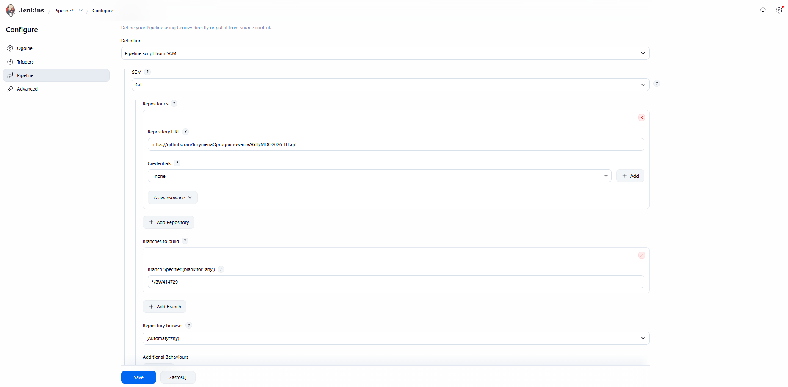
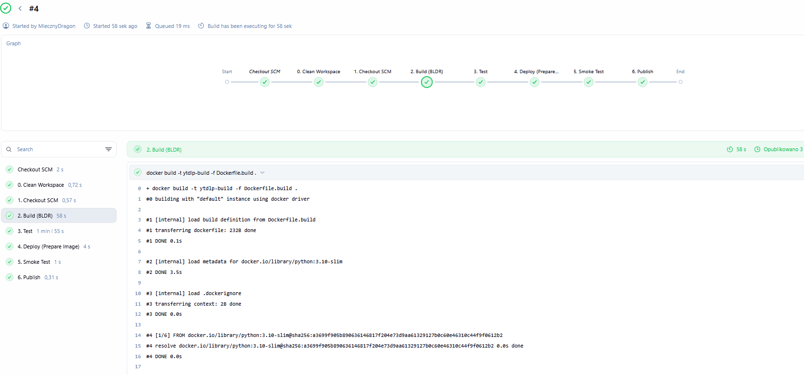
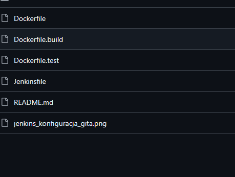
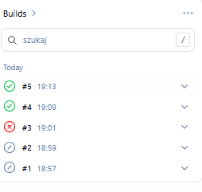

# Sprawozdanie 5

### Kroki Jenkinsfile
Zweryfikuj, czy definicja pipeline'u obecna w repozytorium pokrywa ścieżkę krytyczną:

- [x] Przepis dostarczany z SCM, a nie wklejony w Jenkinsa lub sprawozdanie (co załatwia nam `clone` )
  
- [x] Posprzątaliśmy i wiemy, że odbyło się to skutecznie - mamy pewność, że pracujemy na najnowszym (a nie *cache'owanym* kodzie)
- [x] Etap `Build` dysponuje repozytorium i plikami `Dockerfile`
- [x] Etap `Build` tworzy obraz buildowy, np. `BLDR`
- [x] Etap `Build` (krok w tym etapie) lub oddzielny etap (o innej nazwie), przygotowuje artefakt - **jeżeli docelowy kontener ma być odmienny**, tj. nie wywodzimy `Deploy` z obrazu `BLDR`
- [x] Etap `Test` przeprowadza testy
- [x] Etap `Deploy` przygotowuje **obraz lub artefakt** pod wdrożenie. W przypadku aplikacji pracującej jako kontener, powinien to być obraz z odpowiednim entrypointem. W przypadku buildu tworzącego artefakt niekoniecznie pracujący jako kontener (np. interaktywna aplikacja desktopowa), należy przesłać i uruchomić artefakt w środowisku docelowym.
- [x] Etap `Deploy` przeprowadza wdrożenie (start kontenera docelowego lub uruchomienie aplikacji na przeznaczonym do tego celu kontenerze sandboxowym)
- [x] Etap `Publish` wysyła obraz docelowy do Rejestru i/lub dodaje artefakt do historii builda


- [x] Ponowne uruchomienie naszego *pipeline'u* powinno zapewniać, że pracujemy na najnowszym (a nie *cache'owanym*) kodzie. Innymi słowy, *pipeline* musi zadziałać więcej niż jeden raz 😎



# Jenkinsfile
```
pipeline {
    agent any

    stages {
        stage('0. Clean Workspace') {
            steps {
                echo 'Czyszczenie przestrzeni roboczej...'
                // Usuwamy binarkę, jeśli została po starym buildzie
                sh 'rm -f grupa4/BW414729/Sprawozdanie7/yt-dlp-bin || true'
                // Czyścimy dockera z wiszących obrazów
                sh 'docker system prune -f'
            }
        }

        stage('1. Checkout SCM') {
            steps {
                checkout scm
            }
        }

        stage('2. Build (BLDR)') {
            steps {
                script {
                    dir('grupa4/BW414729/Sprawozdanie7') {
                        sh 'docker build -t ytdlp-build -f Dockerfile.build .'
                    }
                }
            }
        }

        stage('3. Test') {
            steps {
                script {
                    dir('grupa4/BW414729/Sprawozdanie7') {
                        sh 'docker build -t ytdlp-test -f Dockerfile.test .'
                        sh 'docker run --rm ytdlp-test'
                    }
                }
            }
        }

        stage('4. Deploy (Prepare Image)') {
            steps {
                script {
                    dir('grupa4/BW414729/Sprawozdanie7') {
                        // Wyciągamy binarkę
                        sh 'docker create --name extract-ytdlp ytdlp-build'
                        sh 'docker cp extract-ytdlp:/app/yt-dlp ./yt-dlp-bin'
                        sh 'docker rm extract-ytdlp'
                        
                        // Budujemy finalny, lekki obraz (z nowego pliku Dockerfile)
                        sh 'docker build -t yt-dlp-final -f Dockerfile .'
                    }
                }
            }
        }

        stage('5. Smoke Test') {
            steps {
                // Uruchamiamy testowo nasz nowy, czysty obraz
                sh 'docker run --rm yt-dlp-final --version'
            }
        }

        stage('6. Publish') {
            steps {
                script {
                    dir('grupa4/BW414729/Sprawozdanie7') {
                        archiveArtifacts artifacts: 'yt-dlp-bin', fingerprint: true
                    }
                }
            }
        }
    }
}
```

#  Dockerfile
```
FROM python:3.10-slim
WORKDIR /app
COPY yt-dlp-bin /usr/local/bin/yt-dlp
RUN chmod +x /usr/local/bin/yt-dlp
ENTRYPOINT ["yt-dlp"]
```

# Dockerfile.build
```
FROM python:3.10-slim
RUN apt-get update && apt-get install -y git make zip pandoc
RUN pip install pytest
WORKDIR /app
RUN git clone https://github.com/yt-dlp/yt-dlp.git .
RUN make yt-dlp
```

# Dockerfile.test
```
FROM ytdlp-build:latest
CMD ["python3", "-m", "pytest", "-v", "-m", "not download"]
```