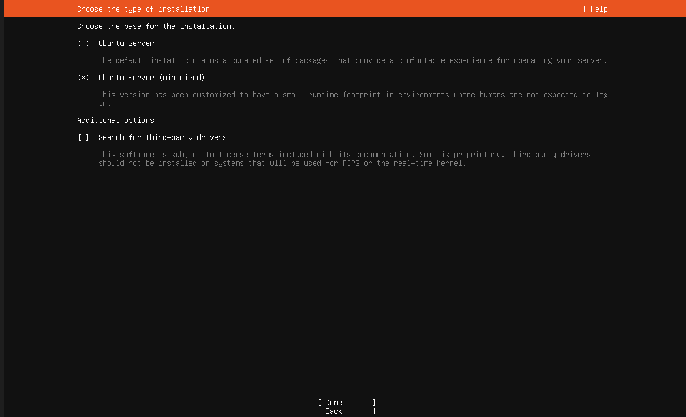
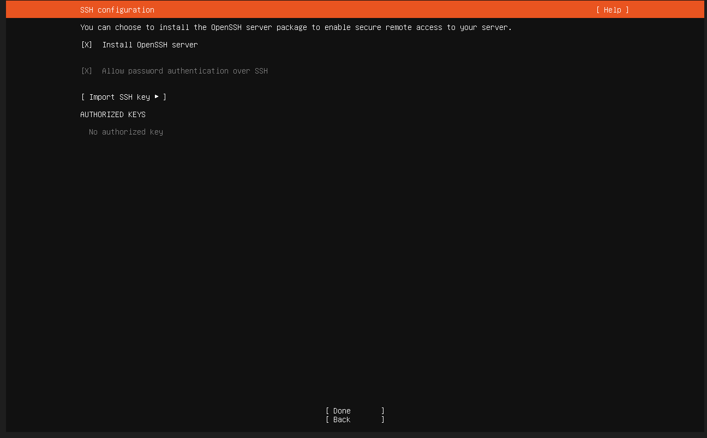
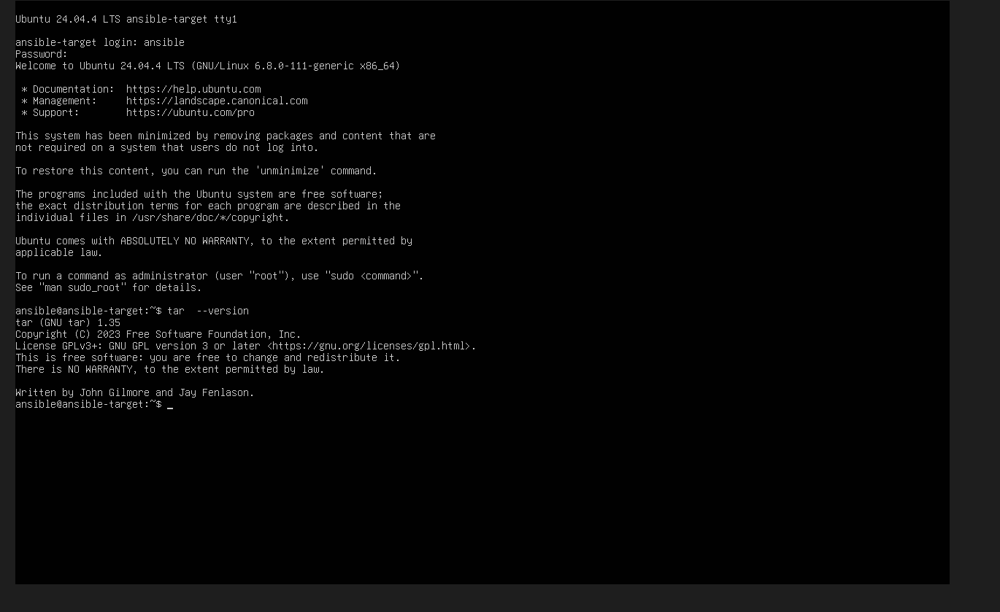
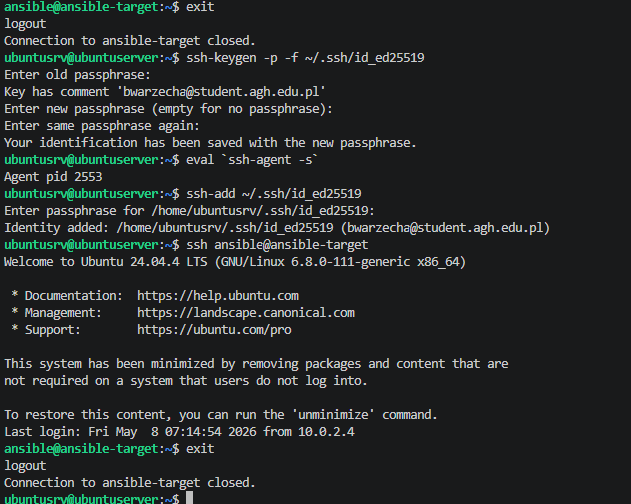
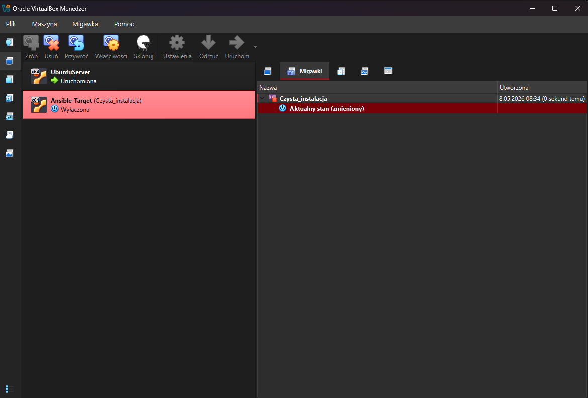
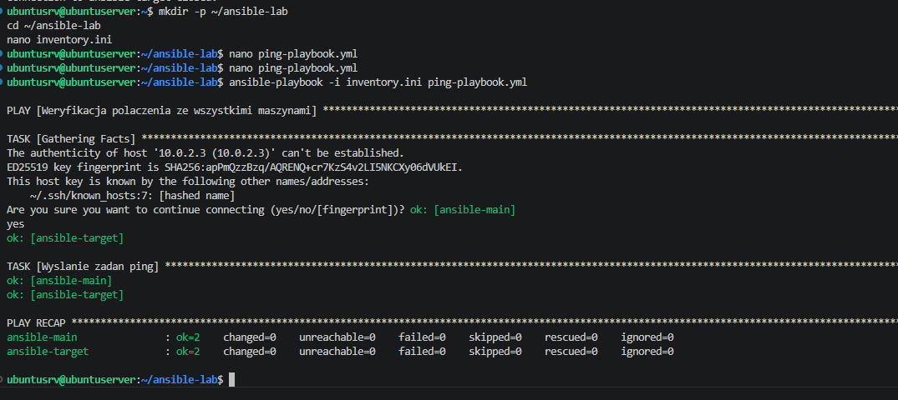
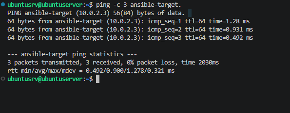

# Sprawozdanie z zajęć 08

## Automatyzacja i zdalne wykonywanie poleceń za pomocą Ansible

### 1.Instalacja zarządcy Ansible
* Utworzyłem osobną maszyne na tym samym systemie co główna i wybrałem wersje minimalistyczną

* Stworzyłem użytkowanika ansible, podczas instalacji, potem zaznaczyłęm by doinstalowawło OpenSSH server

* po instalacji upweniłem się że tar jest zainstalwoany na systemie.

* Następnie na głównej maszynie zainstalowałem Ansible server, nadałem głównej maszynie nazwe ansible-main po czym wymieniłem je kluczami by logowanie nie wymagało hasła. Do tego dodałem klucz prywatny do działającego agenta.

* W virtual boxie zrobiłem migawke urządzenai po tej konfiguracji

* Zgodnie z wymaganiami przeprowadziłem inwentaryzację systemów oraz skonfigurowałem rozwiązywanie nazw (/etc/hosts), utworzyłem plik inventory.ini z podziałem na role i pomyślnie zweryfikowałem bezhasłową łączność, uruchamiając playbook testowy z modułem ping na wszystkich węzłach.

* Na końcu przeprowadziłem udane pingowanie maszyn

