1. Instalacja klastra Kubernetes

    * instalacja minikube

    * zaopatrzenie się w polecenie kubectl

    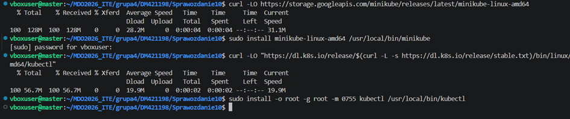

2. Zbudowanie klastra Kubernetes z wykorzystaniem dockera

    ```{groovy}
    minikube statr --driver=docker
    ```

    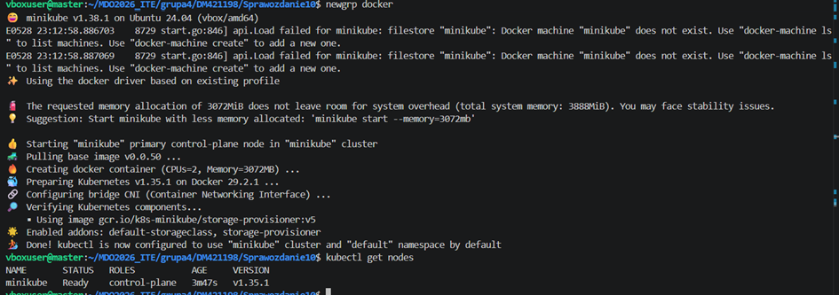
 

3. Weryfikacja działania workera 

    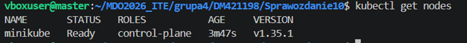

4. Uruchomienie Dashboardu

    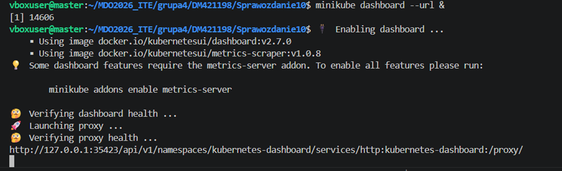

5. Wdrożenie pierwszej aplikacji (moj-nginx)

    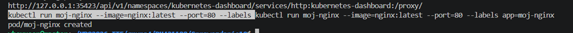

    * sprawdzenie stanu aplikacji, czy kontener faktycznie pracuje

        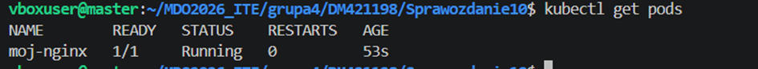
 
6. Przekierowanie portu (8888 -> 80)

    * udowowdnienie komunikacji 

    ```{groovy}
    curl http:/localhost:8888
    ```

    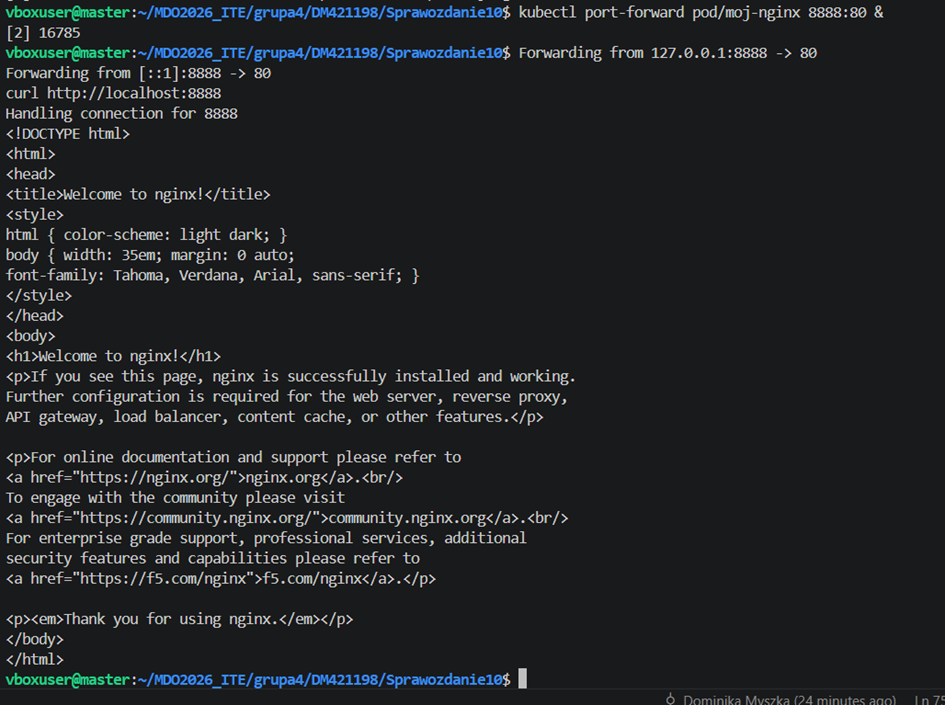

 
7. Utworzenie pliku wdrożenia (yml)
 
    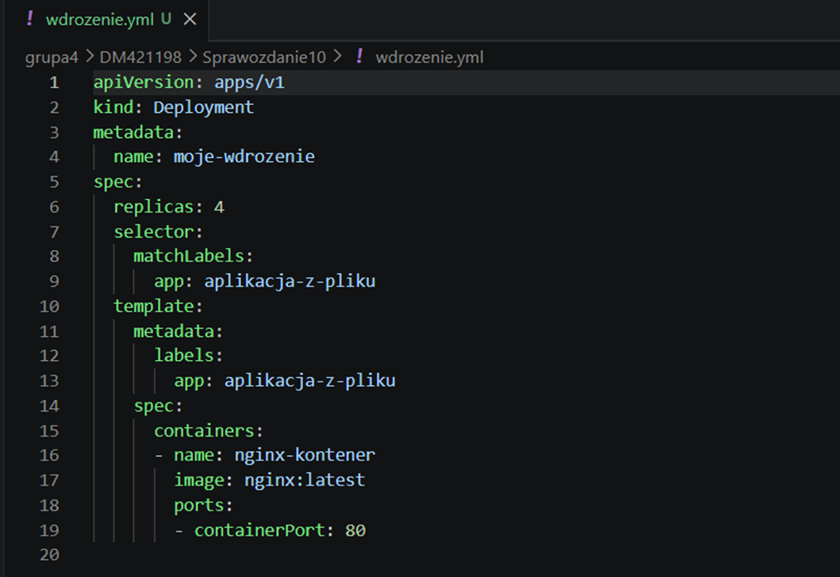

    * Uruchomienie wdrożenia

        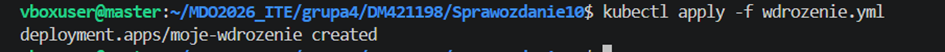
 
    * Sprawdzenie statusu za pomocą 
        ```{groovy} 
        kubel rollout status deployment moje-wdrozenie
        ```

        dla upewniena sie czy napewno są 4 działające aplikacje na raz (+ moja pierwsza aplikacja moj-nginx)
        ```{groovy}
        kubectl get pods
        ```
        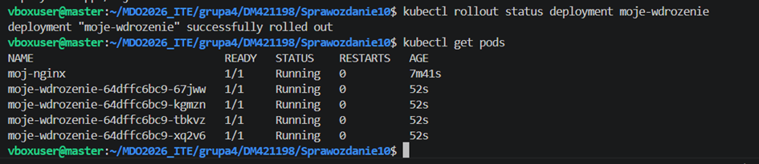
 

8. Wyeksponowanie wdrożenia na serwis

    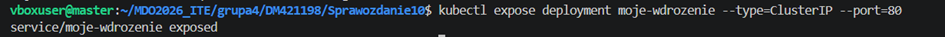
 
9. Przekierowanie portu (do serwisu 9999 -> 80)

    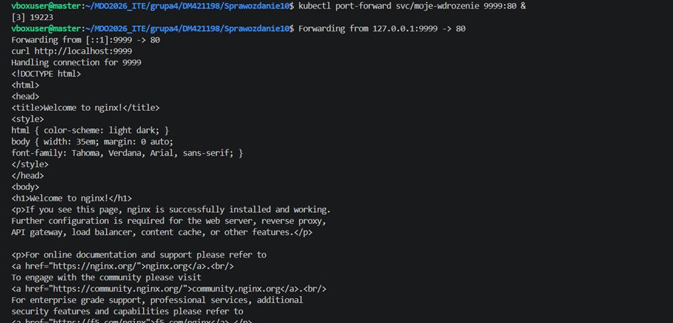

10. Ostateczny wygląd Kubernates Dashboard

    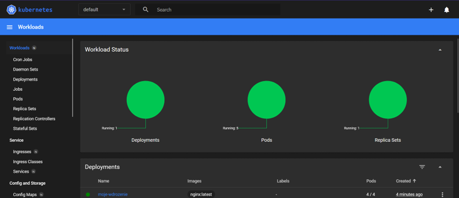
    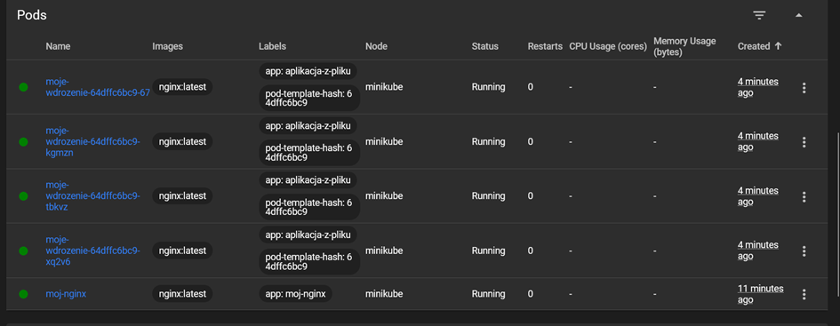
 
    Wszystko działa poprawnie

 
