1.	Powiązanie terminala z Dockerem wewnątrz Minikube:
```bash
eval $(minikube docker-env)
```
2.	Zbudowanie Wersji 1 (v1);
 
 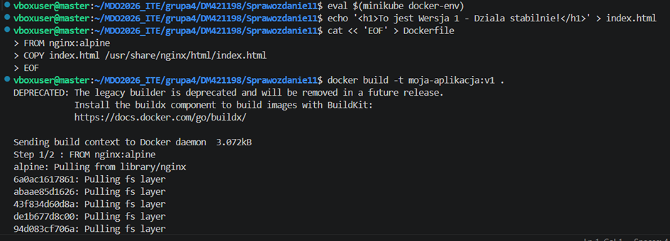
 
3.	Zbudowanie Wersji 2 (v2):
 
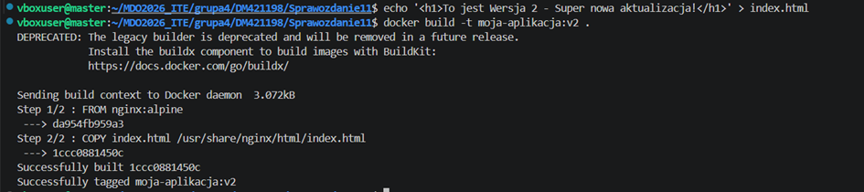

4.	Zbudowanie Wersji 3 (v3-broken - celowo uszkodzona):
 
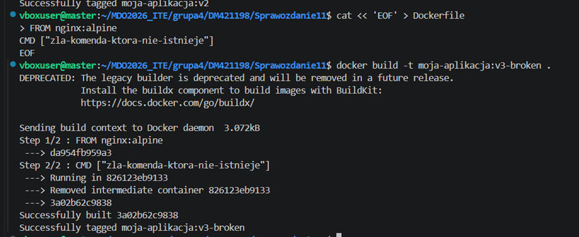

5.	Weryfikacja (wyświetli tabelkę z obrazami)
 
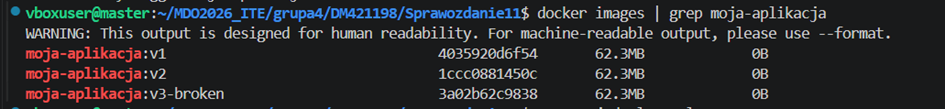

6.	Utworzenie pliku YAML dla nowej aplikacji
 
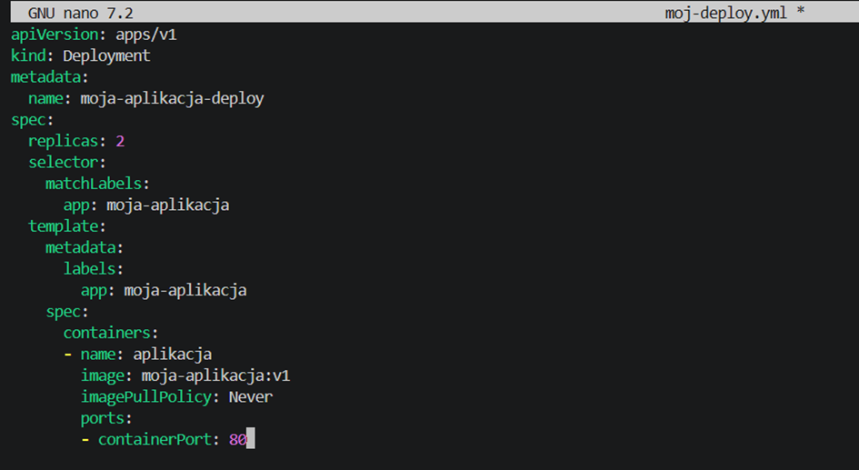

7.	Uruchomienie wdrożenia
 
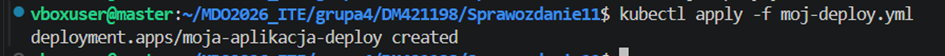

8.	Aktualizacje pliku YAML
    •   Zwiększenie replik do 8:

    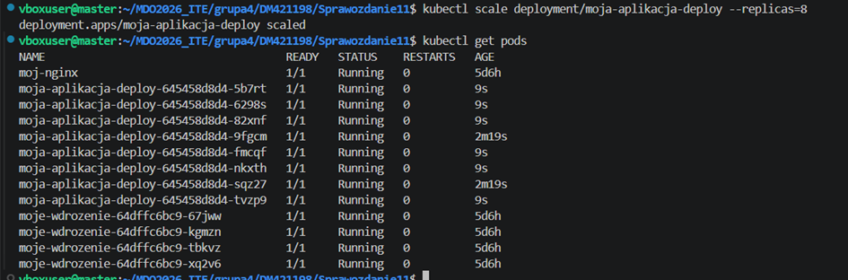

    •	Zmniejszenie liczby replik do 1:  

    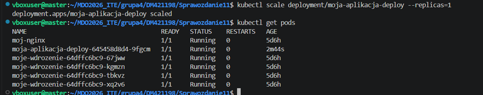

    •	Zmniejszenie liczby replik do 0 :  

    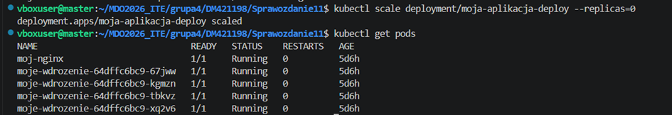

    •	Ponowne przeskalowanie w górę do 4 replik (stan docelowy): 

    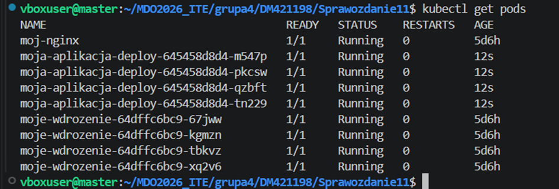

    •	Zastosowanie nowej wersji obrazu (v2) 

    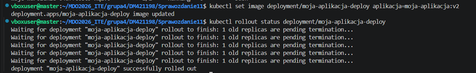

    •	Zastosowanie starszej wersji obrazu (v1)  

    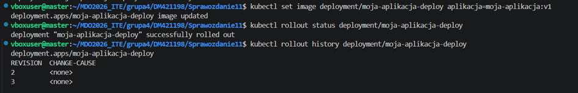
    
    •	Wdrożenie "wadliwego" obrazu (v3-broken) 

    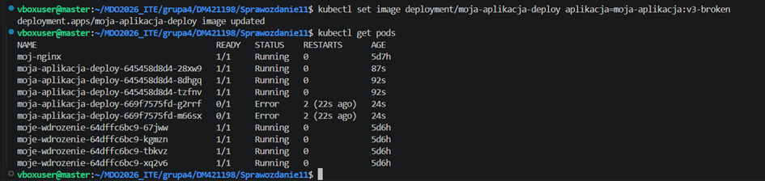

9.	Analiza historii wdrożeń

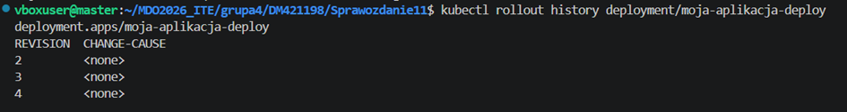

10.	Wycofanie zepsutej wersji i powrót do działającej (v2)  

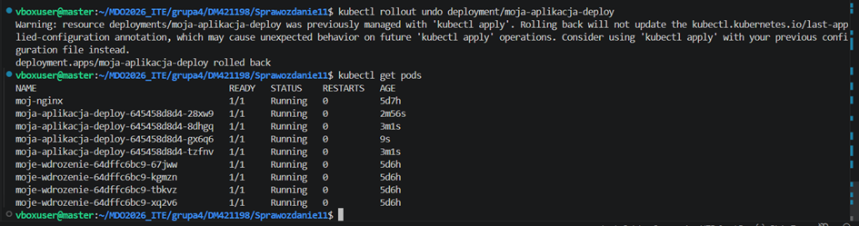

11.	Utworzenie skryptu weryfikującego 

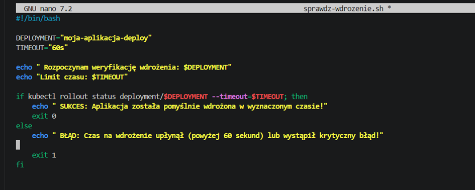

12.	Nadanie uprawnień i test skryptu 

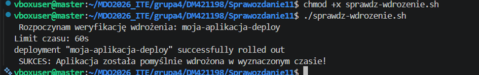

13.	Utworzenie uniwersalnego Serwisu kierującego ruchem 

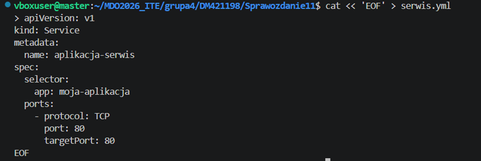

14.	Wersje wdrożeń
    
    •	STRATEGIA 1: Recreate 

    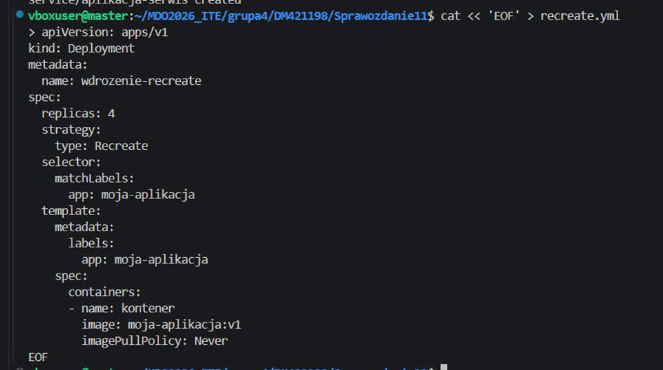

    Obserwacje

    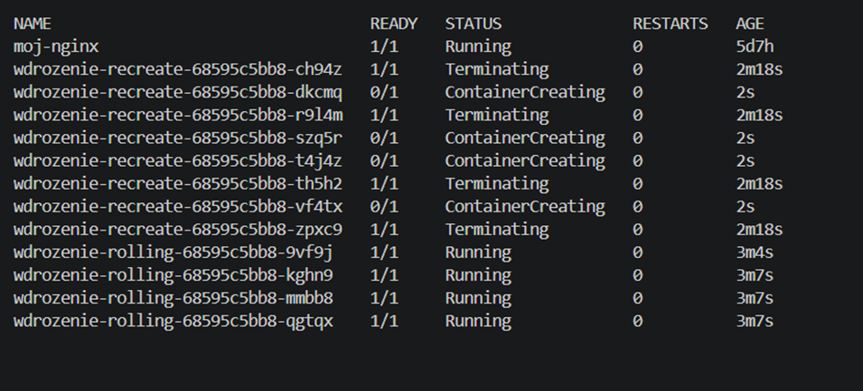

    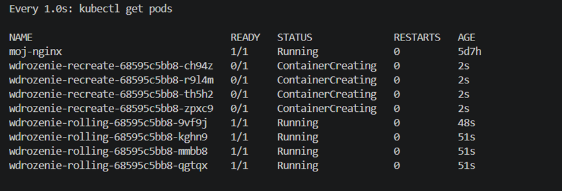

    Wszystkie 4 stare kontenery w ułamku sekundy wejdą w stan Terminating (Zabijanie). Zanim nowe zaczną się tworzyć (ContainerCreating), przez moment nie będziesz miała ani jednego działającego kontenera.
    
    •	STRATEGIA 2: Rolling Update 

    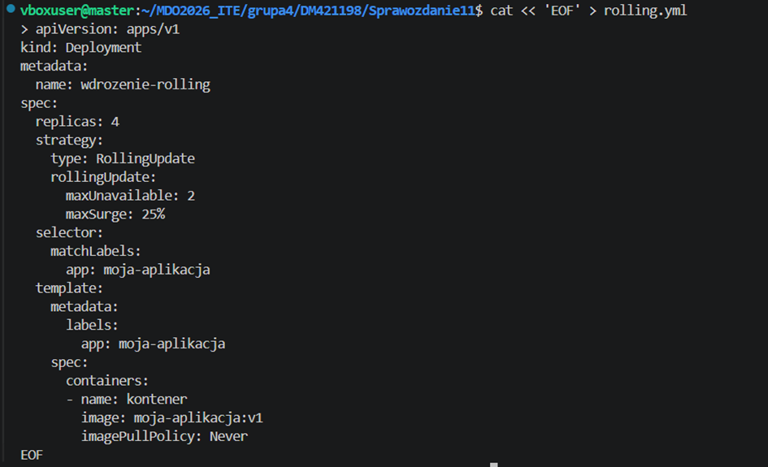

    obserwacje 

    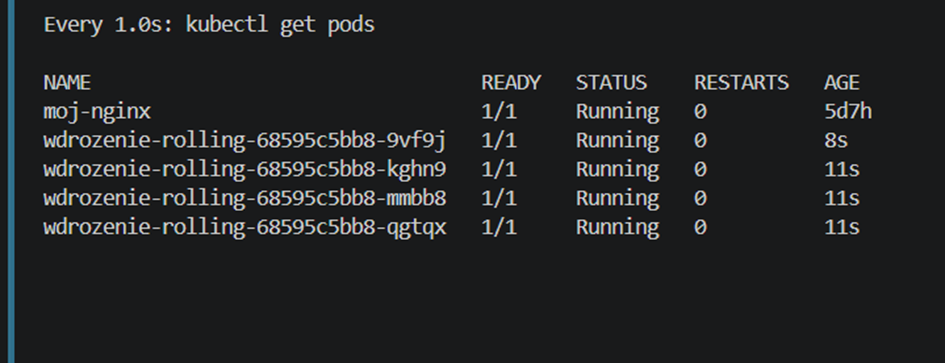

    Kubernetes najpierw stworzy nowe kontenery, a stare będzie wyłączał powoli, sztuka po sztuce. Zawsze będziesz miała co najmniej kilka podów w stanie Running. Aplikacja ani przez sekundę nie przestanie działać z punktu widzenia klienta.
    
    •	STRATEGIA 3: Canary Deployment 

    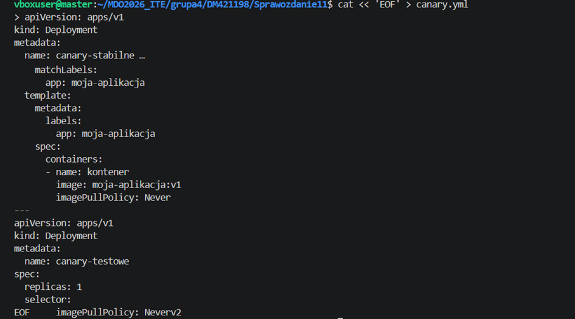

    Obserwacje
 
    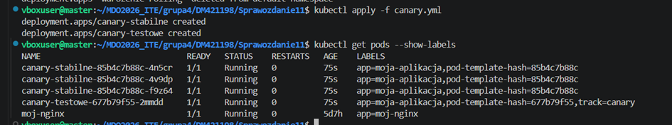

