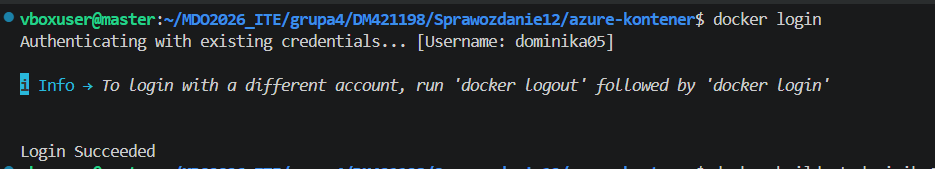
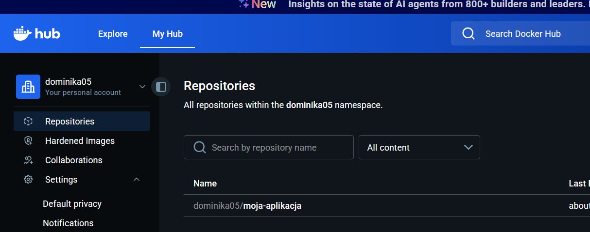
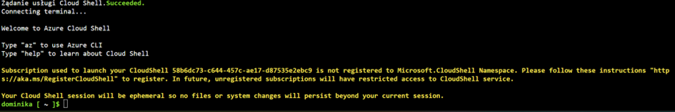
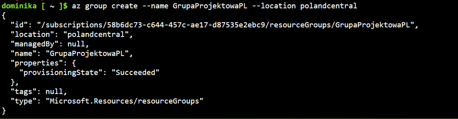
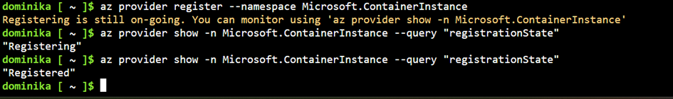
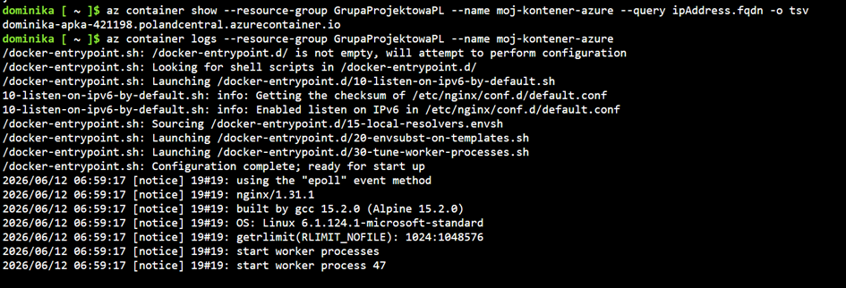
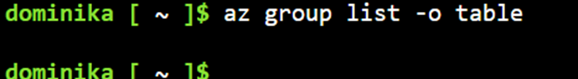

1. Wypchnięcie obrazu na Docker Hub

* logowanie się do konta na Docker Hub przez terminal w maszynie wirtualnej:

```bash
docker login
```



* Wypchnij obraz do chmury Docker Hub:

```bash
docker tag moja-aplikacja:v2 dominika05/moja-aplikacja:v2
docker push dominika05/moja-aplikacja:v2
```



2. Środowisko Azure i Cloud Shell

* zalogowanie do Azure

* uruchomienie Azure Cloud Shell



3. Wdrożenie kontenera w Azure

* utworzenie Grupy Zasobów

```bash
az container create \ 
--resource-group GrupaProjektowaPL \ 
--name moj-kontener-azure \  
--image dominika05/moja-aplikacja:v2 \
--dns-name-label dominika-apka-421198 \
--ports 80 \
--os-type linux \
--cpu 1 \
--memory 1.5 
```



* rejestracja usługi aby było możliwe wdrożenie kontenera



* wdrożenie kontenera

```bash
az container create 
--resource-group GrupaProjektowaPL 
--name moj-kontener-azure 
--image dominika05/moja-aplikacja:v2 
--dns-name-label dominika-apka-421198 
--ports 80 
--os-type linux 
--cpu 1 
--memory 1.5
```

4. Weryfikacja działania

* pobranie adresu dostępu i pobranie logów z kontenera



* test czy adres `http://dominika-apka-421198.polandcentral.azurecontainer.io/` działa w przeglądarce


5. Sprzątanie i usówanie zasobów

```bash
az group delete --name GrupaProjektowaPL --yes --no-wait
```

