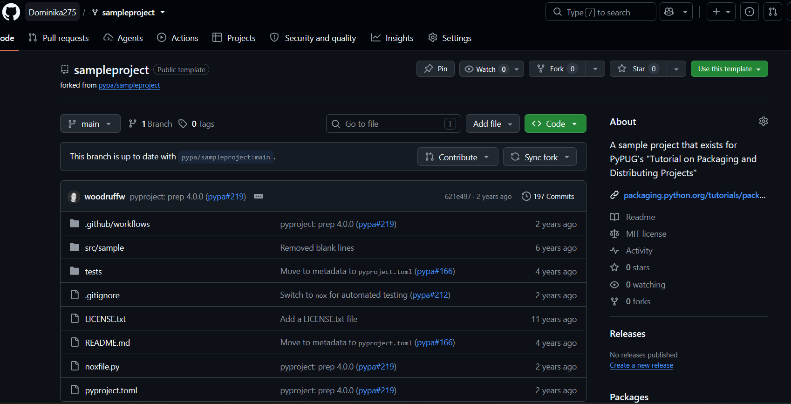
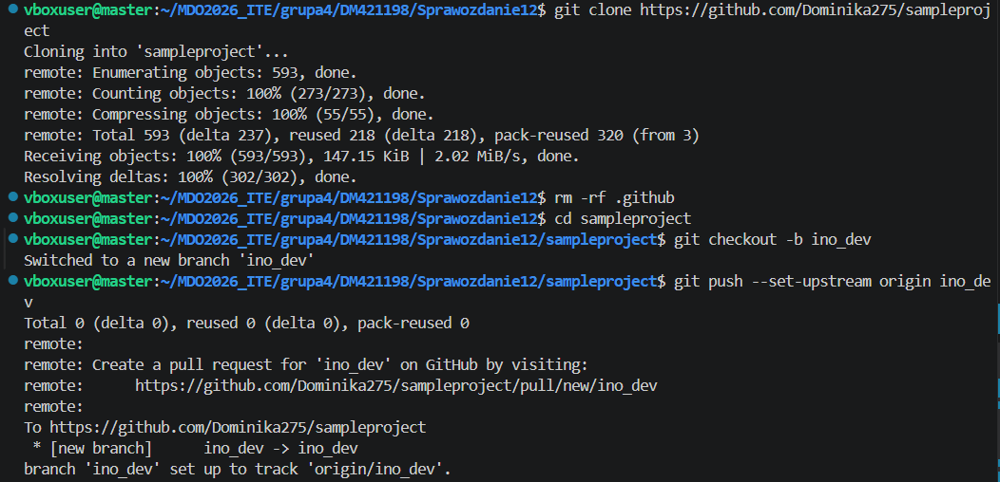
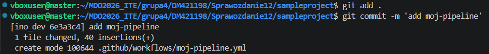
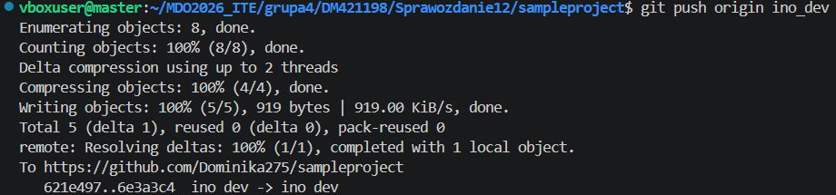
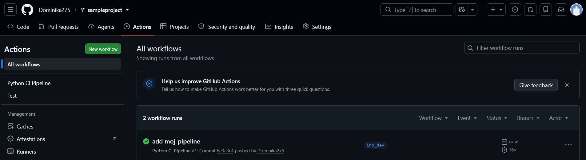
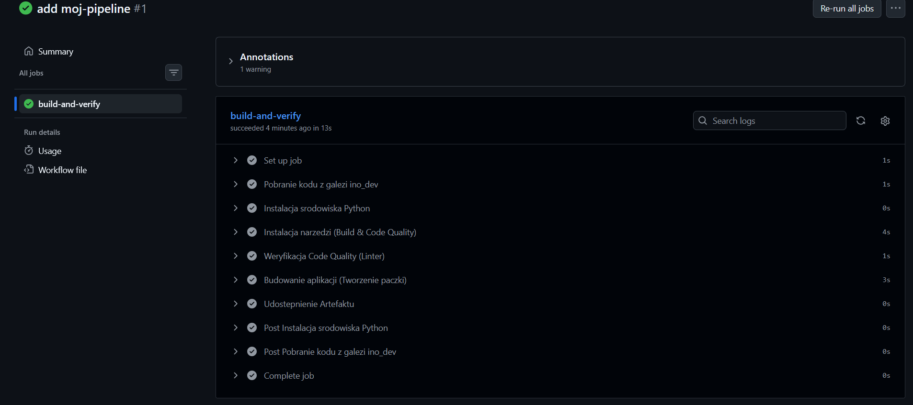
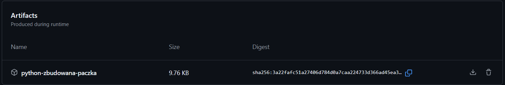

## Sforkowanie wybranego repozytorium



## Sklonowanie istniejącego forka i utworzenie gałęźi `ino_dev`



## Stworzenie pliku konfiguracyjnego `.github/workflows/moj-pipeline.yml` z triggerem

* TRIGGER: Zgodnie z poleceniem, akcja odpala się TYLKO na gałęzi ino_dev

```groovy
on:
  push:
    branches:
      - ino_dev

```

* Pobranie kodu z repozytorium

```groovy
    - name: Pobranie kodu z galezi ino_dev
    uses: actions/checkout@v4

```

* Przygotowanie interpretera Pythona

```groovy
        - name: Instalacja srodowiska Python
            uses: actions/setup-python@v5
         with:
            python-version: '3.10'
```

* Instalacja narzędzi do budowania i sprawdzania jakości

```groovy
          - name: Instalacja narzedzi (Build & Code Quality)
          run: |
             python -m pip install --upgrade pip
            pip install build flake8

```

* Sprawdzenie jakości kodu

```groovy
          - name: Weryfikacja Code Quality (Linter)
            run: |
             echo "Sprawdzam kod pod katem bledow krytycznych"
             flake8 . --count --select=E9,F63,F7,F82 --show-source --statistics

```

* Budowa aplikacji

```groovy
          - name: Budowanie aplikacji (Tworzenie paczki)
            run: |
              echo "Buduje oficjalna paczke instalacyjna Pythona..."
              python -m build
```

* Zapisanie artefaktu

```groovy
          - name: Udostepnienie Artefaktu
            uses: actions/upload-artifact@v4
            with:
              name: python-zbudowana-paczka
              path: dist/
```

## Weryfikacja działania workflow

* dodanie zmian w zdalnym repozytorium





Po push w zakładce `Actions` został uruchomiaiony workflow.





* Aretfakt poprawnie się utworzył



## Wnioski

Laboratorium udowodniło, że narzędzie GitHub Actions skutecznie i bezobsługowo automatyzuje proces testowania oraz budowania aplikacji. Dzięki precyzyjnej konfiguracji zyskaliśmy w pełni darmowy potok CI/CD, który samodzielnie generuje gotowe do wdrożenia artefakty.