Instalowanie dockera 
  
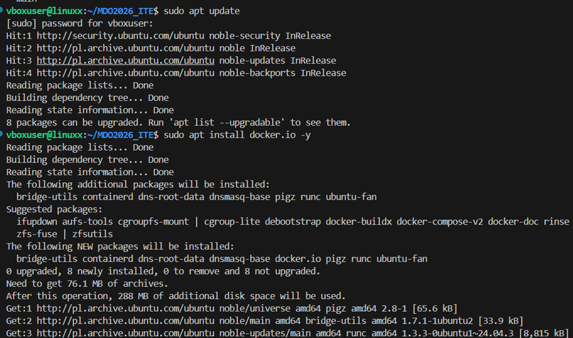

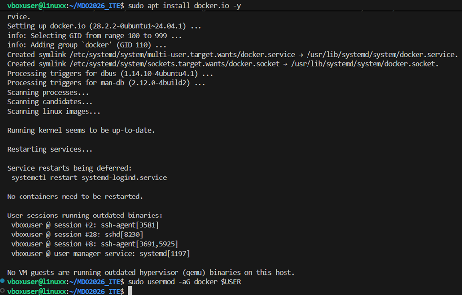

Pobieranie obrazów

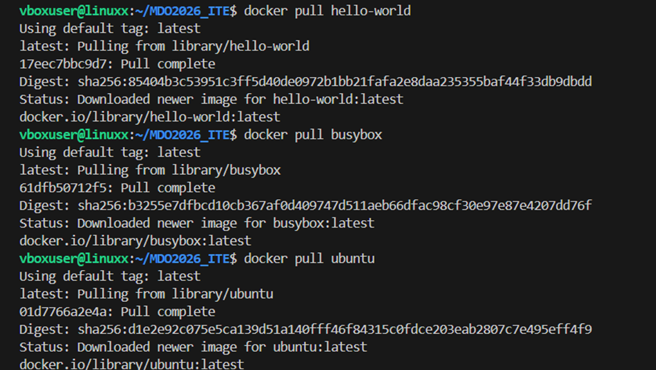  

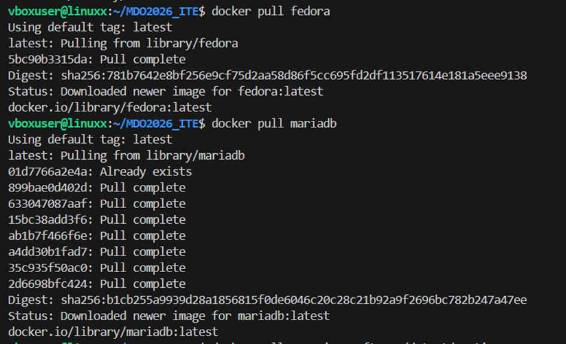

Sprawdzenie rozmiaru obrazów
 
 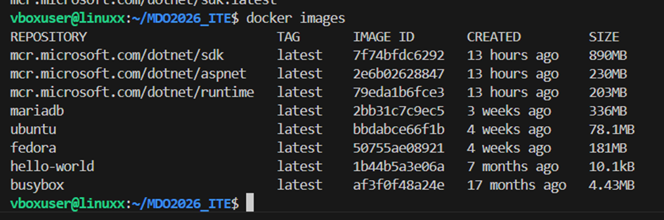

Uruchomienie 3 obrazow:
 
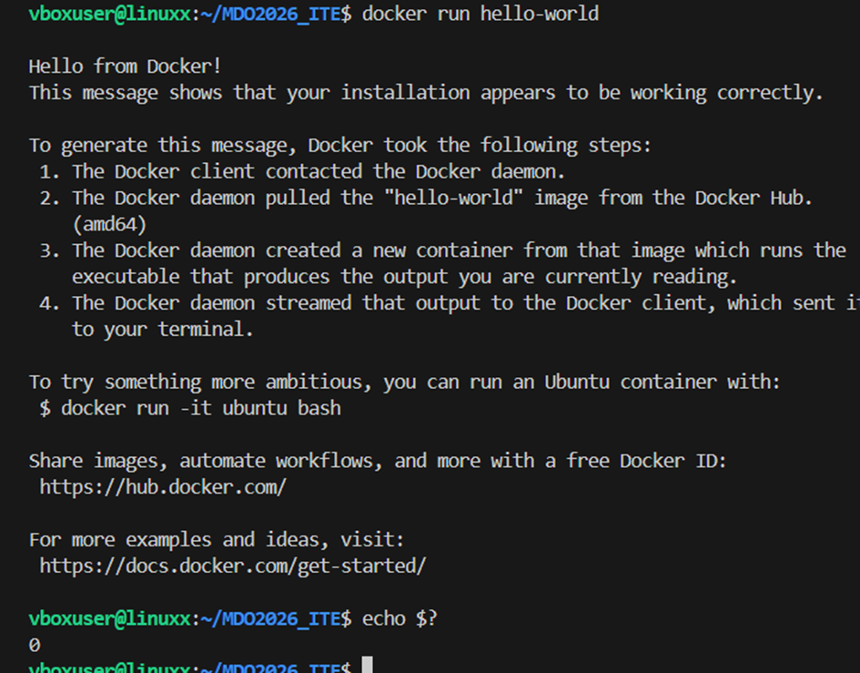
 
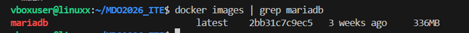

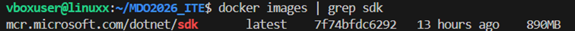
 
Uruchomienie busybox:

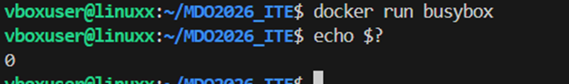 
 
interaktywnie

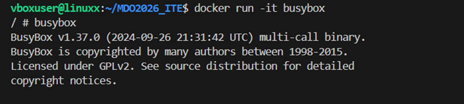
 
Uruchominie ubuntu i zaktualizowanie pakietów

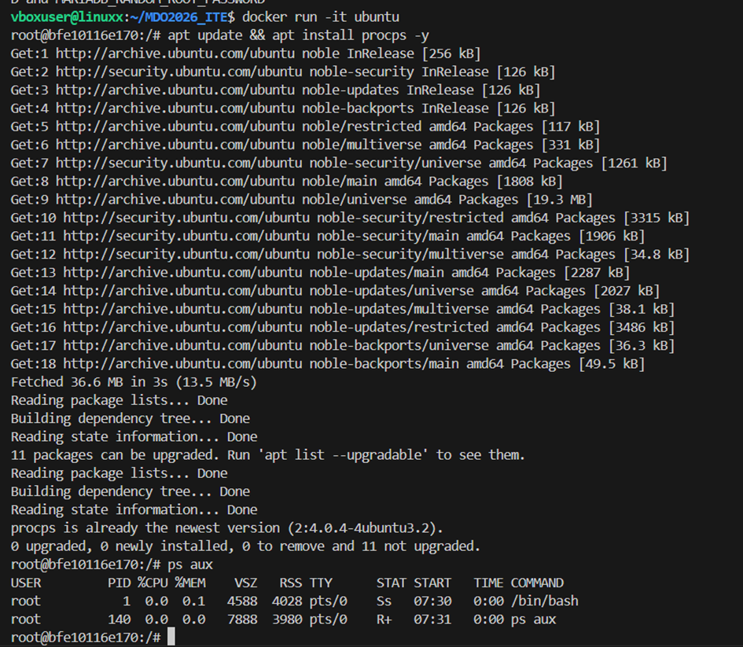 

Sprawdzenie dockerow na hoście:

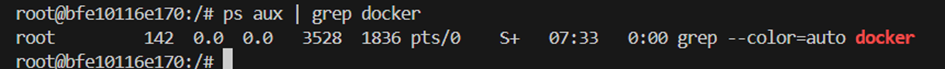 

Tresc utworzonego dockera
 
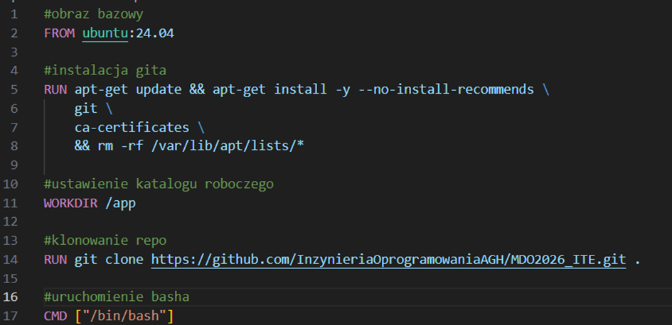 

Zbudowanie własnego obrazu:
 
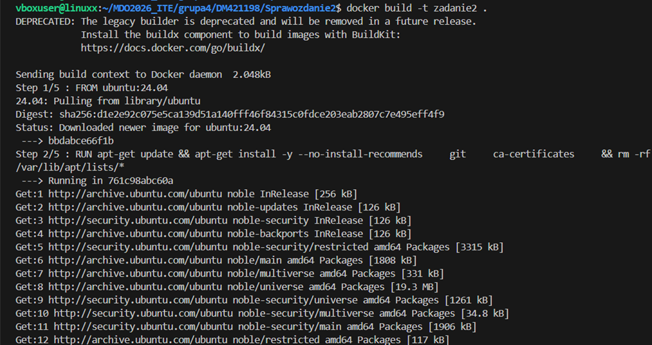
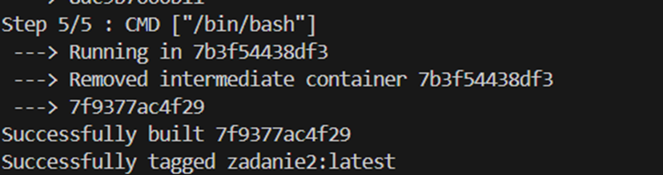

Uruchomienei mojego kontenera
 
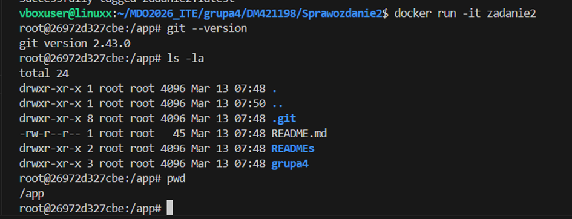

wyświetlenie wszystkich kontenerów:

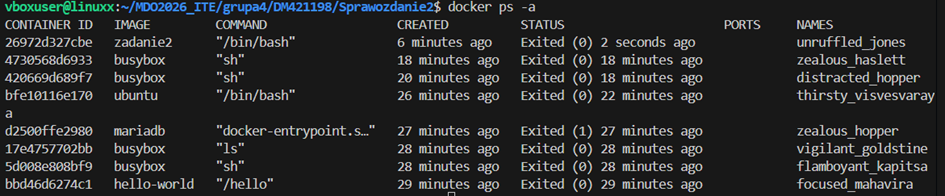
 
Usunięcie zakończonych kontenerów

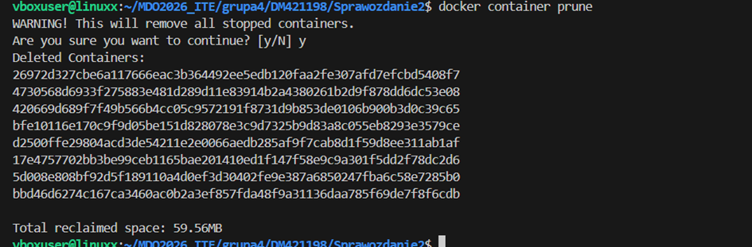 

Usuniecie wszytkich obrazów nie używanych przez kontenery

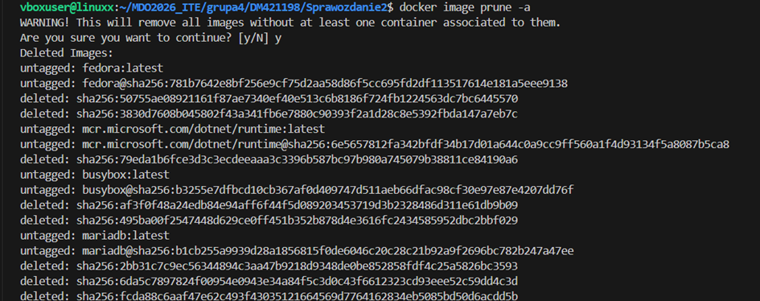