1.	Znalezienie Repozytorium
 
 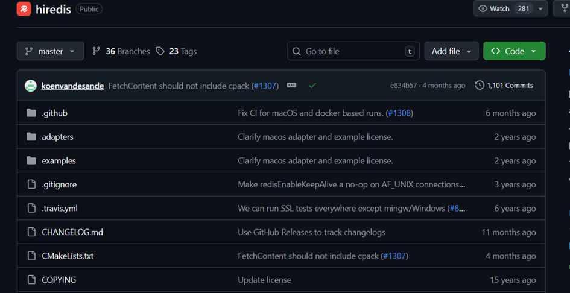

2.	Build programu
 
 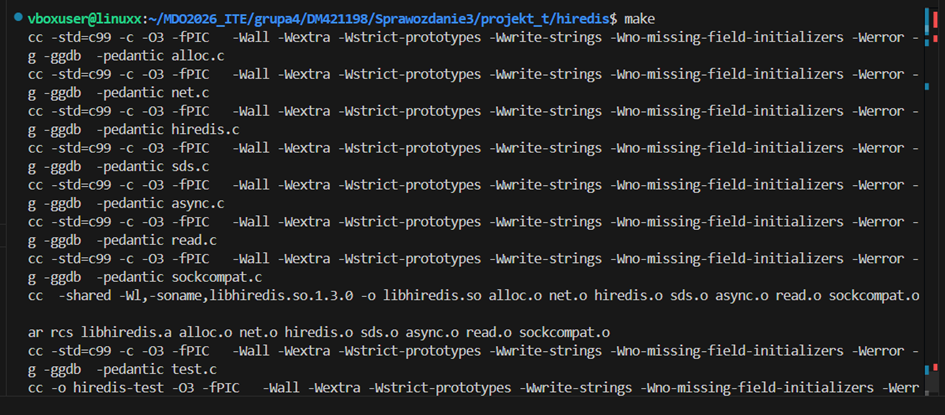

3.	Testy jednostkowe w repozytorium
  
  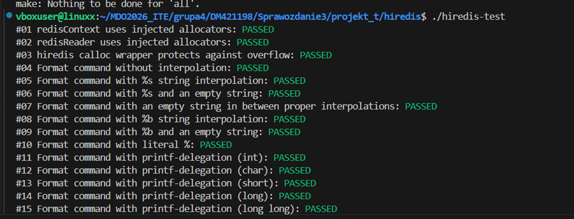

  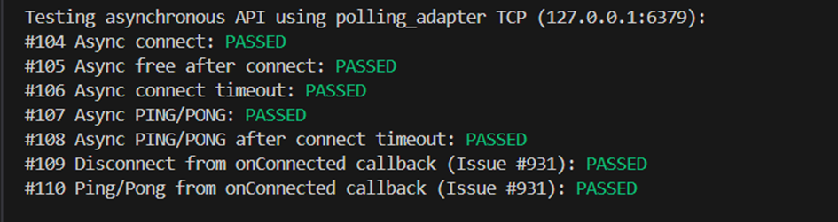

  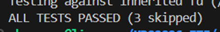
 
4.	Wejście do kontenera
 
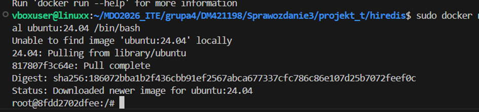

5.	Sklonowanie repozutorium wewnątrz kontenera
 
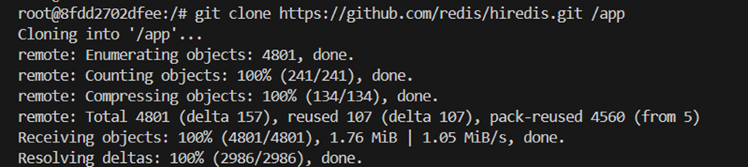

6.	Build i test w kontenerze
 
 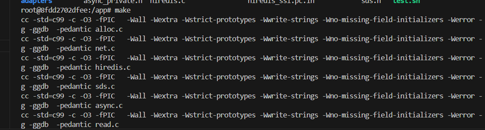
 
 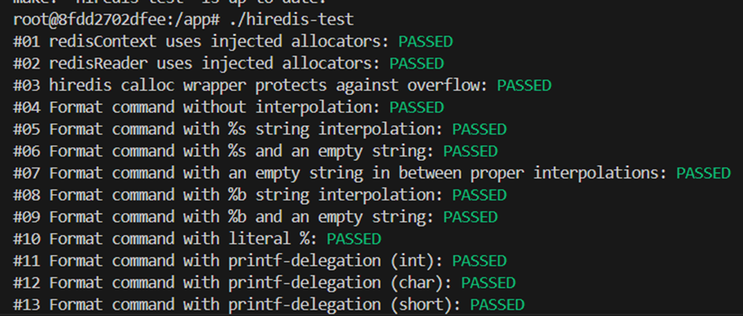
 
 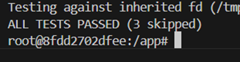

7.	Zawartośc pliku Dockerfile.build
 
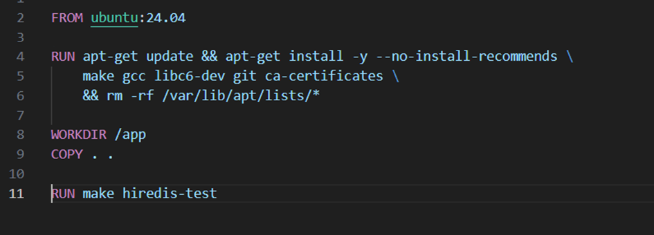

8.	Zawartość pliku Dockerfile.test
   
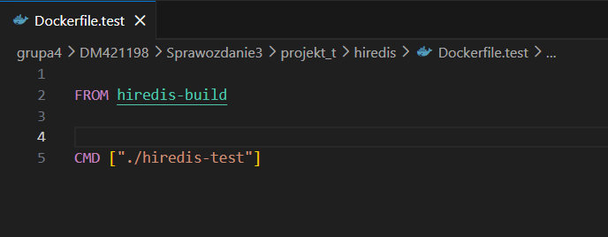
   
10.	Zbudownaie pierwszego obrazu
    
 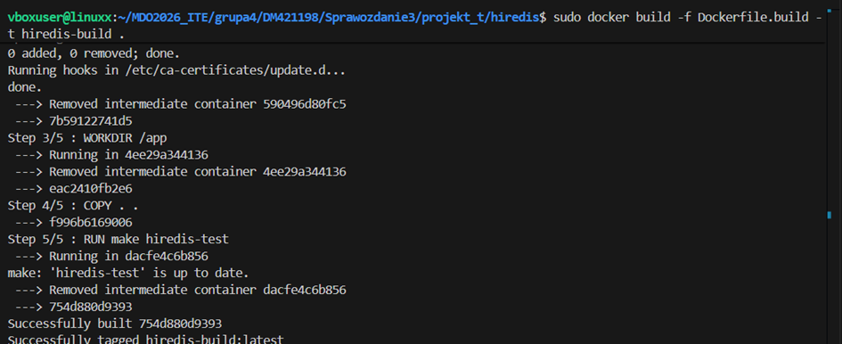

Zbudowanie drugiego obrazu

 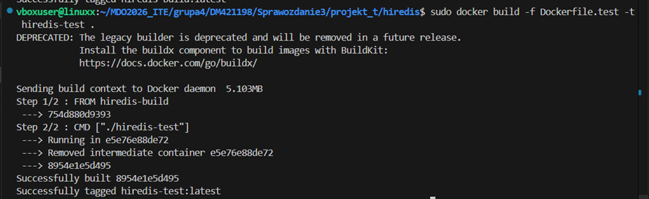
 
Wdrożenie kończy się sukcesem

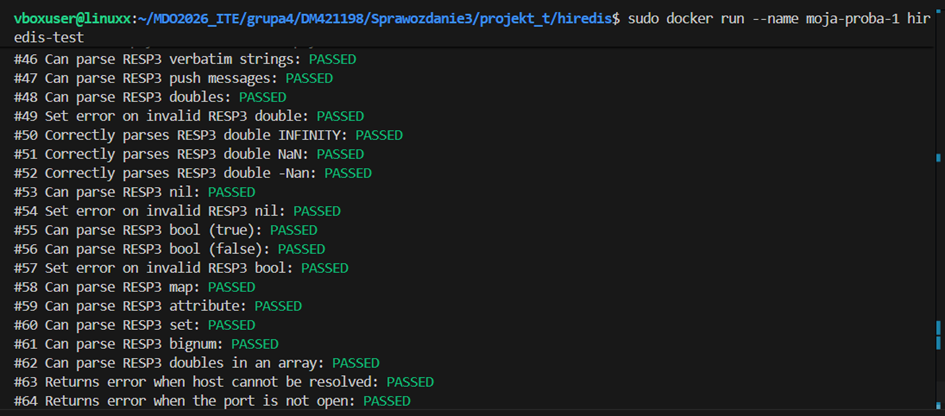
