1. Stworzenie woluminów
    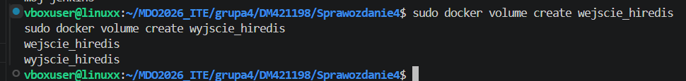

2. Podpięcie woluminów do obrazu ubuntu:24.04

    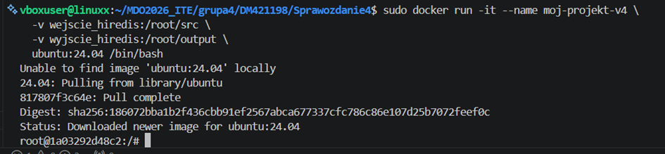

    Sprawdzenie czy połączenie było poprawne:
    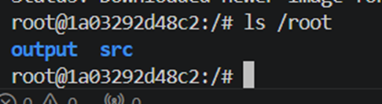

3. Pobranie odpowiednich rzeczy bez Gita
    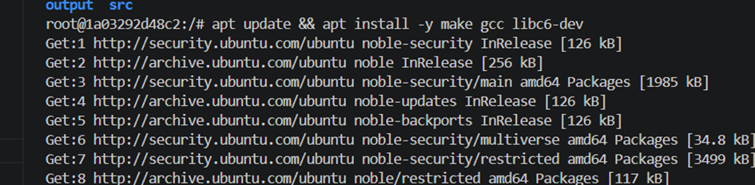

4. sklonowanie użytego na poprzednich zajęciach repozytorium za pomocą wolumina wejściowego
    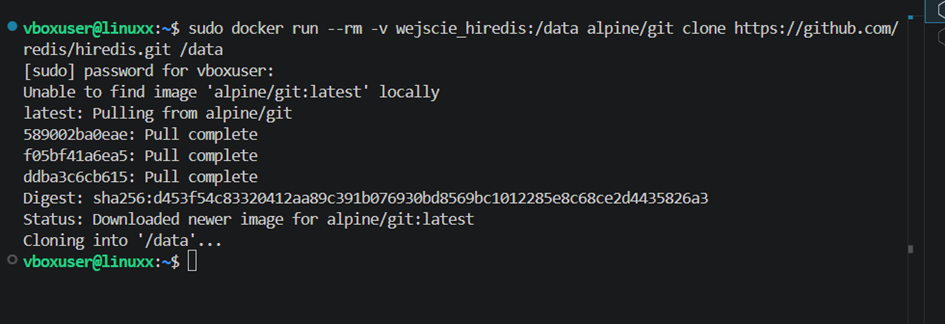

    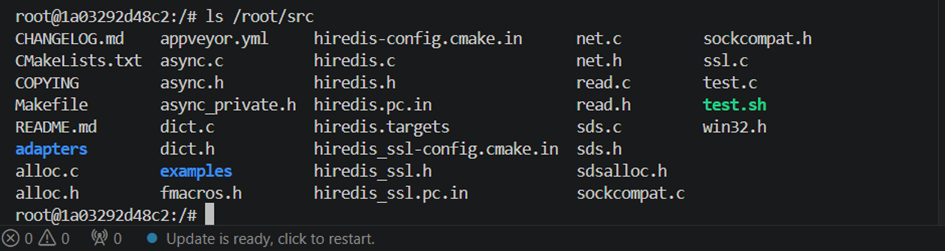

5. Uruchominie build w kontenerze
    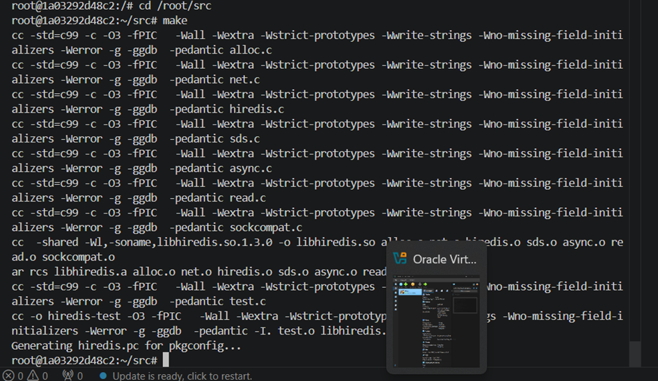

6. Zapisanie powstalych plików w woluminie wyjściowym
    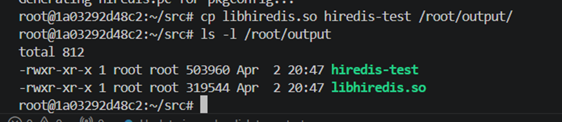

7. Sprawdzneie dostępu do plików po usunięciu kontenera
    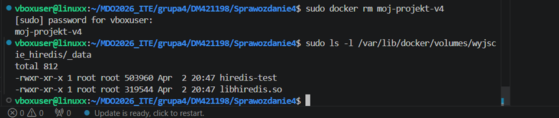

8. Ponowienie wszystkich operacji, ale klonowanie na woluminie wejściowym odbywa się za pomocą gita
    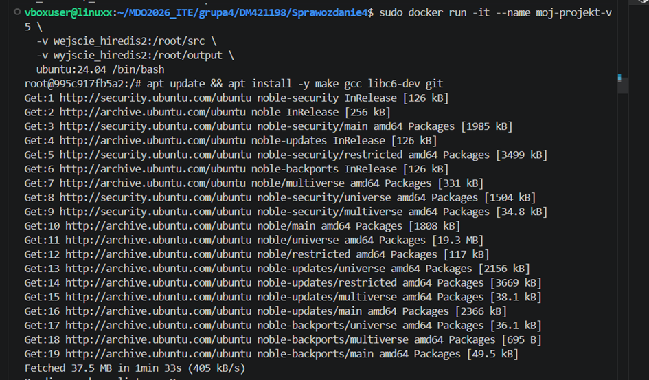

    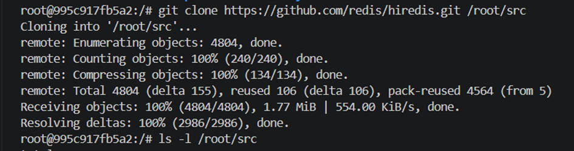

    Zbudowanie w kontenerze
    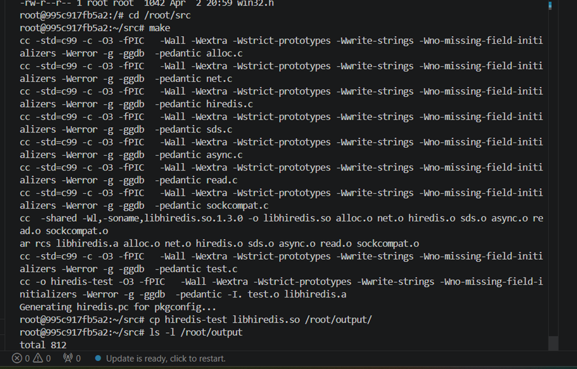

    Zalety klonowania w kontenerze: w jednym oknie terminala, jest większa kontrola
    wady: obraz z Gitem jest cięższy, przez dostęp do internetu ( ze względu na Gita) jest bardziej podatny na ataki.

9. Dyskusja:
    Zamiast tworzyć woluminy komendą docker volume create i montować je flagą -v, w Dockerfile możemy użyć BuildKit. Pozwala on na tymczasowe podpięcie zasobów (kodu źródłowego) tylko na czas budowania obrazu.
    Zalety RUN --mount:
    minimalny obraz, bezpieczniejsze( ponieważnie trzeba kopiowaćkluczy SSH)

--------------------------------------------
Eksponowanie portu i łączność między kontenerami

Do tworzenia wszystkich kontenerów używany będzie lekki obraz Docker zawierający narzędzie iPerf3 networkstatic/iperf3 
1. Uruchomienie pierwszego kontenera
    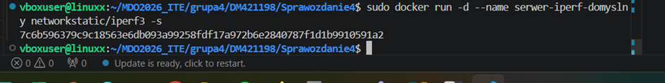

    Uruchomienie drugiego kontenera wraz z wskazaniem mu adresu IP
    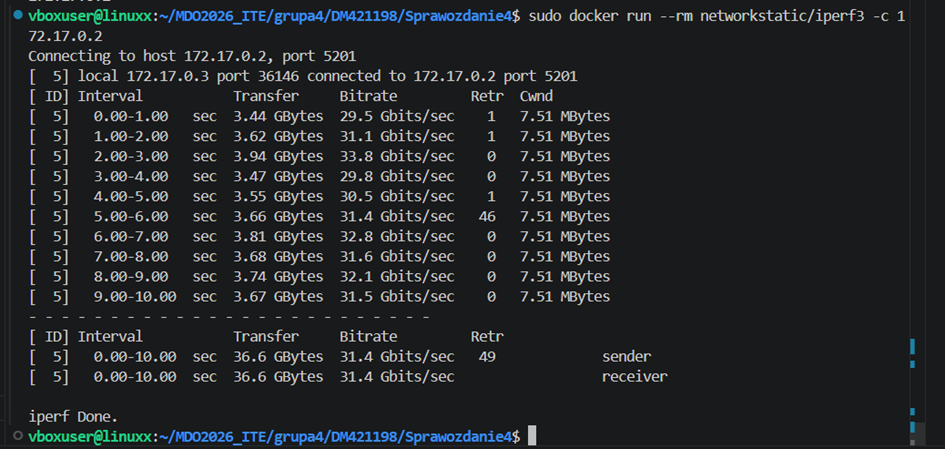

2. Stworzenie własnej sieci
    [alt text](img/image-14.png)

3. Uruchomineie pierwszego kontenera na własnej sieci
    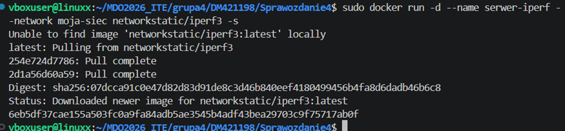

    -d kontener działa w tle
    -s uruchomienie iperf w trybie serwera

4. Uruchmineie drugiego kontenera
    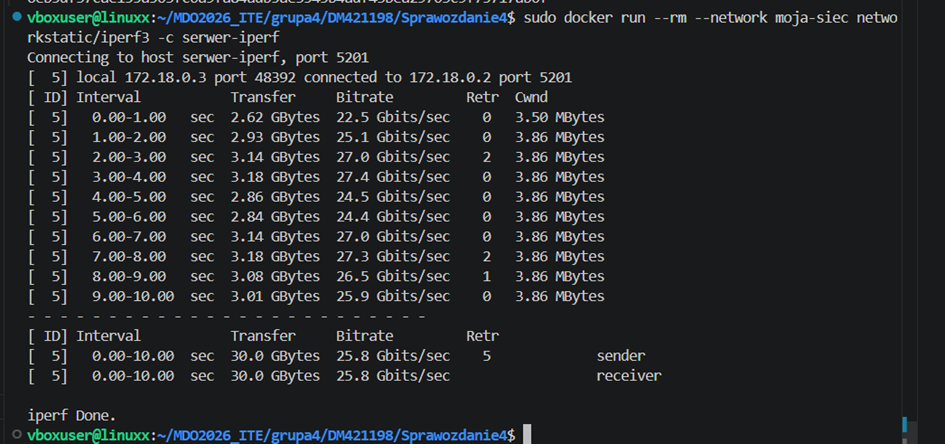

    -c serwer-iperf: Łączymy się po nazwie kontenera. Docker sam zamieni tę nazwę na właściwy adres IP dzięki stworzonej wcześniej sieci.

5. Połączenie spoza kontenera

    Z Hosta:
    Przygotowanie serwera usunięcie starego serwera jeśli działa i uruchomienie nowego z mapowaniem portu -p
    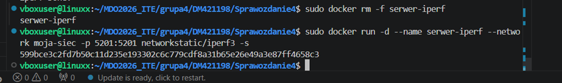

    dodanie portu:
    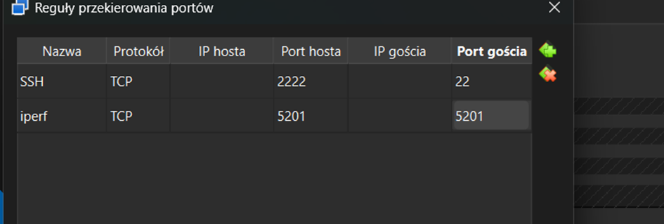

    uruchomienie komendy iperf3 -c localhost
    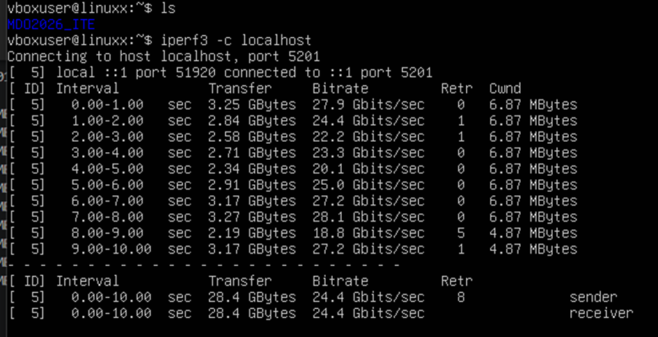
    Charakteryzuje się bardzo wysoką przepustowaością

    Spoza Hosta:
    po pobraniu iperf w terminalu na Windowsie wejście do pliku z pobranym iperfem i uruchomienie instrukcji .\iperf3.exe -c 127.0.01
    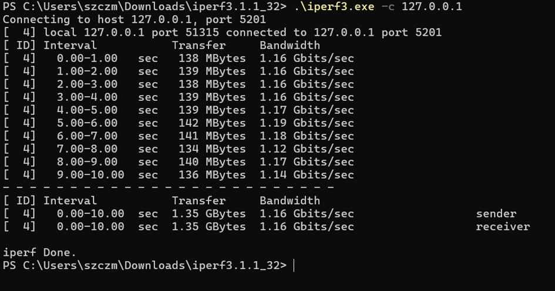

    Wyciągnięcie logów
    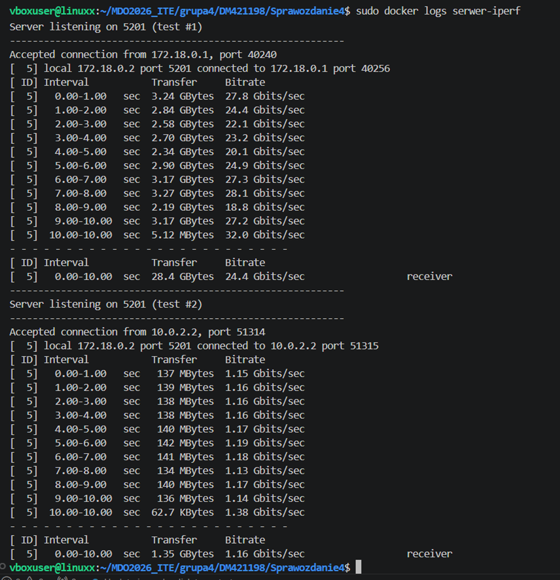
    Analiza Logów 

        Test #1 (z hosta):

            Przepustowość: Średnio 24.4 Gbits/sec.

            Wniosek: To jest komunikacja wewnątrz maszyny wirtualnej. Prędkość jest ogromna, bo dane są przesyłane niemal bezpośrednio przez pamięć RAM.

        Test #2 (spoza hosta):

            Przepustowość: Średnio 1.16 Gbits/sec.

            Wniosek: Nastąpił spadek prędkości o ponad 20-krotność. Dane musiały przejść przez Windowsa,  VirtualBox i stos sieciowy Dockera.

--------------------------------------------

Usługi w rozumieniu systemu, kontenera i klastra

1. Uruchomineie kontenera z Ubuntu i zainstalownaie w nim serwera SSH
    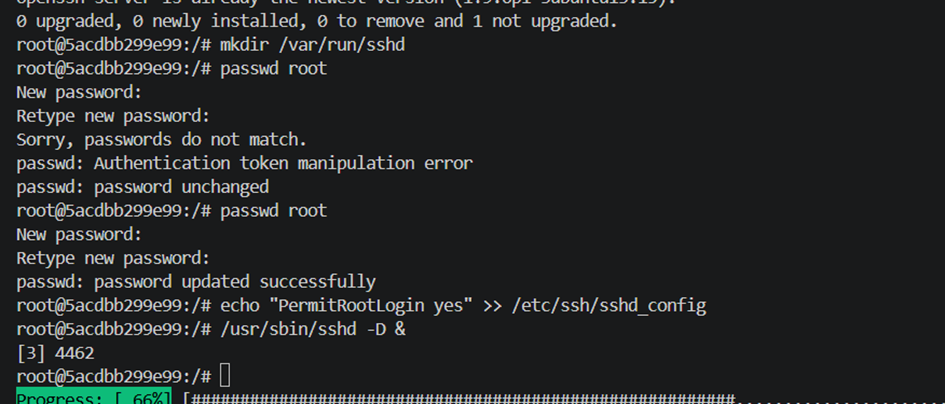

    apt update && apt install -y openssh-server
    mkdir /var/run/sshd
    Ustawienie hasła
    passwd root

    echo "PermitRootLogin yes" >> /etc/ssh/sshd_config
    #uruchomienie usługi
    /usr/sbin/sshd -D &

    Sprawdzenie połączneia:
    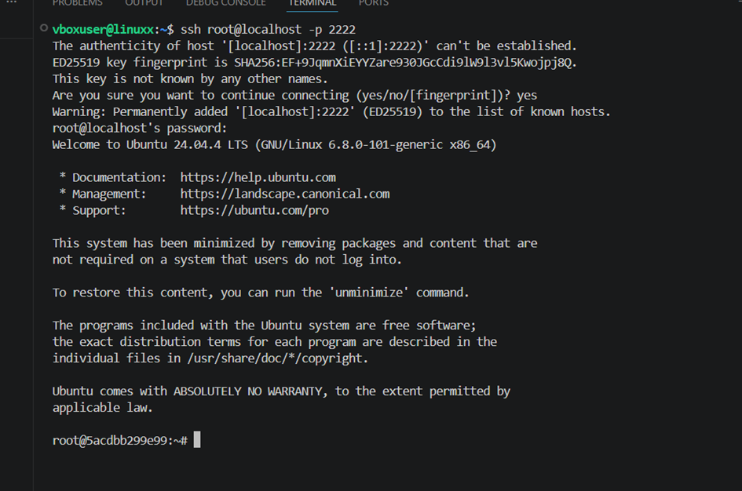

    Zaleta: dzięki SSH jest łatwiejszy transfer plików.
    Wada: mniejsze bezpieczeństwo

--------------------------------------------

Jenkins
1. Utworzenie nowego woluminium
    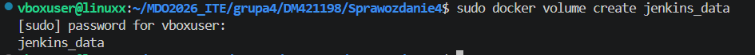

2. Uruchomienie Jenkinsa
    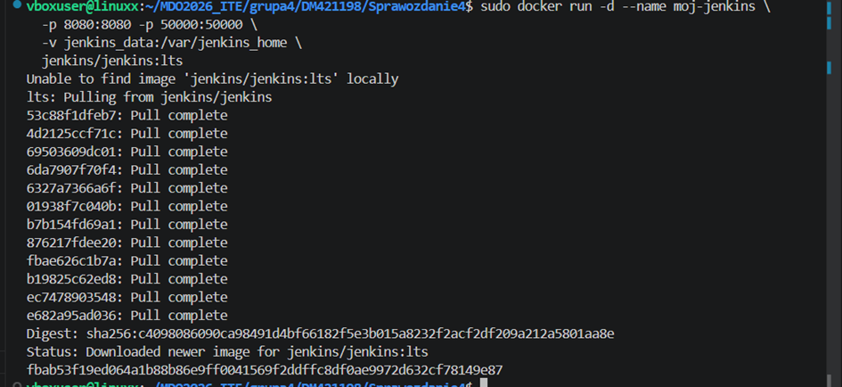

    Przed logowanie była koniecznośc sprawdzenia hasła

    Aby połącznie zadziało trzebbayło dodćkolejny port 
    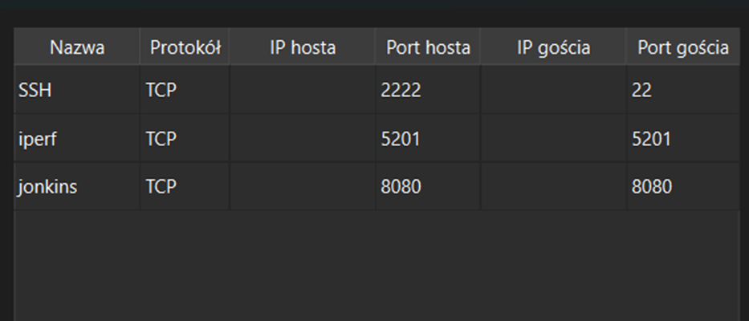

    wejscie do panelu http://localhost:8080
    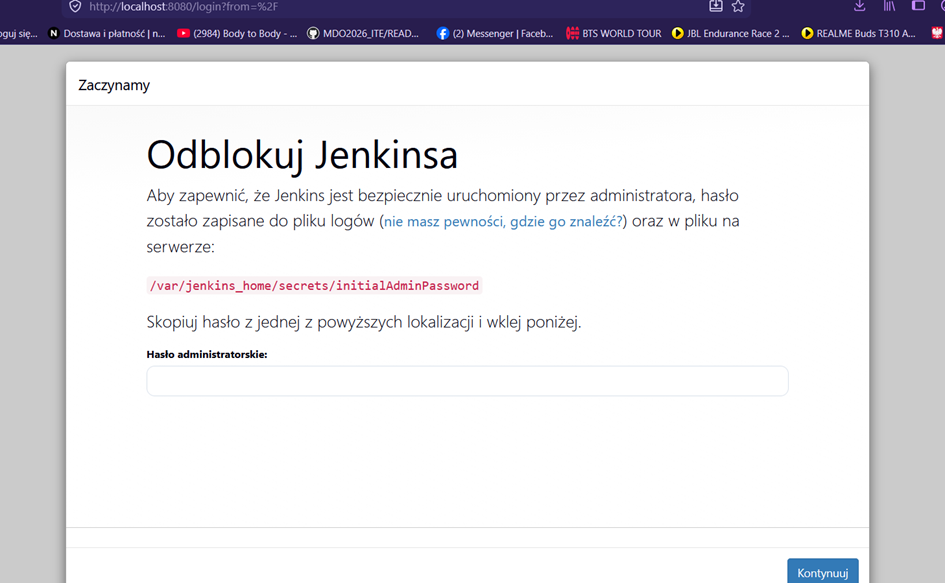

    Tutaj zostaje wpisane hasło wczesniej sprawdzone następnie zostały zaistalowane odpowiednie wtyczki i został utworzony użytkownik. Utworzenie projektu

    Sprawdzneie zapisu danych poprzez usunięcie kontenera:
    sudo docker rm -f moj-jenkins

    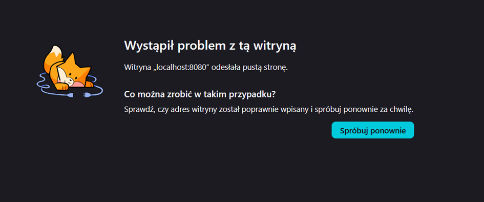

    Po ponownym uruchominiu kontenera strona działa i zadanie nadal jest czyli ndane nie zostały utracone
    sudo docker run -d --name moj-jenkins \
    -p 8080:8080 -p 50000:50000 \
    -v jenkins_data:/var/jenkins_home \
    jenkins/jenkins:lts

    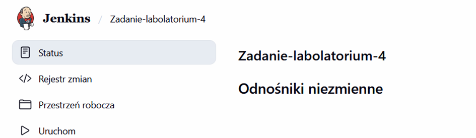

    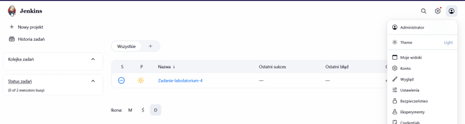

    Zastosowanie woluminów nazwanych pozwoliło na odseparowanie danych aplikacji od cyklu życia samego kontenera. Nawet w przypadku awarii lub celowego usunięcia instancji Jenkinsa, wszystkie projekty, wtyczki i dane użytkowników pozostają bezpieczne na systemie plików hosta i mogą być natychmiast podpięte do nowego kontenera.