1.	Uruchomienie środowiska zagniezdzonego

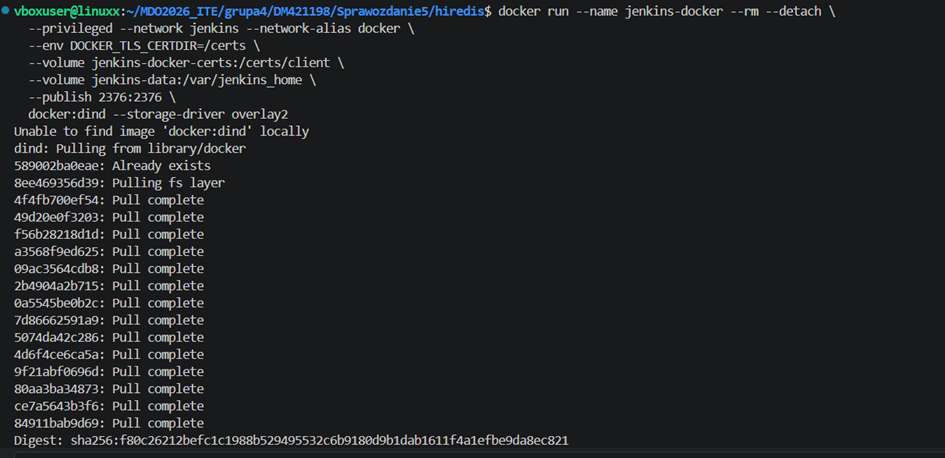
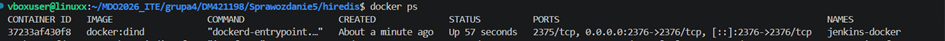

2. Przygotowanie obrazu blueocean

Czym różni się Jenkins od Blue Ocean?
Standardowy Jenkins: Posiada klasyczny interfejs graficzny, który jest funkcjonalny, ale bywa mało czytelny przy skomplikowanych procesach.
Blue Ocean: To nowoczesna nakładka graficzna zaprojektowana specjalnie dla Pipelineów. Ułatwia diagnostykę błędów.

Tresc pliku Dockerfile potrzebnego do stworzenia obrazu

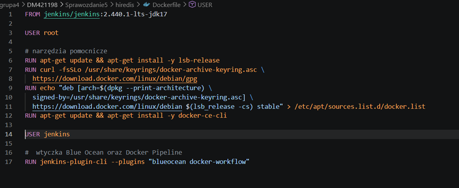

zbudowanie obrazu: docker build -t myjenkins-blueocean 

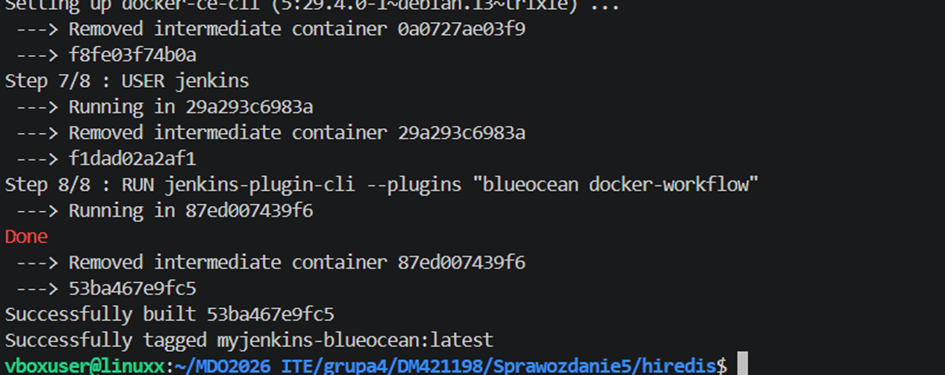

3. Uruchomienie Blueocean

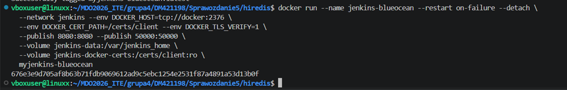

4. Zalogowanie i skonfigurowanie Jenkinsa

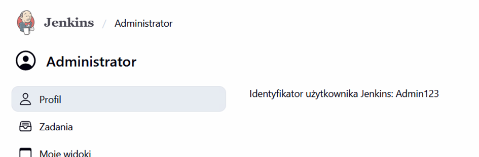

5. Utworzenie projektu **uname**\

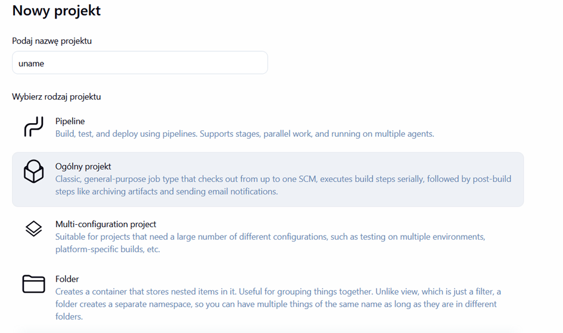

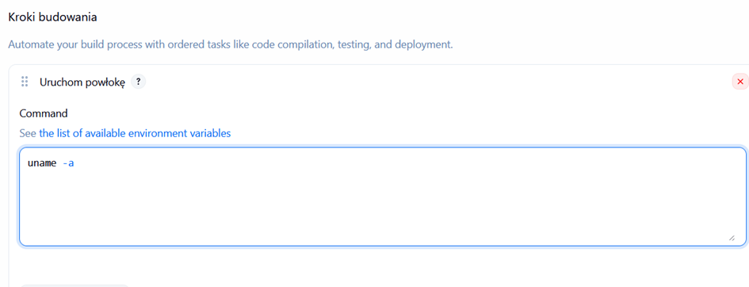

sprawdzenie:

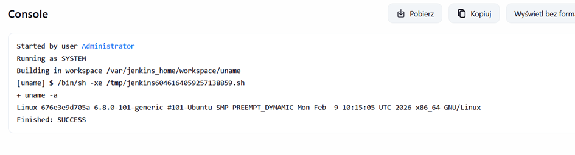

6. Utworzenie zadania sprawdzającego godzine

skrypt:
HOUR=$(date +%H)
echo "Aktualna godzina: $HOUR"

if [ $((HOUR % 2)) -ne 0 ]; then
  echo "BŁĄD: Godzina $HOUR jest nieparzysta!"
  exit 1
else
  echo "SUKCES: Godzina $HOUR jest parzysta."
  exit 0
fi

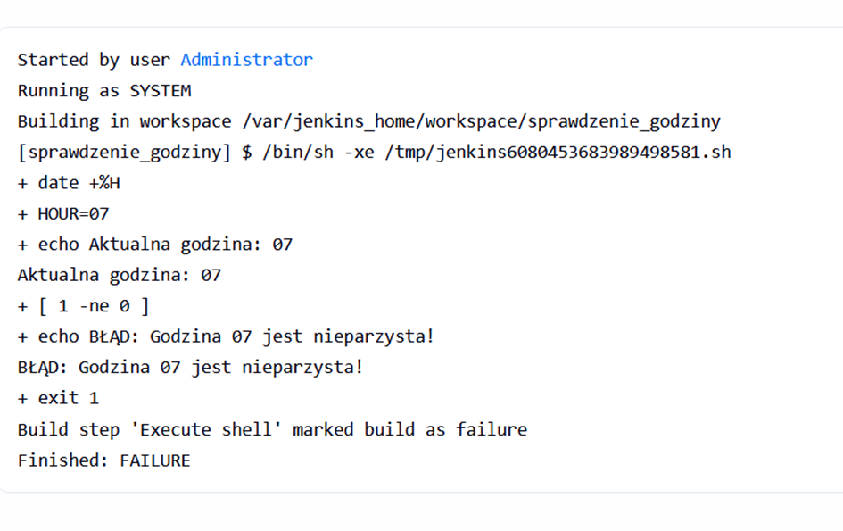

Działa poprawnie

7. Utwórz nowy obiekt typu pipeline

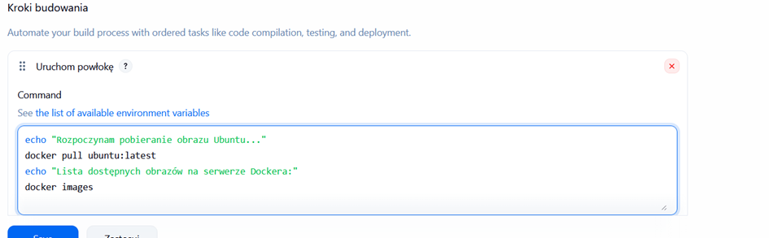

Sprawdzenie czy zadanie poprawnie klonuje repozytorium:

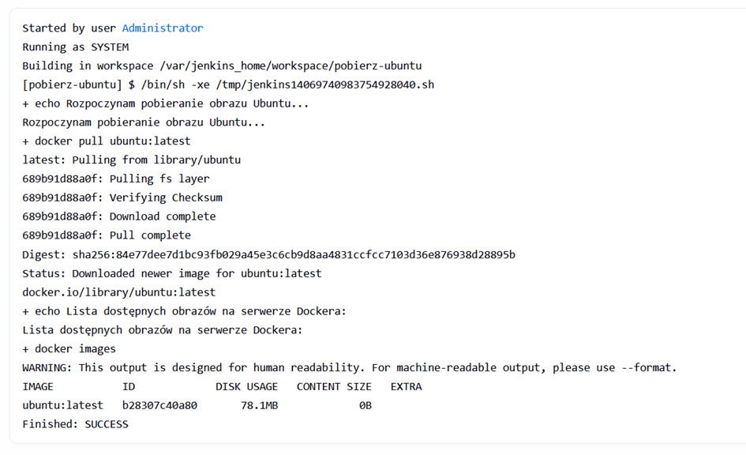

8. Poprawne skolonowanie z mojej gałęzi:

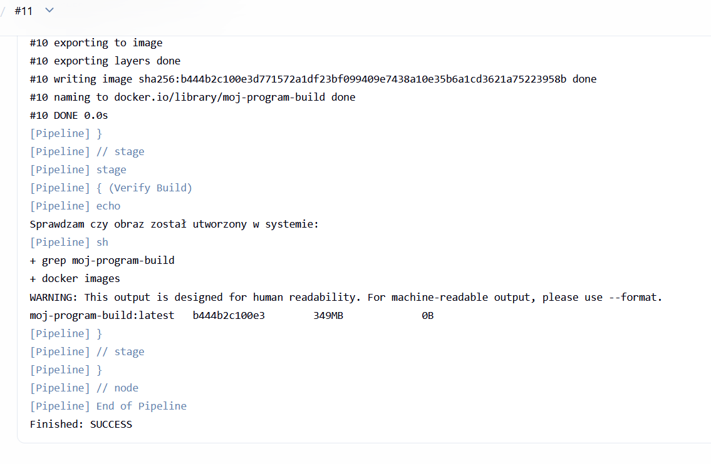

9. porówannie czasu

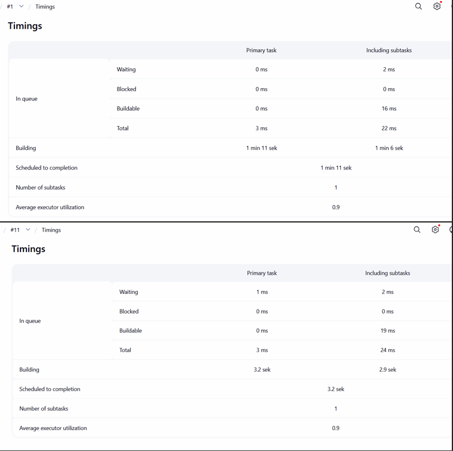

drugie zadanie znacznie szybciej się wykonuje