1. Wybrana aplikacja:

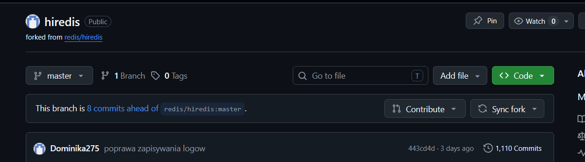

zrobiony został fork, testy przechodzą i program sie buduje

2. Stworzenie pliku Jenkinsfile:

\```

        stage('1. Build') {
            steps {
                echo 'Budowanie obrazu Builder (GCC 13)...'
                
                sh 'docker build -t hiredis-builder -f Dockerfile.build . > build_log.txt 2>&1'            }
        }

        stage('2. Test') {
            steps {
                echo 'Uruchamianie testów wewnątrz kontenera...'
                
                sh 'docker run --rm hiredis-builder make test >> build_log.txt 2>&1 || echo "Testy wykonane, sprawdz logi powyzej."'            }
        }

        stage('3. Deploy (Smoke Test)') {
            steps {
                echo 'Weryfikacja artefaktu...'
                sh 'docker run --rm hiredis-builder ls -lh /app/libhiredis.so'            }
        }

        stage('4. Publish (Artefakt)') {
            steps {
                echo 'Przygotowanie plików do pobrania...'
                
                sh 'docker rm -f temp-container || true'
                
                sh 'docker create --name temp-container hiredis-builder'
                
                sh 'docker cp temp-container:/app/libhiredis.so ./libhiredis.so'
                
                sh 'docker rm temp-container'

                sh 'tar -cvzf hiredis-paczka.tar.gz libhiredis.so'
                archiveArtifacts artifacts: 'hiredis-paczka.tar.gz', fingerprint: true
            }
        }
    }
    
    post {
        always {
            echo 'Zapisywanie logów i sprzątanie po buildzie'

            archiveArtifacts artifacts: 'build_log.txt', allowEmptyArchive: true
            
            sh 'docker image prune -f'
        }
    }
}

/'''

Skonfigurowano etap budowania i testowania biblioteki wewnątrz izolowanego kontenera. Użyto obrazu opartego na gcc:13, aby zapewnić spójność kompilatora niezależnie od maszyny, na której działa Jenkins. Wybór kontenera gcc:13 jako bazy buildowej gwarantuje dostęp do najnowszych standardów języka C i narzędzi make

3. Stworzono diagram UML zawierający planowany pomysł na proces CI/CD:

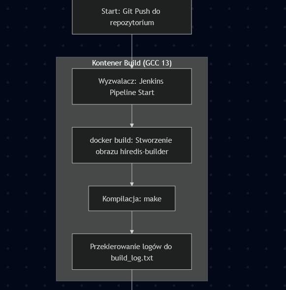

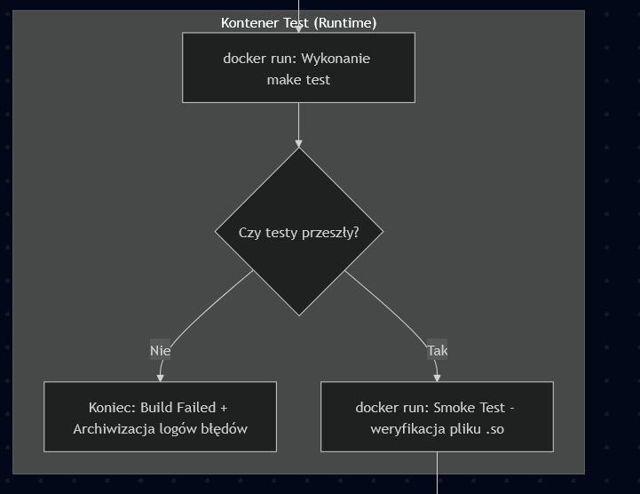

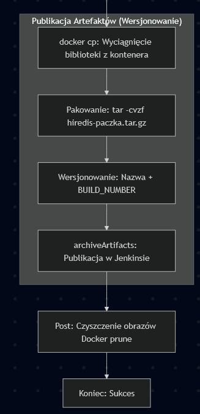

4. Build wykonany w kontenerze, przejscie testów, weryfikacja aplikacji ze wykonuje się poprawnie czyli smoke test, stworzenie artefaktów:

Budowanie:

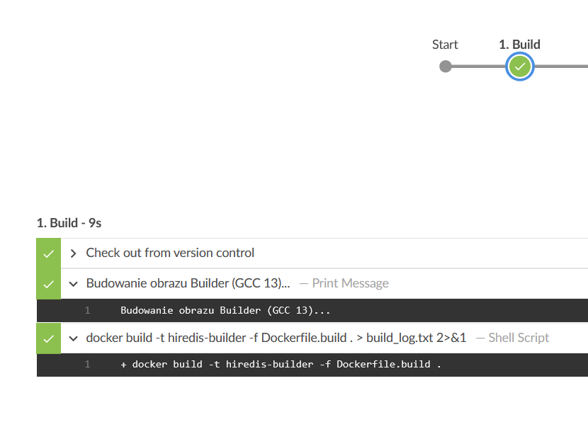

Testy:

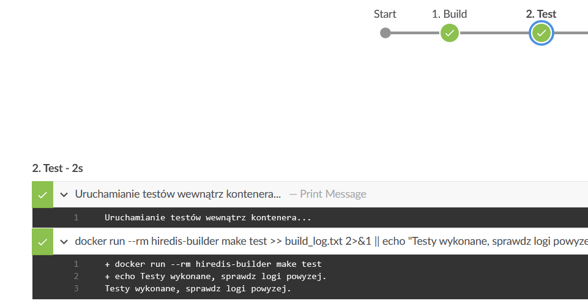

Smoke test:

weryfikacja, że aplikacja pracuje (Smoke Test), Wersjonowany kontener 'deploy' jest wdrażany na instancję Dockera

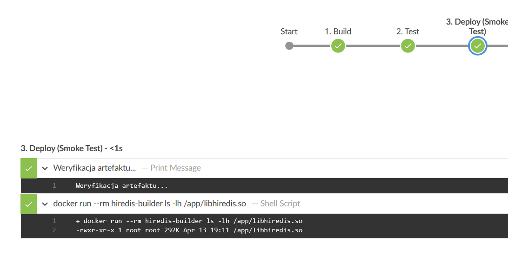

Jako kontener typu 'deploy' integracyjnie wykorzystano obraz budujący, ponieważ biblioteka hiredis jest komponentem niskopoziomowym i jej weryfikacja polega na potwierdzeniu obecności pliku .so oraz jego metadanych.

Artefakty:

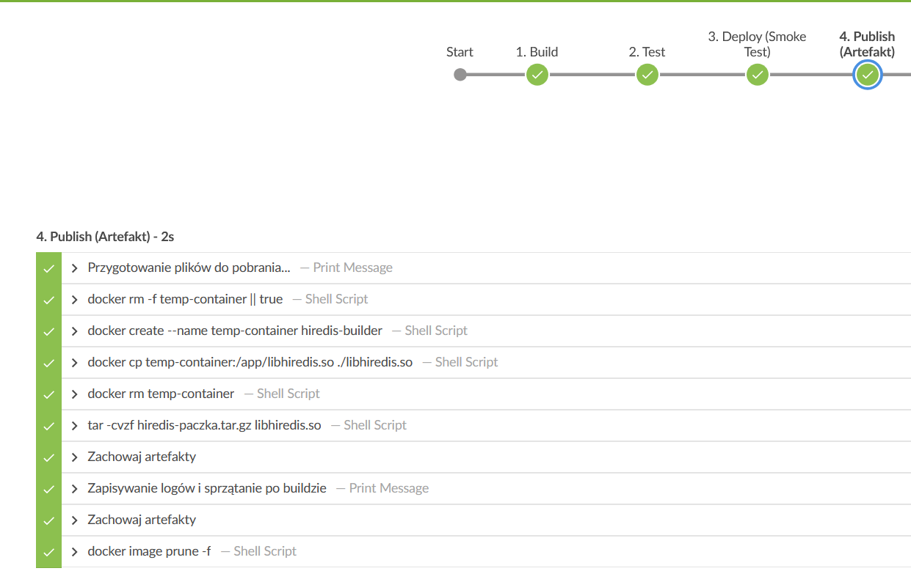

stwrzone artefakty:

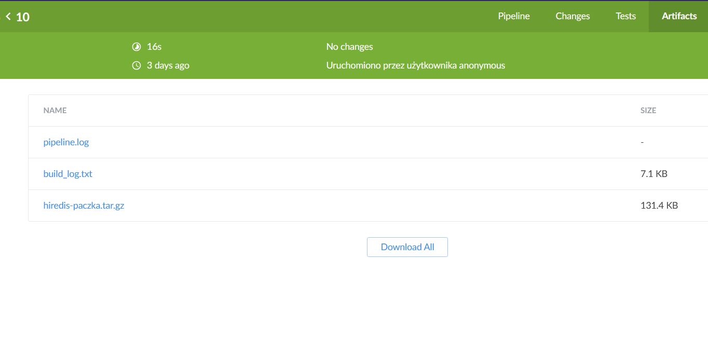

Wybrano archiwum tar.gz, ponieważ jest to standard dystrybucji bibliotek w systemach Linux, pozwalający zachować uprawnienia plików i kompresję.

5. Logi z procesu są odkładane jako numerowany artefakt, niekoniecznie jawnie

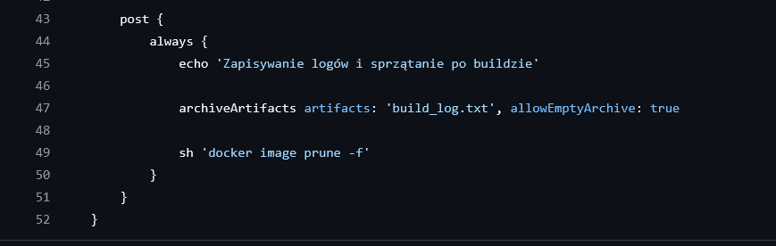

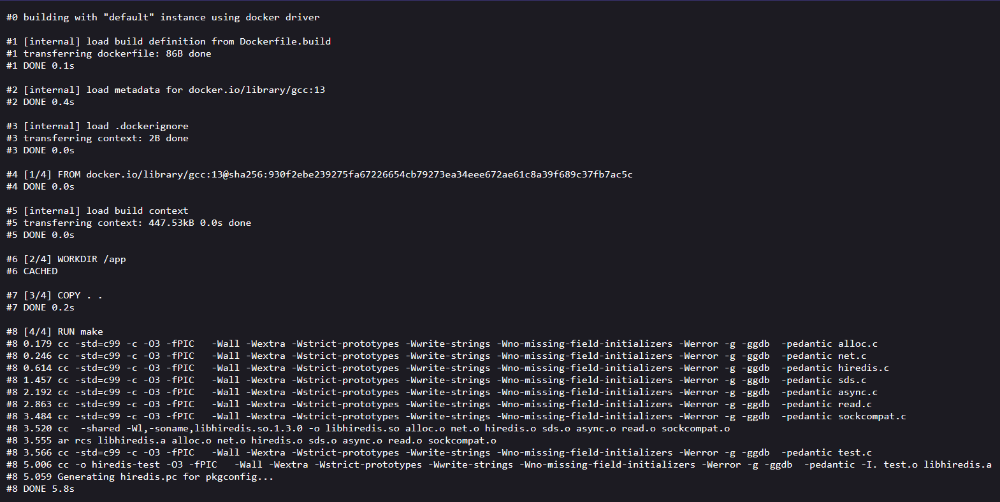

Dzięki załączeniu logów jako numerowanego artefaktu, w dowolnym momencie można sprawdzić, jakie ostrzeżenia kompilatora wystąpiły podczas generowania konkretnej paczki .tar.gz

6.  Zdefiniowano, jaki element ma być publikowany jako artefakt:  Jako główny artefakt publikowany jest plik archiwum o nazwie hiredis-paczka.tar.gz, zawierający skompilowaną bibliotekę dynamiczną libhiredis.so. Dodatkowo publikowany jest plik build_log.txt zawierający logi z procesu kompilacji.

Uzasadniono wybór: kontener z programem, plik binarny, flatpak, archiwum tar.gz, pakiet RPM/DEB: 
Artefakt jest załączony bezpośrednio jako rezultat builda w Jenkinsie (sekcja Build Artifacts). Jest on dostępny do pobrania bezpośrednio z interfejsu webowego dla każdego użytkownika z uprawnieniami do odczytu projektu.

7. Dockerfile.build

FROM gcc:13
WORKDIR /app
COPY . .
RUN make

8. Zweryfikowano potencjalną rozbieżność między zaplanowanym UML a otrzymanym efektem

Planowany proces (budowa -> test -> weryfikacja -> publikacja) został w pełni zachowany w implementacji Jenkinsfile.
