Sprawdzenie czy na poprzednich zajęciach poprawnie została przygotowana maszyna ansible, czy klucze SSH zostały poporawnie przesłane

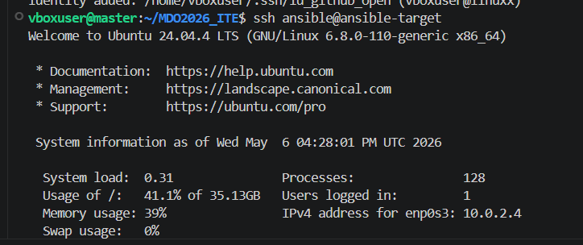

## Inwenteryzacja

W tym kroku skonfigurowano nazwy maszyn wirtualnych (hostnamectl), aby unikać używania localhost. W pliku /etc/hosts przypisano adresy IP do nazw DNS, co pozwoliło na wywoływanie maszyn po nazwach. Następnie stworzono plik inwentaryzacji hosts.ini z podziałem na sekcje [Orchestrators] (maszyna Master) oraz [Endpoints] (maszyna Ansible).

* przypisanie ansible-target

    

* przypisanie master

    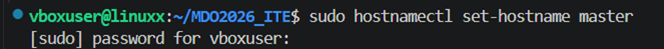

* przypisanie adresów IP do nazw DNS

    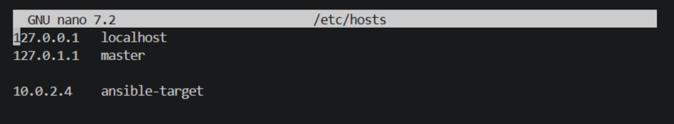

* utworzenie pliku inwenteryzacji hosts.ini

    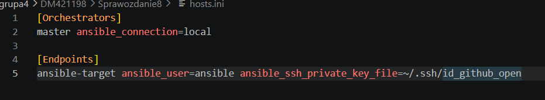


## Łączność SSH

Zapewniono bezhasłową łączność między maszyną-dyrygentem a końcówką. Wygenerowano parę kluczy SSH i przesłano klucz publiczny na maszynę docelową za pomocą ssh-copy-id. Łączność zweryfikowano za pomocą komendy ad-hoc: ansible -i hosts.ini all -m ping. Uzyskanie odpowiedzi "ping": "pong" potwierdziło poprawność wymiany kluczy i obecność interpretera Python na maszynie docelowej.

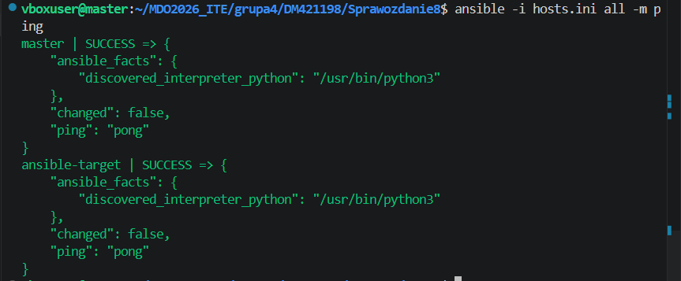

## Zdalne wywołanie procedur

Stworzono playbook zadania.yml, który zautomatyzował:

    Wysłanie żądania ping.

    Skopiowanie pliku hosts.ini na maszynę docelową.

    Aktualizację bazy pakietów (apt update).

    Restart usług ssh oraz rng-tools.

* treśc pliku zadanie.yml

    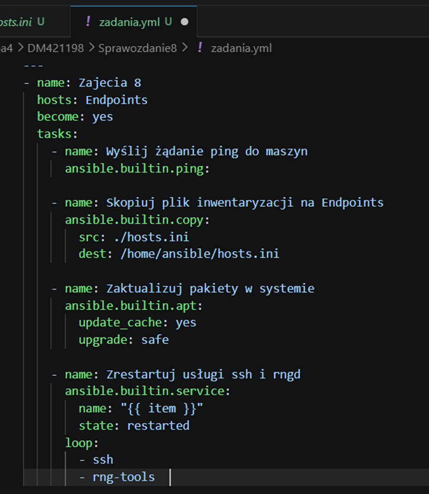

* pierwsze wykonanie playbooka

    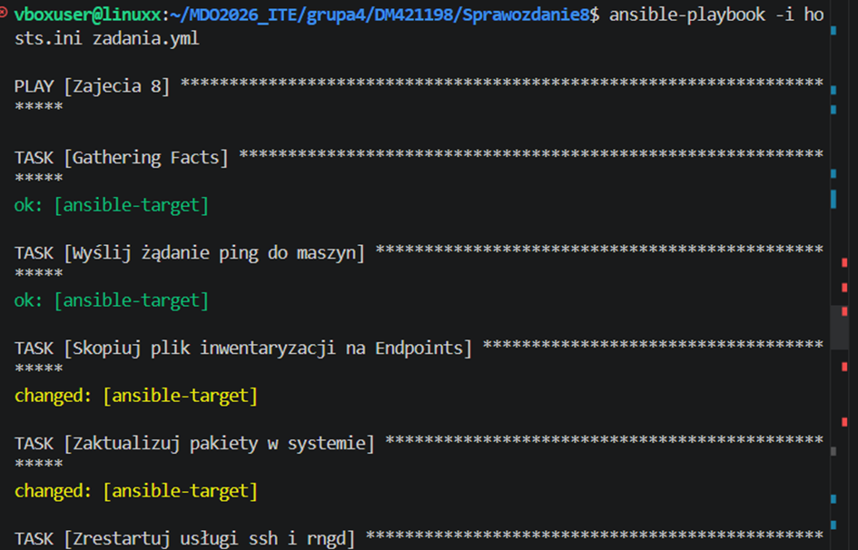

* drugie wykonanie playbooka

    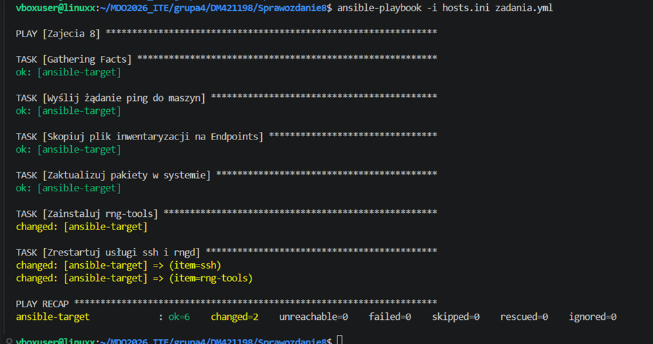

Uruchomiono playbook dwukrotnie. Za drugim razem zadania kopiowania i aktualizacji zwróciły status ok zamiast changed, co dowodzi, że Ansible nie wykonuje zbędnych zmian, gdy stan systemu jest zgodny z oczekiwanym

* zaktualizowanie pakietów w systemie

    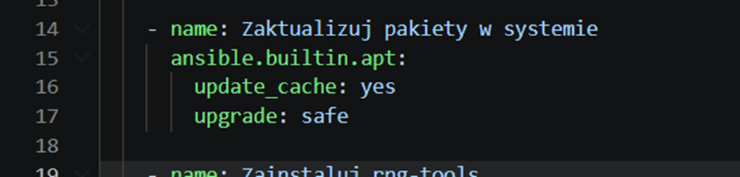

    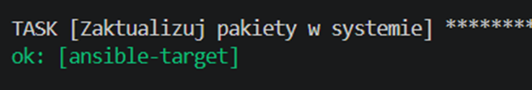

* zrestartowanie usłóg ssh i rngd

    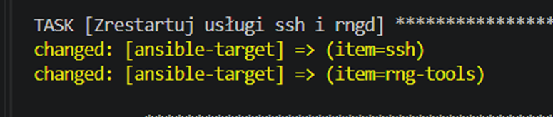

* test awaryjny

    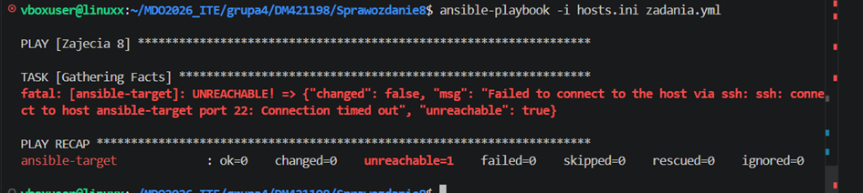

    Przeprowadzono próbę uruchomienia przy wyłączonej karcie sieciowej na maszynie Target, co poskutkowało błędem UNREACHABLE i poprawnym przerwaniem pracy przez Ansible.


## Zarządzanie artefaktami

Zrealizowano scenariusz dla artefaktu binarnego (libhiredis.so). Playbook deploy_hiredis.yml wykonał następujące czynności:

    Sanity check: Sprawdzenie wolnego miejsca na dyskuh

    Instalacja środowiska: Instalacja Dockera za pomocą modułu apt.

    Transfer i rozpakowanie: Przesłanie paczki .tar.gz i jej rozpakowanie w /tmp/.

    Konteneryzacja: Uruchomienie kontenera debian:bookworm-slim z zamontowaną biblioteką w trybie read-only.

    Weryfikacja: Wykonanie ls -lh wewnątrz działającego kontenera, aby potwierdzić obecność pliku binarniego.

    Cleanup: Usunięcie kontenera po testach.

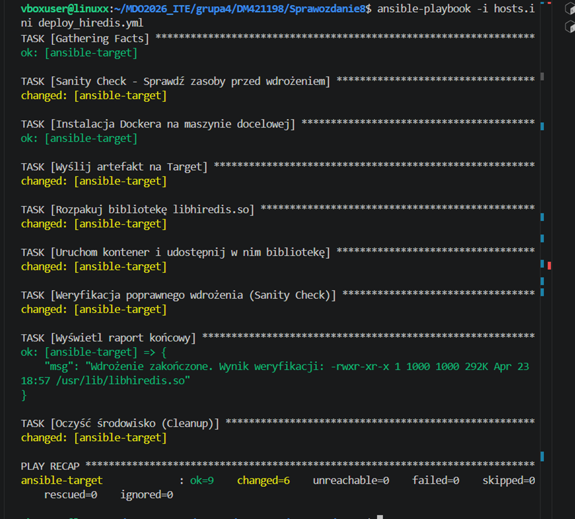

## Architektura Roli (Ansible-Galaxy)

Playbook wdrożeniowy został zrefaktoryzowany do postaci roli. Za pomocą ansible-galaxy role init hiredis_deploy wygenerowano strukturę katalogów.

* Logikę zadań przeniesiono do tasks/main.yml.

* Plik artefaktu umieszczono w katalogu files/.

* W pliku meta/main.yml uzupełniono informacje o autorze i przeznaczeniu roli.

* Finalne wdrożenie wywołano prostym playbookiem final_run.yml z sekcją roles

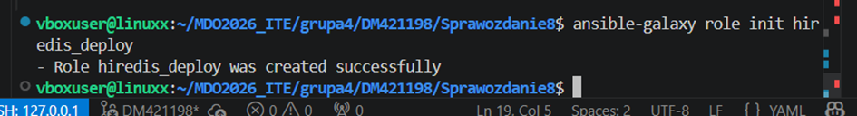

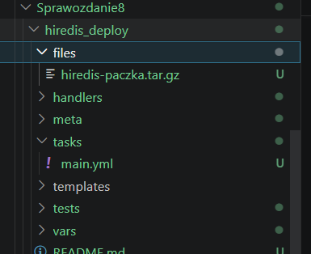

* tresc playbooka final_run.yml

```
- name: Uruchomienie wdrożenia za pomocą roli
  hosts: Endpoints
  become: yes
  roles:
    - hiredis_deploy
```

* wywołanie playbooka final_run.yml

    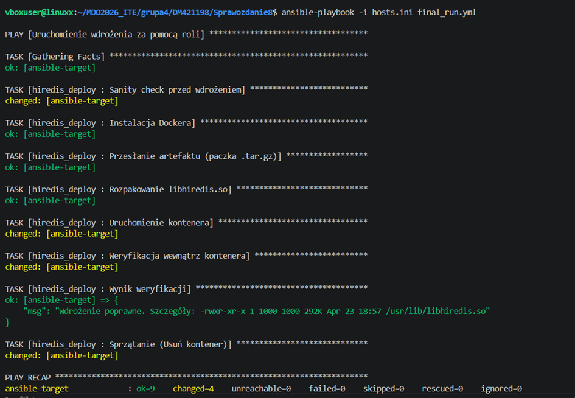