# Sprawozdanie Zbiorcze z Laboratoriów 8-12
**Przedmiot:** Metodyki DevOps
**Autor:** Dominika Myszka DM421198  

## 1. Labolatorium 08: Automatyzacja i zdalne wykonywanie poleceń za pomocą Ansible

### Cel zajęć:
 Zrozumienie zasady działania narzędzi klasy Infrastructure as Code, stworzenie pliku inwentaryzacji, konfiguracja połączeń SSH oraz przygotowanie i uruchomienie playbooków i ról Ansible.

 ### Realizacja zajęć:

 #### Inwentaryzacja i komunikacja

Skonfigurowano nazwy maszyn wirtualnych (hostnamectl), unikając używania domyślnego localhost. W pliku /etc/hosts przypisano adresy IP do nazw DNS (ansible-target, master), co pozwoliło na wywoływanie maszyn po nazwach.
Stworzono plik inwentaryzacji `hosts.ini` z logicznym podziałem na sekcje [Orchestrators] oraz [Endpoints]. Zapewniono bezhasłową łączność poprzez wygenerowanie kluczy kryptograficznych i przesłanie klucza publicznego za pomocą ssh-copy-id.

* plik hosts.ini

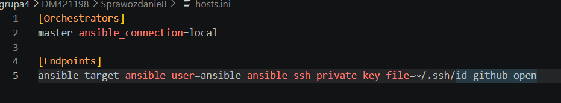

* test połączenia ping

```bash
ansible -i hosts.ini all -m ping
```
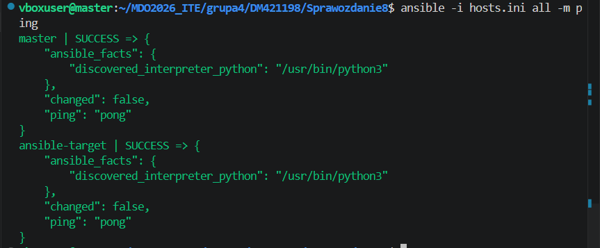

#### Zdalne wywoływanie procedur (Playbook)

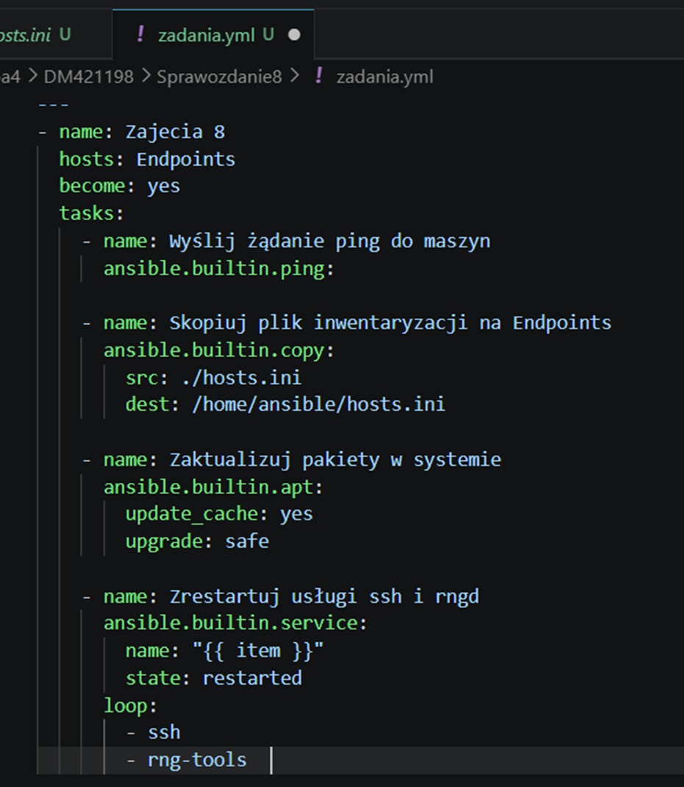

Stworzono playbook `zadanie.yml`, który realizował następujące kroki:
*  Wysłanie żądania `ping`.
*  Skopiowanie pliku `hosts.ini` na maszynę docelową.
* Aktualizację bazy pakietów (`apt update`).
* Restart usług `ssh` oraz `rng-tools`.


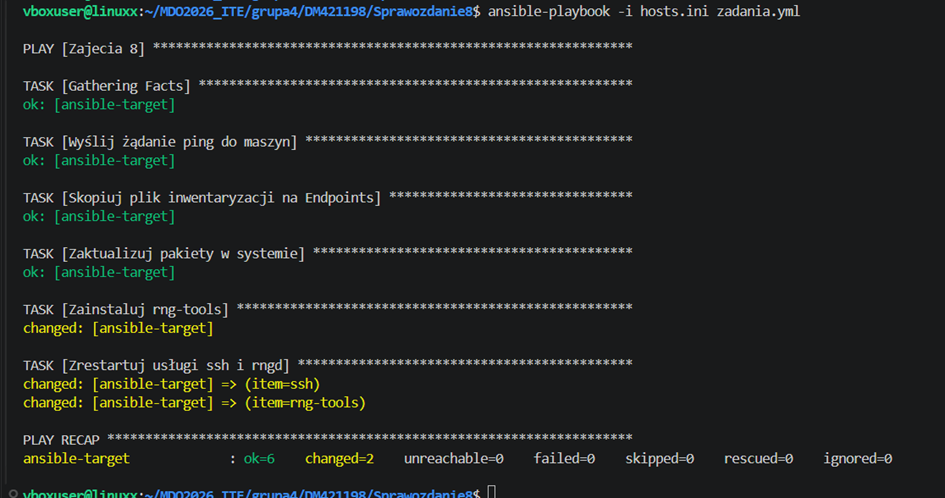

Podczas ponownego uruchomienia playbooka zaobserwowano, że zadania kopiowania i aktualizacji zwróciły status ok zamiast changed, co dowodzi, że system nie wykonuje zbędnych operacji, jeśli stan końcowy jest zgodny z oczekiwanym.

Przeprowadzono również test awaryjny (wyłączenie karty sieciowej na maszynie docelowej), co skutkowało poprawnym przerwaniem pracy ze statusem UNREACHABLE.

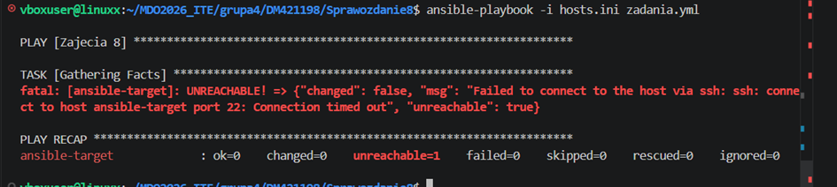

#### Zarządzanie artefaktami i struktura Roli (Ansible-Galaxy)

* Zarządzanie artefaktamim

Zrealizowano scenariusz wdrożenia dla artefaktu binarnego (libhiredis.so). Playbook wykonał sanity check dysku, zainstalował silnik Docker, przesłał paczkę z aplikacją i uruchomił ją w wyizolowanym kontenerze.

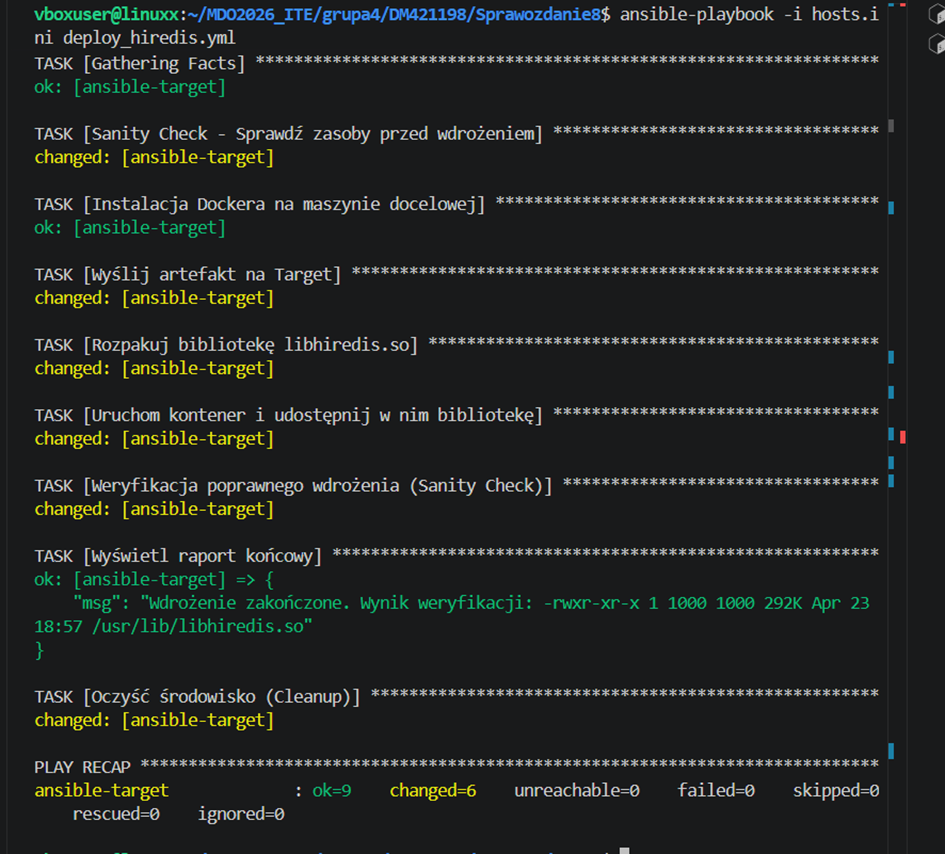

* Ansible-Galaxy

Zrefaktoryzowano płaski kod do profesjonalnej struktury Roli za pomocą polecenia `ansible-galaxy role init hiredis_deploy`. Logikę przeniesiono do `tasks/main.yml`, uzupełniono metadane, a ostateczne wdrożenie wywołano uproszczonym plikiem `final_run.yml`.

playbook `final_run.yml`

```
- name: Uruchomienie wdrożenia za pomocą roli
  hosts: Endpoints
  become: yes
  roles:
    - hiredis_deploy
```

wywołąnie playbooka za pomocą komendy:

```bash
ansible-playbook -i hosta.ini final_run.yml
```

## 2. Labolatorium 09: Pliki odpowiedzi dla wdrożeń nienadzorowanych (Kickstart)

### Cel zadania: 

Utworzenie źródła instalacji nienadzorowanej dla systemu Fedora, mającego na celu automatyczne przygotowanie hosta do uruchomienia aplikacji (bazy danych pgAdmin4) natychmiast po instalacji systemu.

### Realizacja zajęć:

#### Przygotowanie pliku odpowiedzi

Pozyskano bazowy plik `anaconda-ks.cfg` z ręcznie zainstalowanej maszyny. Dokonano jego modyfikacji:

* Zastosowano dyrektywę `clearpart --all --initlabel` w celu formatowania całego dysku bez interakcji użytkownika.

* Zmieniono domyślny hostname na `fedora-kickstart`.

* Sekcja `%packages`: Wskazano środowisko bazowe oraz dodano pakiety narzędziowe (`tar`, `wget`, `curl`).
* Automatyzacja uruchomienia: Zdefiniowano sekcję poinstalacyjną z logowaniem operacji (`%post --log=/root/ks-post.log`). Zainstalowano pakiety `docker-ce`. Ponieważ usługi systemowe nie są aktywne podczas instalacji, użyto polecenia `systemctl enable docker` oraz zarejestrowano autorską usługę `systemctl enable moj-pipeline.service`. Zagwarantowało to bezobsługowe pobranie i uruchomienie kontenera `pgAdmin4` przy pierwszym rozruchu.

bazowy plik `anaconda-ks.cfg`

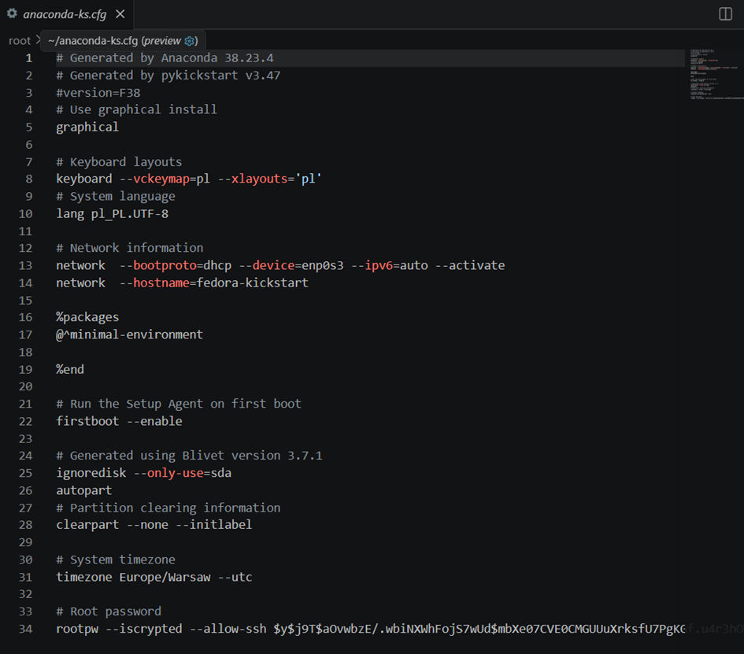

plik po modyfikacji

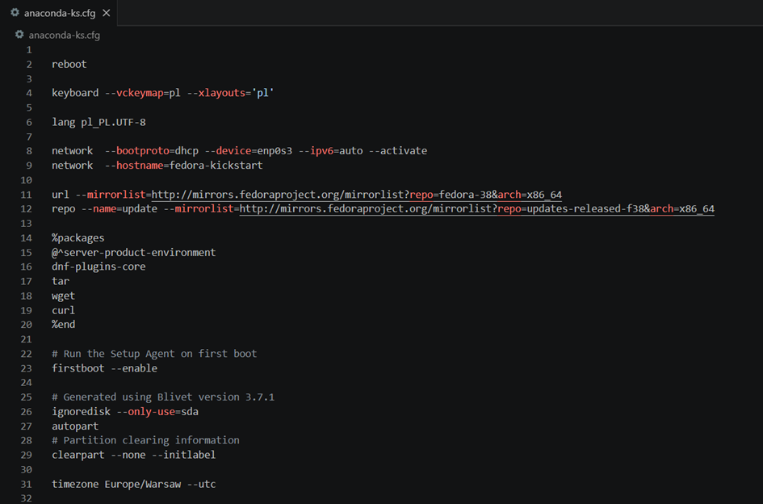
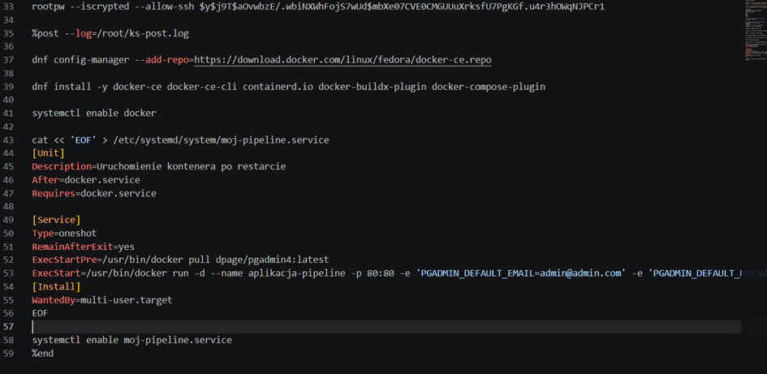

#### Instalacja nienadzorowana

Na hoście uruchomiono lokalny serwer HTTP (python3 -m http.server 80), aby udostępnić plik w sieci lokalnej. Na nowej maszynie wirtualnej w menu GRUB dopisano komendę wskazującą lokalizację pliku. 

```bash
inst.ks=http://192.168.100.1/anaconda-ks.cfg ip=192.168.100.2:::255.255.255.0::enp0s8:none
```

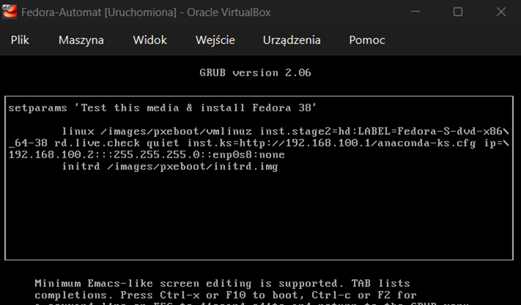

System zainstalował się całkowicie bezobsługowo. Po restarcie zweryfikowano, że kontener z bazą danych funkcjonuje poprawnie.

Weryfikacja działąnia środowiska:

* Czy mechanizm automatycznego uruchamiania aplikacji działa? TAK

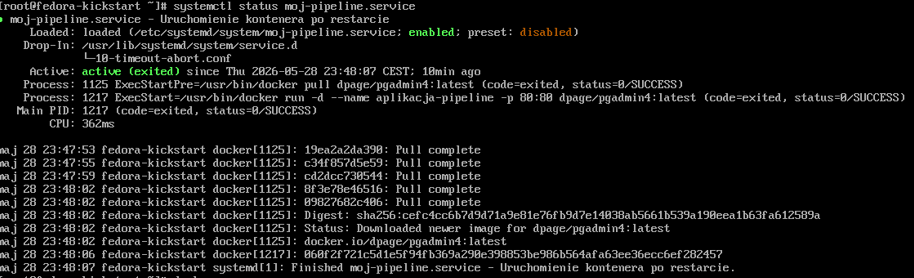

* Czy kontener z bazą danych pgadmin4 jest uruchomiony? TAK

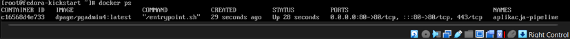

## 3. Labolatorium 10: Budowa klastra Kubernetes i podstawy wdrożeń

### Cel zadania: 

Uruchomienie lokalnego klastra Minikube, wdrażanie aplikacji bezpośrednio oraz za pomocą plików deklaratywnych YAML, a także zarządzanie ruchem sieciowym.

### Realizacja zajęć:

#### Inicjalizacja i weryfikacja

Klaster uruchomiono komendą `minikube start --driver=docker`. Zweryfikowano działanie workera oraz poprawnie uruchomiono wbudowany Kubernetes Dashboard.

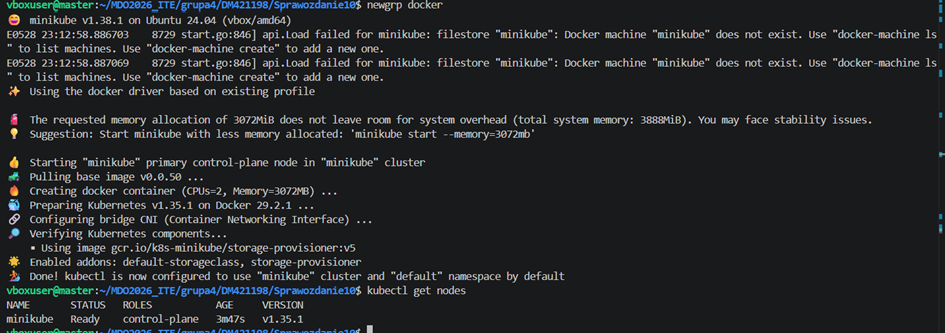

Uruchomienie dahboardu

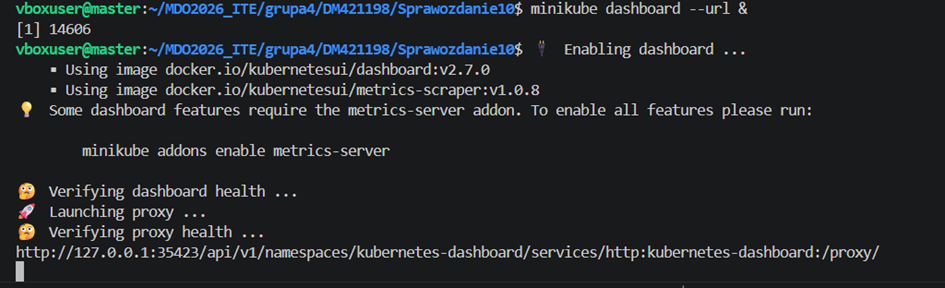

#### Wdrażanie i przekierowanie portów

* Wdrożono testową aplikację (`kubectl port-forward pod/moj-nginx 8888:80`). Komunikację udowodniono poprzez bezpośrednie przekierowanie portów i zweryfikowano zapytaniem `curl http://localhost:8888`.

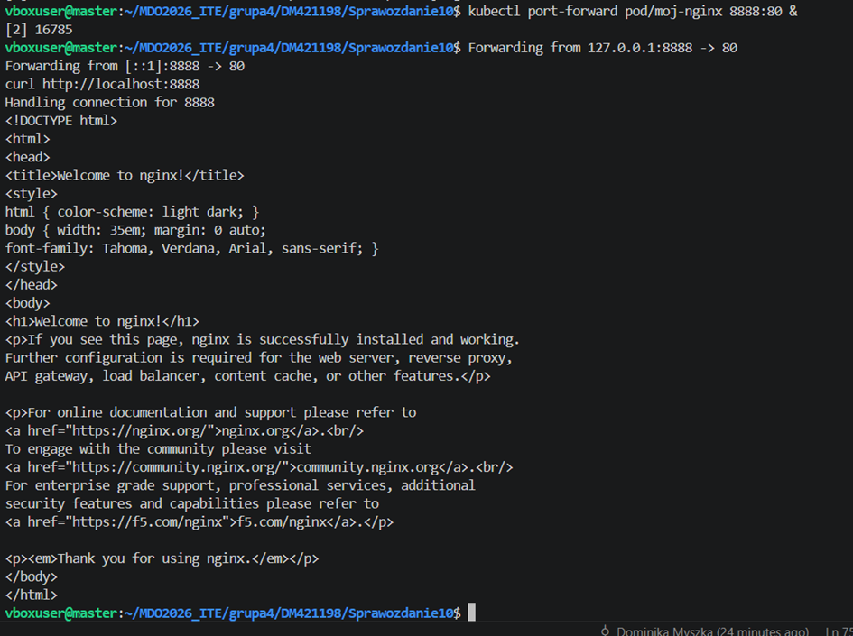

* Następnie stworzono wdrożenie zdefiniowane w pliku yml.
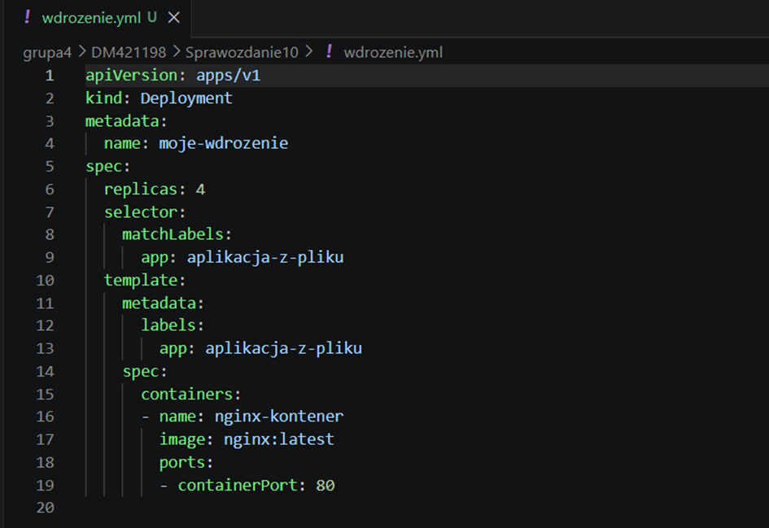
Zweryfikowano poprawność komendami `kubectl rollout status` oraz `kubectl get pods`, potwierdzając uruchomienie żądanej liczby replik.
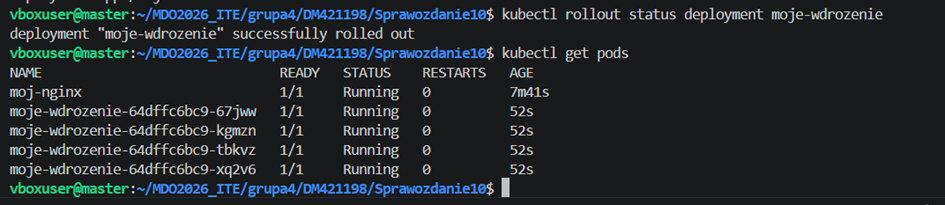

#### Ekspozycja (Service)

Wdrożenie udostępniono na zewnątrz klastra tworząc obiekt typu Service. 
 
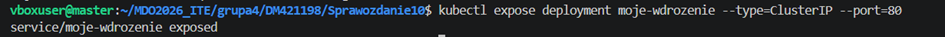

Zweryfikowano przekierowanie portów (9999 -> 80), co udokumentowano poprawną pracą aplikacji widoczną w przeglądarce oraz w panelu Minikube Dashboard.

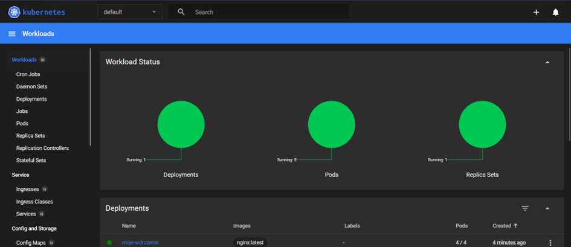

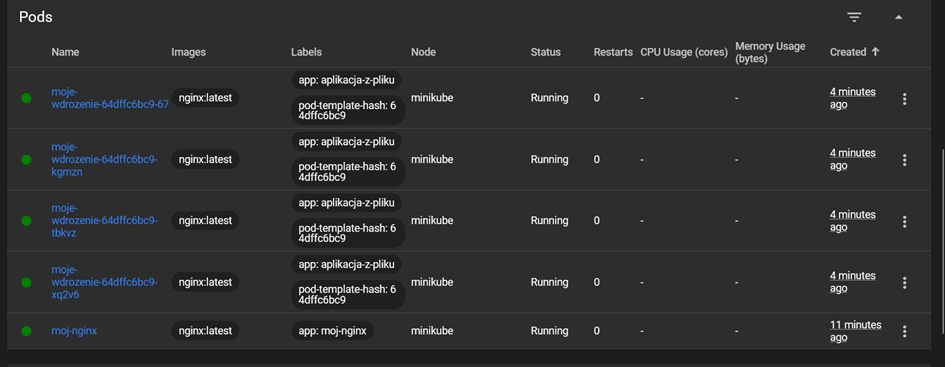

## 4. Labolatorium 11: Kubernetes - Skalowanie deklaratywne, Rollback i strategie wdrożeń

### Cel zadania:

Zarządzanie obrazami Dockera wewnątrz klastra, testowanie mechanizmów skalowania, reagowanie na awarie (Rollback) oraz weryfikacja różnych strategii aktualizacji (Recreate, Rolling Update, Canary).

### Realizacja zajęć:

##### Lokalne obrazy i modyfikacja zasobów

* Powiązano terminal z silnikiem Docker wewnątrz Minikube 

```bash
eval $(minikube docker-env)
```

* Zbudowano trzy wersje aplikacji (v1, v2 oraz celowo uszkodzoną v3-broken).

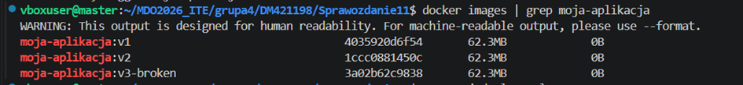

* Utworzono deklaratywny plik YAML

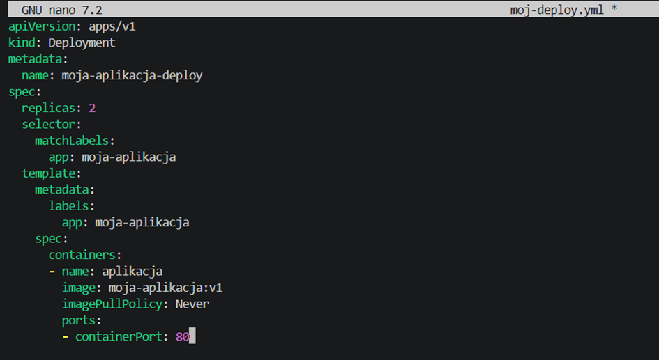

Następnie testowano elastyczność środowiska poprzez dynamiczne skalowanie replik (wartości: 8, 1, 0, a docelowo 4).

#### Aktualizacje wdrożeń i zarządzanie kryzysowe

Przeprowadzono aktualizację oprogramowania do wersji v2. Następnie celowo wprowadzono wadliwy obraz v3-broken. 

* Dokonano analizy historii wdrożeń 

```bash
kubectl rollout history
```

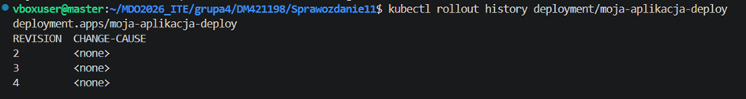

* Z powodzeniem wycofano awaryjną wersję do ostatniego stabilnego stanu za pomocą komendy:

```bash
kubectl rollout undo
```

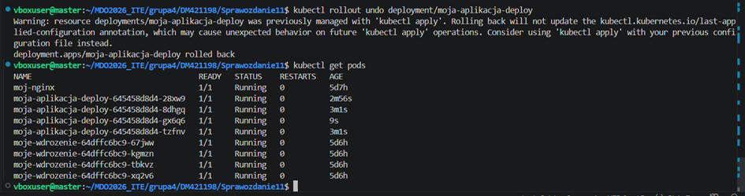

#### Strategie wdrażania

Utworzono uniwersalny Service kierujący ruchem, a następnie przetestowano i przeanalizowano trzy strategie wydawnicze:

* Recreate

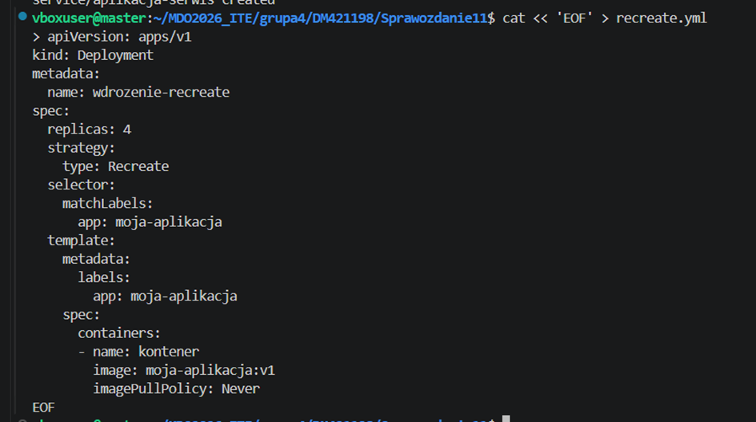

Obserwacje: Stare kontenery w ułamku sekundy weszły w stan Terminating. Zanim nowe zaczęły się tworzyć (ContainerCreating), przez moment klaster nie posiadał ani jednego działającego kontenera.

* Rolling Update

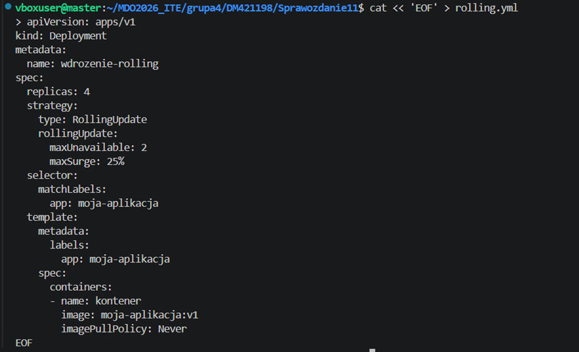

Obserwacje: Kubernetes stworzył najpierw nowe kontenery, a stare wyłączał pojedynczo. Zawsze dostępnych było co najmniej kilka podów w stanie Running. Aplikacja ani przez sekundę nie przestała działać z punktu widzenia klienta.

* Canary Deployment

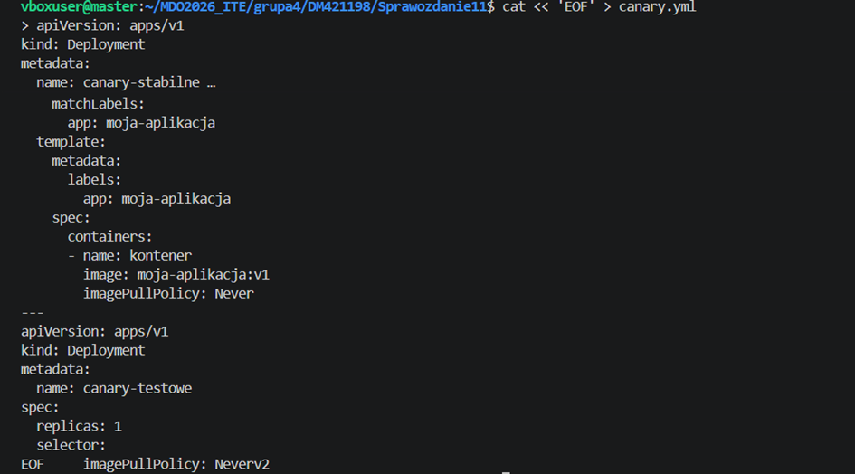

Obserwacje: Skonfigurowano klaster tak, aby kierował zaledwie ułamek ruchu do nowej, eksperymentalnej wersji, zabezpieczając tym samym większość użytkowników produkcyjnych.

## 5. Labolatorium 12: Wdrażanie na zarządzalne kontenery w chmurze (Azure)

### Cel zadania: 

Publikacja zbudowanego obrazu aplikacji w globalnym rejestrze oraz jego uruchomienie na publicznej platformie chmurowej Microsoft Azure.

### Realizacja zajęć:

#### Rejestr kontenerów (Docker Hub)

Za pomocą komend terminala (`docker login`, `docker tag`, `docker push`) poprawnie wyeksportowano lokalny obraz `moja-aplikacja:v2` do globalnego i publicznie dostępnego rejestru kontenerów.

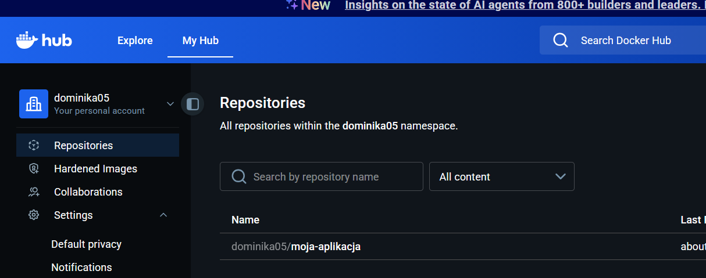

#### Środowisko Azure i przygotowanie wdrożenia

Zalogowano się do portalu Azure i uruchomiono terminal zarządzający Azure Cloud Shell (Bash). W pierwszej kolejności aktywowano usługę hostowania kontenerów na koncie edukacyjnym komendą wybudzającą usługodawcę:

```bash
az provider register --namespace Microsoft.ContainerInstance
```

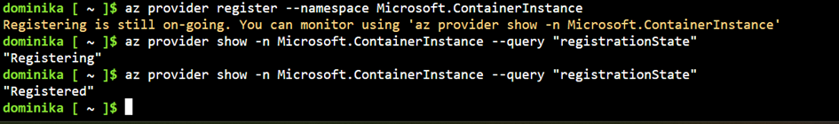

Utworzono dedykowaną Grupę Zasobów zlokalizowaną w regionalnym centrum danych w Polsce (polandcentral):

```bash
az group create --name GrupaProjektowaPL --location polandcentral
```

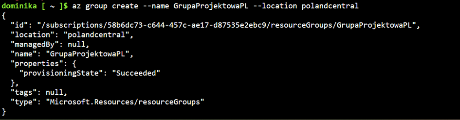

#### Wdrożenie i weryfikacja

Wdrożono kontener do platformy Azure Container Instances Użyto autorskiego obrazu zapisanego w repozytorium Docker Hub.

```bash
az container create 
--resource-group GrupaProjektowaPL 
--name moj-kontener-azure 
--image dominika05/moja-aplikacja:v2 
--dns-name-label dominika-apka-421198 
--ports 80 
--os-type linux 
--cpu 1 
--memory 1.5
```

Pobrano logi z działającego kontenera (`az container logs`) w celu weryfikacji ruchu sieciowego
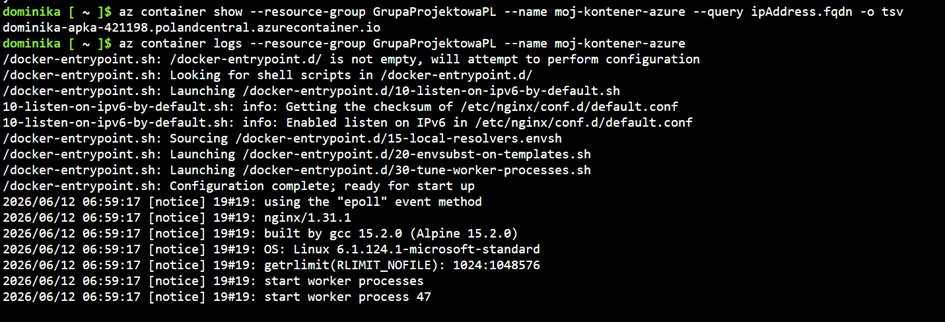 

oraz przetestowano wejście na globalnie widoczny adres FQDN (`http://dominika-apka-421198.polandcentral.azurecontainer.io`) z poziomu lokalnej przeglądarki.

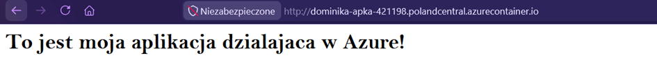

#### Sprzątanie

Zgodnie z dobrymi praktykami zarządzania infrastrukturą chmurową, po udanej walidacji wdrożenia środowisko zostało natychmiast, bezpowrotnie usunięte w celu zabezpieczenia darmowych kredytów na koncie. Zastosowano polecenie w tle:

```bash
az group delete --name GrupaProjektowaPL --yes --no-wait
```
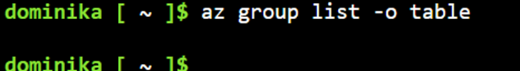

## Podsumowanie końcowe:

Powyższy cykl laboratoryjny udowodnił umiejętność zaprojektowania i wykonania kompletnego potoku operacyjnego. Zaprezentowano praktyczną znajomość konfiguracji niskopoziomowej systemów (Kickstart, Ansible), budowy wyizolowanych środowisk aplikacyjnych (Docker), elastycznego zarządzania klastrem wysokiej dostępności (Kubernetes) oraz implementacji zasobów w chmurze publicznej (Azure).