1. Przygotowanie środowiska i pliku bazowego:
    Użyłam wersji Server DVD, ale skonfigurowałam instalację tak, by minimalizować pobieranie z sieci

    * instalowanie systemu Fedora:

        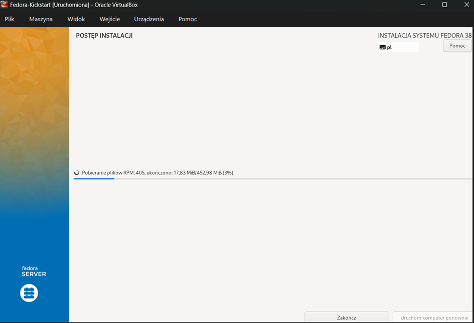

        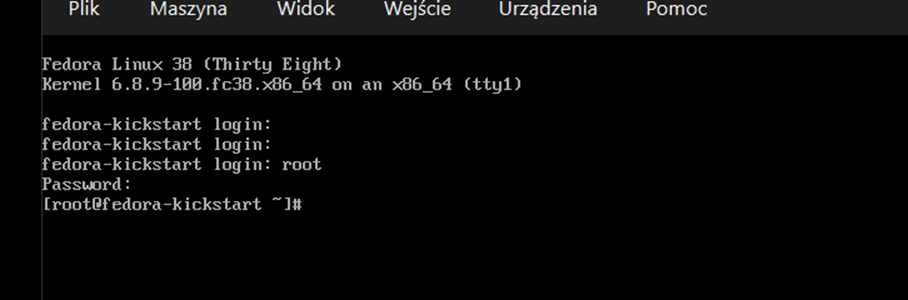

    * Wygenerowanie i pozyskanie bazowego pliku anaconda-ks.cfg z pierwszej, ręcznie zainstalowanej maszyny.

        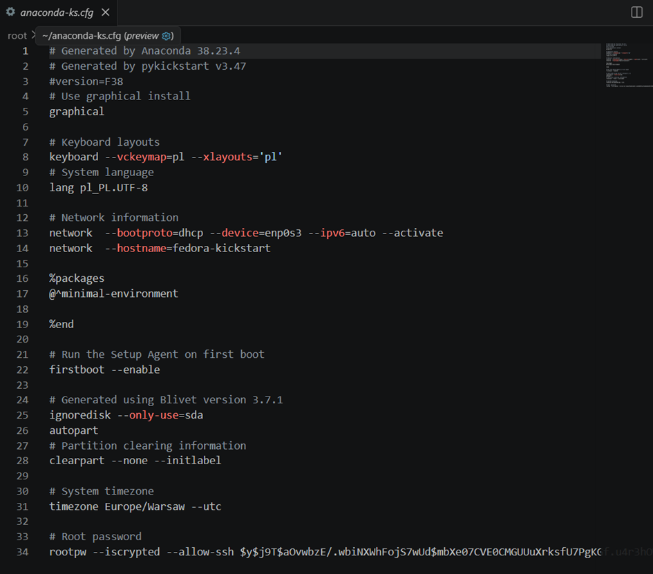

2. Modyfikacja pliku odpowiedzi.

    Repozytoria: Konfiguracja dyrektyw url i repo.

    Partycjonowanie: Zastosowanie dyrektywy clearpart --all --initlabel w celu zapewnienia formatowania całego dysku.

    Identyfikacja w sieci: Zmiana domyślnego hostname na własny (fedora-kickstart).

    Automatyzacja: Dodanie dyrektywy reboot na końcu procesu.

    Sekcja %packages:
        Wskazanie środowiska bazowego (@^server-product-environment).
        
        Dodanie niezbędnych pakietów narzędziowych (tar, wget, curl)

    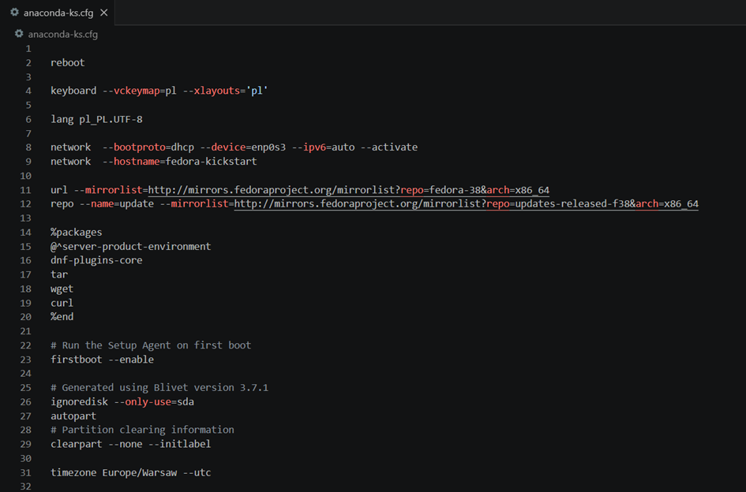

    Sekcja %post(automatyzacja uruchomienia aplikacji)

    Najistotniejszą modyfikacją było zdefiniowanie sekcji poinstalacyjnej (%post --log=/root/ks-post.log), w której przygotowano mechanizm uruchamiający kontener z aplikacją docelową (baza danych pgAdmin4)

    Dodano oficjalne repozytorium Dockera poleceniem dnf config-manager i zainstalowano najnowsze pakiety docker-ce.
    
    Zarządzono aktywację usługi Dockera przy starcie systemu (systemctl enable docker).

    Na samym końcu aktywowano autorską usługę poleceniem systemctl enable moj-pipeline.service, co zagwarantowało bezobsługowe uruchomienie aplikacji natychmiast po pierwszym restarcie zainstalowanego systemu

    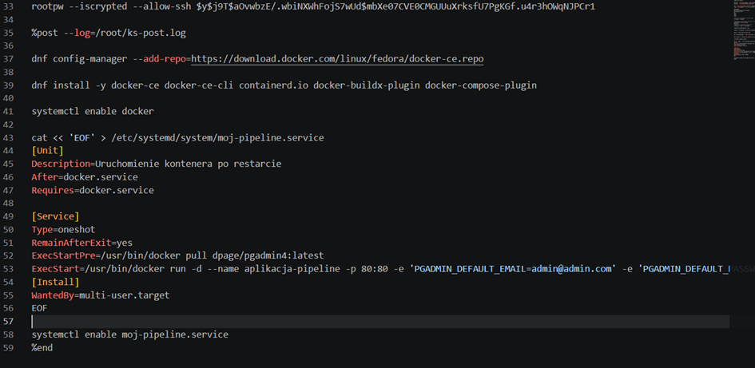

3. Przeprowadzenie instalacji nienadzorowanej

    Aby nowa maszyna wirtualna mogła pobrać zmodyfikowany plik Kickstart podczas rozruchu, zorganizowano lokalny serwer HTTP. uruchomiono wbudowany moduł Pythona poleceniem python3 -m http.server 80. Pozwoliło to na bezproblemowe i szybkie udostępnienie pliku w sieci lokalnej.

    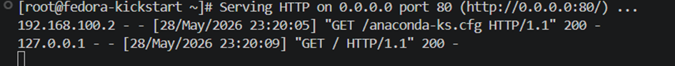

    * Inicjalizacja środowiska:

        Uruchomiono nową maszynę wirtualną z podpiętym obrazem ISO. Na etapie bootloadera (GRUB) wciśnięto klawisz e, aby wyedytować parametry przed właściwym startem instalatora. Na końcu linii konfiguracyjnej dopisano komendę wskazującą lokalizację pliku odpowiedzi na serwerze.

        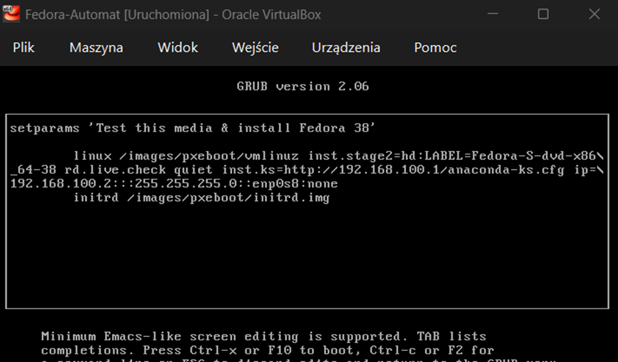

        Po zatwierdzeniu wpisu skrótem Ctrl+X, instalator pomyślnie połączył się z siecią wewnętrzną, pobrał instrukcje instalacyjne i całkowicie bezobsługowo przeprowadził wdrożenie systemu.

        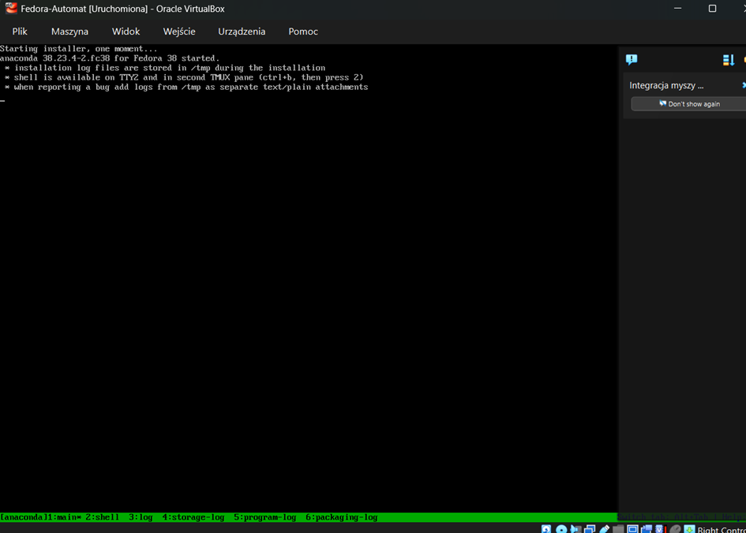
    
    * rozpoczecie instalowania:

        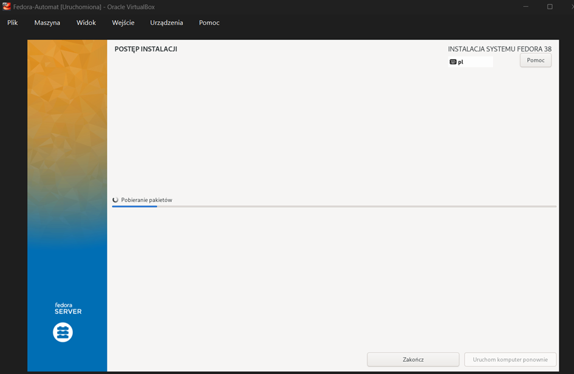

4. Weryfikajca działania środowiska:

    * Czy mechanizm automatycznego uruchamiania aplikacji działa?

        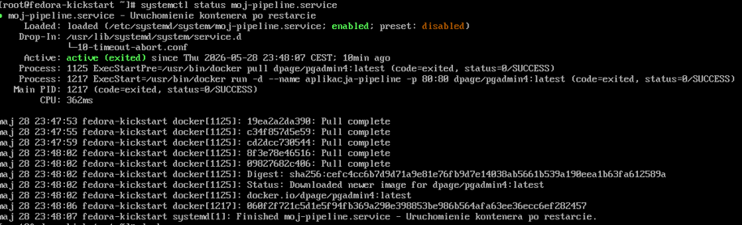

        TAK
    
    * Czy kontener z bazą danych pgadmin4 jest uruchomiony

        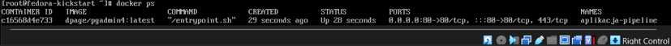

        TAK