# Sprawozdanie 10 - 29.05.2026
## Kubernetes

Zaczynamy od instalacji serwisu minikube i sprawdzeniu czy system spełnia wszystkie wymagania.

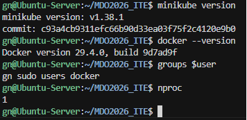

Mamy tylko jeden procesor więc trzeba włączyć drugi w ustawieniach VM. Po restarcie uruchamiamy minikube z dockerem jako Driver.

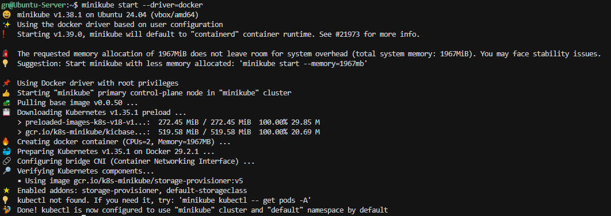

Sprawdzamy czy wszystko jest ok i działa minikube

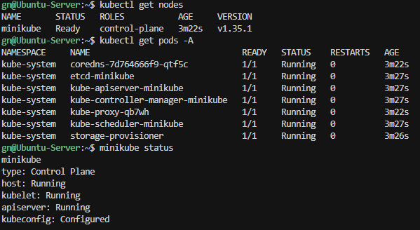

Później również sprawdziłem czy nodesy są widziane przez minikube używając polecenia `minikube kubectl -- get nodes`. Dla uproszczenia utworzyłem również alias `Alias minikubectl="minikube kubectl --"`.

Uruchamiamy dashboard kubernetes.

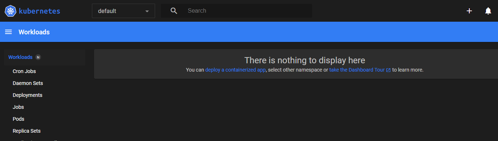

Tworzymy obraz dockera który jest prostym `nginx` z prostym `index.html`

```
#Dockerfile
FROM nginx:1.27-alpine
COPY index.html /usr/share/nginx/html/index.html
EXPOSE 80
```
```
#index.html
GN421256 - Devops
```

Następnie uruchamiamy obraz na minikube

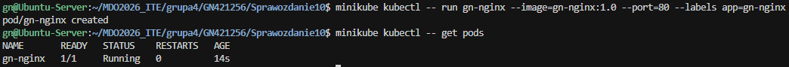

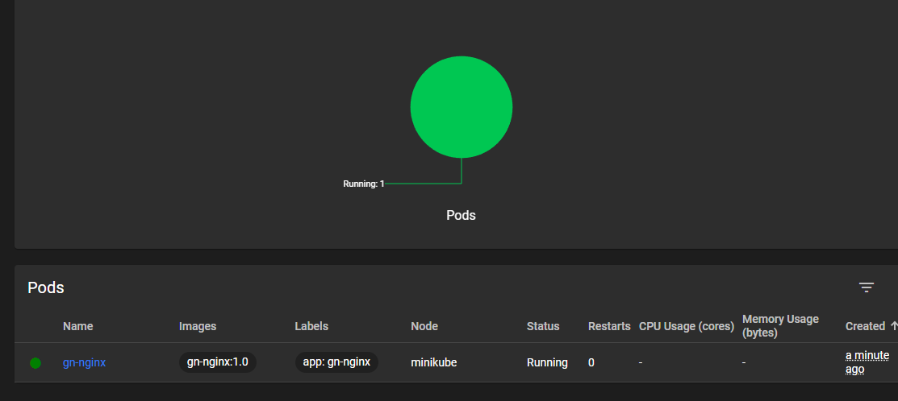

Uruchamiamy port forward na port 8080 `minikubectl port-forward pod/gn-nginx 8080:80`

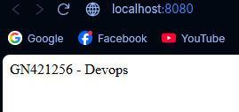
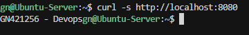

Sprawdzamy czy możemy zapisać deployment z działającego poda.

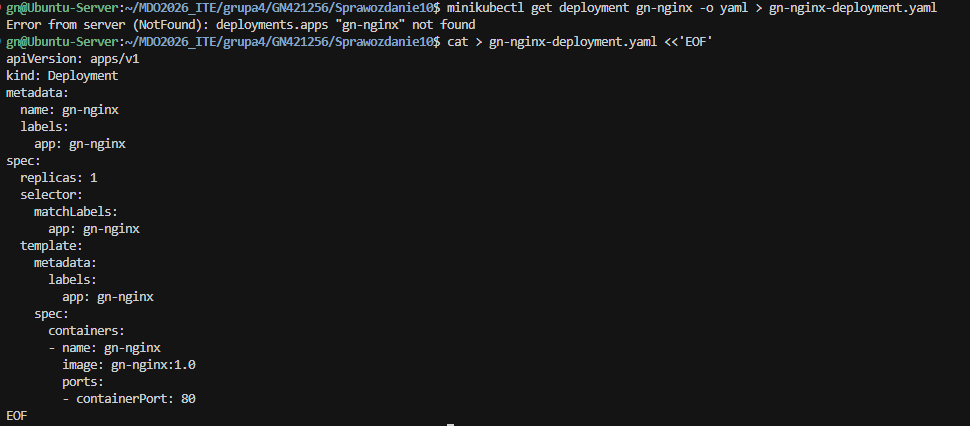

Jako że stworzyliśmy wcześniej tylko pod a nie deployment to nie jesteśmy w stanie więc piszemy go ręcznie.

Następnie wykonano przykładowy deployment i na tej podstawie kontynuowano pracę. 

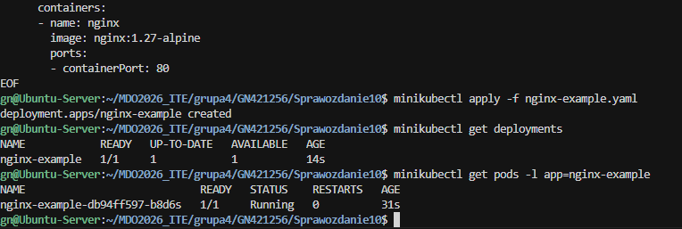

Zmieniono nasz deployment aby robił 4 repliki zmieniając fragment.

```
[...]
spec:
  replicas: 4
[...]
```

Następnie w sposób analogiczny do przykładu uruchomiono nasz deployment i w dashboardzie widać deployment i stworzone 4 pody.

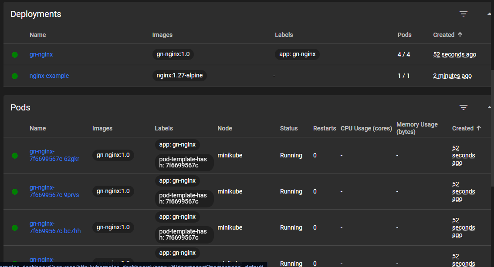

Stworzono również serwis który uruchomiono przez port forwarding.

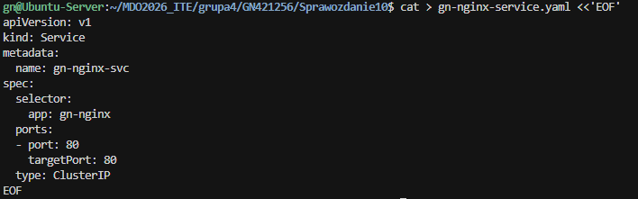

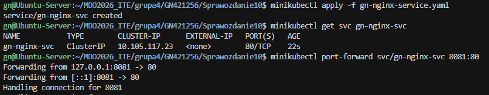

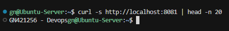

