# Sprawozdanie 11 - Gabriel Nowak

## Kubernetes (2) - wersje obrazu, skalowanie, rollback, strategie wdrożeń

Ćwiczenie jest kontynuacją zajęć 10 i bazuje na własnym obrazie `gn-nginx` (prosty `nginx` z własnym `index.html`).

---

## 1. Przygotowanie nowych wersji obrazu

Stan wyjściowy klastra `minikube` i przygotowanie środowiska.

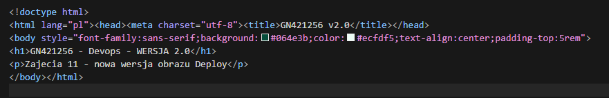

Nowy `Dockerfile` dla wersji **2.0** (zmieniona treść strony).

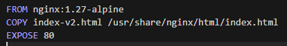

`Dockerfile` wersji **wadliwej** - kontener celowo kończy pracę błędem (`exit 1`).

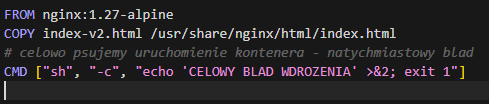

Załadowanie obrazów do `minikube` - dostępne trzy wersje: `1.0`, `2.0`, `broken`.

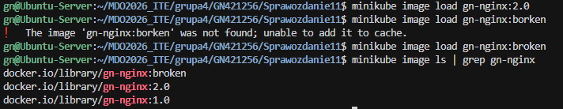

---

## 2. Zmiany w deploymencie - skalowanie replik

Skalowanie do **8 replik** (edycja YAML + `apply`).

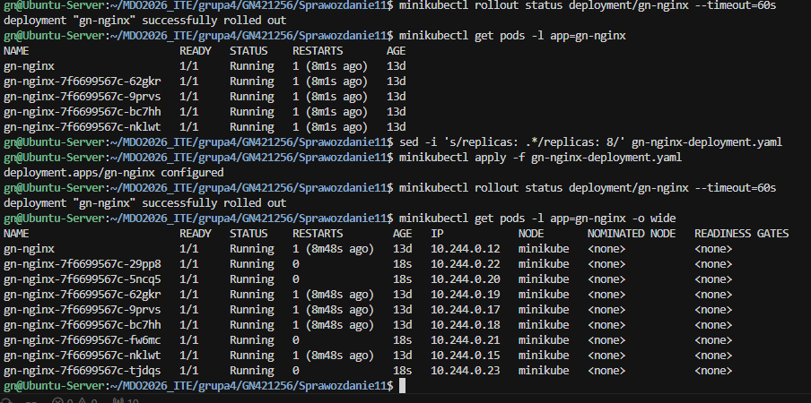

Zmniejszenie do **1 repliki**.

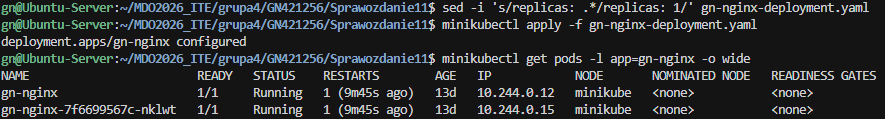

Zmniejszenie do **0 replik** (deployment `0/0`, brak podów).

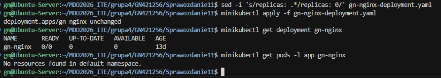

Ponowne przeskalowanie w górę do **4 replik**.

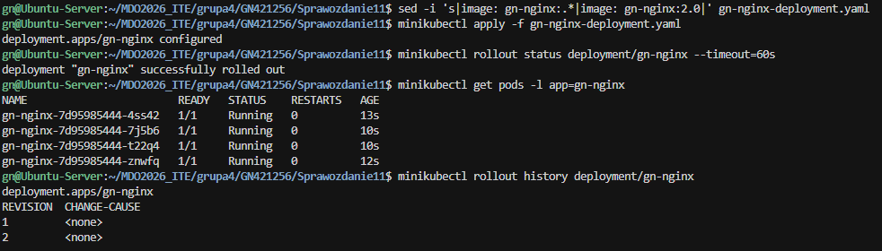

---

## 3. Zmiana wersji obrazu + historia wdrożeń

Zastosowanie nowej / starszej wersji obrazu (`2.0` ↔ `1.0`).

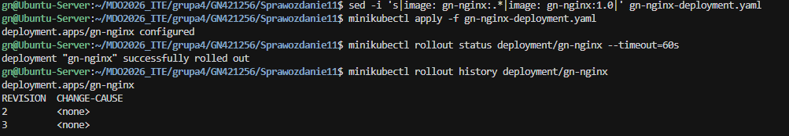

Zastosowanie obrazu **wadliwego** - pody w stanie `CrashLoopBackOff` / `Error`.

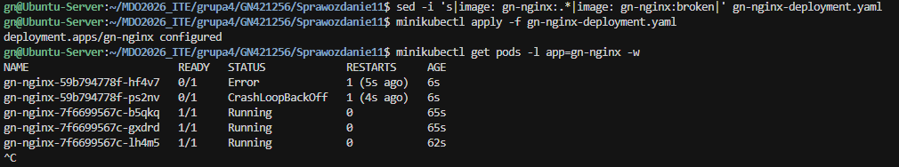

`kubectl describe deployment` - szczegóły problemu wdrożenia.

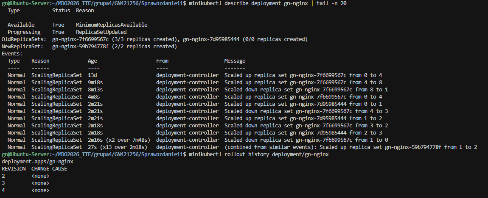

`kubectl rollout undo` - cofnięcie do działającej wersji.

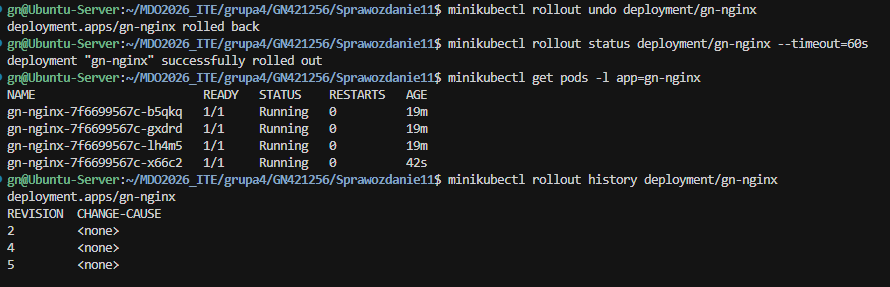

---

## 4. Skrypt weryfikujący wdrożenie (60 s)

Skrypt `verify-rollout.sh` sprawdzający, czy wdrożenie zdążyło się wykonać w 60 sekund.

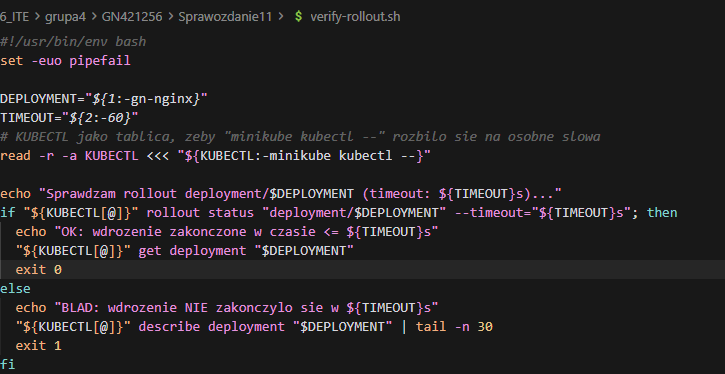

Wynik dla poprawnego wdrożenia - **OK**.

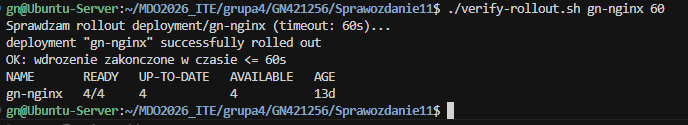

Wynik dla wadliwego wdrożenia - **BŁĄD** (timeout).

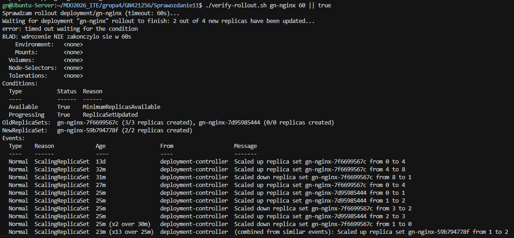

---

## 5. Strategie wdrożeń

### Recreate

Deployment ze strategią `Recreate`.

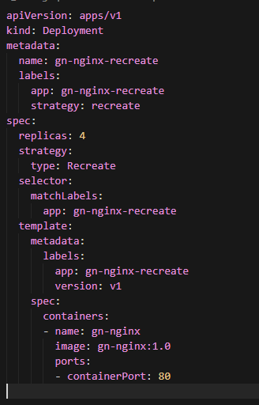

Wdrożenie strategii.

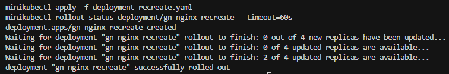

Aktualizacja do v2.0 - wszystkie stare pody znikają naraz, potem powstają nowe.

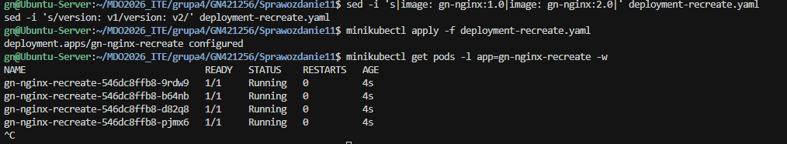

### Rolling Update

Deployment ze strategią `RollingUpdate` (`maxUnavailable: 2`, `maxSurge: 50%`).

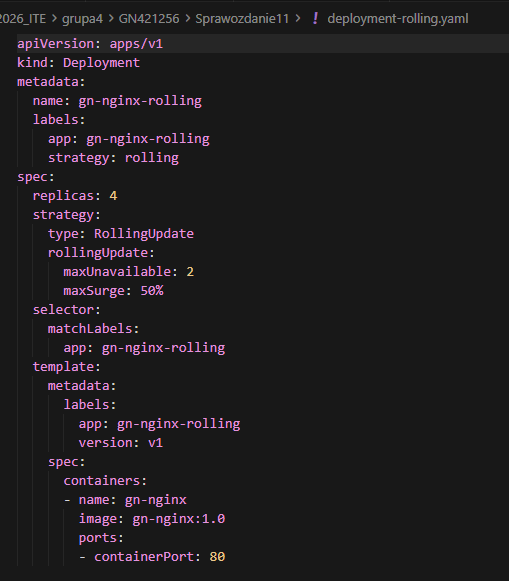

Aktualizacja - stopniowa wymiana podów (stare i nowe działają równolegle).

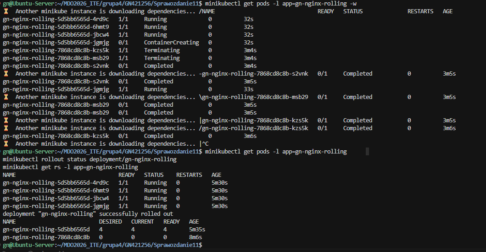

### Canary

Deployment **stable** (3 repliki, v1.0).

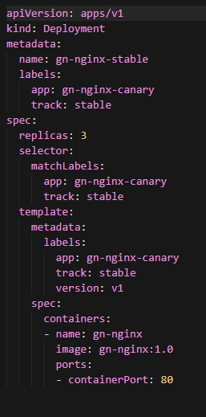

Deployment **canary** (1 replika, v2.0).

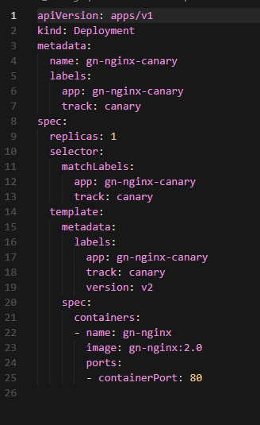

Wspólny serwis obejmujący oba deploymenty (selektor `app=gn-nginx-canary`).

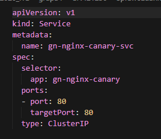

Pody i endpointy serwisu - 3× stable + 1× canary.

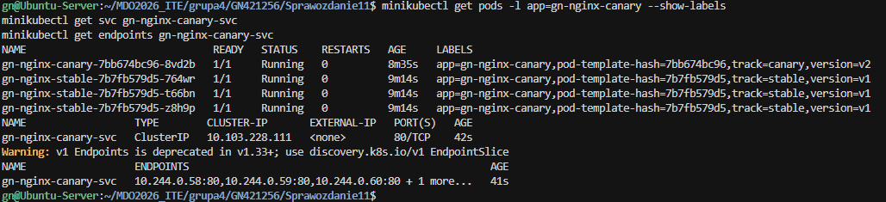

Test ruchu z wnętrza klastra (curl do ClusterIP) - widoczny podział ruchu między wersję v1.0 i v2.0.

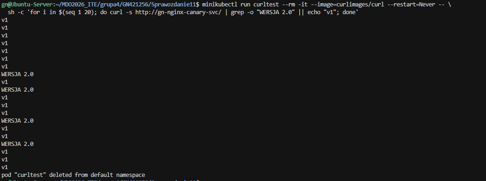

---

## Wnioski

- **Recreate** - krótka przerwa w dostępności (najpierw kasowane są wszystkie stare pody).
- **Rolling Update** - brak przerwy, pody wymieniane stopniowo.
- **Canary** - nowa wersja na małej części replik; serwis dzieli ruch między stable i canary.
- `kubectl port-forward svc/...` przypina się do jednego poda i nie rozkłada ruchu - podział widać dopiero przy odpytywaniu ClusterIP serwisu z wnętrza klastra (kube-proxy).
- Wersja "wadliwa" obrazu skutkuje `CrashLoopBackOff`; przywrócenie działającej wersji wykonano przez `kubectl rollout undo`.
