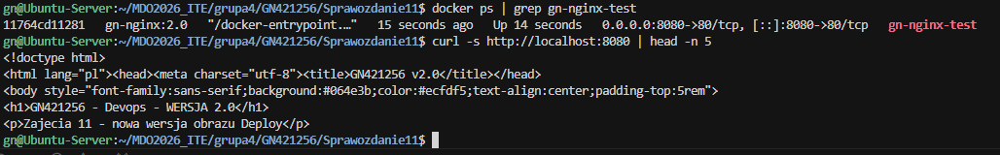
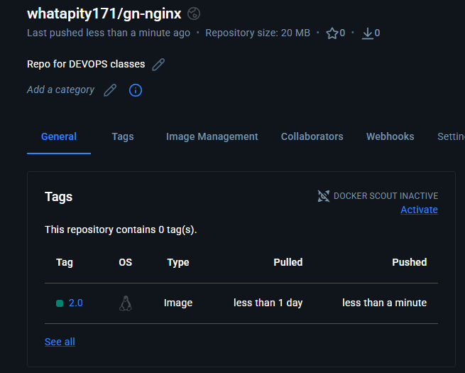
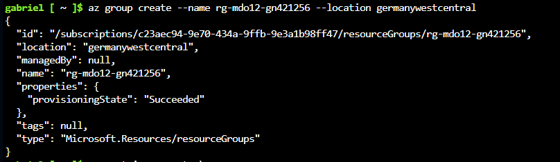
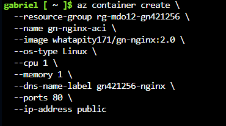
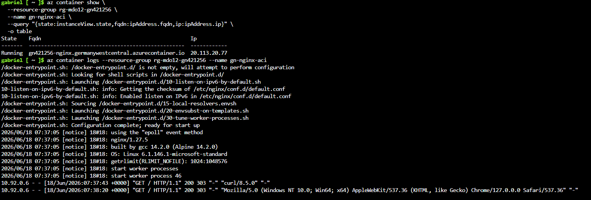
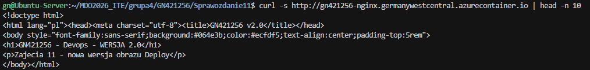

# Sprawozdanie 12 - Gabriel Nowak

## Wdrażanie kontenera w chmurze (Azure Container Instances)

Ćwiczenie wykorzystuje własny obraz `gn-nginx` (nginx z własnym `index.html`) opublikowany na Docker Hub i wdrożony w Azure bez tworzenia Azure Container Registry.

---

## 1. Lokalne uruchomienie obrazu

Sprawdzenie, że obraz `gn-nginx:2.0` działa lokalnie i serwuje treść HTTP (kontener nie kończy pracy od razu).

---

## 2. Publikacja na Docker Hub

Obraz opublikowany na własnym koncie Docker Hub (`whatapity171/gn-nginx`) — dostępne wersje tagów.

---

## 3. Utworzenie resource group w Azure

Utworzenie grupy zasobów `rg-mdo12-gn421256` w regionie **Germany West Central** (region *West Europe* był zablokowany polityką subskrypcji studenckiej).

---

## 4. Wdrożenie kontenera z Docker Hub

Utworzenie Azure Container Instance z obrazu `whatapity171/gn-nginx:2.0` — wymagane parametry: `--os-type Linux`, `--cpu 1`, `--memory 1`.

---

## 5. Stan kontenera i logi

`az container show` — kontener w stanie **Running**, publiczny FQDN. `az container logs` — logi z uruchomionego nginx.

---

## 6. Dostęp HTTP do usługi

Test dostępu do aplikacji przez publiczny adres FQDN (`curl` w Terminalu ubuntu).

---

## Wnioski

- Obraz wdrożono bezpośrednio z **Docker Hub** — zgodnie z wymaganiami zajęć nie tworzono Azure Container Registry.
- Cloud Shell uruchomiono w regionie **Germany West Central** z powodu ograniczeń subskrypcji *Azure for Students* w *West Europe*.
- Po zakończeniu ćwiczenia wykonano sprzątanie: `az container delete` oraz `az group delete` (zatrzymanie naliczania kosztów).
