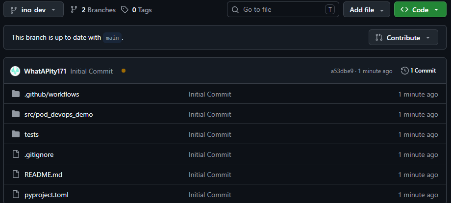
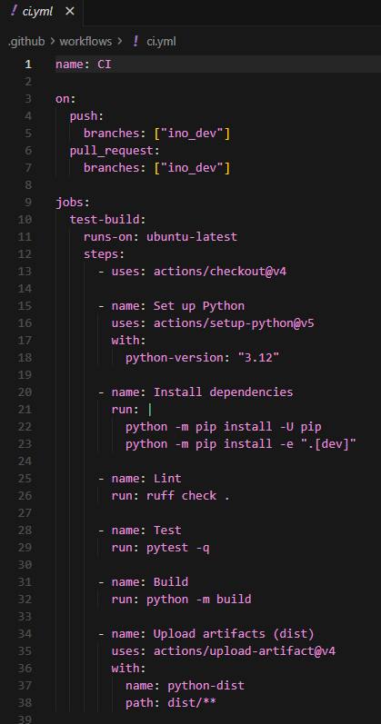
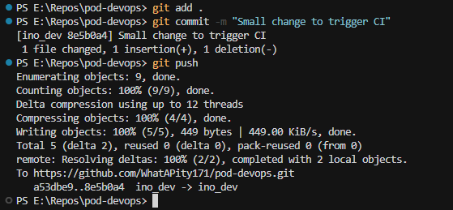
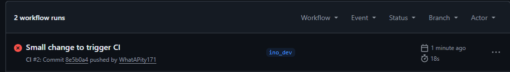
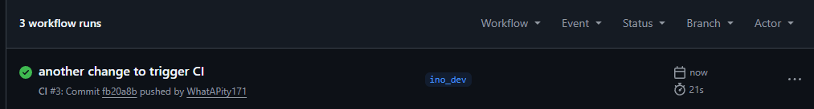
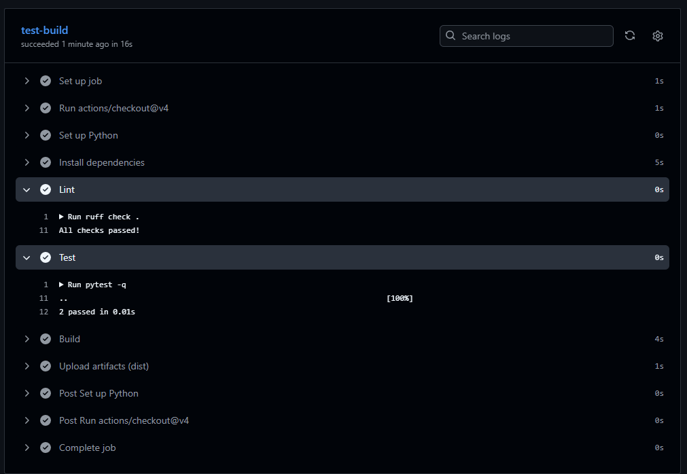
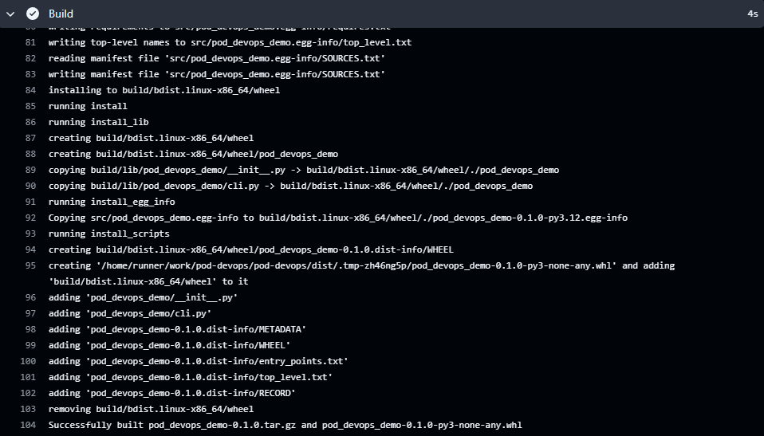
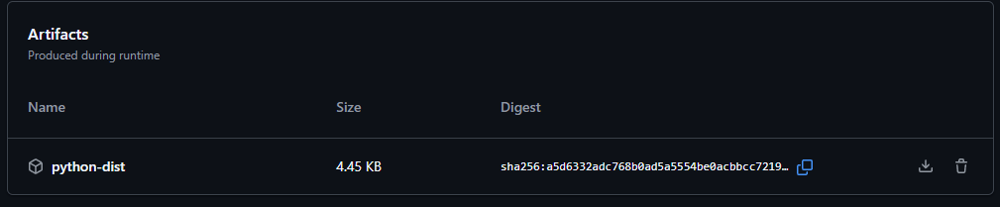

## Sprawozdanie 13 — GitHub Actions 
### Gabriel Nowak

### Cel ćwiczenia

Celem było przygotowanie pipeline w GitHub Actions, który:

- uruchamia **lint** i **testy**
- wykonuje **build** paczki (wheel + sdist)
- publikuje wynik builda jako **artefakt**
- reaguje na zmiany w gałęzi **`ino_dev`** (push/PR)

---

### 1) Repozytorium na GitHub + właściwa gałąź

Na GitHub utworzone repozytorium z gałęzią `ino_dev` i plikami projektu. Projekt był własny stworzony czysto na potrzeby zajęć.

---

### 2) Zawartość workflow (`.yml`)

Widoczny plik workflow w `.github/workflows/` z triggerami oraz krokami uruchamiającymi lint/test/build i upload artefaktów.

---

### 3) Commit i push zmian (terminal)

Wykonanie commita i wypchnięcie zmian do zdalnego repozytorium (push na `ino_dev`), co uruchamia pipeline.

---

### 4) Pierwsze uruchomienie pipeline — wynik FAIL

Na GitHub Actions pojawia się uruchomiony workflow, który kończy się błędem (fail). Powodem jest zmiana treści w projekcie z `Hello, world!` na `Hello there, world` powodująca niespełnienie testu/oczekiwań.

---

### 5) Poprawka i ponowne uruchomienie — wynik OK

Po wprowadzeniu poprawki workflow przechodzi poprawnie (status success).

---

### 6) Logi całego pipeline

Widok logów z wykonania całego pipeline w GitHub Actions.

---

### 6v2) Logi kroku build

Szczegółowe logi kroku budowania paczki (`python -m build`), generujące `sdist` i `wheel`.

---

### 7) Artefakty z pipeline

Potwierdzenie, że artefakty (np. zawartość `dist/`) zostały zapisane i są dostępne do pobrania w runie GitHub Actions.

