# Sprawozdanie z zajęć 13.03.2026
# Przygotowanie Dockera
1. Instalacja Dockera na VM
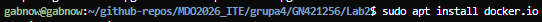
2. Uruchomienie dockera po restarcie VM
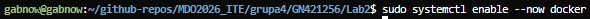
3. Sprawdzenie czy działa
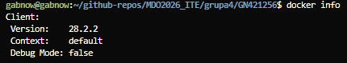
# Zapoznanie się z przykładowymi obrazami dockera 

1. hello world (rm żeby się pozbyć od razu)
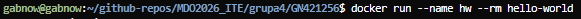
2. to samo dla bb (gdzieś mi uciekł screenshot)
3. ubuntu to samo
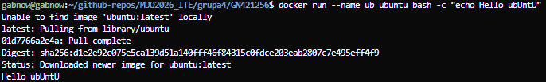
4. mariadb używamy -d bo bo nie kończy się od razu + inny sposób sprawdzenia exitcode
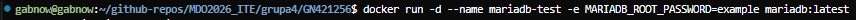
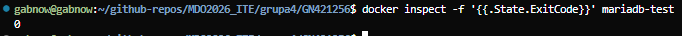
5. Obrazy MS Dotnet są praktycznie identyczne
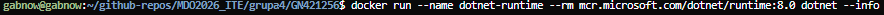

6. Używamy docker images aby sprawdzić rozmiar obrazów
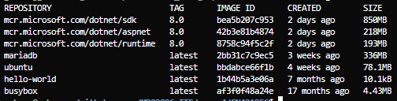


# BusyBox

1. Uruchamiamy busybox używajac -d dla detached i sleep 3600 zeby działał przez godzinę
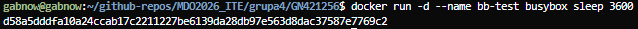
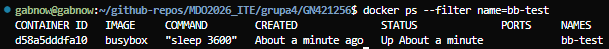
2. wejście w interaktywne
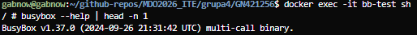
# System w dockerze (Ubuntu)

1. Pobranie i uruchomienie Ubuntu przez dockera
2. Sprawdzenie PID
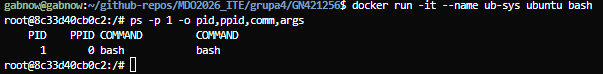
3. Pokazanie wszystkich procesów dockera
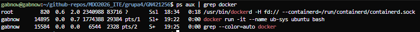
4. Apt upgrade i exit
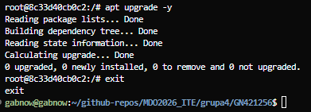


# Własny Dockerfile

Stworzenie Dockerfile
```
FROM ubuntu:22.04 
#konkretny tag a nie latest

RUN apt-get update && \
    apt-get install -y --no-install-recommends ca-certificates git && \
    rm -rf /var/lib/apt/lists/*
#apt-get i install w jednym RUN

WORKDIR /opt/app

CMD ["bash"]
```
1. Zbudowanie własnego obrazu
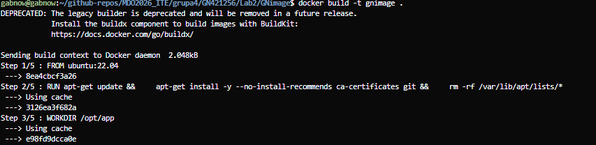
2. Uruchomienie obrazu
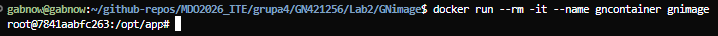
3. Wewnątrz uruchomionego systemu: git --version git clone cd i ls
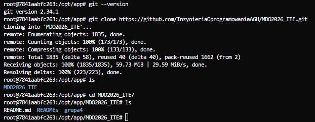

# Pruning
1. Sprawdzenie uruchomionych i czyszczenie zakończonych
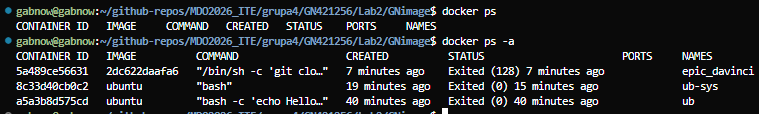
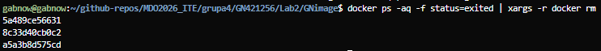
2. Czyszczenie obrazów z pamięci
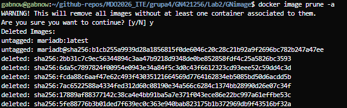

# Wszystkie polecenia
```{bash}
sudo apt install docker.io
sudo systemctl enable --now docker
docker info
docker run --name hw --rm hello-world
echo "exit code hello-world: $?"
docker run --name bb --rm busybox echo "Hello from busybox"
echo "exit code busybox: $?"
docker run --name ub --rm ubuntu bash -c "echo Hello from ubuntu"
echo "exit code ubuntu: $?"
docker run -d --name mariadb-test -e MARIADB_ROOT_PASSWORD=example mariadb:latest
docker inspect -f '{{.State.ExitCode}}' mariadb-test
docker stop mariadb-test
docker rm mariadb-test
docker run --name dotnet-runtime --rm mcr.microsoft.com/dotnet/runtime:8.0 dotnet --info
echo "exit code runtime: $?"
docker run --name dotnet-aspnet --rm mcr.microsoft.com/dotnet/aspnet:8.0 dotnet --info
echo "exit code aspnet: $?"
docker run --name dotnet-sdk --rm mcr.microsoft.com/dotnet/sdk:8.0 dotnet --info
echo "exit code sdk: $?"

docker images

docker run -d --name bb-test busybox sleep 3600
docker ps --filter name=bb-test
docker exec -it bb-test sh
busybox --help | head -n 1
docker stop bb-test
docker rm bb-test

docker run -it --name ub-sys ubuntu bash
ps -p 1 -o pid,ppid,comm,args
apt upgrade -y
exit

ps aux | grep docker
docker ps

docker build -t gnimage .
docker run --rm -it --name gncontainer gnimage

git --version         
git clone https://github.com/InzynieriaOprogramowaniaAGH/MDO2026_ITE.git
cd MDO2026
ls

docker ps
docker ps -a
docker ps -aq -f status=exited | xargs -r docker rm

docker image prune -a

```