# Sprawozdanie 3 20.03.2026
# Praca na VM
1 Znalezienie i klonowanie repo na maszynie (nie w dockerze)

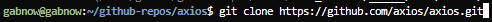

2 Instalacja zależności i zbudowanie projektu

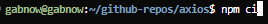

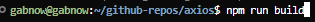

3 Uruchomienie testów i sprawdzenie raportu

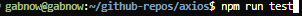

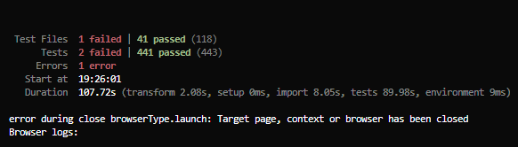

Błędy testów są moim zdaniem nieistotne chcemy tylko pokazać sposób działania

# Praca na dockerze

1 Tworzymy kontener 

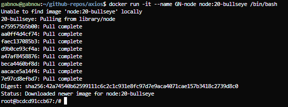

2 Wewnątrz kontenera: klonujemy repo

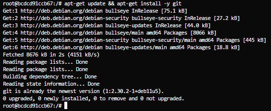

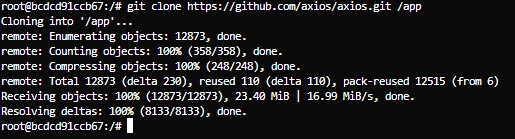

3 Jeszcze raz instalujemy zależności i budujemy projekt

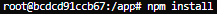

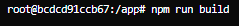

4 Uruchamiamy testy

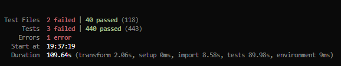

# Automatyzacja

1 Tworzymy dwa pliki Dockerfile.build i Dockerfile.test 

```
# Dockerfile.build
FROM node:20-bullseye

WORKDIR /app

RUN apt-get update && apt-get install -y git && rm -rf /var/lib/apt/lists/*

RUN git clone https://github.com/axios/axios.git .

RUN npm install

RUN npm run build

```
```
# Dockerfile.test
FROM axios-build-image:latest

WORKDIR /app

CMD ["npm", "test"]
```

2 budujem,y obraz Dockerfile.build

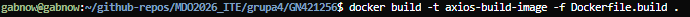

3 budujemy drugi obraz który bazuje na poprzednim

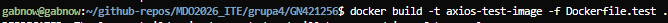

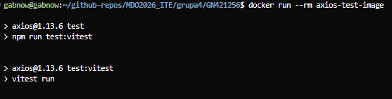

Czekamy na koniec testów

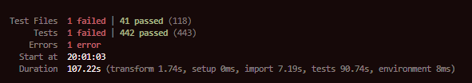

# Różnica między obrazem a kontenerem
Obraz to statyczny szblon (plik). Zawierta OS i narzędzia (np. Node.js Git), kod źródłowy oraz aplikację. W naszym przypadku `axios-test-image` jest przepisem na środowisko które można uruchomić

Kontener to dynamiczny obraz, aktywna instancja w pamięci RAM

W kontenerze pracuje wyłącznie zdefiniowany proces, w naszym przypadku kontener nazywa się tak samo (`axios-test-image`) ale jest kontenerem dopiero po uruchomieniu przez `docker run` 

# Polecenia
```{bash}
git clone https://github.com/axios/axios.git
npm ci
npm run build
npm run test
docker run -it --name GN-node node:20-bullseye /bin/bash

git clone https://github.com/axios/axios.git /app
npm install
npm run build
npm run test
exit

touch Dockerfile.build
touch Dockerfile.test

docker build -t axios-build-image -f Dockerfile.build .
docker build -t axios-test-image -f Dockerfile.test .

docker run --rm axios-test-image
```